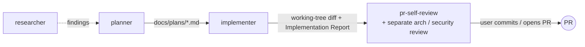

# Agents

Project subagents for Claude Code. Each `*.md` here is one agent: YAML frontmatter (tools, model, hooks, preloaded skills) + system prompt. This README is a map — the agent files are the source of truth for behavior.

## Pipeline

Sequential, in the current branch, no worktrees. The user commits — no agent does.

## Catalog

| Agent | Model | Responsibility | Not responsible for |
|---|---|---|---|
| [researcher](researcher.md) | sonnet | Repo lookups (where/why/when) and external research; interviews first if the ask is vague | Changing anything |
| [planner](planner.md) | opus | Turns a request into a structured Development Plan: requirements, tasks with owned paths, mandatory skills, done-conditions | Product code; review |
| [implementer](implementer.md) | sonnet | Executes a plan in `client/`, `server/`, `reviewer-core/`; keeps existing typecheck/test/lint green; self-checks its diff scope | Architecture / security review; commits; redesigning the plan |

## Permissions

| Agent | Tools | Denied | Enforced by hook |
|---|---|---|---|
| researcher | Read, Grep, Glob, Bash, WebFetch, WebSearch | (no Write/Edit in toolset) | — |
| planner | Read, Grep, Glob, Bash, Write, Edit, Agent, Skill | NotebookEdit, WebFetch, WebSearch | [`planner-guard.sh`](../hooks/planner-guard.sh): writes only `docs/plans/*.md`; Bash read-only allowlist; `Agent` only → `researcher` / `Explore` |
| implementer | Read, Grep, Glob, Edit, Write, Bash, Skill | Agent, NotebookEdit, WebFetch, WebSearch | [`implementer-guard.sh`](../hooks/implementer-guard.sh): blocks commit/push/`gh pr`, destructive git/docker, `db:migrate`/`db:seed`, e2e `npm test`, edits to lockfiles, `CLAUDE.md`, `.env*`, migrations, `.claude/`, `docs/plans/` |

Hooks, not `permissionMode`, carry enforcement: in auto mode a subagent's `permissionMode` is ignored, and `Agent(type)` allowlists are ignored inside subagents. Per-task **owned paths** are enforced only by the implementer's prompt + diff self-check. The Bash guards are keyword-based guardrails, not a sandbox.

## Artifacts

| Agent | Input | Output |
|---|---|---|
| researcher | A concrete question | Research report (findings · evidence · references · could-not-find), returned in chat |
| planner | Feature/fix request; reads root `CLAUDE.md`, package `AGENTS.md` + `Insights.md`, `.claude/skills/README.md`, code | `docs/plans/<YYYY-MM-DD>-<slug>.md` + chat summary (plan path, mandatory skills loaded, blocking questions, red flags) |
| implementer | A plan in `docs/plans/` (optionally specific task IDs) | Code changes in the working tree (uncommitted); optional append to a package `Insights.md`; Implementation Report in chat (per-task status, deviations, skills loaded, verification evidence, handoff to reviewers) |

## Shared contract: planner ↔ implementer

- **Skill sets** — the same table in both files; the planner loads every skill the implementer will need (planning gate), the implementer loads them per task (implementation gate). Edit both files together.
- **Plan template** (in `planner.md`) — each task carries R-IDs, Depends-on, Owned paths, Mandatory skills, Change, Why, Risk, Acceptance, Done-condition; plus Testing strategy, Diagrams (via `mermaid-diagram`), Traceability, and a Red-flags check.
- **Preloaded skills** (both): `engineering-insights`, `backend-onion-architecture`, `frontend-ui-architecture`. All others load on demand through the `Skill` tool.

## Sources behind planner & implementer rules

Official Anthropic docs:

| Source | Rule | Applied in |
|---|---|---|
| [Subagents](https://code.claude.com/docs/en/sub-agents) | Frontmatter fields; `description` drives delegation ("Use proactively when…") | Both descriptions (trigger + output shape) |
| same | `skills:` injects full skill content at startup; others remain reachable via the `Skill` tool | Minimal preload + mandatory skill gates |
| same | Subagents can spawn subagents (≤3 levels); block with `disallowedTools: Agent`; `Agent(type)` lists ignored inside subagents | implementer denies `Agent`; planner's allowlist lives in its hook |
| same | Frontmatter `hooks` (`PreToolUse` + matcher) | Both guard scripts |
| same | Subagent `permissionMode` ignored under auto mode | Enforcement via tools + hooks |
| [Best practices](https://code.claude.com/docs/en/best-practices) | Explore → Plan → Implement → Commit as separate phases; read-only planning | planner / implementer split; user commits |
| same | Give Claude a check it can run; show evidence, don't assert success | Done-condition per task; baseline run; report shows commands + output tails |
| same | Hand off through a written spec; review in a fresh context | Plan file in `docs/plans/`; review left to `pr-self-review` / separate agents |

Community sources (useful patterns, not authoritative):

| Source | Rule | Applied in |
|---|---|---|
| [wshobson/agents](https://github.com/wshobson/agents) | Opus for planning, Sonnet for implementation | `model:` fields |
| [affaan-m/everything-claude-code — planner.md](https://github.com/affaan-m/everything-claude-code/blob/main/agents/planner.md) | Plan template: requirements, file-level changes, per-step Action/Why/Dependencies/Risk, testing strategy, success criteria | Plan template (Why, Risk, Testing strategy) |
| Strategic Task Planner (subagents.app) — not re-verified | Plan anti-patterns → explicit check | Red-flags check |
| Parallel-agents guidance — source not re-verified | Owned paths per task; forbidden files | Owned paths; implementer guard |
| Skill-invocation finding — source not re-verified | Conditional `Skill` calls can be silently skipped | "MANDATORY" skill gates + skills-loaded list in outputs |

Repo-derived rules (not from external sources): forbidden files, migrations via `pnpm db:generate`, hermetic-only e2e, verification commands — from root `CLAUDE.md` and each package's `AGENTS.md`; Insights handling — from the `engineering-insights` skill.

## Adding or changing an agent

- Keep one responsibility per agent; put its output format in the prompt as a fixed template.
- Grant the smallest tool set; anything a tool list can't express (paths, command patterns, delegation targets) goes in a hook under `.claude/hooks/`.
- Changing the skill sets or plan template → update `planner.md` and `implementer.md` together, then this README.
- New agents appear after `/agents` reload or a session restart.
