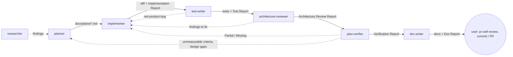

# Agents

Project subagents for Claude Code. Each `*.md` here is one agent: YAML frontmatter (tools, model, hooks, preloaded skills) + system prompt. This README is a map — the agent files are the source of truth for behavior.

## Pipeline

Sequential, in the current branch, no worktrees. The three evaluators (test-writer, architecture-reviewer, plan-verifier) feed findings back to the implementer — an evaluator-optimizer loop. The user commits — no agent does.

## Catalog

| Agent | Model | Responsibility | Not responsible for |
|---|---|---|---|
| [researcher](researcher.md) | sonnet | Repo lookups (where/why/when) and external research; interviews first if the ask is vague | Changing anything |
| [planner](planner.md) | opus | Turns a request into a structured Development Plan: requirements, tasks with owned paths, mandatory skills, done-conditions | Product code; review |
| [implementer](implementer.md) | sonnet | Executes a plan in `client/`, `server/`, `reviewer-core/`; keeps existing typecheck/test/lint green; self-checks its diff scope | Architecture / security review; commits; redesigning the plan |
| [test-writer](test-writer.md) | sonnet | Writes Vitest tests for `client/` (RTL) and `server/` + `reviewer-core/` (`app.inject`, testcontainers) after loading the matching skills; runs them twice and reports evidence | Product code; e2e flows; adding test deps; commits |
| [architecture-reviewer](architecture-reviewer.md) | opus | Read-only boundary check of a diff against a fixed catalog (AB/RC/FC/XP checks); every finding has `file:line`, rule source, severity, fix, confidence | Editing; security, correctness or style review |
| [plan-verifier](plan-verifier.md) | opus | Read-only traceability matrix: every plan item → Met / Partial / Missing / Unverifiable with evidence; runs existing typecheck/test/lint | Editing; fixing gaps; generic advice in place of a check; e2e |
| [mechanical-checker](mechanical-checker.md) | haiku | Read-only, cheap: runs a given typecheck/test/lint command or checks a file/pattern exists, reports pass/fail + evidence, no judgement | Architecture or requirement judgement — defers to architecture-reviewer / plan-verifier; editing |
| [doc-writer](doc-writer.md) | sonnet | Turns shipped code, plans and other material into docs with Mermaid diagrams, placed per the [docs taxonomy](../../docs/README.md); records decisions as ADRs | Code, plans, agent prompts, `AGENTS.md` / `CLAUDE.md` / `Insights.md` |

## Permissions

| Agent | Tools | Denied | Enforced by hook |
|---|---|---|---|
| researcher | Read, Grep, Glob, Bash, WebFetch, WebSearch | (no Write/Edit in toolset) | — |
| planner | Read, Grep, Glob, Bash, Write, Edit, Agent, Skill | NotebookEdit, WebFetch, WebSearch | [`planner-guard.sh`](../hooks/planner-guard.sh): writes only `docs/plans/*.md`; Bash read-only allowlist; `Agent` only → `researcher` / `Explore` |
| implementer | Read, Grep, Glob, Edit, Write, Bash, Skill | Agent, NotebookEdit, WebFetch, WebSearch | [`implementer-guard.sh`](../hooks/implementer-guard.sh): blocks commit/push/`gh pr`, destructive git/docker, `db:migrate`/`db:seed`, e2e `npm test`, edits to lockfiles, `CLAUDE.md`, `.env*`, migrations, `.claude/`, `docs/plans/` |
| test-writer | Read, Grep, Glob, Edit, Write, Bash, Skill | Agent, NotebookEdit, WebFetch, WebSearch | [`test-writer-guard.sh`](../hooks/test-writer-guard.sh): writes only test files (not `server/test/helpers/pg.ts`, `client/src/test/setup.ts`); blocks `.only(`, numeric `retry:`, `@ts-ignore`/`@ts-expect-error`/`eslint-disable`, DB tests not named `*.it.test.ts`; Bash blocks installs, `npx`, `-u`, shell writes (`>`, `tee`, `cp`, `mv`, `sed -i`, `rm`, `node -e`, `python`), e2e, commits, destructive git/docker, `db:*` |
| architecture-reviewer | Read, Grep, Glob, Bash | Write, Edit, NotebookEdit, Agent, Skill, WebFetch, WebSearch | [`readonly-guard.sh`](../hooks/readonly-guard.sh) `architecture-reviewer` (base mode): all writes blocked; Bash read-only allowlist |
| plan-verifier | Read, Grep, Glob, Bash | Write, Edit, NotebookEdit, Agent, Skill, WebFetch, WebSearch | `readonly-guard.sh plan-verifier --verify`: base mode + existing `pnpm`/`npm` typecheck/test/lint; blocks `-u`, `--fix`, `--watch`, `--outputFile`, installs, `db:*`, e2e |
| mechanical-checker | Read, Grep, Glob, Bash | Write, Edit, NotebookEdit, Agent, Skill, WebFetch, WebSearch | `readonly-guard.sh mechanical-checker --verify`: same as plan-verifier's mode (shared script, reused as-is) |
| doc-writer | Read, Grep, Glob, Bash, Write, Edit, Skill | Agent, NotebookEdit, WebFetch, WebSearch | [`doc-writer-guard.sh`](../hooks/doc-writer-guard.sh): writes only `*.md` under `docs/` and package `docs/` / `specs/`, never `docs/plans/`, `docs/agent-prompts/`, `AGENTS.md`, `CLAUDE.md`, `Insights*.md`; Bash via `readonly-guard.sh doc-writer` |

Hooks, not `permissionMode`, carry enforcement: in auto mode a subagent's `permissionMode` is ignored, and `Agent(type)` allowlists are ignored inside subagents. `skills:` preloads content but doesn't restrict the `Skill` tool, so the two reviewers deny `Skill` outright. Per-task **owned paths** are enforced only by the implementer's prompt + diff self-check.

The Bash guards are keyword-based guardrails, not a sandbox. `readonly-guard.sh` is shared by three agents (base vs `--verify` mode). The read-only guards split commands on `|`, `&&`, `;` without honouring quotes, so `grep 'a\|b'` is blocked — use `grep -e a -e b`; `$(…)` is blocked too, so run `git merge-base` and `git diff <sha>` as two calls. After any guard edit, run `bash .claude/hooks/tests/run-guard-tests.sh`.

## Artifacts

| Agent | Input | Output |
|---|---|---|
| researcher | A concrete question | Research report (findings · evidence · references · could-not-find), returned in chat |
| planner | Feature/fix request; reads root `CLAUDE.md`, package `AGENTS.md` + `Insights.md`, `.claude/skills/README.md`, code | `docs/plans/<YYYY-MM-DD>-<slug>.md` + chat summary (plan path, mandatory skills loaded, blocking questions, red flags) |
| implementer | A plan in `docs/plans/` (optionally specific task IDs) | Code changes in the working tree (uncommitted); optional append to a package `Insights.md`; Implementation Report in chat (per-task status, deviations, skills loaded, verification evidence, handoff to reviewers) |
| test-writer | A plan (+ task IDs) or an explicit target + behaviours | Test files in the working tree; Test Report (status, tests table, skills loaded, command evidence, failure-mode statements, coverage gaps, suspected bugs, diff self-check, insights) |
| architecture-reviewer | Paths, a diff range or a plan; default: diff vs merge-base with `main` | Architecture Review Report (scope, verdict, findings with evidence, checks run clean, known tradeoffs, out of scope, fitness-function candidates, compact handoff summary) |
| plan-verifier | A plan path (+ optional agent reports, treated as claims) | Verification Report (plan & baseline, traceability matrix, command evidence, scope compliance, how to verify the Unverifiable, out-of-scope observations, compact handoff summary) |
| mechanical-checker | A list of concrete checks (commands to run, or file/pattern existence to confirm) | Mechanical Check Report (checks run, pass/fail table with evidence, one-line verdict, anything declined as needing judgement) |
| doc-writer | A plan + Verification Report, a feature/module, or other material | Markdown pages + index updates in the docs taxonomy; Doc Report (files, placement, diagrams, sources, code≠plan mismatches, proposed AGENTS.md/README edits, stale docs) |

## Relationship to `pr-self-review`

`pr-self-review` stays the pre-PR, multi-rubric hygiene pass the user runs over the whole diff. `architecture-reviewer` is the deeper, evidence-first boundary check. Both use the same `critical|major|minor|nit` scale, so their findings can be merged.

## Shared contract: planner ↔ implementer

- **Skill sets** — the same table in both files; the planner loads every skill the implementer will need (planning gate), the implementer loads them per task (implementation gate). Edit both files together.
- **Plan template** (in `planner.md`) — each task carries R-IDs, Depends-on, Owned paths, Mandatory skills, Change, Why, Risk, Acceptance, Done-condition; plus Testing strategy, Diagrams (via `mermaid-diagram`), Traceability, and a Red-flags check. `plan-verifier` enumerates exactly these fields.
- **Preloaded skills** (both): `engineering-insights`, `backend-onion-architecture`, `frontend-ui-architecture`. All others load on demand through the `Skill` tool.

## Sources

Official Anthropic docs:

| Source | Rule | Applied in |
|---|---|---|
| [Subagents](https://code.claude.com/docs/en/sub-agents) | Frontmatter fields; `description` drives delegation ("Use proactively when…"), details in the body | All descriptions (trigger + output shape + what it doesn't do) |
| same | `skills:` injects full skill content at startup; doesn't restrict the `Skill` tool | Minimal preload + mandatory skill gates; `disallowedTools: Skill` on both reviewers |
| same | `disallowedTools` is subtracted before `tools` resolves | Explicit deny lists on every agent |
| same | Subagents can spawn subagents (≤3 levels); block with `disallowedTools: Agent`; `Agent(type)` lists ignored inside subagents | Only the planner keeps `Agent`, with its allowlist in the hook |
| same | Frontmatter `hooks` (`PreToolUse` + matcher); exit code 2 blocks and feeds stderr back | All guard scripts |
| same | Subagent `permissionMode` ignored under auto mode | Enforcement via tools + hooks |
| [Best practices](https://code.claude.com/docs/en/best-practices) | Explore → Plan → Implement → Commit as separate phases; read-only planning | planner / implementer split; user commits |
| same | Give Claude a check it can run; show evidence, don't assert success | Done-conditions; baseline runs; every report shows commands + output tails |
| same | Give subagents a bounded question, a source boundary and a required evidence format; review in a fresh context | Input sections + fixed report templates; separate evaluator agents |
| [Building effective agents](https://www.anthropic.com/engineering/building-effective-agents) | Evaluator-optimizer: one agent generates, another evaluates with feedback | Evaluator loop back to the implementer |
| [Multi-agent research system](https://www.anthropic.com/engineering/built-multi-agent-research-system) | Single judge with a rubric (factual accuracy, citation accuracy, completeness, source quality); human review still needed | plan-verifier self-check; the user reviews before committing |

Testing, architecture and docs sources:

| Source | Rule | Applied in |
|---|---|---|
| [Next.js — Vitest](https://nextjs.org/docs/app/guides/testing/vitest) | Async Server Components aren't supported by Vitest → cover them with e2e | test-writer coverage gaps |
| [Testing Library — guiding principles](https://testing-library.com/docs/guiding-principles/) | Test the way users use the UI; role/label/text queries | test-writer design rules |
| [Vitest — testing in practice](https://main.vitest.dev/guide/learn/testing-in-practice), [retry](https://vitest.dev/config/retry) | Behaviour-named tests, AAA; retries are a signal, not a fix | test-writer rules; guard blocks `retry:` |
| [Fastify — testing](https://fastify.dev/docs/latest/Guides/Testing/) | `inject()`, app factory per test, `close()` in teardown | test-writer server rules |
| [Drizzle — transactions](https://orm.drizzle.team/docs/transactions) | Transaction API; per-test rollback isolation is community practice only | test-writer keeps the repo's one-container-per-file practice |
| [Fitness functions](https://www.oreilly.com/library/view/building-evolutionary-architectures/9781492097532/ch02.html), [dependency-cruiser](https://github.com/sverweij/dependency-cruiser), [eslint-plugin-boundaries](https://github.com/javierbrea/eslint-plugin-boundaries), [ArchUnitTS](https://github.com/LukasNiessen/ArchUnitTS) | Architecture checks as executable rules | architecture-reviewer fixed check catalog + fitness-function candidates |
| [Diátaxis](https://diataxis.fr/), [arc42](https://arc42.org/overview/), [C4](https://c4model.com/), [ADR](https://adr.github.io/) / [MADR](https://adr.github.io/madr/) | Doc types; architecture sections; context/container views; decision records | [`docs/README.md`](../../docs/README.md), [ADR-0001](../../docs/adr/0001-docs-taxonomy.md), doc-writer |
| [Mermaid C4](https://mermaid.js.org/syntax/c4.html), [GitHub discussion](https://github.com/orgs/community/discussions/197898) | GitHub doesn't render Mermaid's C4 extension | doc-writer draws C4-style views as flowcharts |
| [Docs as code](https://www.writethedocs.org/guide/docs-as-code/), [Google developer docs style](https://developers.google.com/style) | Docs in the repo, reviewed like code; voice, tense, headings | doc-writer style + index rule |

Community sources (useful patterns, not authoritative):

| Source | Rule | Applied in |
|---|---|---|
| [wshobson/agents](https://github.com/wshobson/agents) | Opus for planning, Sonnet for implementation | `model:` fields |
| [affaan-m/everything-claude-code — planner.md](https://github.com/affaan-m/everything-claude-code/blob/main/agents/planner.md) | Plan template: requirements, file-level changes, per-step Action/Why/Dependencies/Risk, testing strategy, success criteria | Plan template (Why, Risk, Testing strategy) |
| Strategic Task Planner (subagents.app) — not re-verified | Plan anti-patterns → explicit check | Red-flags check |
| Parallel-agents guidance — source not re-verified | Owned paths per task; forbidden files | Owned paths; implementer guard |
| Skill-invocation finding — source not re-verified | Conditional `Skill` calls can be silently skipped | "MANDATORY" skill gates + skills-loaded list in outputs |

Repo-derived rules (not from external sources): forbidden files, migrations via `pnpm db:generate`, hermetic-only e2e, `*.it.test.ts` naming, verification commands, vendor/shared mirroring — from root `CLAUDE.md`, `TESTING.md` and each package's `AGENTS.md`; Insights handling — from the `engineering-insights` skill.

## Adding or changing an agent

- Keep one responsibility per agent; put its output format in the prompt as a fixed template.
- Grant the smallest tool set; anything a tool list can't express (paths, command patterns, delegation targets) goes in a hook under `.claude/hooks/`.
- After any guard edit, run `bash .claude/hooks/tests/run-guard-tests.sh` and add a case for the new rule.
- Changing the skill sets or plan template → update `planner.md` and `implementer.md` together, then this README.
- New agents appear after `/agents` reload or a session restart.
