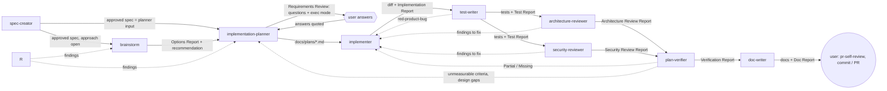
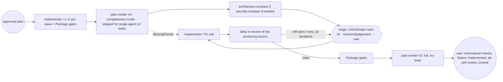
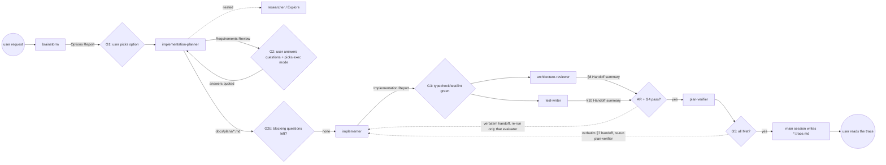

# Agents

Project subagents for Claude Code. Each `*.md` here is one agent: YAML frontmatter (tools, model, hooks, preloaded skills) + system prompt. This README is a map — the agent files are the source of truth for behavior.

## Pipeline


```mermaid
flowchart LR
  SC[spec-creator] -->|approved spec, approach open| B[brainstorm]
  SC -->|approved spec = planner input| P
  R -.->|findings| B
  B -->|Options Report + recommendation| P[implementation-planner]
  R -.->|findings| P
  P -->|Requirements Review: questions + exec mode| UQ{{user answers}}
  UQ -->|answers quoted| P
  P -->|docs/plans/*.md| I[implementer]
  I -->|diff + Implementation Report| TW[test-writer]
  TW -->|tests + Test Report| AR[architecture-reviewer]
  TW -->|tests + Test Report| SR[security-reviewer]
  AR -->|Architecture Review Report| PV[plan-verifier]
  SR -->|Security Review Report| PV
  PV -->|Verification Report| DW[doc-writer]
  DW -->|docs + Doc Report| U(("user: pr-self-review, commit / PR"))
  TW -.->|red-product-bug| I
  AR -.->|findings to fix| I
  SR -.->|findings to fix| I
  PV -.->|Partial / Missing| I
  PV -.->|unmeasurable criteria, design gaps| P
```

Sequential by default, in the current branch, no worktrees — except that `architecture-reviewer` and `security-reviewer` are both read-only and may run in parallel. `spec-creator` is optional and runs first when a feature needs a spec: a Discovery call returns 1–4 blocking questions that the main session asks with `AskUserQuestion`, then an Authoring call (answers quoted) writes a `draft` spec in English, and a Revision call (draft path + the user's changes) edits that draft in place while it is still `draft`; the user sets `approved` and hands the spec path to `implementation-planner`, which takes it as its input. `brainstorm` is optional: use it when the request has more than one reasonable approach; skip it when the design is already fixed. `implementation-planner` always runs in two calls: a Review call checks the requirements and returns a Requirements Review (issues, recommendations, ≤4 questions — always including the execution-mode question, single-agent vs multi-agent) that the main session asks with `AskUserQuestion`; a Planning call (answers quoted) writes the plan. It never writes or edits specs. In **multi-agent** mode the implementer step runs per wave: one `implementer` per task of the wave in parallel (tasks in a wave touch different packages and disjoint owned paths, and alias-linked packages — `reviewer-core` → `server`, `vendor/shared` → `server`/`client` — never share a wave when either task changes exports), then the wave gate runs the plan's Package gates (§6b — the full suite of each package the wave touched) before the next wave; in single-agent mode the same gates run once after the implementer; the steps after the implementer stay as below. The four evaluators (test-writer, architecture-reviewer, security-reviewer, plan-verifier) feed findings back to the implementer — an evaluator-optimizer loop. The user commits — no agent does. **Spec ↔ tests:** `test-writer` turns every `unit`/`integration` AC of the spec into a test named `AC-N: …` inside `describe('<Spec ID>', …)`; `plan-verifier` greps those names to build the spec coverage matrix; when it reports `ready for implemented`, the **user** sets the spec's `Status: implemented` (no agent edits spec status — `doc-writer` only reminds in its Next step).

## `/implement` — run an approved plan

[`/implement <plan>`](../skills/implement/SKILL.md) runs the implementation half of the Pipeline from the main session. `spec-creator` and `implementation-planner` are run by hand before it (their questions need the user anyway); `test-writer` is skipped for now to save tokens (plan-verifier runs with `no-tests` and judges ACs from code). A run log in `docs/plans/<date>-<slug>.trace.md` lets it resume in a new chat.


```mermaid
flowchart LR
  P((approved plan)) --> I[implementer ×1 or per wave + Package gates]
  I --> PV1[plan-verifier #1: completeness mode · skipped for single-agent ≤3 tasks]
  PV1 -.->|Missing/Partial| FX
  PV1 --> R[architecture-reviewer ∥ security-reviewer if needed]
  R --> T{{triage: critical/major auto-fix · minor/nit/judgement → user}}
  T --> FX[implementer: Fix call]
  FX --> D[delta re-review of the producing source]
  D -->|still open / new, ≤3 iterations| T
  D -->|clean| G[Package gates]
  G --> PV2[plan-verifier #2: full, no-tests]
  PV2 --> U((user: e2e/manual checks, Status: implemented, /pr-self-review, commit))
```

Review findings go through a triage gate and a **fix loop** — `implementer` in *Fix call* mode, then the producing reviewer in *Delta re-review* mode (only the fixed files, previous IDs marked resolved / still open), capped at 3 iterations per source, with a stop on oscillation. Accepted findings are logged and never re-flagged.

## Traced chain

A fixed, narrower chain for a feature whose design is chosen via `brainstorm`, which ends with a per-call cost/context trace. Differs from the Pipeline: no `security-reviewer`, no `doc-writer`, `test-writer` runs **in parallel** with `architecture-reviewer` (not before it), and a trace file is written.


```mermaid
flowchart LR
  U0((user request)) --> B[brainstorm]
  B -->|Options Report| G1{G1: user picks option}
  G1 --> P[implementation-planner]
  P -.->|nested| RX[researcher / Explore]
  P -->|Requirements Review| G2{G2: user answers questions + picks exec mode}
  G2 -->|answers quoted| P
  P -->|docs/plans/*.md| G2b{G2b: blocking questions left?}
  G2b -->|none| I[implementer]
  I -->|Implementation Report| G3{G3: typecheck/test/lint green}
  G3 --> AR[architecture-reviewer]
  G3 --> TW[test-writer]
  AR -->|§8 Handoff summary| J{AR + G4 pass?}
  TW -->|§10 Handoff summary| J
  J -->|yes| PV[plan-verifier]
  PV --> G5{G5: all Met?}
  G5 -->|yes| TR[main session writes *.trace.md]
  TR --> U1((user reads the trace))
  J -.->|verbatim handoff, re-run only that evaluator| I
  G5 -.->|verbatim §7 handoff, re-run plan-verifier| I
```

**Orchestration**

- The main session calls every agent with the `Agent` tool. No Workflow tool, no dynamic workflow.
- Sequential, except step 4: `architecture-reviewer` and `test-writer` are two `Agent` calls in one message.
- Nested calls (implementation-planner → `researcher` / `Explore`) happen inside the implementation-planner and are traced too.
- `implementation-planner` is two calls (Review, then Planning), each its own trace row. In multi-agent mode step 3 becomes one `implementer` call per task of each wave (a/b/… rows), followed by the wave gate.
- Fix-loop calls are **new** `Agent` calls (fresh context, own agent id, own trace row), not `SendMessage` continuations.
- `security-reviewer` and `doc-writer` are not part of this chain; run them separately afterwards if the change needs them. Nobody commits during the run — the user commits.

**Before the run**: `git status --porcelain` must be empty (the user commits unrelated work first). Record `git rev-parse HEAD` as the **base sha** and the main session id (the JSONL name under the config dir, see Trace).

**Diff range**: every `architecture-reviewer`, `test-writer` and `plan-verifier` prompt gets the plan path, the base sha, and the file list from the Implementation Report §2 Tasks table. Reviewers diff `git diff <base-sha> -- <files>` plus `git status --porcelain` for untracked files — don't rely on the merge-base-with-`main` default. `architecture-reviewer` therefore never sees `test-writer`'s tests; that is by design.

**Gates**

| Gate | After | Pass evidence | On fail |
|---|---|---|---|
| G1 | brainstorm | The user picks an option and answers its questions | Ask the user; pause |
| G2 | implementation-planner (Review call) | The user answered its questions, including the execution mode | Ask the user with `AskUserQuestion`; pause |
| G2b | implementation-planner (Planning call) | No blocking open question in the plan | Ask the user; pause |
| G3 | implementer | Every task's Done-condition green (command + output tail in the Implementation Report), then the plan's Package gates (§6b, full suite incl. `*.it.test.ts`) green — run by the main session or `mechanical-checker` | Re-call implementer with the failing command tail |
| G4 | test-writer | Status `done`, both runs green | `red-product-bug` → relay test-writer §10 Handoff summary verbatim to implementer, re-run **only** test-writer |
| — | architecture-reviewer | No `blocking` verdict, no critical/major finding | Relay its §8 Handoff summary verbatim to implementer, re-run **only** architecture-reviewer |
| G5 | plan-verifier | Every matrix row Met; with a spec, every AC in the spec coverage matrix (§2a) Met / Deferred / Unverifiable | Relay its §7 Handoff summary verbatim to implementer, re-run **only** plan-verifier. Unverifiable rows go to the user, not into the loop |

Cap: 2 fix iterations per evaluator, then the user decides. Re-running only the producing evaluator is safe because `plan-verifier` (G5) runs every Package gate — the full suite, including test-writer's new tests — after the last fix. The implementer's own Done-condition is deliberately fast (typecheck, lint, unit tests + only the related `*.it.test.ts`); it never runs the full `server/` suite.

**Trace**

- Path: `docs/plans/<YYYY-MM-DD>-<slug>.trace.md`, same date + slug as the plan; if it exists, suffix `-run2` — never overwrite. Committed with the feature.
- Written by the main session after the last gate. `implementer` and `plan-verifier` ignore `*.trace.md` when falling back to "the newest plan".
- Transcripts: `<config dir>/projects/<cwd with / → ->/<main session id>/subagents/agent-<agentId>.jsonl` plus `agent-<agentId>.meta.json` (`agentType`, `toolUseId`, `spawnDepth`: 1 = called by the main session, 2 = nested). The config dir is `~/.claude` by default (or whatever `CLAUDE_CONFIG_DIR` points to). The `agentId` comes from the `Agent` tool result.
- Model: frontmatter → `message.model` in the subagent JSONL → `toolUseResult.resolvedModel` of the `Agent` call in the main-session JSONL (e.g. `claude-opus-5-5[1m]`). Built-in agents (`Explore`) have no frontmatter — record "built-in".
- Duration: from the task-completion notification (`duration_ms`); otherwise last − first `timestamp` in the JSONL, labelled as such.
- Cost: JSONL usage × prices from the official Anthropic pricing page **fetched during the run** — record the URL and retrieval time; never from memory. Transcript cost is an estimate; cross-check with `/cost` (sum of subagent costs ≤ session total, the difference is the main session's own orchestration). If `/cost` shows no dollar figure (subscription), record that and compare tokens instead.

Usage per subagent transcript (one assistant message spans several JSONL lines sharing `message.id` with repeated usage, so de-duplicate before summing; cache writes are split into 5-minute and 1-hour tokens, priced differently):

```bash
jq -s 'map(select(.type=="assistant" and .message.usage)) | group_by(.message.id) | map(last) | {models: (map(.message.model)|unique), in: (map(.message.usage.input_tokens)|add), out: (map(.message.usage.output_tokens)|add), cache_read: (map(.message.usage.cache_read_input_tokens // 0)|add), write_5m: (map(.message.usage.cache_creation.ephemeral_5m_input_tokens // 0)|add), write_1h: (map(.message.usage.cache_creation.ephemeral_1h_input_tokens // 0)|add), start: (map(.timestamp)|min), end: (map(.timestamp)|max)}' agent-<id>.jsonl
```

Cost = in × input + out × output + cache_read × cache-read + write_5m × 5m-write + write_1h × 1h-write (all $/MTok from the fetched page; apply a long-context rate if the page lists one and `resolvedModel` carries `[1m]` with prompts above the threshold).

Trace template:

````markdown
# Run trace — <feature title>
Date: YYYY-MM-DD · Branch: <branch> · Base sha: <sha> · Plan: `docs/plans/<date>-<slug>.md`
Main session: <session id> · Transcripts: `<config dir>/projects/<cwd-slug>/<session id>/subagents/`
Prices: <official pricing URL> · retrieved YYYY-MM-DD HH:MM

| Model | Input $/MTok | Output $/MTok | Cache read $/MTok | Cache write 5m $/MTok | Cache write 1h $/MTok |
|---|---|---|---|---|---|

## 1. Pre-run
- `git status --porcelain`: <empty>
- Base sha: <sha>

## 2. Calls
| # | Parent | Agent | Model: frontmatter → transcript | Agent id | Input artifacts | Output artifacts | Gate | In | Out | Cache read | Cache write 5m / 1h | Duration | Cost $ |
|---|---|---|---|---|---|---|---|---|---|---|---|---|---|
| 1 | main | brainstorm | opus → <message.model> | <id> | user request | Options Report | G1: user chose <option> | | | | | | |
| 2 | main | implementation-planner | opus → … | <id> | chosen option + Options Report handoff (verbatim) | Requirements Review | G2: <answers, exec mode> | | | | | | |
| 2b | main | implementation-planner | opus → … | <id> | same + answers (verbatim) | `docs/plans/<…>.md` | G2b: <none / questions> | | | | | | |
| 2.1 | #2 | Explore | built-in → … | <id> | <question> | findings | — | | | | | | |
| 3 | main | implementer | sonnet → … | <id> | plan path, base sha | diff (files), Implementation Report | G3: <commands green> | | | | | | |
| 4a | main | architecture-reviewer | sonnet → … | <id> | plan path, base sha, file list | Architecture Review Report (§8) | <verdict> | | | | | | |
| 4b | main | test-writer | sonnet → … | <id> | plan path, base sha, task IDs | test files, Test Report (§10) | G4: <status> | | | | | | |
| 5 | main | plan-verifier | sonnet → … | <id> | plan path, base sha, file list | Verification Report (§7) | G5: <counts> | | | | | | |

Parent: `main` or the parent row #. Parallel calls share a number with a/b. Fix-loop calls get their own rows.

## 3. Gates & fix loops
| Gate | Call # | Evidence (command / report section) | Outcome | Iteration |
|---|---|---|---|---|

## 4. Totals & cross-check
- Per model: tokens and cost
- Sum of subagent costs: $<x> · `/cost` session total: $<y> · difference (main session + rounding): $<y−x>
- Model mismatches (frontmatter vs transcript vs `resolvedModel`): <none / list>

## 5. Method
- Recipe run (verbatim command), de-dup rule, duration source
- Known uncertainty: <e.g. per-message output_tokens in JSONL vs `/cost`>

## 6. Relayed handoffs (verbatim)
- Call #<n> → implementer call #<m>: <quoted Handoff summary lines>

## 7. Reading the trace (user)
- Most expensive call and why:
- Fix iterations per evaluator:
- Model surprises:
````

**Read the trace** — the last step is the user's: which call cost most and why, how many fix iterations each evaluator caused, and whether any model in the transcripts differs from the frontmatter.

## Catalog

| Agent | Model | Responsibility | Not responsible for |
|---|---|---|---|
| [spec-creator](spec-creator.md) | opus | Before brainstorm/implementation-planner: analyses user-supplied design sources (text, Figma, plans, code, repos) for gaps, corner cases, module communication and UX improvements; asks blocking questions first, then writes a `draft` `SPEC-<YYYY-MM-DD>-<slug>` spec in English — EARS acceptance criteria, optional workflow / service-communication diagrams and interface-level contracts, no implementation details — into `<package>/specs/` or cross-package `specs/`. Preloads `mermaid-diagram` + `ears-requirements`; loads `ux-review` / `security` on demand | Plans, code, docs; approving specs; editing non-draft specs |
| [researcher](researcher.md) | sonnet | Repo lookups (where/why/when) and external research; interviews first if the ask is vague | Changing anything |
| [brainstorm](brainstorm.md) | opus | Before planning: 2–4 genuinely different approaches grounded in the code, compared on fixed criteria, one recommendation + questions only the user can answer | Plans, code, docs; picking the option for the user when a question is theirs |
| [implementation-planner](implementation-planner.md) | opus | Reviews the given requirements (gaps, conflicts, testability), recommends improvements and asks clarifying questions plus the execution mode (single- vs multi-agent); then writes an Implementation Plan: requirements citing their source (unconfirmed ones marked `⚠ assumed default — confirm`), contract tasks first, tasks with owned paths, mandatory skills, done-conditions, waves in multi-agent mode | Writing, editing or approving specs; product code; review |
| [implementer](implementer.md) | sonnet | Executes a plan in `client/`, `server/`, `reviewer-core/`; keeps existing typecheck/test/lint green; self-checks its diff scope | Architecture / security review; commits; redesigning the plan |
| [test-writer](test-writer.md) | sonnet | Writes Vitest tests for `client/` (RTL) and `server/` + `reviewer-core/` (`app.inject`, testcontainers) after loading the matching skills; runs them twice and reports evidence | Product code; e2e flows; adding test deps; commits |
| [architecture-reviewer](architecture-reviewer.md) | sonnet | Read-only boundary check of a diff against a fixed catalog (AB/RC/FC/XP checks); every finding has `file:line`, rule source, severity, fix, confidence | Editing; security, correctness or style review |
| [security-reviewer](security-reviewer.md) | opus | Read-only security check of a diff against a fixed catalog (SA1–SA11, OWASP 2025 + this stack: workspace scoping, Zod input, SQL, secrets, SSRF, prompt injection, XSS); every finding traces source → sink with `file:line`, exploit scenario, fix, confidence | Editing; running exploits; layering, style or non-security correctness |
| [plan-verifier](plan-verifier.md) | sonnet | Read-only traceability matrix: every plan item → Met / Partial / Missing / Unverifiable with evidence; runs existing typecheck/test/lint | Editing; fixing gaps; generic advice in place of a check; e2e |
| [mechanical-checker](mechanical-checker.md) | haiku | Read-only, cheap: runs a given typecheck/test/lint command or checks a file/pattern exists, reports pass/fail + evidence, no judgement | Architecture or requirement judgement — defers to architecture-reviewer / plan-verifier; editing |
| [doc-writer](doc-writer.md) | sonnet | Turns shipped code, plans and other material into docs with Mermaid diagrams, placed per the [docs taxonomy](../../docs/README.md); records decisions as ADRs | Code, plans, agent prompts, `AGENTS.md` / `CLAUDE.md` / `Insights.md` |

## Permissions

| Agent | Tools | Denied | Enforced by hook |
|---|---|---|---|
| spec-creator | Read, Grep, Glob, Bash, Write, Edit, WebFetch, Skill, Agent | NotebookEdit, WebSearch | [`spec-creator-guard.sh`](../hooks/spec-creator-guard.sh): `Write` only creates a new `SPEC-<YYYY-MM-DD>-<slug>.md` directly in `specs/` or `<package>/specs/` with `Status: draft`, `Spec ID:` equal to the file name and an ID unused in every spec folder; `Edit` only draft specs and the specs `README.md` indexes; can't set `approved`/`implemented`; `Agent` only → `researcher` / `Explore` (parallel research); Bash via `readonly-guard.sh spec-creator` |
| researcher | Read, Grep, Glob, Bash, WebFetch, WebSearch | (no Write/Edit in toolset) | — |
| brainstorm | Read, Grep, Glob, Bash, WebFetch, WebSearch | Write, Edit, NotebookEdit, Agent, Skill | `readonly-guard.sh brainstorm` (base mode): all writes blocked; Bash read-only allowlist |
| implementation-planner | Read, Grep, Glob, Bash, Write, Agent, Skill | Edit, NotebookEdit, WebFetch, WebSearch | [`implementation-planner-guard.sh`](../hooks/implementation-planner-guard.sh): `Write` only to **create a new** `docs/plans/*.md` (existing files, including earlier plans, can't be overwritten); any `specs/`, `<package>/specs/` or `SPEC-*` path blocked; `Edit`/`NotebookEdit` blocked; Bash read-only allowlist; `Agent` only → `researcher` / `Explore` |
| implementer | Read, Grep, Glob, Edit, Write, Bash, Skill | Agent, NotebookEdit, WebFetch, WebSearch | [`implementer-guard.sh`](../hooks/implementer-guard.sh): blocks commit/push/`gh pr`, destructive git/docker, `db:migrate`/`db:seed`, e2e `npm test`, edits to lockfiles, `CLAUDE.md`, `.env*`, migrations, `.claude/`, `docs/plans/` |
| test-writer | Read, Grep, Glob, Edit, Write, Bash, Skill | Agent, NotebookEdit, WebFetch, WebSearch | [`test-writer-guard.sh`](../hooks/test-writer-guard.sh): writes only test files (not `server/test/helpers/pg.ts`, `client/src/test/setup.ts`); blocks `.only(`, numeric `retry:`, `@ts-ignore`/`@ts-expect-error`/`eslint-disable`, DB tests not named `*.it.test.ts`; Bash blocks installs, `npx`, `-u`, shell writes (`>`, `tee`, `cp`, `mv`, `sed -i`, `rm`, `node -e`, `python`), e2e, commits, destructive git/docker, `db:*` |
| architecture-reviewer | Read, Grep, Glob, Bash | Write, Edit, NotebookEdit, Agent, Skill, WebFetch, WebSearch | [`readonly-guard.sh`](../hooks/readonly-guard.sh) `architecture-reviewer` (base mode): all writes blocked; Bash read-only allowlist |
| security-reviewer | Read, Grep, Glob, Bash | Write, Edit, NotebookEdit, Agent, Skill, WebFetch, WebSearch | `readonly-guard.sh security-reviewer` (base mode): all writes blocked; Bash read-only allowlist (no `curl`, so no live probing) |
| plan-verifier | Read, Grep, Glob, Bash | Write, Edit, NotebookEdit, Agent, Skill, WebFetch, WebSearch | `readonly-guard.sh plan-verifier --verify`: base mode + existing `pnpm`/`npm` typecheck/test/lint; blocks `-u`, `--fix`, `--watch`, `--outputFile`, installs, `db:*`, e2e |
| mechanical-checker | Read, Grep, Glob, Bash | Write, Edit, NotebookEdit, Agent, Skill, WebFetch, WebSearch | `readonly-guard.sh mechanical-checker --verify`: same as plan-verifier's mode (shared script, reused as-is) |
| doc-writer | Read, Grep, Glob, Bash, Write, Edit, Skill | Agent, NotebookEdit, WebFetch, WebSearch | [`doc-writer-guard.sh`](../hooks/doc-writer-guard.sh): writes only `*.md` under `docs/` and package `docs/` / `specs/`, never `docs/plans/`, `docs/agent-prompts/`, `AGENTS.md`, `CLAUDE.md`, `Insights*.md`, `SPEC-*.md`; Bash via `readonly-guard.sh doc-writer` |

Hooks, not `permissionMode`, carry enforcement: in auto mode a subagent's `permissionMode` is ignored, and `Agent(type)` allowlists are ignored inside subagents. `skills:` preloads content but doesn't restrict the `Skill` tool, so the reviewers and `brainstorm` deny `Skill` outright. Per-task **owned paths** are enforced only by the implementer's prompt + diff self-check.

The Bash guards are keyword-based guardrails, not a sandbox. `readonly-guard.sh` is shared by seven agents — `architecture-reviewer`, `security-reviewer`, `brainstorm`, `doc-writer` and `spec-creator` (Bash only) in base mode, `plan-verifier` and `mechanical-checker` in `--verify` mode. The read-only guards split commands on `|`, `&&`, `;` without honouring quotes, so `grep 'a\|b'` is blocked — use `grep -e a -e b`; `$(…)` is blocked too, so run `git merge-base` and `git diff <sha>` as two calls. After any guard edit, run `bash .claude/hooks/tests/run-guard-tests.sh`.

## Briefing agents (main session)

- Give every input file as a full absolute path — never `.../file.png` shorthand for "the same folder as above".
- Relay the user's answers **verbatim** (quoted). Any recommendation of your own goes on a separate line labelled `Orchestrator note:`, so the agent can tell the user's decision from your steer.

## Artifacts

| Agent | Input | Output |
|---|---|---|
| spec-creator | Feature idea + user-supplied design sources (+ answers to its blocking questions on the Authoring call; or a draft path + the user's changes on a Revision call) | Discovery Report (blocking questions in `AskUserQuestion` shape, design analysis) **or** `specs/`/`<package>/specs/SPEC-<YYYY-MM-DD>-<slug>.md` draft + README index line + Spec Report (Revision call: the same draft edited in place) |
| researcher | A concrete question | Research report (findings · evidence · references · could-not-find), returned in chat |
| brainstorm | A problem or feature request with more than one reasonable approach | Options Report in chat (problem, what exists, 2–4 options, comparison table, recommendation, questions for the user, handoff to implementation-planner) |
| implementation-planner | Feature/fix request, optionally an approved spec (read-only) and/or the chosen option from `brainstorm` (+ quoted answers and the execution mode on the second call); reads root `CLAUDE.md`, package `AGENTS.md` + `Insights.md`, `.claude/skills/README.md`, code | Review call: Requirements Review in chat (requirements as understood, issues, recommendations, questions incl. execution mode, draft shape) **or** Planning call: `docs/plans/<YYYY-MM-DD>-<slug>.md` + Plan Report (plan path, mode, mandatory skills loaded, review outcome, blocking questions, red flags) |
| implementer | A plan in `docs/plans/` (optionally specific task IDs) | Code changes in the working tree (uncommitted); optional append to a package `Insights.md`; Implementation Report in chat (per-task status, deviations, skills loaded, verification evidence, handoff to reviewers) |
| test-writer | A plan (+ task IDs) or an explicit target + behaviours | Test files in the working tree; Test Report (status, tests table, skills loaded, command evidence, failure-mode statements, coverage gaps, suspected bugs, diff self-check, insights, handoff summary) |
| architecture-reviewer | Paths, a diff range or a plan; default: diff vs merge-base with `main` | Architecture Review Report (scope, verdict, findings with evidence, checks run clean, known tradeoffs, out of scope, fitness-function candidates, compact handoff summary) |
| security-reviewer | Paths, a diff range or a plan; default: diff vs merge-base with `main` | Security Review Report (scope, verdict, findings with source → sink evidence and exploit scenario, checks run clean, mitigations observed, out of scope, handoff summary) |
| plan-verifier | A plan path (+ spec path if the plan has one; optional agent reports, treated as claims) | Verification Report (plan & baseline, traceability matrix, spec coverage matrix (AC → R → `AC-N:` test → green), command evidence, scope compliance, how to verify the Unverifiable, out-of-scope observations, compact handoff summary) |
| mechanical-checker | A list of concrete checks (commands to run, or file/pattern existence to confirm) | Mechanical Check Report (checks run, pass/fail table with evidence, one-line verdict, anything declined as needing judgement) |
| doc-writer | A plan + Verification Report, a feature/module, or other material | Markdown pages + index updates in the docs taxonomy; Doc Report (files, placement, diagrams, sources, code≠plan mismatches, proposed AGENTS.md/README edits, stale docs) |

## Relationship to `pr-self-review`

`pr-self-review` stays the pre-PR, multi-rubric hygiene pass the user runs over the whole diff. `architecture-reviewer` is the deeper, evidence-first boundary check and `security-reviewer` the deeper, source → sink security check (its catalog grounds the `security` skill in this stack). All three use the same `critical|major|minor|nit` scale, so their findings can be merged.

## Shared contract: implementation-planner ↔ implementer

- **Skill sets** — the same table in both files; the implementation-planner loads every skill the implementer will need (planning gate), the implementer loads them per task (implementation gate). Edit both files together.
- **Plan template** (in `implementation-planner.md`) — header carries the Execution mode; each requirement cites its source and, if unconfirmed, carries `⚠ assumed default — confirm`; contract tasks come first; each task carries R-IDs, Depends-on, Wave (multi-agent only), Owned paths, Mandatory skills, Change, Why, Risk, Acceptance, Done-condition (fast: unit + related `*.it.test.ts`); §6b Package gates (full suite, run by the main session / `mechanical-checker` and `plan-verifier`, never the implementer); plus Testing strategy, Diagrams (via `mermaid-diagram`), Traceability, and a Red-flags check. `plan-verifier` enumerates exactly these fields.
- **Preloaded skills** (both): `engineering-insights`, `backend-onion-architecture`, `frontend-ui-architecture`. All others load on demand through the `Skill` tool.

## Sources

Official Anthropic docs:

| Source | Rule | Applied in |
|---|---|---|
| [Subagents](https://code.claude.com/docs/en/sub-agents) | Frontmatter fields; `description` drives delegation ("Use proactively when…"), details in the body | All descriptions (trigger + output shape + what it doesn't do) |
| same | `skills:` injects full skill content at startup; doesn't restrict the `Skill` tool | Minimal preload + mandatory skill gates; `disallowedTools: Skill` on the reviewers and `brainstorm` |
| same | `disallowedTools` is subtracted before `tools` resolves | Explicit deny lists on every agent |
| same | Subagents can spawn subagents (≤3 levels); block with `disallowedTools: Agent`; `Agent(type)` lists ignored inside subagents | Only implementation-planner and spec-creator keep `Agent`, each with a `researcher` / `Explore` allowlist in its hook |
| same | Frontmatter `hooks` (`PreToolUse` + matcher); exit code 2 blocks and feeds stderr back | All guard scripts |
| same | Subagent `permissionMode` ignored under auto mode | Enforcement via tools + hooks |
| [Best practices](https://code.claude.com/docs/en/best-practices) | Explore → Plan → Implement → Commit as separate phases; read-only planning | implementation-planner / implementer split; user commits |
| same | Give Claude a check it can run; show evidence, don't assert success | Done-conditions; baseline runs; every report shows commands + output tails |
| same | Give subagents a bounded question, a source boundary and a required evidence format; review in a fresh context | Input sections + fixed report templates; separate evaluator agents |
| [Building effective agents](https://www.anthropic.com/engineering/building-effective-agents) | Evaluator-optimizer: one agent generates, another evaluates with feedback | Evaluator loop back to the implementer |
| [Multi-agent research system](https://www.anthropic.com/engineering/built-multi-agent-research-system) | Single judge with a rubric (factual accuracy, citation accuracy, completeness, source quality); human review still needed | plan-verifier self-check; the user reviews before committing |

Testing, architecture and docs sources:

| Source | Rule | Applied in |
|---|---|---|
| [Next.js — Vitest](https://nextjs.org/docs/app/guides/testing/vitest) | Async Server Components aren't supported by Vitest → cover them with e2e | test-writer coverage gaps |
| [Testing Library — guiding principles](https://testing-library.com/docs/guiding-principles/) | Test the way users use the UI; role/label/text queries | test-writer design rules |
| [Vitest — testing in practice](https://main.vitest.dev/guide/learn/testing-in-practice), [retry](https://vitest.dev/config/retry) | Behaviour-named tests, AAA; retries are a signal, not a fix | test-writer rules; guard blocks `retry:` |
| [Fastify — testing](https://fastify.dev/docs/latest/Guides/Testing/) | `inject()`, app factory per test, `close()` in teardown | test-writer server rules |
| [Drizzle — transactions](https://orm.drizzle.team/docs/transactions) | Transaction API; per-test rollback isolation is community practice only | test-writer keeps the repo's one-container-per-file practice |
| [Fitness functions](https://www.oreilly.com/library/view/building-evolutionary-architectures/9781492097532/ch02.html), [dependency-cruiser](https://github.com/sverweij/dependency-cruiser), [eslint-plugin-boundaries](https://github.com/javierbrea/eslint-plugin-boundaries), [ArchUnitTS](https://github.com/LukasNiessen/ArchUnitTS) | Architecture checks as executable rules | architecture-reviewer fixed check catalog + fitness-function candidates |
| [Diátaxis](https://diataxis.fr/), [arc42](https://arc42.org/overview/), [C4](https://c4model.com/), [ADR](https://adr.github.io/) / [MADR](https://adr.github.io/madr/) | Doc types; architecture sections; context/container views; decision records | [`docs/README.md`](../../docs/README.md), [ADR-0001](../../docs/adr/0001-docs-taxonomy.md), doc-writer |
| [Mermaid C4](https://mermaid.js.org/syntax/c4.html), [GitHub discussion](https://github.com/orgs/community/discussions/197898) | GitHub doesn't render Mermaid's C4 extension | doc-writer draws C4-style views as flowcharts |
| [Docs as code](https://www.writethedocs.org/guide/docs-as-code/), [Google developer docs style](https://developers.google.com/style) | Docs in the repo, reviewed like code; voice, tense, headings | doc-writer style + index rule |

Community sources (useful patterns, not authoritative):

| Source | Rule | Applied in |
|---|---|---|
| [wshobson/agents](https://github.com/wshobson/agents) | Opus for planning, Sonnet for implementation | `model:` fields |
| [affaan-m/everything-claude-code — planner.md](https://github.com/affaan-m/everything-claude-code/blob/main/agents/planner.md) | Plan template: requirements, file-level changes, per-step Action/Why/Dependencies/Risk, testing strategy, success criteria | Plan template (Why, Risk, Testing strategy) |
| Strategic Task Planner (subagents.app) — not re-verified | Plan anti-patterns → explicit check | Red-flags check |
| Parallel-agents guidance — source not re-verified | Owned paths per task; forbidden files | Owned paths; implementer guard |
| Skill-invocation finding — source not re-verified | Conditional `Skill` calls can be silently skipped | "MANDATORY" skill gates + skills-loaded list in outputs |

Repo-derived rules (not from external sources): forbidden files, migrations via `pnpm db:generate`, hermetic-only e2e, `*.it.test.ts` naming, verification commands, vendor/shared mirroring — from root `CLAUDE.md`, `TESTING.md` and each package's `AGENTS.md`; Insights handling — from the `engineering-insights` skill.

## Adding or changing an agent

- Keep one responsibility per agent; put its output format in the prompt as a fixed template.
- Grant the smallest tool set; anything a tool list can't express (paths, command patterns, delegation targets) goes in a hook under `.claude/hooks/`.
- After any guard edit, run `bash .claude/hooks/tests/run-guard-tests.sh` and add a case for the new rule.
- Changing the skill sets or plan template → update `implementation-planner.md` and `implementer.md` together, then this README.
- New or changed agents load on the next session start (the `/agents` wizard has been removed); check that they appear in the session's agent list.
