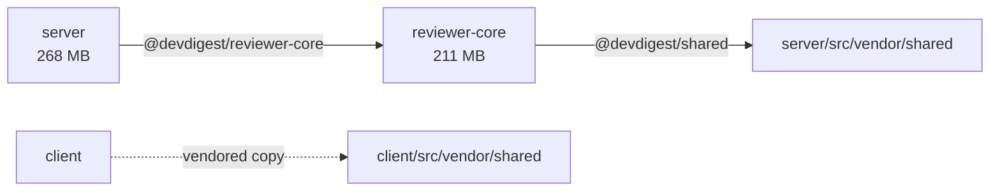

# Report template

Fill in every section in this order. Keep the headings exactly as written so
successive reports diff cleanly in git. Replace `<…>` placeholders; delete the
guidance lines in *italics*. Sizes in MB with one decimal (`12.4 MB`), sorted
descending. Package paths in backticks.

---

~~~~markdown
# Dependencies report

> Generated <YYYY-MM-DD> on branch `<branch>` @ `<sha>` by the `dependency-checker` skill.
> Mode: <online | offline — outdated/audit sections empty>. Incomplete: <none | what and why>.

## 1. Summary

| Package | Manager (lock / installed) | Prod | Dev | node_modules | Vulns in prod (C/H/M/L) | Vulns dev-only (C/H/M/L) | Outdated (major) |
|---|---|---|---|---|---|---|---|
| `server` | pnpm / pnpm | 23 | 11 | 268.0 MB | 2/4/1/0 | 4/28/22/5 | 27 (6) |

**Totals:** <N> packages · <N> direct deps · <X> MB on disk · P0 <n> · P1 <n> · P2 <n> · P3 <n>

*Then 2–4 sentences: the single most important thing, and the overall health.*

## 2. Map

*Diagram 1 — packages and how they link. Nodes = packages (label: name + node_modules size).
Solid arrows = tsconfig path alias (label: alias). Dashed arrows = vendored copy.
Colour nodes that have a P0 red, P1 amber. Keep it under ~15 nodes.*

*Diagram 2 — weight. One subgraph per package with its top 5 prod deps by closureBytes
(label: name + size), so the heavy hitters are visible at a glance. Skip packages with
no prod deps and say so under the diagram.*

## 3. Inventory by package

*One subsection per package, ordered: deployed packages first (server, client,
reviewer-core, mcp-server), then tooling (evals, e2e). Each subsection:*

### `<package>` — <name from package.json>

<one line: role of the package, manager, lockfile drift if any>

| Dependency | Kind | Role | Installed | Latest | Own size | With transitive (pkgs) | Notes |
|---|---|---|---|---|---|---|---|

*Sort by "With transitive" descending. Notes: deprecated, unused candidate, misplaced kind,
advisory count. Show all prod deps; for dev deps show the top 10 and summarise the rest
in one line.*

> Transitive sizes overlap between dependencies that share sub-dependencies, so they
> don't add up to the node_modules total.

## 4. Findings

### 4.1 Vulnerabilities

| Package | Vulnerable dep | Severity | Reaches prod? | Via | Advisory | Fix |
|---|---|---|---|---|---|---|

*Group rows that share an advisory and a root dependency.*

### 4.2 Outdated (major behind or ≥ 1 year)

| Package | Dependency | Kind | Installed | Latest | Majors behind |
|---|---|---|---|---|---|

### 4.3 Drift

- **Lockfile / installer drift:** <packages where lockManager ≠ installedWith, or "none">
- **Version drift across packages:** <libraries with different majors across packages, or "none">

### 4.4 Unused and misplaced

| Package | Dependency | Kind | Why it looks unused / misplaced | Verified how |
|---|---|---|---|---|

## 5. Priorities and actions

*Use references/prioritization.md. One table per level; write "No P<n> findings." for
empty levels.*

### P0 — now
| ID | Package(s) | Dependency | Finding | Evidence | Next step | Effort |
|---|---|---|---|---|---|---|

### P1 — this sprint
### P2 — planned
### P3 — note

## 6. Advice

*3–6 bullets of structural advice that goes beyond single actions — patterns the data
shows (e.g. "the same vitest upgrade is due in four packages: do it once, in one PR";
"mermaid is 115 MB and client-only: lazy-load it"). Each bullet cites the finding IDs
it builds on.*

## 7. Changes since last run

*If a previous report existed: new/resolved P0–P1 findings, size deltas > 10 %, and
version bumps. Otherwise: "First run."*

## Method

Collected with `.claude/skills/dependency-checker/scripts/collect-deps.mjs`
(<online|offline>). Sizes measured from installed `node_modules`; "unused" is a
grep-based heuristic, verified manually as noted in 4.4. Excludes `server/clones/**`
and build output.
~~~~
