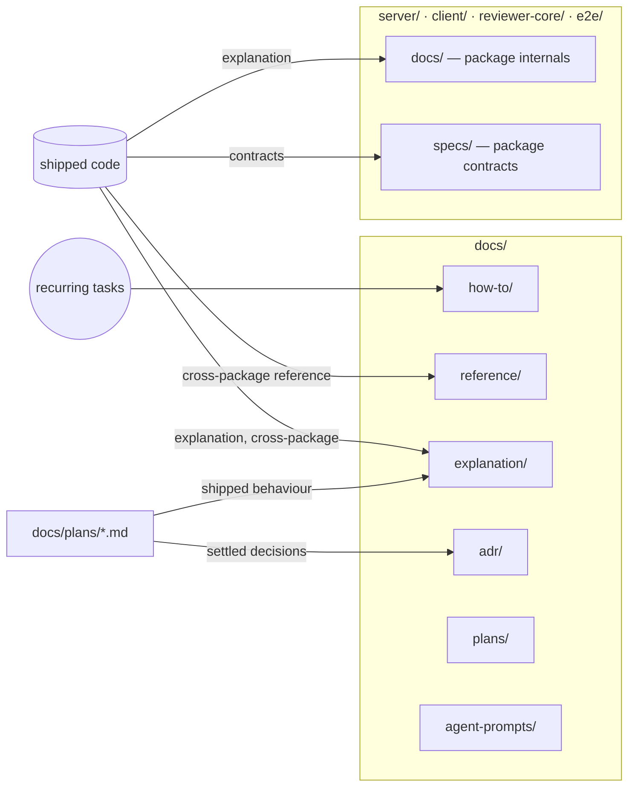

# Docs

Where DevDigest documentation lives and which kind of page goes where. The structure is a light version of [Diátaxis](https://diataxis.fr/) plus [ADRs](https://adr.github.io/), built around the folders that already exist. The decision is recorded in [ADR-0001](adr/0001-docs-taxonomy.md).

## Taxonomy

| Type (purpose) | Location | Examples | Owner |
|---|---|---|---|
| Tutorial — learn by doing | Root [`README.md`](../README.md) Quick start. No `docs/tutorials/` until a second tutorial exists. | [`README.md`](../README.md) | maintainers |
| How-to — cross-package task recipes | `docs/how-to/<task>.md` | — | doc-writer |
| Reference — exact contracts, config | Per-package contracts in `<package>/specs/<feature>.md` (append dated sections after shipping). Cross-package reference in `docs/reference/<topic>.md`. Prompt originals in `docs/agent-prompts/` (not doc-writer-editable). | [`server/specs/review-flow.md`](../server/specs/review-flow.md), [`reviewer-core/specs/review-contract.md`](../reviewer-core/specs/review-contract.md) | doc-writer (specs, reference) |
| Explanation — architecture, features, "why" | Package internals in `<package>/docs/<topic>.md`. Cross-package features in `docs/explanation/<feature>.md` (C4-style context/container views as flowcharts; arc42-inspired sections: context, building blocks, runtime, decisions). | [`server/docs/architecture.md`](../server/docs/architecture.md), [`client/docs/ui-architecture.md`](../client/docs/ui-architecture.md) | doc-writer |
| Decision records | `docs/adr/NNNN-kebab-title.md`, MADR format. Immutable once `accepted`; supersede with a new ADR. | [ADR index](adr/README.md) | doc-writer, human-approved |
| Plans and specs in flight (not docs) | `docs/plans/` (planner output); existing root specs stay where they are | [`skills-lab-spec.md`](skills-lab-spec.md) | planner, humans |

Folders such as `docs/how-to/` are created when their first page arrives, not as empty scaffolding.

## Diagrams

Use Mermaid with plain `flowchart`, `sequenceDiagram`, `erDiagram` or `stateDiagram-v2`. Don't use Mermaid's C4 extension (`C4Context`, `C4Container`…): GitHub doesn't render it. Draw C4-style views as flowcharts with subgraphs instead.

## Index

**Root `docs/`**

- [`agent-prompts/`](agent-prompts/README.md) — reviewable originals of the reviewer agents' DB-stored system prompts, plus [model-choice notes](agent-prompts/choosing-a-model.md). Edit together with `PUT /agents/:id`.
- [`architecture-improvement-plan.md`](architecture-improvement-plan.md) — 2026-09-20 cross-package architecture review; open findings and accepted tradeoffs.
- [`skills-lab-spec.md`](skills-lab-spec.md) — 2026-09-21 spec for the Skills Lab feature and the `pr-self-review` skill.
- [`plans/`](plans/) — Development Plans written by the `planner` agent.
- [`adr/`](adr/README.md) — architecture decision records.

**Repo root**

- [`README.md`](../README.md) — quick start and architecture overview.
- [`TESTING.md`](../TESTING.md) — cross-package testing and CI strategy.

**Per package**

| Package | Docs (internals) | Specs (contracts) |
|---|---|---|
| server | [`server/docs/`](../server/docs/README.md) | [`server/specs/`](../server/specs/README.md) |
| client | [`client/docs/`](../client/docs/README.md) | [`client/specs/`](../client/specs/README.md) |
| reviewer-core | [`reviewer-core/docs/`](../reviewer-core/docs/README.md) | [`reviewer-core/specs/`](../reviewer-core/specs/README.md) |
| e2e | [`e2e/docs/`](../e2e/docs/README.md) | [`e2e/specs/`](../e2e/specs/README.md) |

## Rules

- One Diátaxis type per page.
- Every new page is linked from this index, `adr/README.md`, or its package `docs/README.md` / `specs/README.md`.
- Link instead of duplicating; use relative links.
- Never put secrets or `.env` values in docs.
