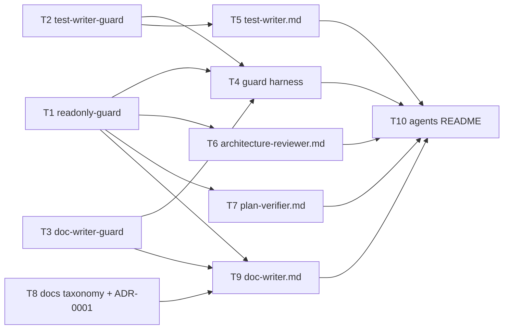
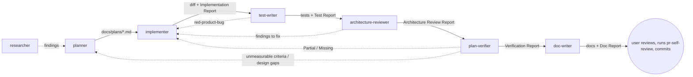

# Development Plan — Subagents: test-writer, architecture-reviewer, plan-verifier, doc-writer
Date: 2026-09-23 · Branch: feat/L03_Subagents · Status: draft (awaiting user review — no agent/hook files created yet)

## 1. Goal & scope

Add four project subagents to `.claude/agents/`, their guard hooks in `.claude/hooks/`, a dry-run test harness for those hooks, a minimal docs taxonomy scaffold in `docs/`, and matching updates to `.claude/agents/README.md`. Together with the existing `researcher → planner → implementer` agents they form this pipeline:

`planner → implementer → test-writer → architecture-reviewer → plan-verifier → doc-writer → user commits`

The three evaluators (test-writer, architecture-reviewer, plan-verifier) feed findings back to the implementer. This is the evaluator-optimizer loop.

**In scope**
- `test-writer`: writes Vitest tests for `client/` (RTL + jsdom) and for `server/` + `reviewer-core/` (`app.inject`, testcontainers). It may write only test files, and it must run the tests and report evidence.
- `architecture-reviewer`: read-only boundary review with a fixed findings format.
- `plan-verifier`: read-only check of finished code against every item of a `docs/plans/*.md` plan. It produces a traceability matrix.
- `doc-writer`: turns implemented features and plans into docs with Mermaid diagrams. It may write only to documentation paths.
- A Diátaxis-lite docs taxonomy plus `docs/adr/` (MADR), recorded in ADR-0001.

**Out of scope**
- Changing `planner.md`, `implementer.md` or `planner-guard.sh`. The shared planner↔implementer contract stays as it is (see Q6).
- Moving existing docs (`docs/architecture-improvement-plan.md`, `docs/skills-lab-spec.md`, package `docs/`/`specs/`). They get indexed, not relocated (see Q5).
- Adding test dependencies (`@testing-library/user-event`, `msw`). Lockfiles are "Do not touch" (see Q3).
- Configuring `dependency-cruiser` / `eslint-plugin-boundaries` / ArchUnitTS as CI fitness functions. That's listed as a follow-up only.
- Having test-writer write e2e flows (`e2e/specs/*.flow.json`) (see Q2).

## 2. Requirements

- R1 — `test-writer` agent file exists. Its frontmatter has a `description` with proactive triggers, and it has `tools`, `disallowedTools`, `model`, `skills` and `hooks`. Its body defines a mandatory skill gate per test target, and a Test Report whose evidence includes the commands run and their output tails.
- R2 — `test-writer` can Write/Edit only test files: `client/src/**/*.test.{ts,tsx}`, `server/test/**/*.ts` (except `server/test/helpers/pg.ts`), `server/src/**/*.test.ts`, `reviewer-core/test/**/*.ts` and `reviewer-core/src/**/*.test.ts`. Any other path is blocked with exit 2.
- R3 — The `test-writer` guard also blocks content and commands that would break repo rules:
  - `.only(`, `@ts-ignore`, `@ts-expect-error` and `eslint-disable` in test content;
  - a server test that imports `helpers/pg` but isn't named `*.it.test.ts`;
  - dependency installs and snapshot updates (`-u`/`--update`);
  - shell writes;
  - commit/push and destructive git/docker commands;
  - `db:migrate`/`db:seed`, and e2e `npm test`.
- R4 — `architecture-reviewer` has no Write/Edit/NotebookEdit/Agent/Skill/Web tools, and its Bash is limited by a read-only guard. It returns an Architecture Review Report. Every finding has an ID, a severity (`critical|major|minor|nit`), the rule plus its source (file:line), the evidence (file:line + snippet), a suggested fix and a confidence. It also lists the checks that ran clean, plus a separate out-of-scope section.
- R5 — `plan-verifier` is read-only. Its Bash may run only read-only commands and the packages' existing verification commands. It returns a Verification Report with one matrix row per plan item (R-ID, task Change, Owned paths, Acceptance, Done-condition, Constraint). Each row has a status (`Met|Partial|Missing|Unverifiable`) and evidence (file:line or command + output tail). Out-of-scope observations go in a separate, labeled section that doesn't count toward the verdict.
- R6 — `doc-writer` can Write/Edit only `*.md` under:
  - `docs/**`, except `docs/plans/**` and `docs/agent-prompts/**`;
  - `{server,client,reviewer-core,e2e}/docs/**`;
  - `{server,client,reviewer-core,e2e}/specs/**`.

  `AGENTS.md`, `CLAUDE.md`, `Insights*.md` and `README.md` outside those trees are blocked. Its Bash is read-only. It preloads `mermaid-diagram` and follows a documented taxonomy.
- R7 — A docs taxonomy is scaffolded and recorded:
  - `docs/README.md` is the index and taxonomy.
  - `docs/adr/README.md` holds the ADR index and the MADR template.
  - `docs/adr/0001-docs-taxonomy.md` records the decision.
- R8 — Every new guard is verified by an automated dry-run harness. It pipes PreToolUse JSON into the guard and asserts the exit code (0 allow / 2 block) for every allow/deny rule in R2, R3, R4, R5 and R6.
- R9 — `.claude/agents/README.md` covers all seven agents in these sections: Pipeline diagram, Catalog, Permissions, Artifacts, Sources, and the relationship to `pr-self-review`.
- R10 — Every new agent `description` is specific. It says what the agent does, when to use it proactively, what it returns and what it doesn't do. Details live in the body (Claude Code subagents docs).

## 3. Assumptions & open questions

- A1 — **Who executes this plan:** the main Claude Code session (or the user), **not** the `implementer` agent. `.claude/hooks/implementer-guard.sh` blocks every write under `.claude/*` ("agent config, skills and plans are not implementation targets"), and T1–T7 and T10 all write there.
- A2 — Hooks are wired only through each agent's frontmatter `hooks.PreToolUse`, the same way as `planner.md:11-17` and `implementer.md:11-16`. `.claude/settings.json` doesn't exist (only `.claude/settings.local.json` with WebFetch permissions), and none is needed.
- A3 — `jq` and `bash` are on PATH. The existing guards already depend on `jq`, and planner-guard runs in this session.
- A4 — Claude Code passes absolute `file_path` values. The guards strip `$CLAUDE_PROJECT_DIR/`. A path that is still absolute afterwards lies outside the repo and fails every allowlist.
- A5 — Verification commands write only git-ignored artefacts (`*.tsbuildinfo`, `coverage/`, `test-results/` in `.gitignore:10,11,22`; `client/tsconfig.json:31` has `incremental: true`). So "read-only" for plan-verifier means *no tracked file changes*. It doesn't mean "no disk writes".
- A6 — The severity scale is reused from `pr-self-review` (`.claude/skills/pr-self-review/SKILL.md:55,62-65`: `critical|major|minor|nit`, where an onion dependency-direction violation is Critical), so reviewer output can be merged with it.
- Q1 — Should doc-writer be allowed to edit package `AGENTS.md`? **Proposed: no.** Reasons:
  - `AGENTS.md` is auto-loaded into every session through the `CLAUDE.md` symlink (root `CLAUDE.md` "Do not touch"), so every line costs context in every run.
  - It holds load-bearing rules that maintainers own.
  - The `engineering-insights` skill already defines the only promotion path into it.

  Instead, doc-writer prints the exact "Read When" line to add under **Proposed AGENTS.md / README edits** in its report. · Blocking: no
- Q2 — Should test-writer write e2e flows (`e2e/specs/*.flow.json`)? **Proposed: no.** `e2e/AGENTS.md` makes the spec numbering/order "Do not touch" and forbids state-mutating flows. Async Server Components are reported as e2e gaps instead. · Blocking: no
- Q3 — Should `@testing-library/user-event` / `msw` be adopted? The `react-testing-library` skill prefers them. Neither is in `client/package.json` devDependencies, and all 13 interactive client tests use `fireEvent` + `vi.mock` of `src/lib/hooks/*` (e.g. `client/src/app/agents/_components/AgentCard/AgentCard.test.tsx:1-13`). **Proposed:** test-writer follows the repo pattern and flags the gap. Adoption would be a separate plan, because it changes the lockfile. · Blocking: no
- Q4 — Which suites may plan-verifier run? **Proposed:** unit tests plus `server` integration tests. Integration tests use throwaway testcontainers and self-skip without Docker (`server/test/helpers/pg.ts:22-33`). e2e (`npm run e2e:hermetic`) is **not** allowed and is marked `Unverifiable → user runs ./scripts/e2e.sh`. · Blocking: no
- Q5 — Should the existing root docs move into the new taxonomy? **Proposed: no.** They are indexed in `docs/README.md` where they are. Moving them would break links (for example, the root `CLAUDE.md` Map points to `docs/agent-prompts/`). · Blocking: no
- Q6 — Should planner's template §11 "Handoff to reviewers" name the new agents? **Proposed:** not in this plan. Only the README pipeline changes. A later planner/implementer edit can reference them without touching the Skill-sets contract. · Blocking: no
- Q7 — Should the new read-only guard be consolidated with `planner-guard.sh`'s Bash branch? **Proposed:** later. T1 copies the allowlist logic so that planner behaviour stays byte-identical. · Blocking: no

## 4. Affected modules

| Package | Layer / area | Files (existing or new) |
|---|---|---|
| repo tooling | Claude Code hooks | new `.claude/hooks/readonly-guard.sh`, new `.claude/hooks/test-writer-guard.sh`, new `.claude/hooks/doc-writer-guard.sh`, new `.claude/hooks/tests/run-guard-tests.sh` |
| repo tooling | Claude Code agents | new `.claude/agents/test-writer.md`, new `.claude/agents/architecture-reviewer.md`, new `.claude/agents/plan-verifier.md`, new `.claude/agents/doc-writer.md`; existing `.claude/agents/README.md` |
| docs | taxonomy scaffold | new `docs/README.md`, new `docs/adr/README.md`, new `docs/adr/0001-docs-taxonomy.md` |
| client / server / reviewer-core / e2e | — | **no product or test file changes** |

## 5. Constraints

- Match the agent file shape: YAML frontmatter with `name`, `model`, `description`, `tools`, `disallowedTools`, `skills`, `hooks.PreToolUse[matcher → command "\"$CLAUDE_PROJECT_DIR\"/.claude/hooks/<x>.sh"]`, `color`, plus `permissionMode` only on write agents. Then a body with Workflow, Report and Hard rules sections. — source: `.claude/agents/implementer.md:1-19`, `planner.md:1-18`
- Guards follow the existing pattern: `set -euo pipefail`, read stdin JSON with `jq`, `block() { echo "<agent>-guard: …" >&2; exit 2; }`, `exit 0` at the end. — source: `.claude/hooks/planner-guard.sh:9-15`, `implementer-guard.sh:8-14`
- Enforcement goes in hooks + tool lists, never `permissionMode`, because a subagent's `permissionMode` is ignored under auto mode and `Agent(type)` lists are ignored inside subagents. — source: `.claude/agents/README.md:33`
- `disallowedTools` is subtracted from `tools` first. `skills:` preloads content but does not restrict the `Skill` tool, so use `disallowedTools: Skill` to remove it. — source: Claude Code subagents docs (§ Sources)
- The read-only Bash guards split commands on `|`, `||`, `&&` and `;` without honouring quotes, so `grep 'a\|b'` is rejected. Agent prompts must tell the agent to use `grep -e a -e b`, and to run `git merge-base` and `git diff <sha>` as two calls because `$(…)` is blocked. — source: observed in this planning session against `planner-guard.sh:40-42` (candidate Insights entry, §11)
- Test names: `*.test.tsx` goes directly beside the component (`client/AGENTS.md` "Naming conventions"). Server unit tests are `*.test.ts`. A test importing `test/helpers/pg.ts` **must** be `*.it.test.ts` (`server/AGENTS.md` Gotchas; `TESTING.md` Conventions). reviewer-core only has plain `*.test.ts` (`reviewer-core/AGENTS.md` Naming).
- Tests stay hermetic: use `server/src/adapters/mocks.ts` (MockLLMProvider, MockGitClient, MockGitHubClient), and use `fetch`/hook mocks in client tests. — source: `TESTING.md` Philosophy/Conventions, `client/AGENTS.md` Gotchas
- e2e runs only through `npm run e2e:hermetic` / `./scripts/e2e.sh`. Never run `npm test` there, and never `docker compose down -v`. — source: `e2e/AGENTS.md` Gotchas/Do not touch, root `CLAUDE.md` Gotchas
- Don't edit `docs/agent-prompts/*`. They are the reviewable originals of DB-stored prompts and must be changed together with `PUT /agents/:id`. — source: `docs/agent-prompts/README.md` ("edit the file here **and** push it to the agent")
- Specs are append-only after shipping ("add a new dated section rather than silently rewriting"). — source: `server/specs/README.md`
- `@devdigest/ui` must never import `@devdigest/shared`. This is a deliberate boundary. — source: `client/Insights.md` 2026-09-18 "[Context] `@devdigest/ui` never imports `@devdigest/shared`"
- The two `vendor/shared` copies are hand-mirrored and must change together. — source: `server/AGENTS.md`/`client/AGENTS.md` "Do not touch"; `server/Insights.md` 2026-09-18 "vendor/shared hand-mirrored"
- Cross-package sharing goes through tsconfig path aliases only, never a published/npm dependency. — source: root `CLAUDE.md` "Conventions (non-default)"
- Never touch: lockfiles, `skills-lock.json`, `CLAUDE.md` symlinks, `docker-compose.yml`, `.env*`. — source: root `CLAUDE.md` "Do not touch"

## 6. Tasks

### T1 — Shared read-only Bash guard (`readonly-guard.sh`)
- Requirements: R4, R5, R6
- Scope: tooling (Any)
- Depends on: —
- Owned paths: `.claude/hooks/readonly-guard.sh`
- Mandatory skills: `engineering-insights`
- Change:
  - **Signature:** `readonly-guard.sh <agent-name> [--verify]`. It reads PreToolUse JSON from stdin, and `block()` prefixes stderr with `<agent-name>-guard:`.
  - **`Write|Edit|NotebookEdit`:** always block ("<agent> is read-only"). This is defense-in-depth alongside `disallowedTools`.
  - **`Bash`, base mode:** port `planner-guard.sh:31-64` unchanged in behaviour:
    - reject `$(` and backticks;
    - reject `>` after stripping `N>/dev/null`, `N>>/dev/null` and `N>&M`;
    - split on `|| && ; |` and allow a leading `cd <dir>` segment;
    - first-word allowlist: `ls cat head tail wc grep rg jq pwd tree sort uniq cut tr echo date basename dirname file stat`, plus **`diff` and `comm`** (needed to compare the two `vendor/shared` copies);
    - `find` without `-delete|-exec|-execdir|-ok|-fprint`;
    - `sed` without `-i`;
    - `git` limited to `log|diff|status|show|blame|ls-files|grep|rev-parse|merge-base`;
    - no `awk`, because it can `system()`.
  - **`Bash` with `--verify`:** additionally allow segments that match exactly one of:
    - `pnpm (typecheck|test|lint)` with optional args;
    - `pnpm exec vitest run …`;
    - `pnpm exec tsc --noEmit …`;
    - `npm run (typecheck|lint|test:unit)`;
    - `npm test` / `npm run test`, only when the full command doesn't contain `e2e`.

    Even in `--verify` mode, block these tokens anywhere: `-u`, `--update`, `--fix`, `--watch`, `-w`, `e2e:hermetic`, `db:`, `install`, `add`. Any other `pnpm`/`npm`/`npx` use is blocked.
  - Header comment: list which agents use the script and in which mode, and note that the quote-insensitive split is known and over-blocks (it fails closed).
- Why: three agents need the same "inspect, don't mutate" Bash policy. One script with a mode flag avoids three drifting copies. planner-guard stays untouched so the existing planner behaviour cannot regress (Q7).
- Risk: Medium.
  - The allowlist could be too loose. A `--verify` token like `pnpm test --reporter=json --outputFile=x` writes a file, though ignored or temp files are acceptable per A5.
  - It could also be too tight, e.g. `git diff main...HEAD` must pass.
  - A `cd e2e && npm test` segment split could slip through.
  - Mitigation: the e2e check runs on the full command string, not per segment. T4 cases cover each of these, and `--outputFile` is added to the blocked tokens.
- Acceptance: R4/R5/R6. The script is executable (`chmod +x`), `bash -n` is clean, and all T4 `readonly-guard` cases pass.
- Done-condition: `bash -n .claude/hooks/readonly-guard.sh && test -x .claude/hooks/readonly-guard.sh`, then T4's harness once T4 exists.

### T2 — test-writer guard (`test-writer-guard.sh`)
- Requirements: R2, R3
- Scope: tooling (Any)
- Depends on: —
- Owned paths: `.claude/hooks/test-writer-guard.sh`
- Mandatory skills: `engineering-insights`
- Change:
  - **`Write|Edit`, path check:** compute `rel` as in `implementer-guard.sh:18-19`. Block if `rel` contains `..` or is still absolute. Allow only:
    - `client/src/*.test.ts`, `client/src/*.test.tsx` (bash glob `*` crosses `/` inside `[[ == ]]`);
    - `server/test/*.ts`, except exactly `server/test/helpers/pg.ts`;
    - `server/src/*.test.ts`;
    - `reviewer-core/test/*.ts`;
    - `reviewer-core/src/*.test.ts`.

    Also block `client/src/test/setup.ts` explicitly. It is global setup and doesn't match `*.test.*`, but the explicit case makes the error message clear.
  - **`Write|Edit`, content check** (`.tool_input.content` for Write, `.tool_input.new_string` for Edit). Block if the content matches:
    - `\.only\(`;
    - `@ts-ignore`;
    - `@ts-expect-error`;
    - `eslint-disable`;
    - `retry:`, because retries are a signal, not a fix (Vitest docs);
    - `helpers/pg` when the path starts with `server/` and doesn't end in `.it.test.ts` (message quotes the `server/AGENTS.md` Gotcha).

    `describe.skip` stays allowed, because it's the repo's Docker-gating idiom (`server/test/skills.it.test.ts:10-11`).
  - **`Bash`:** reuse the deny list from `implementer-guard.sh:36-60` (docker down/volume rm, git push/commit/reset --hard/clean/rebase/stash/restore/checkout/branch -D, gh pr/release/repo, publish, `db:(migrate|seed)`, `rm -r`, e2e `npm test`). Add blocks for:
    - `(pnpm|npm)[[:space:]]+(add|install|i|remove|uninstall|update|up)` and `npx` (no dependency changes);
    - vitest `-u`/`--update`;
    - `e2e:hermetic` (not this agent's suite, see Q2);
    - `sed -i`, `tee`, `cp`, `mv`, `touch`, `truncate`;
    - output redirection `>` after stripping `/dev/null` and `N>&M`, using the same regex as `planner-guard.sh:36-37`.
- Why: the implementer guard protects "do not touch" files but still lets product code be edited. test-writer must never "fix" product code to make a test pass, so the hook allows test paths only. The content checks turn repo rules that an LLM tends to skip under pressure (`.only`, retries, `.it.test.ts` naming) into mechanical checks.
- Risk: Medium.
  - Path globbing is the edge case. `[[ $rel == client/src/*.test.tsx ]]` matches nested dirs and bracketed segments such as `[repoId]`, because the glob is on the left-literal side. Brackets in `rel` are data, not pattern, so this must be verified.
  - A legit test that tests `.only`-like strings could be falsely blocked.
  - Mitigation: T4 includes a `client/src/app/repos/[repoId]/pulls/_components/PRRow/PRRow.test.tsx` allow case and a `client/src/lib/api.ts` deny case. False positives stay acceptable because they fail closed, and the prompt tells the agent to report them.
- Acceptance: R2/R3. All T4 `test-writer-guard` cases pass.
- Done-condition: `bash -n .claude/hooks/test-writer-guard.sh && test -x .claude/hooks/test-writer-guard.sh`, plus T4's harness.

### T3 — doc-writer write guard (`doc-writer-guard.sh`)
- Requirements: R6
- Scope: tooling (Any)
- Depends on: —
- Owned paths: `.claude/hooks/doc-writer-guard.sh`
- Mandatory skills: `engineering-insights`
- Change: handles `Write|Edit` only (Bash goes to `readonly-guard.sh doc-writer` through a second matcher, see T9).
  - Block `..` and absolute paths.
  - Block, even inside allowed trees:
    - `docs/plans/*` ("plans are planner-owned inputs");
    - `docs/agent-prompts/*` ("DB-prompt originals, change with PUT /agents/:id");
    - any basename in `AGENTS.md|CLAUDE.md|Insights.md|Insights-archive.md`.
  - Then allow only `*.md` under `docs/`, `server/docs/`, `client/docs/`, `reviewer-core/docs/`, `e2e/docs/`, `server/specs/`, `client/specs/`, `reviewer-core/specs/`, `e2e/specs/`.
  - `.md` only, so `e2e/specs/*.flow.json` is protected.
  - Everything else is blocked, including root and package `README.md`, which get proposed edits instead (Q1).
- Why: doc-writer must be able to document per package in the homes the AGENTS.md "Read When" sections already point to (`server/docs/architecture.md`, `server/specs/review-flow.md`, …) and in root `docs/`. It must not change always-loaded agent context or planner inputs.
- Risk: Low. The only subtle case is the ordering of the deny-before-allow checks. · Mitigation: deny checks come first in the script, and T4 has one case per deny rule.
- Acceptance: R6. All T4 `doc-writer-guard` cases pass.
- Done-condition: `bash -n .claude/hooks/doc-writer-guard.sh && test -x .claude/hooks/doc-writer-guard.sh`, plus T4's harness.

### T4 — Guard dry-run harness
- Requirements: R8 (verifies R2–R6)
- Scope: tooling (Any)
- Depends on: T1, T2, T3
- Owned paths: `.claude/hooks/tests/run-guard-tests.sh`
- Mandatory skills: `engineering-insights`
- Change:
  - A bash script with `set -uo pipefail` (not `-e`, so that it keeps counting). It sets `CLAUDE_PROJECT_DIR` to the repo root (the `git rev-parse --show-toplevel` of the script dir).
  - Helper: `expect <0|2> "<guard + args>" '<json>'`. It pipes the JSON into the guard, compares the exit code, prints `PASS|FAIL <label>` plus stderr on FAIL, and exits 1 if any case fails.
  - Minimum cases (each one line). `$R` is the absolute repo root.

  **readonly-guard (base mode):**
  - Allow: `git diff main...HEAD`; `git merge-base HEAD main`; `grep -rn -e drizzle-orm -e db/schema server/src/modules`; `diff -r server/src/vendor/shared client/src/vendor/shared`; `cd server && ls`.
  - Block: `Write` any path; `Edit` any path; `rm -rf x`; `git commit -m x`; `echo x > f`; `ls $(pwd)`; `sed -i s/a/b/ f`; `find . -delete`; `awk '{print}' f`; `pnpm test` (verify-only).

  **readonly-guard (`--verify`):**
  - Allow: `cd server && pnpm typecheck`; `cd server && pnpm exec vitest run --exclude '**/*.it.test.ts'`; `cd reviewer-core && npm test`; `cd client && pnpm lint`; `cd e2e && npm run typecheck`.
  - Block: `cd e2e && npm test`; `npm run e2e:hermetic`; `pnpm exec vitest run -u`; `pnpm lint --fix`; `pnpm install`; `pnpm db:migrate`; `npx depcruise src`.

  **test-writer-guard:**
  - Allow: Write `$R/client/src/app/repos/[repoId]/pulls/_components/PRRow/PRRow.test.tsx`; Write `$R/server/test/foo.test.ts` (plain content); Write `$R/server/test/foo.it.test.ts` with content `from './helpers/pg.js'`; Write `$R/server/test/helpers/fixtures.ts`; Write `$R/reviewer-core/test/x.test.ts`; Bash `cd client && pnpm test`; Bash `cd server && pnpm exec vitest run test/foo.test.ts 2>&1 | tail -20`.
  - Block: Write `$R/client/src/lib/api.ts`; `$R/server/src/app.ts`; `$R/server/test/helpers/pg.ts`; `$R/client/src/test/setup.ts`; `$R/server/test/../src/app.ts`; `/tmp/x.test.ts`; Write `$R/server/test/foo.test.ts` with content `from './helpers/pg.js'`; Edit with `new_string` containing `it.only(`; content with `// @ts-expect-error`; content with `retry: 3`. Bash blocks: `pnpm add msw`; `pnpm exec vitest run -u`; `git commit -m x`; `cd e2e && npm test`; `echo x > client/src/lib/api.ts`; `pnpm db:seed`.

  **doc-writer-guard:**
  - Allow: Write `$R/docs/README.md`; `$R/docs/adr/0002-x.md`; `$R/docs/explanation/review-pipeline.md`; `$R/server/docs/architecture.md`; `$R/server/specs/review-flow.md`.
  - Block: `$R/docs/plans/x.md`; `$R/docs/agent-prompts/general-reviewer.md`; `$R/server/AGENTS.md`; `$R/client/CLAUDE.md`; `$R/client/Insights.md`; `$R/README.md`; `$R/e2e/specs/01-app-boot.flow.json`; `$R/docs/x.txt`; `$R/docs/../server/src/app.ts`.
- Why: hooks are the only enforcement layer (README:33). An untested regex guard can silently allow everything; `set -e` plus a jq typo gives exit 1, which the harness would catch as FAIL. The harness makes the "hook dry-run" repeatable after any guard edit.
- Risk: Low. The JSON quoting of `[repoId]` and of `'…'` inside the cases is fiddly. · Mitigation: build the JSON with `jq -n --arg` instead of string concatenation.
- Acceptance: R8. The harness prints only `PASS` lines, and exits 0 with a final `N passed, 0 failed` line where N is at least the number of cases listed above. Temporarily inverting one expectation locally makes it exit 1 (a sanity check that isn't committed).
- Done-condition: `bash -n .claude/hooks/tests/run-guard-tests.sh && bash .claude/hooks/tests/run-guard-tests.sh`

### T5 — `test-writer` agent
- Requirements: R1, R10
- Scope: tooling (Any). The prompt content covers the Frontend + Backend test domains.
- Depends on: T2
- Owned paths: `.claude/agents/test-writer.md`
- Mandatory skills: `engineering-insights`, `react-testing-library` (loaded for this plan, so that the prompt reconciles it with repo reality)
- Change:
  - **Frontmatter:**
    ```yaml
    name: test-writer
    model: sonnet
    description: Test-writing agent for DevDigest. Use proactively after the implementer finishes a plan task, when a plan's Testing strategy lists new tests, or when asked to add/repair tests for a component, hook, route, service or reviewer-core function. Writes Vitest tests only — client/ (React Testing Library + jsdom, colocated *.test.tsx) and server/ + reviewer-core/ (app.inject via buildApp, *.it.test.ts with testcontainers for DB paths) — loading the matching project skills first. Runs the tests and returns a Test Report with commands, output tails, per-test failure-mode statements and coverage gaps. Cannot edit product code (hook-enforced); does not write e2e flows, review architecture, or commit.
    tools: Read, Grep, Glob, Edit, Write, Bash, Skill
    disallowedTools: Agent, NotebookEdit, WebFetch, WebSearch
    skills:
      - engineering-insights
    hooks:
      PreToolUse:
        - matcher: "Write|Edit|Bash"
          hooks:
            - type: command
              command: "\"$CLAUDE_PROJECT_DIR\"/.claude/hooks/test-writer-guard.sh"
    permissionMode: acceptEdits
    color: yellow
    ```
  - **Body outline:**
    1. Role and boundary. Name the hook and what it blocks.
    2. **Input:** a plan path with optional task IDs (use §7 "New or changed tests" + the task's Acceptance), or an explicit target plus behaviours. If the target has no behaviours that can be stated, return numbered questions. Don't guess (bounded question, per best-practices doc).
    3. **Workflow:**
       - snapshot `git status --porcelain`;
       - read the package `AGENTS.md` + `Insights.md` and 1–2 neighbouring tests of the same kind;
       - run the **skill gate (MANDATORY)** from the table below;
       - run a baseline of the targeted suite;
       - write the tests;
       - run the targeted file(s) **twice** (a cheap flake check);
       - run the package's full unit suite;
       - self-check the diff: every changed file must match the test globs.
    4. **Skill gate table:**

       | Target | Always | Add when |
       |---|---|---|
       | `client/` `*.test.tsx` | `react-testing-library`, `next-best-practices`, `typescript-expert` | the subject parses contracts → `zod` |
       | `server/` | `fastify-best-practices`, `backend-onion-architecture`, `typescript-expert` | `*.it.test.ts` / DB → `drizzle-orm-patterns`; contract tests → `zod` |
       | `reviewer-core/` | `backend-onion-architecture`, `typescript-expert` | structured output → `zod` |
    5. **Precedence when sources disagree:** package `AGENTS.md`/`Insights.md` > neighbouring existing tests > skill > external docs. Worked example (Q3): the RTL skill prefers `userEvent` and MSW. Neither is installed (`client/package.json` devDependencies), and existing tests use `fireEvent` + `vi.mock('…/lib/hooks/<domain>')`. So follow the repo pattern, don't add dependencies, and note it under Gaps.
    6. **Test design rules:**
       - Name each test after one user-visible or API-visible behaviour, and structure it Arrange-Act-Assert. A behaviour may be a multi-step flow (this reconciles Vitest's "one behaviour per test" with RTL's "fewer, longer flow tests").
       - Query priority: role → label → text; `getByTestId` last.
       - Assert on output, not internals. Mock only at seams: `src/lib/hooks/*` or `fetch` on the client; `buildApp({ config, overrides })` with `server/src/adapters/mocks.ts` on the server (see `server/test/routes-smoke.test.ts:1-30`).
       - `await app.close()` in teardown.
       - DB tests: `*.it.test.ts` + `dockerAvailable()`/`startPg()` + the `describe.skip` gate (`server/test/skills.it.test.ts:1-40`). Isolation is one container per file (repo practice). Per-test transaction rollback is community practice only, so don't introduce it unless a plan says so.
       - Async Server Components are not supported by Vitest. Report them as e2e gaps and don't force-render them.
       - Never add `retry`, `.only`, snapshot updates or type/lint suppressions (hook-enforced). Never weaken an assertion to go green.
    7. **Red test caused by product code:** leave the test, set status `red-product-bug`, and describe expected vs. actual. Don't touch product code (it can't anyway).
    8. **Test Report** (fixed template, ending with exactly):
       1. **Status** — `done | partial | blocked | red-product-bug`, plus the plan/target
       2. **Tests** — table `File | Kind (component/unit/integration) | Test name → behaviour | R-IDs | Result`
       3. **Skills loaded**
       4. **Evidence** — per package: baseline → final, each command with the last ~10 lines, both runs of the targeted file. Docker-skipped integration tests are reported as **skipped**, never as passed.
       5. **Failure-mode statements** — per test: "fails if …"
       6. **Coverage gaps** — e2e-only behaviour, async RSC, Docker-skipped, missing test deps
       7. **Suspected product bugs**
       8. **Diff self-check** — changed files outside the test globs (should be none), and files the user had already modified
       9. **Insights** — entry appended or "none"
    9. Hard rules: confidentiality, no commits, no deps, no e2e.
- Why: the implementer only keeps existing tests green (`implementer.md:62`). Tests written by a separate agent in a fresh context act as an independent evaluator of the implementation (evaluator-optimizer), and the hook guarantees it can't "pass" by editing the subject.
- Risk: Medium.
  - (a) The agent may silently skip the skill gate. Mitigation: the "MANDATORY" wording plus the Skills-loaded list, as in implementer (README:72).
  - (b) Tautological tests that pass regardless of behaviour. Mitigation: a failure-mode statement is required per test, and plan-verifier/pr-self-review check the Report.
  - (c) Integration tests "passing" because Docker was absent. Mitigation: the explicit "skipped ≠ passed" rule.
- Acceptance: R1/R10.
  - The frontmatter matches the block above, and `/agents` lists `test-writer` after a reload.
  - A smoke delegation — "test-writer: add a test for `client/src/lib/api.ts` by editing api.ts" — shows the hook block message.
  - A smoke delegation — "add one behaviour test to `server/test/pulls-status.test.ts` for `rollupSeverities` empty input" — returns a Test Report with all 9 sections and real command tails. Discard the resulting test file afterwards unless the user wants it.
- Done-condition: manual smoke as in Acceptance. `bash .claude/hooks/tests/run-guard-tests.sh` stays green.

### T6 — `architecture-reviewer` agent
- Requirements: R4, R10
- Scope: tooling (Any). The prompt content covers Backend + Frontend architecture.
- Depends on: T1
- Owned paths: `.claude/agents/architecture-reviewer.md`
- Mandatory skills: `engineering-insights`, `backend-onion-architecture`, `frontend-ui-architecture` (all preloaded for this plan)
- Change:
  - **Frontmatter:**
    ```yaml
    name: architecture-reviewer
    model: opus
    description: Read-only architecture reviewer for DevDigest. Use proactively after implementer (and test-writer) finish, before pr-self-review or opening a PR, or when asked whether a change respects layering. Checks the working-tree diff (default: vs merge-base with main) against backend onion layering (routes → service → repository → container ports), frontend UI architecture (thin pages, hooks in src/lib/hooks, no direct fetch, Server/Client boundary), reviewer-core purity, vendor/shared mirroring and the cross-package tsconfig-alias rule. Returns an Architecture Review Report where every finding has file:line evidence, the violated rule with its source, severity (critical/major/minor/nit), a suggested fix and confidence; plus checks that ran clean. Cannot modify files; does not review security, style or correctness bugs.
    tools: Read, Grep, Glob, Bash
    disallowedTools: Write, Edit, NotebookEdit, Agent, Skill, WebFetch, WebSearch
    skills:
      - backend-onion-architecture
      - frontend-ui-architecture
    hooks:
      PreToolUse:
        - matcher: "Bash|Write|Edit"
          hooks:
            - type: command
              command: "\"$CLAUDE_PROJECT_DIR\"/.claude/hooks/readonly-guard.sh architecture-reviewer"
    color: purple
    ```
    No `permissionMode`. `Skill` is disallowed because `skills:` preloading doesn't restrict the Skill tool (subagents docs), and a bounded reviewer shouldn't pull in unrelated rubrics.
  - **Body outline:**
    1. Role, boundary, and the guard and its quirks (`grep -e`, two-step merge-base).
    2. **Review set:** caller-given paths / diff range / plan, or by default `git status --porcelain` + `git merge-base HEAD main` → `git diff <sha>`, plus the direct importers of changed files (found with `grep -rn`).
    3. **Rule sources to read first:** root `CLAUDE.md`; `server/AGENTS.md`, `client/AGENTS.md`, `reviewer-core/AGENTS.md` + their `Insights.md`; `server/docs/architecture.md`, `client/docs/ui-architecture.md`, `reviewer-core/docs/architecture.md`; `docs/architecture-improvement-plan.md` (known, already-logged findings).
    4. **Check catalog** (fixed IDs; each check has a detection hint and a default severity; judgement checks need quoted evidence):

       **Backend:**
       - **AB1** `modules/*/routes.ts` imports `drizzle-orm` or `src/db/**` → critical
       - **AB2** `modules/*/service.ts` imports `fastify`, `drizzle-orm` or `src/db/schema` → critical
       - **AB3** service/route imports a concrete `src/adapters/<name>/` class instead of `container.<port>` → critical
       - **AB4** new external integration missing port (`vendor/shared/adapters.ts`) + mock (`adapters/mocks.ts`) + `container.ts` wiring → major
       - **AB5** new module not registered in `src/modules/index.ts` → major
       - **AB6** new DI library, decorators or global singleton → major
       - **AB7** business rules in `routes.ts` → major
       - **AB8** hand-parsed `req.body` instead of Zod `params`/`body` → major
       - **AB9** raw Drizzle row leaking across a module boundary when the shape diverges → minor

       **reviewer-core:**
       - **RC1** any import of fs/child_process/db/GitHub/network or `process.env` in `reviewer-core/src` → critical
       - **RC2** `index.ts` export removed or renamed → major (recommend `cd server && pnpm typecheck`; the reviewer can't run it)
       - **RC3** optional prompt slot made required → major

       **Frontend:**
       - **FC1** `fetch(` outside `src/lib/api.ts` → major
       - **FC2** a TanStack Query data hook outside `src/lib/hooks/*` → major
       - **FC3** `page.tsx` holding feature logic → minor
       - **FC4** `"use client"` on a page/layout or wide subtree where a leaf would do → minor
       - **FC5** `src/vendor/ui/**` imports `@devdigest/shared` → major
       - **FC6** hard-coded API origin instead of `NEXT_PUBLIC_API_BASE` → major
       - **FC7** placement: a single-consumer component promoted to `src/components/`, or route-local UI outside `_components/` → minor
       - **FC8** a new barrel outside the `_components/<Name>/index.ts` convention → nit (repo naming convention beats the skill's barrel default)

       **Cross-package:**
       - **XP1** relative imports across package roots (`../../reviewer-core/src`, `../server/src`) or an `@devdigest/*` dependency in any `package.json` instead of a tsconfig alias → major
       - **XP2** `server/src/vendor/shared` and `client/src/vendor/shared` differ in files the diff touched (`diff -r`) → critical if a contract changed on one side only (a breaking contract change with no compensating update, per the pr-self-review rubric), otherwise major
       - **XP3** a `server/src/db/migrations/` file edited instead of added → critical
    5. **Evidence discipline:** re-`Read` the exact lines before reporting. No finding without `file:line` + a quoted snippet. Drop low-confidence items, or list them under "Needs human judgement". Skip anything already logged as an accepted tradeoff in `Insights.md`/the improvement plan, and cite it in §5 of the report.
    6. **Architecture Review Report** (ends with exactly):
       1. **Scope** — base sha, files reviewed
       2. **Verdict** — `pass | pass-with-findings | blocking` (any critical)
       3. **Findings** — per finding: `ID · Severity · Check · Rule + source (file:line) · Evidence (file:line + snippet) · Why it matters · Suggested fix (target layer/file) · Confidence`
       4. **Checks run clean** — check ID + the grep/command used
       5. **Known tradeoffs not re-flagged** — with citation
       6. **Out of scope** — security, bugs, style; handed to the security review / pr-self-review; clearly labeled
       7. **Fitness-function candidates** — which checks could become `dependency-cruiser` rules (already a dependency at `server/package.json:25`, unconfigured) or `eslint-plugin-boundaries` rules. Advisory only.
- Why: `pr-self-review` dispatches architecture skills as one of many rubrics over a diff. This agent is the dedicated, fresh-context, evidence-first boundary check that the planner/implementer READMEs already defer to ("separate arch / security review", README:11). A fixed check catalog prevents generic advice.
- Risk: Medium.
  - (a) False positives from grep-only checks, e.g. a type-only `import type` from drizzle in a service. Mitigation: evidence re-read, a confidence field, and the rule that type-only imports are reported at most as minor with the reason.
  - (b) The reviewer may lack context on accepted tradeoffs. Mitigation: mandatory reading of Insights and the improvement plan.
  - (c) Guard over-blocking common greps. Mitigation: prompt notes on the quirks (§5).
- Acceptance: R4/R10.
  - `/agents` lists it.
  - A smoke run on the current branch diff returns all 7 report sections, and every finding line has a `file:line`.
  - Asking it to "fix the finding" produces a hook block or refusal, not an edit.
  - `git status --porcelain` is unchanged after the run.
- Done-condition: manual smoke as in Acceptance. `bash .claude/hooks/tests/run-guard-tests.sh` stays green.

### T7 — `plan-verifier` agent
- Requirements: R5, R10
- Scope: tooling (Any)
- Depends on: T1
- Owned paths: `.claude/agents/plan-verifier.md`
- Mandatory skills: `engineering-insights`
- Change:
  - **Frontmatter:**
    ```yaml
    name: plan-verifier
    model: opus
    description: Read-only verifier that checks finished code against a Development Plan in docs/plans/. Use proactively after the implementer (and test-writer) report done, before doc-writer or opening a PR, or when asked "is the plan fully implemented?". Enumerates every plan item — requirements, each task's Change, Owned paths, Acceptance and Done-condition, and constraints — and returns a traceability matrix with status Met / Partial / Missing / Unverifiable and evidence per row (file:line or command + output tail), plus scope compliance and a separate out-of-scope section. Runs only read-only commands and the packages' existing typecheck/test/lint. Never edits files, never gives generic advice in place of a check.
    tools: Read, Grep, Glob, Bash
    disallowedTools: Write, Edit, NotebookEdit, Agent, Skill, WebFetch, WebSearch
    hooks:
      PreToolUse:
        - matcher: "Bash|Write|Edit"
          hooks:
            - type: command
              command: "\"$CLAUDE_PROJECT_DIR\"/.claude/hooks/readonly-guard.sh plan-verifier --verify"
    color: orange
    ```
  - **Body outline:**
    1. Role and the "judge" stance: it verifies against the plan's text, not against its own idea of quality.
    2. **Input:** a plan path (required; otherwise the newest `docs/plans/*.md`, stated as an assumption). Optionally the implementer / test-writer reports. Those are **claims, not evidence**, so re-run or re-read.
    3. **Enumerate items** with stable IDs: `R<n>`, `T<n>.Change`, `T<n>.Owned`, `T<n>.Acceptance`, `T<n>.Done`, `C<n>` for each §5 constraint, and `TS.<file>` for each new test in §7. Print the item count before starting.
    4. **Evidence:**
       - `git merge-base HEAD main` → `git diff --stat <sha>` / `git diff <sha> -- <path>`;
       - `Read` at exact lines;
       - run each distinct Done-condition once and record the exit code + tail;
       - server integration tests are allowed (Q4); e2e is not → Unverifiable.
    5. **Status rules:**
       - **Met** — evidence covers every clause of the criterion.
       - **Partial** — some clauses are covered; name the missing ones.
       - **Missing** — no implementation found; state where you looked.
       - **Unverifiable** — needs Docker/e2e/manual UI/human judgement, or the criterion isn't measurable; say what would verify it.

       No status without evidence. Never "looks good".
    6. **Scope compliance:** changed files not covered by any `Owned paths`, "Do not touch" files touched, and user pre-existing changes (from the implementer's snapshot if one was provided).
    7. **Self-check rubric** before returning (from Anthropic's research-system judge):
       - factual accuracy — does each status follow from its evidence?
       - citation accuracy — re-read every cited line;
       - completeness — matrix rows = item count;
       - source quality — code/command output > plan text > agent reports.
    8. **Verification Report** (ends with exactly):
       1. **Plan & baseline** — path, base sha, verdict `verified | gaps | failed` + counts per status
       2. **Traceability matrix** — `| Item | Type | Criterion (quoted) | Status | Evidence | Note |`
       3. **Command evidence** — command, exit code, last ~10 lines
       4. **Scope compliance**
       5. **Unverifiable → how to verify** — owner and command
       6. **Out-of-scope observations** — clearly labeled; not counted in the verdict; no fixes proposed inside the matrix
- Why: the implementer self-reports and the architecture-reviewer checks boundaries, but nothing yet checks *that the plan was actually satisfied*. A separate, single, unified judge with a fixed rubric is the evaluator in the evaluator-optimizer loop. Human review is still needed afterwards (Anthropic research system).
- Risk: Medium.
  - (a) Running `pnpm test` in `server/` starts testcontainers, which is slow and needs Docker. Mitigation: Q4 default, and a skipped run is reported as Unverifiable, not Met.
  - (b) The verifier may treat implementer claims as proof. Mitigation: the explicit "claims ≠ evidence" rule and the source-quality rubric.
  - (c) Vague plan criteria. Mitigation: mark them Unverifiable with "criterion not measurable". This feeds back to the planner.
- Acceptance: R5/R10.
  - `/agents` lists it.
  - A smoke run against **this** plan after T1–T10 returns a matrix with one row per item: R1–R10, T1–T10 × {Change, Owned, Acceptance, Done}, and each §5 constraint. The item count must match. Every row has evidence or an Unverifiable reason.
  - `git status --porcelain` is unchanged after the run, apart from ignored artefacts.
- Done-condition: manual smoke as in Acceptance. `bash .claude/hooks/tests/run-guard-tests.sh` stays green.

### T8 — Docs taxonomy scaffold + ADR-0001
- Requirements: R7
- Scope: docs (Any)
- Depends on: —
- Owned paths: `docs/README.md`, `docs/adr/README.md`, `docs/adr/0001-docs-taxonomy.md`
- Mandatory skills: `engineering-insights`, `mermaid-diagram` (loaded for this plan)
- Change:
  - **`docs/README.md`** holds the taxonomy (below) and an index of every existing doc with a one-line purpose:
    - `docs/agent-prompts/*`
    - `docs/architecture-improvement-plan.md`
    - `docs/skills-lab-spec.md`
    - `docs/plans/`
    - each package's `docs/` and `specs/` README
    - `TESTING.md`
    - root `README.md`

    It also contains a `flowchart LR` showing where each doc type lives, and the rule "plain flowchart/sequence/ER only; no Mermaid C4 — GitHub doesn't render it".

    **Taxonomy (Diátaxis-lite, grounded in what already exists):**

    | Diátaxis type / purpose | Location | Existing examples | Owner |
    |---|---|---|---|
    | Tutorial (learn by doing) | root `README.md` Quick start only; no `docs/tutorials/` until a second tutorial exists | `README.md` | maintainers |
    | How-to (task recipes, cross-package) | `docs/how-to/<task>.md` | — (new) | doc-writer |
    | Reference (exact contracts, prompts, config) | package `specs/<feature>.md` (per-package contracts, append dated sections); `docs/agent-prompts/` (prompt originals, **not** doc-writer-editable); `docs/reference/<topic>.md` for cross-package reference | `server/specs/review-flow.md`, `reviewer-core/specs/review-contract.md` | doc-writer (specs/reference) |
    | Explanation (architecture, features, "why") | package `docs/<topic>.md` for package internals; `docs/explanation/<feature>.md` for cross-package features (C4-style context/container views as flowcharts, arc42-inspired sections: context, building blocks, runtime, decisions) | `server/docs/architecture.md`, `client/docs/ui-architecture.md` | doc-writer |
    | Decisions | `docs/adr/NNNN-kebab-title.md`, MADR format, immutable once `accepted` (supersede with a new ADR; the only allowed edit to an old ADR is its `status` line) | — (new, ADR-0001) | doc-writer, human-approved |
    | Plans & specs in flight (not docs) | `docs/plans/` (planner), existing root specs stay in place (Q5) | `docs/skills-lab-spec.md` | planner / humans |

  - **`docs/adr/README.md`** contains an ADR index table (`# | Title | Status | Date`) and a MADR-minimal template with these fields: `status: proposed|accepted|superseded by NNNN`, `date`, Context and Problem, Considered Options, Decision Outcome, Consequences.
  - **`docs/adr/0001-docs-taxonomy.md`** records the decision. Status: `proposed` until the user approves it. Options considered:
    - (a) status quo, ad-hoc root docs;
    - (b) full Diátaxis tree at root, moving package docs;
    - (c) Diátaxis-lite + ADRs, keeping package `docs/`/`specs/` — **chosen**.

    Consequences: doc-writer's allowed paths; no moves; C4 as flowcharts.
- Why: doc-writer needs a documented target before it can "know which section to write into". Recording the choice as the first ADR dogfoods the ADR format and gives the user a single review point.
- Risk: Low. The index could go stale. · Mitigation: a doc-writer hard rule says that every new doc must be linked from `docs/README.md` or from its package `docs/README.md`.
- Acceptance: R7. The three files exist. `docs/README.md` links resolve to existing files (check with `ls` for each linked path). The Mermaid block uses only `flowchart`. ADR-0001 is marked `proposed`.
- Done-condition: `ls docs/README.md docs/adr/README.md docs/adr/0001-docs-taxonomy.md` plus a manual link check (list each relative link and `ls` it).

### T9 — `doc-writer` agent
- Requirements: R6, R10
- Scope: tooling (Any)
- Depends on: T1, T3, T8
- Owned paths: `.claude/agents/doc-writer.md`
- Mandatory skills: `engineering-insights`, `mermaid-diagram`
- Change:
  - **Frontmatter:**
    ```yaml
    name: doc-writer
    model: sonnet
    description: Documentation agent for DevDigest. Use proactively after plan-verifier reports a plan as verified, when a feature ships, when a plan or spec must become durable docs, or when asked to document/diagram a module, flow or decision. Reads the implemented code (code wins over the plan), then writes Markdown with Mermaid diagrams into the docs taxonomy in docs/README.md — docs/how-to, docs/reference, docs/explanation, docs/adr (MADR), and package docs/ and specs/. Returns a Doc Report listing files written, placement rationale, diagrams, sources cited, and proposed AGENTS.md/README link edits it is not allowed to make itself. Cannot edit code, plans, agent prompts, AGENTS.md, CLAUDE.md or Insights.md (hook-enforced).
    tools: Read, Grep, Glob, Bash, Write, Edit, Skill
    disallowedTools: Agent, NotebookEdit, WebFetch, WebSearch
    skills:
      - mermaid-diagram
    hooks:
      PreToolUse:
        - matcher: "Write|Edit"
          hooks:
            - type: command
              command: "\"$CLAUDE_PROJECT_DIR\"/.claude/hooks/doc-writer-guard.sh"
        - matcher: "Bash"
          hooks:
            - type: command
              command: "\"$CLAUDE_PROJECT_DIR\"/.claude/hooks/readonly-guard.sh doc-writer"
    permissionMode: acceptEdits
    color: cyan
    ```
    `Skill` is kept so that doc-writer can load `backend-onion-architecture`/`frontend-ui-architecture` when explaining layering.
  - **Body outline:**
    1. Role, boundary and the hooks.
    2. **Input:** a plan path + optional Verification Report (document only items marked Met; list Partial/Missing as "not documented"), a feature/module, or other material.
    3. **Workflow:**
       - read `docs/README.md` (taxonomy) and the target package's `docs/README.md` + `specs/README.md`;
       - read the code the doc describes and cite paths;
       - pick one Diátaxis type per page (never mix a how-to with an explanation);
       - decide the placement using the taxonomy table and state why;
       - write the doc;
       - add it to the relevant index;
       - self-check the links with `ls`.
    4. **Plan → doc conversion:** plans are proposals. Drop tasks, owned paths and risks. Keep the requirements that shipped, as behaviour. Turn settled design choices into an ADR. Rejected alternatives go into the ADR's "Considered Options".
    5. **Diagrams (via `mermaid-diagram`):**
       - context/container view → `flowchart` with subgraphs (C4-style; no Mermaid C4, which doesn't render on GitHub);
       - cross-package runtime → `sequenceDiagram`;
       - schema → `erDiagram`;
       - lifecycle (e.g. a review run) → `stateDiagram-v2`;
       - at most ~20 nodes; labeled edges.
    6. **Style** (Google developer docs style): second person, present tense, active voice, sentence-case headings, short paragraphs, relative links. Link instead of duplicating (docs-as-code).
    7. **Rules:**
       - specs are append-only with dated sections (`server/specs/README.md`);
       - ADRs are immutable once accepted;
       - never write secrets or `.env` values;
       - never edit `docs/agent-prompts/`;
       - when code and plan disagree, document the code and flag the mismatch.
    8. **Doc Report** (ends with exactly):
       1. **Files written** — path + Diátaxis type
       2. **Placement rationale**
       3. **Diagrams** — file, type, what it shows
       4. **Sources** — code paths / plan / verifier report read
       5. **Code ≠ plan mismatches**
       6. **Proposed AGENTS.md / README edits** — exact lines, not applied (Q1)
       7. **Stale docs found**
- Why: plans and specs rot unless someone converts the shipped state into durable, discoverable docs. A dedicated, path-restricted writer keeps that from leaking into code or always-loaded agent context.
- Risk: Low–Medium.
  - (a) Documenting plan intent instead of shipped code. Mitigation: "code wins", the Met-only rule, and the Sources section.
  - (b) Index sprawl. Mitigation: the index rule from T8.
- Acceptance: R6/R10.
  - `/agents` lists it.
  - A smoke request — "document the planner→implementer pipeline as docs/explanation/agent-pipeline.md" — writes only that file + an index line and produces the 7-section Doc Report. Keep or discard the file per the user.
  - An attempt to edit `server/AGENTS.md` is blocked by the hook.
- Done-condition: manual smoke as in Acceptance. `bash .claude/hooks/tests/run-guard-tests.sh` stays green.

### T10 — Update `.claude/agents/README.md`
- Requirements: R9
- Scope: tooling (Any)
- Depends on: T4, T5, T6, T7, T9
- Owned paths: `.claude/agents/README.md`
- Mandatory skills: `engineering-insights`, `mermaid-diagram`
- Change:
  - **Pipeline:** replace the flowchart with the §8 "Agent pipeline" diagram. It shows the evaluator loop back to the implementer, and design issues going back to the planner.
  - **Catalog:** add rows for test-writer (sonnet), architecture-reviewer (opus), plan-verifier (opus) and doc-writer (sonnet), each with Responsibility / Not responsible for.
  - **Permissions:** add 4 rows (tools, denied, hook + mode). Add a line that `readonly-guard.sh` is shared (base vs `--verify`), and that `run-guard-tests.sh` must pass after any guard edit. Add the quote-insensitive-split note from §11 (use `grep -e`, avoid `$(…)`/loops).
  - **Artifacts:** add the Test Report, Architecture Review Report, Verification Report and Doc Report, with their inputs.
  - A **"Relationship to pr-self-review"** paragraph: pr-self-review stays the pre-PR, multi-rubric hygiene pass; architecture-reviewer is the deeper, evidence-first boundary check using the same severity scale, so the two can be merged.
  - **Sources:** extend the tables with the §13 references mapped to the rules they justify.
  - **"Adding or changing an agent":** add "run `bash .claude/hooks/tests/run-guard-tests.sh`".
- Why: the README is the map (README:3), and the next person needs the whole pipeline in one place.
- Risk: Low. It could drift from the agent files. · Mitigation: the tool lists in the README are copied from the final frontmatter, and plan-verifier checks R9.
- Acceptance: R9. The README lists 7 agents in Catalog, Permissions and Artifacts. The Mermaid block is a plain `flowchart`. Every agent file linked from the README exists.
- Done-condition: `ls .claude/agents/test-writer.md .claude/agents/architecture-reviewer.md .claude/agents/plan-verifier.md .claude/agents/doc-writer.md` and `bash .claude/hooks/tests/run-guard-tests.sh`.

## 7. Testing strategy

- **Existing suites that cover the change:** none. No file in `client/`, `server/`, `reviewer-core/` or `e2e/` changes, so the package suites (`TESTING.md` Suite map) are unaffected and don't need to run.
- **New tests:** `.claude/hooks/tests/run-guard-tests.sh` (T4). It covers every allow/deny rule of the three new guards.
- **Agent behaviour:** the manual smoke delegations in the T5, T6, T7 and T9 Acceptance, run after `/agents` reload or a session restart (README:81). Final end-to-end check: run `plan-verifier` against this plan.
- **Gaps (for reviewers):**
  - (1) There's no automated test that frontmatter YAML parses, or that Claude Code actually wires the hook. Only the `/agents` listing and the smoke block messages show it.
  - (2) The existing `planner-guard.sh` / `implementer-guard.sh` remain untested. Adding them to the harness is a follow-up.
  - (3) The keyword guards are guardrails, not a sandbox (README:33). A determined command can still write via tools not in the deny list, e.g. `python -c` for test-writer. Accepted, and documented in the README.

## 8. Diagrams

### Task graph



Execution order (sequential, one executor): T1 → T2 → T3 → T4 → T5 → T6 → T7 → T8 → T9 → T10.

### Agent pipeline (target state, used in T10)



### Hook enforcement (all four agents)

```mermaid
sequenceDiagram
  participant A as Subagent
  participant CC as Claude Code
  participant H as PreToolUse hook (guard.sh)
  participant T as Tool (Write/Edit/Bash)
  A->>CC: tool call (JSON)
  Note over CC: disallowedTools removed first;<br/>tool not in list → never offered
  CC->>H: stdin: {tool_name, tool_input}
  alt allowed
    H-->>CC: exit 0
    CC->>T: execute
    T-->>A: result
  else blocked
    H-->>CC: exit 2 + stderr reason
    CC-->>A: stderr fed back, tool not run
  end
```

## 9. Traceability

| Requirement | Tasks |
|---|---|
| R1 | T5 |
| R2 | T2, T4 |
| R3 | T2, T4 |
| R4 | T1, T6, T4 |
| R5 | T1, T7, T4 |
| R6 | T1, T3, T9, T4 |
| R7 | T8 |
| R8 | T4 |
| R9 | T10 |
| R10 | T5, T6, T7, T9 |

## 10. Red-flags check

- [x] Every requirement maps to ≥1 task, and every task maps to ≥1 requirement
- [x] Depends-on forms a DAG, and the order is executable top-to-bottom
- [x] Owned paths of different tasks don't overlap
- [x] No owned path hits a "Do not touch" file
- [x] Schema and API-contract decisions are settled (n/a: no schema or API change). Frontmatter and guard contracts are settled in the tasks.
- [x] Migrations: none
- [x] Every task has a Why and a Risk, and Medium risks name concrete edge cases and mitigations
- [x] Testing strategy names the covering suites (none affected) and the gaps
- [ ] Every Done-condition is an existing command from a package's AGENTS.md / package.json — **deliberate deviation.** This plan changes only repo tooling, which has no package.json. The Done-conditions use `bash -n`, `test -x`, `ls` and the new T4 harness, plus manual `/agents` smoke checks.
- [x] No task contradicts a mandatory skill or an Insights.md entry. The RTL-skill vs repo-pattern tension is resolved explicitly (Q3, T5 precedence rule).
- [x] No blocking open question remains (Q1–Q7 all have proposed defaults)

## 11. Handoff to reviewers

- **Guard regexes (T1–T3)** are the only enforcement. Review the `--verify` allowlist for write-capable flags missed beyond `-u/--update/--fix/--outputFile`, and the test-writer Bash deny list for shell-write bypasses (`python -c`, `node -e`, `perl -i`). Decide whether to block `node -e`/`python` outright.
- **Glob semantics in `[[ $rel == pattern ]]`** with paths that contain `[repoId]` / `[number]`: confirm that T4's bracket cases really exercise this.
- **Content checks in test-writer-guard** apply only to `content`/`new_string`. A multi-Edit could split `it.only(` across calls, which is unlikely and fails open. Note it.
- **plan-verifier running `server` `pnpm test`** starts Docker containers on the user's machine. Confirm this is acceptable (Q4).
- **`disallowedTools: Skill` on both reviewers:** confirm the preloaded skills are enough, since otherwise the reviewer can't consult `next-best-practices` for RSC-boundary nuance.
- **Candidate note (not written by the planner):** "`planner-guard.sh` splits Bash on `|`/`;`/`&&` without honouring quotes (`planner-guard.sh:42`), so `grep 'a\|b'` and `for …; do` loops are blocked. Use `grep -e a -e b` and separate calls." No package `Insights.md` fits tooling notes, so T10 should record it as a line in `.claude/agents/README.md` → Permissions.

## 12. Risks & rollback

- **Cross-task risk:** an over-tight `readonly-guard.sh` would make three agents unusable at once. The harness (T4) catches regressions for listed cases only, so the real-world smoke runs in T6, T7 and T9 are the backstop.
- **Model/cost:** two opus reviewers per pipeline run. Downgrade `plan-verifier` to sonnet if cost matters. That's a single frontmatter line.
- **Rollback:** every artefact is a new file except `.claude/agents/README.md`. Revert by deleting the 4 agent files, the 3 guards, `.claude/hooks/tests/`, `docs/README.md` and `docs/adr/`, then `git diff`-revert the README. Existing agents are untouched, so nothing else regresses. Run `/agents` reload afterwards.

## 13. Sources

External (from prior research; cited, not re-verified in this session):

| Source | Used for |
|---|---|
| Claude Code subagents — https://code.claude.com/docs/en/sub-agents | Frontmatter fields incl. `tools`/`disallowedTools` (disallowed subtracted first); `skills` preloads content but doesn't restrict the `Skill` tool → `disallowedTools: Skill` on reviewers; PreToolUse hook exit code 2 blocks; specific descriptions with proactive triggers, detail in body (R10, T1–T3, T5–T9) |
| Claude Code best practices — https://code.claude.com/docs/en/best-practices | Give subagents a bounded question, source boundary and required evidence format (input sections + fixed report templates in T5–T9) |
| Anthropic, Building Effective Agents — https://www.anthropic.com/engineering/building-effective-agents | Evaluator-optimizer pattern (pipeline loop, §8) |
| Anthropic, multi-agent research system — https://www.anthropic.com/engineering/built-multi-agent-research-system | Judge rubric (factual accuracy, citation accuracy, completeness, source quality); single unified judge; human review still needed (T7) |
| Next.js Vitest guide — https://nextjs.org/docs/app/guides/testing/vitest | Async Server Components unsupported by Vitest → e2e gap (T5) |
| Testing Library guiding principles — https://testing-library.com/docs/guiding-principles/ | Test the way users use the UI; query priority (T5) |
| Vitest, testing in practice — https://main.vitest.dev/guide/learn/testing-in-practice | Behaviour naming, one behaviour per test, AAA (T5) |
| Vitest retry — https://vitest.dev/config/retry | Retries are a signal, not a fix → guard blocks `retry:` (T2, T5) |
| Fastify testing guide — https://fastify.dev/docs/latest/Guides/Testing/ | `inject()`, `build()` factory, `close()` in teardown (T5) |
| Drizzle transactions — https://orm.drizzle.team/docs/transactions | Transaction API; per-test DB isolation via testcontainers/rollback is **community practice only**, not Drizzle guidance (T5) |
| Fitness functions — https://www.oreilly.com/library/view/building-evolutionary-architectures/9781492097532/ch02.html | Framing architecture checks as fitness functions (T6 §7 report section) |
| dependency-cruiser — https://github.com/sverweij/dependency-cruiser · eslint-plugin-boundaries — https://github.com/javierbrea/eslint-plugin-boundaries · ArchUnitTS — https://github.com/LukasNiessen/ArchUnitTS | Optional future fitness-function tooling, not required now (T6) |
| Diátaxis — https://diataxis.fr/ | Doc types (T8, T9) |
| arc42 — https://arc42.org/overview/ | Section structure for explanation docs (T8) |
| C4 model — https://c4model.com/ | Context/container views (T8, T9) |
| ADR — https://adr.github.io/ · MADR — https://adr.github.io/madr/ | `docs/adr/` + template (T8) |
| Mermaid C4 — https://mermaid.js.org/syntax/c4.html · GitHub discussion — https://github.com/orgs/community/discussions/197898 | GitHub doesn't render Mermaid C4 → use plain flowchart/sequence/ER (T8, T9) |
| Docs-as-code — https://www.writethedocs.org/guide/docs-as-code/ | Docs in the repo, reviewed like code, link not duplicate (T9) |
| Google developer docs style guide — https://developers.google.com/style | Voice, tense, headings (T9) |

Repo sources read for this plan: root `CLAUDE.md`, `TESTING.md`, `.claude/agents/{README,planner,implementer,researcher}.md`, `.claude/hooks/{planner,implementer}-guard.sh`, `.claude/settings.local.json`, `.claude/skills/README.md`, `.claude/skills/pr-self-review/SKILL.md`, `{server,client,reviewer-core,e2e}/AGENTS.md` + `Insights.md`, `{client,server,reviewer-core}/vitest.config.ts`, the package.json scripts/devDependencies, `client/src/test/setup.ts`, `server/test/{routes-smoke.test.ts,skills.it.test.ts,helpers/pg.ts}`, `client/src/app/agents/_components/AgentCard/AgentCard.test.tsx`, `server/docs/README.md`, `server/specs/README.md`, `docs/agent-prompts/README.md`, and the heads of `docs/architecture-improvement-plan.md` and `docs/skills-lab-spec.md`.
