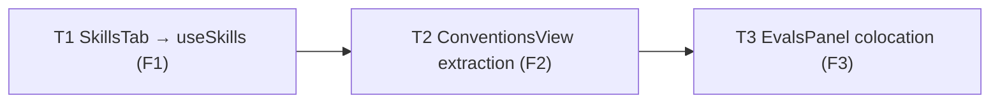

# Development Plan — Architecture-review fixes F1–F3 (client)
Date: 2026-09-24 · Branch: feat/L03_Subagents · Status: draft

## 1. Goal & scope
Fix three findings from the architecture-reviewer run on `feat/L03_Subagents`. Each was re-checked against the code before planning:

| Finding | Verified? | Evidence |
|---|---|---|
| F1 (major, FC2) — `SkillsTab` reads `GET /skills` inline under a forked cache key | **Holds** | `SkillsTab.tsx:5,8` import `useQuery` + `api`; `:28-31` `queryKey: ["skills-for-agent-editor"]`; `lib/hooks/skills.ts:13-18` `useSkills()` uses `["skills"]`, and `:42,59,72` (create/update/delete) invalidate only `["skills"]`. Header comment `:16-19` justifies the fork with "the Skills Lab work owns [hooks/skills.ts] concurrently", which no longer applies. |
| F2 (minor, FC3) — Conventions page holds feature logic | **Holds** | `conventions/page.tsx` is 249 lines: 5 `useState`s (`:43-52`), `runScan` (`:69-79`), selection derivation (`:81-82`), draft-modal flow (`:84-93`), plus all board JSX. Thin-page precedents: `skills/page.tsx` (19 lines), `pulls/[number]/page.tsx` + `hooks/usePrDetailPage.ts`. |
| F3 (minor, FC7) — `EvalsPanel` in `src/components/` has one consumer | **Holds, with context** | Only importer: `skills/[id]/_components/SkillEditor/SkillEditor.tsx:11`. The header (`EvalsPanel.tsx:1-5`) says "shared by the Skill detail panel and the Agent detail panel". That *was* true in commit `74cd3ad` (the Agent Evals tab rendered `<EvalsPanel ownerKind="agent">`). Commit `8c1329e` then deliberately removed that tab ("The grading checklist requires exactly 2 tabs"). `AgentEditor.test.tsx:80-88` now asserts there is **no** "Evals" tab. `docs/skills-lab-spec.md` §A.9 still lists an Agent Evals tab, but that spec comes before `8c1329e` and is superseded on this point. |

**Recommendation for F3:** move `EvalsPanel` under `SkillEditor/_components/EvalsPanel/` (T3). Keep the `ownerKind` prop, so promoting it back later is a pure move. See Q1.

**Out of scope:** any `server/` change, including the user's uncommitted `server/src/modules/skills/routes.ts`. Also out of scope: `docs/plans/2026-09-24-intent-layer.md` (another session), turning the conventions page into a Server Component, changing SkillsTab's derive-once `order` behaviour (see §7 Gaps), and re-adding an Agent Evals tab.

## 2. Requirements
- R1 — `SkillsTab` gets its workspace skill list only through `useSkills()` from `src/lib/hooks/skills.ts`. It has no inline `useQuery`, no `api` import, and no `["skills-for-agent-editor"]` key anywhere in `client/src`.
- R2 — A skill-list refresh on `["skills"]` (for example `invalidateQueries({ queryKey: ["skills"] })`, as create/update/delete already do) refetches `GET /skills` for a mounted `SkillsTab`, and changed skill names show up without a remount.
- R3 — `conventions/page.tsx` only handles composition: route param, breadcrumb, repo-not-found branch, and rendering one colocated component. All state, handlers and derived values live under `conventions/_components/ConventionsView/`.
- R4 — The Conventions page behaves exactly as before. Every existing test case in `conventions/page.test.tsx` passes without being edited.
- R5 — `EvalsPanel` sits next to its only consumer (`SkillEditor/_components/EvalsPanel/`). `src/components/evals-panel/` no longer exists, and the header comment describes the real consumer instead of claiming an Agent consumer.
- R6 — `cd client && pnpm typecheck && pnpm test && pnpm lint` passes after every task.

## 3. Assumptions & open questions
- A1 — `vi.mock("../../../../../lib/api")` in `AgentEditor.test.tsx:34-36` still intercepts the `api.get` call inside the real `useSkills()`, because `lib/hooks/skills.ts:9` imports the same module. The existing Skills-tab tests therefore need no rewiring, only a comment fix.
- A2 — When the repo is not found, the conventions list query and mutations will no longer be *instantiated*: they move into `ConventionsView`, which is not rendered on that branch. Today they run but their result is never shown, so there is no visible difference, and we skip one pointless 404 request. This counts as "behaviour identical".
- A3 — `@testing-library/user-event` and `msw` are **not** client devDependencies (`client/package.json`), and adding them would touch `pnpm-lock.yaml` (Do-not-touch). New tests follow the repo convention: `fireEvent`, plus `vi.mock` at the `lib/api` / hook-module boundary, as in `AgentEditor.test.tsx` and `page.test.tsx`.
- Q1 — F3: move `EvalsPanel` next to SkillEditor (**proposed default**), or keep it in `src/components/` and document the planned Agent consumer? Evidence for "move": the Agent Evals tab was built and then removed on purpose (`8c1329e`), and a test forbids it (`AgentEditor.test.tsx:85-87`). Evidence for "keep": only the pre-`8c1329e` spec `docs/skills-lab-spec.md` §A.9/§A.8. · Blocking: **no**. If the user picks "keep", T3 shrinks to a header-comment rewrite of `src/components/evals-panel/EvalsPanel/EvalsPanel.tsx:1-5` (single consumer today, Agent consumer planned per spec §A.9, removed in `8c1329e`), and the other T3 paths are left alone.

## 4. Affected modules
| Package | Layer / area | Files (existing or new) |
|---|---|---|
| client | Agent editor — Skills tab | `src/app/agents/[id]/_components/AgentEditor/_components/SkillsTab/SkillsTab.tsx` (edit), `…/SkillsTab/SkillsTab.test.tsx` (new), `src/app/agents/[id]/_components/AgentEditor/AgentEditor.test.tsx` (comment only) |
| client | Conventions route | `src/app/repos/[repoId]/conventions/page.tsx` (shrink), `…/conventions/_components/ConventionsView/{ConventionsView.tsx,index.ts,hooks/useConventionsView.ts}` (new), `…/conventions/page.test.tsx` (one additive test case) |
| client | Skill editor — Evals | `src/components/evals-panel/EvalsPanel/{EvalsPanel.tsx,index.ts,styles.ts}` (move out), `src/app/skills/[id]/_components/SkillEditor/_components/EvalsPanel/{EvalsPanel.tsx,index.ts,styles.ts}` (move in), `src/app/skills/[id]/_components/SkillEditor/SkillEditor.tsx` (import line) |

## 5. Constraints
- Every TanStack Query data hook lives in `src/lib/hooks/*`; components never fetch directly — source: `client/AGENTS.md` "Map" + "Conventions".
- Pages stay thin; feature logic goes in a colocated `_components/<Name>/` folder — source: `client/AGENTS.md` "Conventions".
- `_components/<Name>/<Name>.tsx` + barrel `index.ts`; colocated UI hooks go in a local `hooks/` folder with `use*`-named files; tests sit next to the component — source: `client/AGENTS.md` "Naming conventions".
- Colocate until a second consumer exists, then promote to `src/components/` — source: `frontend-ui-architecture` skill.
- Fetching and stateful wiring go in custom hooks, not component bodies; no `useEffect` for derived state — source: `react-best-practices` skill. (SkillsTab's existing one-time `order` initialiser effect is left as is; see §7.)
- Tests: `*.test.tsx` mocks at the module boundary, never a real API — source: `client/AGENTS.md` "Gotchas".
- Do not touch: `pnpm-lock.yaml`, `src/vendor/shared`, `server/src/modules/skills/routes.ts`, `docs/plans/2026-09-24-intent-layer.md` — source: `client/AGENTS.md` "Do not touch", task brief.
- No `server/` changes; client-only — source: task brief.

## 6. Tasks

### T1 — SkillsTab reads skills through `useSkills()` (F1)
- Requirements: R1, R2, R6
- Scope: Frontend
- Depends on: —
- Owned paths:
  - `client/src/app/agents/[id]/_components/AgentEditor/_components/SkillsTab/SkillsTab.tsx`
  - `client/src/app/agents/[id]/_components/AgentEditor/_components/SkillsTab/SkillsTab.test.tsx` (new)
  - `client/src/app/agents/[id]/_components/AgentEditor/AgentEditor.test.tsx` (comment at `:9-11` only, plus the A1 fallback below)
- Mandatory skills: `frontend-ui-architecture`, `next-best-practices`, `react-best-practices`, `typescript-expert`, `react-testing-library`, `engineering-insights`
- Change:
  1. In `SkillsTab.tsx`:
     - Remove `import { useQuery } from "@tanstack/react-query"` (`:5`) and `import { api } from "…/lib/api"` (`:8`).
     - Add `import { useSkills } from "../../../../../../../lib/hooks/skills"`, using the same relative depth as the existing `lib/hooks/agents` import at `:9`.
     - Replace `:23-31` with `const { data: skills, isLoading: skillsLoading, isError: skillsError, refetch: refetchSkills } = useSkills();`.
     - Keep `Skill` in the type import only if it is still referenced. Otherwise drop it so lint stays clean.
     - Rewrite the header comment (`:12-20`): keep the first sentence (tab behaviour), delete the "deliberately tiny, colocated read … safe parallel work" rationale (`:16-19`), and say that the list comes from the shared `useSkills()` (`["skills"]`), so skill create/update/delete refresh it.
     - Change no other logic: `order`/`bound` state, the effect, `commit`, `toggle`, `onDrop`, and the JSX stay byte-identical.
  2. In `AgentEditor.test.tsx`, rewrite the `:9-11` comment. The `lib/api` mock now backs the real `useSkills()` hook rather than an inline read. Keep the mock as is (A1). **Fallback:** if Vitest reports `No "useAgents" export is defined on the "…/lib/hooks/agents" mock` (`hooks/skills.ts:11` imports it), add `useAgents: () => ({ data: [] })` to that mock factory. Nothing else in this file may change.
  3. New `SkillsTab.test.tsx`, colocated:
     - Render `<SkillsTab agent={AGENT} />` inside `QueryClientProvider` (a fresh `new QueryClient({ defaultOptions: { queries: { retry: false } } })` per test, kept in a variable so the test can call it) and `NextIntlClientProvider` with `messages/en/agents.json` under `agents`.
     - `vi.mock` `lib/hooks/agents` → `useAgentSkills` (links `[{ agent_id:"ag1", skill_id:"sk1", order:0 }]`, `isLoading:false`), `useSetAgentSkills` (`{ mutate: vi.fn() }`), `useAgents` (`{ data: [] }`).
     - `vi.mock` `lib/api` → `api: { get: vi.fn() }`, configured per test.
     - Do **not** mock `lib/hooks/skills`, because the real hook is what's under test.
- Why: The forked key means `useCreateSkill`/`useUpdateSkill`/`useDeleteSkill` never refresh this tab, and the tab duplicates a hook the architecture requires to be shared. The concurrency reason given in the old comment no longer holds.
- Risk: Low — (a) the existing Skills-tab tests in `AgentEditor.test.tsx:139-170` could break if module-mock resolution differs from A1; (b) removing the `Skill` type import while it's still used would break typecheck. · Mitigation: A1 fallback in Change step 2; typecheck in the Done-condition; the three existing Skills-tab tests must pass unchanged.
- Acceptance:
  - R1:
    - `grep -rn "skills-for-agent-editor" client/src` returns nothing.
    - `SkillsTab.tsx` imports neither `@tanstack/react-query` nor `lib/api`.
    - New test **"renders skills already in the shared ["skills"] cache"**:
      - Make `api.get` return a never-resolving promise.
      - Before render, `qc.setQueryData(["skills"], SKILLS)`.
      - Assert `screen.getByText("1 of 2 enabled")`, `getByText("Security Rubric")` and `getByText("Style Convention")` appear. Use `findBy*` if the one-time initialiser effect needs a tick.
      - This fails if the component uses any key other than `["skills"]`.
  - R2: new test **"refetches and shows renamed skills when ["skills"] is invalidated"**:
    - `api.get` resolves `SKILLS` first, then a copy with sk1 renamed to `"Security Rubric v2"`.
    - `await screen.findByText("Security Rubric")`, then `await act(() => qc.invalidateQueries({ queryKey: ["skills"] }))`.
    - Assert `await screen.findByText("Security Rubric v2")`, and that `api.get` was called twice, each time with `"/skills"`.
  - Queries use `getByText` / `findByText` / `getAllByRole("checkbox")` only; no `getByTestId`, no `container.querySelector`.
  - All existing `AgentEditor.test.tsx` cases pass.
- Done-condition: `cd client && pnpm typecheck && pnpm test && pnpm lint`

### T2 — Extract Conventions board into `ConventionsView` (F2)
- Requirements: R3, R4, R6
- Scope: Frontend
- Depends on: T1 (sequencing only; one implementer runs sequentially, and there are no shared paths)
- Owned paths:
  - `client/src/app/repos/[repoId]/conventions/page.tsx`
  - `client/src/app/repos/[repoId]/conventions/_components/ConventionsView/ConventionsView.tsx` (new)
  - `client/src/app/repos/[repoId]/conventions/_components/ConventionsView/index.ts` (new)
  - `client/src/app/repos/[repoId]/conventions/_components/ConventionsView/hooks/useConventionsView.ts` (new)
  - `client/src/app/repos/[repoId]/conventions/page.test.tsx` (additive only, see Acceptance)
- Mandatory skills: `frontend-ui-architecture`, `next-best-practices`, `react-best-practices`, `typescript-expert`, `react-testing-library`, `engineering-insights`
- Change:
  1. `hooks/useConventionsView.ts` (`"use client"`, exports `useConventionsView(repoId: string)`) takes over, verbatim in logic, from `page.tsx`:
     - Data hooks: `useActiveRepo`, `useToast`, `useTranslations("conventions")` (the handlers' toasts need `t`), `useConventions`, `useExtractConventions`, `useUpdateConvention`, `useDeleteConvention`, `useConventionSkillDraft`.
     - State: the five `useState`s, including the `excluded` doc comment.
     - Derived values: `repoName`, `all`, `counts`, `visible`, `scanned`, `acceptedIds`, `selectedIds`.
     - Handlers: `runScan`, `openSkillModal`, plus `closeModal = () => setModalOpen(false)`, `toggleSelectAll` (the current `:156` expression), and `setSelected(id, on)` (the current `:229-234` updater).
     - Return one plain object with those values and handlers, plus `activeRepo`, `isLoading`, `isError`, `refetch`, and the `extract`/`update`/`remove`/`draftSkill` mutation objects (the view reads `.isPending`/`.mutate`).
     - Import helpers and constants from the route level (`../../../helpers`, `../../../constants`). **Do not move** `helpers.ts`, `constants.ts` or `styles.ts`: `ConventionCard` and `CreateSkillModal` also import them (`ConventionCard.tsx:19-20`, `CreateSkillModal.tsx:24`), and `helpers.test.ts` sits beside them.
     - Type the return with an exported `interface ConventionsViewModel` or leave it inferred; no `any`.
  2. `ConventionsView.tsx` (`"use client"`, `export function ConventionsView({ repoId }: { repoId: string })`) calls `useConventionsView(repoId)` and renders exactly the current `
…
` subtree (`page.tsx:97-246`): the same elements, i18n keys, props and conditional order. It imports `ConventionCard` / `CreateSkillModal` via `../ConventionCard` / `../CreateSkillModal`, and `s` via `../../styles`. `index.ts`: `export { ConventionsView } from "./ConventionsView";`.
  3. `page.tsx` keeps the route header comment, `"use client"`, `useTranslations`, `useParams`, `useRepoNotFound`, `crumb`, and the `RepoNotFound` branch. It then renders `<AppShell crumb={crumb}><ConventionsView repoId={repoId} /></AppShell>`. It stays a Client Component: `useRepoNotFound`/`useParams` are client hooks, and RSC conversion is out of scope. Target: ≤ 40 lines.
- Why: `client/AGENTS.md` requires thin pages. The page mixes 5 unrelated state slices with orchestration, which is the frontend-ui-architecture decomposition smell. The skill's step 1 is to extract stateful logic into a hook first, then let the component render.
- Risk: Medium — edge cases:
  - (a) `page.test.tsx`'s `vi.mock("./_components/CreateSkillModal")` must still intercept the modal once the import comes from `ConventionsView` as `../CreateSkillModal`. Both resolve to `CreateSkillModal/index.ts`, so the mock holds.
  - (b) Hook order: the old page called all hooks before the `repoNotFound` early return; the new page must not call hooks after its early return.
  - (c) Subtle behaviour drift while moving JSX, such as the `Deselect all`/`Select all` toggle, the `filter` auto-switch after scan, or the modal closing on draft failure.
  - (d) A2: queries no longer run on the not-found branch.
  - Mitigation: the existing 9 cases in `page.test.tsx` act as the regression gate and must pass **before any edit to that file**. Move logic verbatim, with no simplification. Add one additive case for the not-found branch.
- Acceptance:
  - R4: after steps 1–3 and before touching `page.test.tsx`, `cd client && pnpm test -- src/app/repos/\[repoId\]/conventions` passes all existing cases. Afterwards, `git diff` on `page.test.tsx` shows only additions (no changed or removed lines in existing cases).
  - New additive case **"shows RepoNotFound instead of the board when the repo is unknown"**:
    - Turn the `useRepoNotFound` mock into a `let repoNotFound = false` variable (reset in `beforeEach`).
    - `vi.mock("@/components/repo-not-found", () => ({ RepoNotFound: () => 
repo not found
 }))`.
    - Set `repoNotFound = true` and render.
    - Assert `getByText("repo not found")`, and that `queryByText("Run extraction")` is `null`.
  - R3: `page.tsx` has no `useState`, no `@/lib/hooks/conventions` import, and no `runScan`/`openSkillModal`. It is ≤ 40 lines.
- Done-condition: `cd client && pnpm typecheck && pnpm test && pnpm lint`

### T3 — Colocate `EvalsPanel` with its only consumer (F3, default of Q1)
- Requirements: R5, R6
- Scope: Frontend
- Depends on: T2 (sequencing only)
- Owned paths:
  - `client/src/components/evals-panel/**` (removed via `git mv`)
  - `client/src/app/skills/[id]/_components/SkillEditor/_components/EvalsPanel/EvalsPanel.tsx` (moved in)
  - `client/src/app/skills/[id]/_components/SkillEditor/_components/EvalsPanel/index.ts` (moved in)
  - `client/src/app/skills/[id]/_components/SkillEditor/_components/EvalsPanel/styles.ts` (moved in)
  - `client/src/app/skills/[id]/_components/SkillEditor/SkillEditor.tsx` (import line `:11` only)
- Mandatory skills: `frontend-ui-architecture`, `next-best-practices`, `react-best-practices`, `typescript-expert`, `engineering-insights`
- Change:
  1. `git mv` the three files from `client/src/components/evals-panel/EvalsPanel/` to `client/src/app/skills/[id]/_components/SkillEditor/_components/EvalsPanel/` (keeps history). Then make sure the now-empty `client/src/components/evals-panel/` directory is gone.
  2. In the moved `EvalsPanel.tsx`:
     - Change the hooks import (`:23-29`) from `"../../../lib/hooks/eval"` to `"@/lib/hooks/eval"` (the alias is already used, e.g. `SkillEditor.tsx:11`).
     - Rewrite the header (`:1-5`): the Skill detail "Evals" tab body. It stays owner-agnostic (`ownerKind: 'skill' | 'agent'`) because the eval API is. It is colocated here because it has one consumer; the Agent Evals tab that used it was removed in `8c1329e`. If a second consumer comes back (see `docs/skills-lab-spec.md` §A.9), promote it to `src/components/evals-panel/`.
     - Keep the component signature, including the `ownerKind` prop, and its body unchanged.
  3. In `SkillEditor.tsx:11`, change the import to `import { EvalsPanel } from "./_components/EvalsPanel";`. Nothing else changes.
  4. **If Q1 is answered "keep":** skip steps 1–3. The only owned path becomes `client/src/components/evals-panel/EvalsPanel/EvalsPanel.tsx:1-5` (header rewrite as described in Q1).
- Why: With one consumer, `src/components/` placement is premature promotion, and the header comment makes a false claim that misleads future readers. Keeping `ownerKind` means re-promoting later is a pure move, not an API change.
- Risk: Low — (a) a stale import path elsewhere (only `SkillEditor.tsx:11` imports it, per grep; no docs, specs or e2e reference the path); (b) the relative `styles` import (`./styles`) keeps working because `styles.ts` moves with it. · Mitigation: after the move, `grep -rn "components/evals-panel" client/src` returns nothing; the typecheck catches any missed import.
- Acceptance:
  - R5: `client/src/components/evals-panel` does not exist.
  - `grep -rn "components/evals-panel" client/src` is empty, apart from the "promote to" pointer in the new header comment.
  - The header no longer says "shared by … the Agent detail panel".
  - Existing `SkillEditor` sibling tests (`ConfigTab.test.tsx`, `VersionsTab.test.tsx`) still pass.
- Done-condition: `cd client && pnpm typecheck && pnpm test && pnpm lint`

## 7. Testing strategy
- **Existing suites covering the change (client, `pnpm test` = vitest + jsdom):**
  - T1: `AgentEditor.test.tsx` "Skills tab" describe (3 cases: count + toggle payload, name filter, draggable-only-bound).
  - T2: `conventions/page.test.tsx` (9 cases: empty state, scan summary, filters, accept, create-skill disabled, modal open, subset selection, deselect all, evidence link); `ConventionCard.test.tsx`; `conventions/helpers.test.ts`.
  - T3: no direct test; `pnpm typecheck` is the guard.
  - e2e (`./scripts/e2e.sh`, hermetic) is not required by the Done-conditions. Recommend one hermetic run before the PR if Skills/Conventions flows exist in `e2e/`.
- **New or changed tests:**
  - T1: new `SkillsTab/SkillsTab.test.tsx` (2 cases, R1/R2); comment-only edit in `AgentEditor.test.tsx`.
  - T2: 1 additive case in `page.test.tsx` (not-found branch).
  - T3: none.
- **Gaps (flag for reviewers):**
  - `EvalsPanel` has no component test anywhere (before or after).
  - `SkillsTab` derives `order` **once** (`SkillsTab.tsx:43-50`, the `order !== null` guard). After a `["skills"]` refresh, renamed/retyped skills update (via `skillsById`), but a *newly created* skill won't appear, and a deleted one leaves `total` stale until remount. R2 is scoped to renames on purpose. Fixing the derive-once logic is a separate change.
  - `ConventionsView` gets no colocated `*.test.tsx` of its own. Its behaviour stays covered through `page.test.tsx`. Moving those cases next to `ConventionsView` is a possible follow-up.
  - RTL deviation: `fireEvent` instead of `userEvent` (A3), matching every existing client test.

## 8. Diagrams
Task graph (≥3 tasks). The edges only set the order for one sequential implementer; the tasks share no files.

## 9. Traceability
| Requirement | Tasks |
|---|---|
| R1 | T1 |
| R2 | T1 |
| R3 | T2 |
| R4 | T2 |
| R5 | T3 |
| R6 | T1, T2, T3 |

## 10. Red-flags check
- [x] Every requirement maps to ≥1 task; every task maps to ≥1 requirement
- [x] Depends-on forms a DAG (no cycles); order is executable top-to-bottom
- [x] Owned paths of different tasks don't overlap
- [x] No owned path hits a "Do not touch" file (no lockfile, `skills-lock.json`, `CLAUDE.md` symlink, `docker-compose.yml`, `.env*`, `src/vendor/shared`, `server/…/skills/routes.ts`, intent-layer plan)
- [x] Schema and API-contract decisions settled — none needed (no schema/contract change)
- [x] Migrations — none
- [x] Every task has a Why and a Risk; the Medium risk (T2) names concrete edge cases and a mitigation
- [x] Testing strategy names existing suites per changed area and the coverage gaps
- [x] Every Done-condition uses existing `client/package.json` scripts (`typecheck`, `test`, `lint`)
- [x] No task contradicts a mandatory skill or an Insights.md entry (`client/Insights.md` has no entry on hooks, pages or `src/components` promotion; the RTL `userEvent` rule is overridden only because the dependency is absent, A3)
- [x] No blocking open question remains (Q1 is non-blocking, with a default)

## 11. Handoff to reviewers
- Architecture:
  - Confirm `useConventionsView` is a proportionate extraction: one hook plus one view, not a new pattern. Confirm it's placed at `_components/ConventionsView/hooks/` per the `client/AGENTS.md` naming rule.
  - Confirm route-level `styles.ts`/`helpers.ts`/`constants.ts` staying put is right, given they have three consumers.
- Behaviour parity (T2): diff the old `page.tsx:95-246` JSX against `ConventionsView.tsx` line by line.
- T1: check the derive-once gap (§7) and decide whether it deserves its own ticket.
- `pr-self-review`: check that nothing under `server/` or `docs/plans/2026-09-24-intent-layer.md` is in the diff from this work.
- Suggested `client/Insights.md` entry (for the implementer or doc owner to append, not this plan): **[Context]** `EvalsPanel` was moved out of `src/components/` because its Agent consumer was deliberately removed (`8c1329e`, 2-tab grading requirement). `docs/skills-lab-spec.md` §A.9's Agent Evals tab is superseded, so check git history before trusting that spec's tab list.

## 12. Risks & rollback
- The only cross-task risk is test-mock path coupling (T1 `lib/api` mock, T2 `CreateSkillModal` mock). Both are covered by keeping the existing tests as unedited gates.
- Rollback: each task is self-contained, so revert per task (`git checkout -- <owned paths>` before commit; `git revert <sha>` after). T3 used `git mv`, so reverting restores `src/components/evals-panel/` with history intact.
