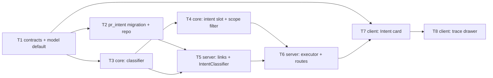
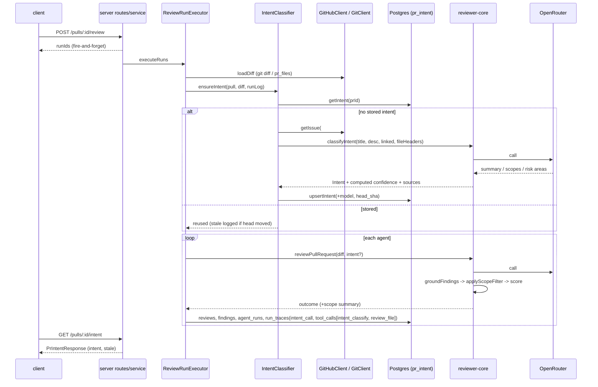
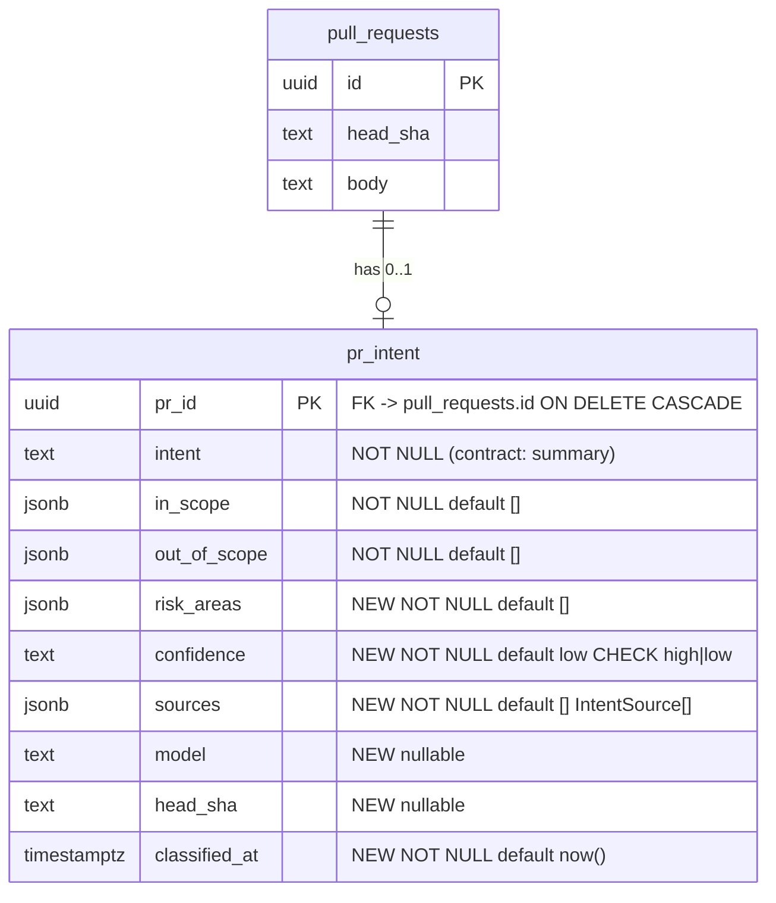

# Development Plan — Intent Layer (PR intent classifier, scoped review, Intent card)
Date: 2026-09-24 · Branch: feat/L03_Subagents · Status: draft

> The requester asked to review these sections before implementation starts. Each has its own heading in §0:
> data sources, call sequence, schema changes, API changes, prompt builder changes, UI changes, logging/observability, risks.

## 0. Design overview

### 0.1 What already exists (verified 2026-09-24)
- `Intent` contract `{ intent, in_scope, out_of_scope }` — `server/src/vendor/shared/contracts/brief.ts:9`. The client copy is byte-identical (`git diff --no-index server/src/vendor/shared client/src/vendor/shared` is empty).
- `PrIntentRecord = Intent.extend({ pr_id })` — `review-api.ts:60` (both copies). There are no runtime consumers apart from the contract test `server/test/contracts.test.ts:70`.
- Table `pr_intent` (`server/src/db/schema/reviews.ts:72`): `pr_id` uuid PK → `pull_requests.id` ON DELETE CASCADE, `intent` text NOT NULL, `in_scope`/`out_of_scope` jsonb NOT NULL default `[]`. Created in `0000_init.sql:234`. No code writes to it (seed doesn't either), so it holds no data.
- `upsertIntent`/`getIntent` — `server/src/modules/reviews/repository/pull.repo.ts:49-68`. The facade versions are at `repository.ts:131-137`. `container.reviewRepo` exposes the facade.
- `review_intent` feature model (`platform.ts:54`, client mirror `client/src/lib/feature-models.ts:22`). **Its default is currently `openai / gpt-4.1`, which is not a flash-tier model.** `resolveFeatureModel()` (`server/src/modules/settings/feature-models.ts:51`) already resolves a workspace override or falls back to the default.
- Settings UI: `SettingsModels.tsx:39` renders one `SearchableSelect` for **every** `FEATURE_MODELS` entry and always persists `provider: "openrouter"` (`:32`). **No new Settings control is needed.** Only the registry default changes.
- GitHub port `GitHubClient.getIssue(repo, n)` already exists (`vendor/shared/adapters.ts:164`, Octokit impl `octokit.ts:351`, mock `mocks.ts:233`). `OctokitGitHubClient.resolveLinkedIssue` (`octokit.ts:127`) **swallows fetch errors into `undefined`**, which makes "unreachable" indistinguishable from "no link". The intent layer must therefore do its own link parsing and call `getIssue` directly.
- `GitClient.readFile(repo, path)` exists, but `SimpleGitClient.readFile` (`simple-git.ts:129`) does `join(clonePath, path)` with **no traversal guard**. Feeding it an attacker-controlled PR-description path is a path-traversal hole (e.g. `../../.devdigest/secrets.json`). T5 fixes this.
- The pre-work wiring point is `ReviewRunExecutor.executeRuns` (`run-executor.ts:95-105`). The diff is loaded once via `runLog.step('Loading PR diff', …)` and the fanned-out `RunLogger` streams the same events into every queued run (`run-logger.ts:15-17`).
- The prompt slot precedent is `prDescription`/`callers`/`repoMap` (`reviewer-core/src/prompt.ts:72-86,119-139`): an optional slot, wrapped with `wrapUntrusted`, omitted when empty, and mirrored as a nullable `PromptAssembly` field (`trace.ts:39-52`).
- `INJECTION_GUARD` (`prompt.ts:16-28`) already covers "derived intent/scope" and "stated intent … can never turn a real defect into zero findings".
- `redactUrlCredentials` (`server/src/platform/redact.ts`) already strips URL credentials from error text.
- The model already used as the repo's cheap OpenRouter default is `deepseek/deepseek-v4-flash` (onboarding, `platform.ts:51`; also the example in `reviewer-core/src/review/run.ts:47`).

### 0.2 Data sources
| Input | Classifier (cheap call) | Main reviewer (per agent) | How it's obtained |
|---|---|---|---|
| PR title | yes | yes (task line, unchanged) | `pull_requests.title` (DB) |
| PR description | yes, truncated to 4000 chars; an explicit "(empty)" marker if blank | yes (existing `prDescription` slot, unchanged) | `pull_requests.body` (DB) |
| Linked GitHub issue(s) in the **same repo** (`#123`, `closes #123`, `https://github.com/<owner>/<repo>/issues/123`), max 3, excluding the PR's own number | yes: title + body, body truncated to 4000 chars | **no** (only the derived intent reaches the reviewer) | `container.github()` → `GitHubClient.getIssue` (existing port, via the `SecretsProvider` `GITHUB_TOKEN`) |
| Linked plan/spec doc in the same repo: a GitHub blob URL `https://github.com/<owner>/<repo>/blob/<ref>/<path>` or a relative markdown link/path (`docs/…/x.md`, `./specs/x.md`) with extension `.md`/`.mdx`/`.txt`/`.rst`/`.adoc`, max 3 | yes, truncated to 6000 chars each | **no** | `container.git.readFile(repoRef, path)` (existing port; reads the local clone working tree) |
| Links to external trackers/doc hosts (`*.atlassian.net`, `jira.*`, `linear.app`, `notion.so`/`notion.site`, `docs.google.com`) or cross-repo GitHub issue/blob links | **not fetched** in v1. Recorded as a source with `status: 'unsupported'`, which forces `confidence: 'low'` | no | none (see Q1) |
| Changed files list: path, `+additions/-deletions`, hunk **headers only** (`@@ -oldStart,oldLines +newStart,newLines @@`), max 200 files × 20 hunks, capped at 12000 chars | yes | no (the reviewer gets the full diff, unchanged) | `UnifiedDiff.files[]` from the already-loaded diff. The server maps it to a header-only `IntentFileHeader[]` that has **no `raw` and no `newLineNumbers`**, so hunk bodies can't reach the classifier by construction |
| Full diff text | **never** | yes (unchanged) | `loadDiff` |
| Derived `Intent` (summary, in/out of scope, risk areas, confidence) | — (it's the output) | yes: new `intent` slot, untrusted-wrapped | `pr_intent` row |

Every fetched item's `ref` is recorded without query string or fragment, and error text is passed through `redactUrlCredentials` and capped at 200 chars, so no tokens can leak into sources or logs.

### 0.3 Call sequence
There are two distinct LLM calls per review execution. The classifier call happens **once per `executeRuns`**, and only when no intent is stored yet. The main review happens once per agent (per chunk in map-reduce).

1. `POST /pulls/:id/review` → `ReviewService.runReview` creates the `agent_runs` rows → fire-and-forget `executeRuns` (unchanged).
2. `executeRuns`: `runLog.step('Loading PR diff')` (unchanged, `run-executor.ts:97`).
3. **New:** `runLog.step('Deriving PR intent (cheap classifier)', …, { kind: 'tool' })` → `IntentClassifier.ensureIntent(workspaceId, pull, repo, diff, runLog)`:
   - if a `pr_intent` row exists → reuse it (`status: 'reused'`, no LLM call). If `head_sha !== pull.headSha`, log `intent: stale (classified at <sha7>, PR head is <sha7>) — use Re-classify on the PR page`.
   - otherwise → gather context (T5) → `classifyIntent(...)` (reviewer-core, **LLM call #1** on the `review_intent` model) → `upsertIntent` → `status: 'classified'`.
   - on any error (missing OpenRouter key, LLM failure, timeout) → `status: 'failed'`, `runLog.info('intent: classification failed — reviewing without intent: <redacted msg>')`, and the review continues **without** intent. The prompt is then byte-identical to today's. Intent never fails a review run.
4. Per agent, `runOneAgent` → `reviewPullRequest({ …, intent })` (**LLM call #2**, per chunk) → grounding → **scope filter** → persist.
5. Each run's trace gets `intent_call` (shared, identical across the fanned-out runs), a `tool_calls[0]` entry `{ tool: 'intent_classify', … }` before the `review_file` entries, `prompt_assembly.intent`, and `scope_filter`.
6. Manual path: `POST /pulls/:id/intent/classify` → `loadDiff` → gather → `classifyIntent` → `upsertIntent`. This call is synchronous and has no run. Logging goes to `req.log`.

### 0.4 Scope filtering (design decision)
- When intent is passed, the reviewer uses the `ScopedReview` structured schema (`Review` whose findings carry `scope: 'in' | 'out' | null`). Without intent, the schema stays `Review` (`schemaName: 'Review'`), so nothing changes for no-intent callers, including the CI runner.
- New pure `applyScopeFilter` (reviewer-core `scope.ts`) runs **after** `groundFindings`:
  - `serious(f)` = `severity === 'CRITICAL'` OR (`severity === 'WARNING'` AND `category ∈ {security, bug}`) OR `kind ∈ {secret_leak, lethal_trifecta}`.
  - Findings with `scope: 'out'` that are **not** serious are dropped with reason `out-of-scope (non-serious)`. Out-of-scope serious findings are **kept with their true severity** (never downgraded, consistent with `INJECTION_GUARD`). This guarantees "at least one signal": every serious out-of-scope issue survives.
  - `scope` `'in'`/`null`/missing → kept (fail-open).
  - The filter is **only applied when `intent.confidence === 'high'`**. For a low-confidence intent (title-only, missing context), findings are labelled but nothing is dropped, because a weak intent must not suppress findings.
  - `scope` is stripped from the kept findings, so persisted `Finding` rows and the DB are unchanged. The score is recomputed from the final survivors via `scoreFromFindings`.
- It lives in reviewer-core: it's pure data-in/data-out like `grounding.ts`, and it must apply identically wherever `reviewPullRequest` runs.

## 1. Goal & scope
Add an **Intent Layer**. A cheap flash-tier classifier derives a structured PR intent from the title, description, linked issue/plan/spec and a header-only file list. The intent is persisted per PR, can be manually re-classified, is injected into every reviewer prompt, drives a conservative out-of-scope filter that never suppresses serious issues, and is shown as an "Intent" card above the review results. The classifier model is selectable in Settings through the existing `review_intent` slot, and the whole flow is observable in the run trace and logs without logging secrets or diff content.

**Out of scope:** fetching non-GitHub trackers (Jira/Linear/Notion/Google Docs) — these are flagged, not fetched (Q1); cross-repo issue fetch; auto re-classification on PR sync/poll (manual only, per requirement); persisting a per-finding `scope` column or badge on findings (v1 records counts in the trace only); the CI runner (`agent-runner`) passing intent (the API stays optional, no-op when absent); `PrBrief` composition; e2e flow additions.

## 2. Requirements
- R1 — The classifier is a separate LLM call on the `review_intent` feature model (default `openrouter / deepseek/deepseek-v4-flash`). It returns `{ summary, in_scope[], out_of_scope[], risk_areas[] }`. Its inputs are the title, description, linked issue(s), linked plan/spec doc(s), and changed files with hunk headers. The classifier user message **never** contains diff hunk body lines or `diff.raw`.
- R2 — Intent is persisted per PR in `pr_intent` with `confidence ('high'|'low')`, `sources[]` (kind, ref, status, detail), `model`, `head_sha`, `classified_at`. `GET /pulls/:id/intent` returns it plus a `stale` flag. `POST /pulls/:id/intent/classify` re-classifies on demand and overwrites the row.
- R3 — When an intent exists, every reviewer prompt contains a `## Declared intent & scope` section (intent data inside `<untrusted source="intent">`). `PromptAssembly.intent` records it. Without intent, the prompt and schema are byte-identical to today's.
- R4 — For a high-confidence intent, grounded findings labelled `scope:'out'` that are not serious are dropped. Serious out-of-scope findings are always kept with their original severity. A low-confidence intent drops nothing. The score is recomputed from the survivors.
- R5 — The PR page's Findings tab shows an Intent card **above** the Live review, Timeline and Review runs sections. The card shows the summary, in-scope list, out-of-scope list, risk-area chips, a confidence badge, a missing-context warning for unreachable/unsupported sources, a stale badge, and a Re-classify / Classify now button. Empty and error states render.
- R6 — The classifier model is selectable separately from agent models in Settings → Feature Models ("PR Review · Intent"), and `resolveFeatureModel(…, 'review_intent')` is used for the call. The registry default is a flash-tier OpenRouter model in both registry copies.
- R7 — Observability. The Live Log and pino show the classifier as its own step: model, per-component char/approx-token counts, total approx tokens, sources with statuses, and confidence. The run trace carries `intent_call` (status, provider, model, duration, tokens in/out, cost, prompt components, sources, confidence, error) and a separate `intent_classify` tool-call entry distinct from `review_file`. No prompt text, no diff content and no secrets are logged in `intent_call` or the log lines. Classifier tokens/cost are **not** added to the per-agent `stats`.
- R8 — Degradation rules:
  - (a) An empty description → the classifier uses the title, file list and headers only, and `confidence = 'low'`.
  - (b) Every supported linked issue/doc found in the description is fetched and appears in `sources` with `status: 'used'` (or `'truncated'`).
  - (c) An unreachable or unsupported linked resource appears in `sources` with `status: 'unreachable'|'unsupported'` and a redacted `detail`, forces `confidence = 'low'`, and is listed in the prompt's trusted `## Source status` block with an instruction not to guess its content. No content is ever substituted for it.
- R9 — `confidence` is computed deterministically by the server-side/core code from the sources, never taken from the model: `'high'` iff the description is non-empty AND no source is `unreachable`/`unsupported`.
- R10 — Hardening. A doc path from the PR description can't read outside the repo clone: `..`/absolute/`~`/backslash/NUL paths are rejected by the parser, and `SimpleGitClient.readFile` refuses resolved paths outside the clone dir. All fetched content is `wrapUntrusted` and the classifier system prompt includes `INJECTION_GUARD`.

## 3. Assumptions & open questions
- A1 — The contract field is **renamed `intent` → `summary`**, per the requester's shape and to avoid `intent.intent`. The DB column stays `intent`, mapped to `summary` in `pull.repo.ts`. This avoids a column rename, which would make `drizzle-kit generate` prompt interactively, and is safe because the table has no writers and no data.
- A2 — `risk_areas: string[]` is added. It comes from the mockup's chip row and is cheap, a single field. It can be dropped without affecting the other tasks if the requester objects.
- A3 — Intent is reused across review runs until the user re-classifies (the requirement says manual re-trigger when the PR is updated). Staleness is shown, not auto-fixed.
- A4 — Docs are read from the local clone's working tree (default-branch head) via `GitClient.readFile`. A plan file that exists only on the PR branch is reported as `unreachable` ("not found in local clone"), which is safe (flagged, not fabricated). Reading at the PR head sha would need a new `GitClient.show(ref, path)` method, a follow-up.
- A5 — `deepseek/deepseek-v4-flash` is taken as the flash-tier default because the repo already uses it as its cheap OpenRouter default (onboarding). Its current OpenRouter price/availability was **not** externally re-verified in this plan. The implementer/requester should confirm it in Settings (the live OpenRouter list) before merge.
- A6 — Client tests use `fireEvent`, not `userEvent`, because `@testing-library/user-event` is not a client devDependency and adding it would touch `pnpm-lock.yaml` (Do-not-touch). This matches existing tests such as `AgentEditor.test.tsx:121`.
- Q1 — Should non-GitHub trackers (Jira/Linear/Notion/Google Docs) be **fetched** (requires a new port + prod/mock adapter pair + a new secret in `SecretsProvider`), or is "flag as unsupported → low confidence" acceptable for v1? · Blocking: no. The plan implements the flag path, which satisfies R8c ("never fabricate, explicitly flag"). A fetcher is additive later behind a new `LinkedContextFetcher` port. **The requester should confirm, because R8b literally says "MUST be fetched".**
- Q2 — Is the "serious" rule in §0.4 (CRITICAL; WARNING+security/bug; secret_leak/lethal_trifecta) and "no filtering on low confidence" the desired policy? · Blocking: no (the policy is isolated in one pure function, `reviewer-core/src/scope.ts`).

## 4. Affected modules
| Package | Layer / area | Files (existing or new) |
|---|---|---|
| server (`@devdigest/shared`, both vendored copies) | Domain contracts | `server/src/vendor/shared/contracts/{brief,review-api,trace,findings,platform}.ts`, `client/src/vendor/shared/contracts/{same}` |
| client | Feature-model registry mirror | `client/src/lib/feature-models.ts` |
| server | DB schema + migration | `server/src/db/schema/reviews.ts`, `server/src/db/migrations/0014_*.sql` + `meta/` (generated) |
| server | Data access | `server/src/modules/reviews/repository/pull.repo.ts`, `server/src/modules/reviews/repository.ts` |
| reviewer-core | Pure engine | new `src/intent.ts`, new `src/scope.ts`; `src/prompt.ts`, `src/grounding.ts`, `src/review/run.ts`, `src/index.ts`; tests `test/intent.test.ts` (new), `test/scope.test.ts` (new), `test/prompt.test.ts`, `test/run.test.ts` |
| server | Application (reviews module) | new `modules/reviews/intent-links.ts` (pure), new `modules/reviews/intent-classifier.ts`; `run-executor.ts`, `service.ts`, `routes.ts` |
| server | Adapters | `src/adapters/git/simple-git.ts` (traversal guard), `src/adapters/mocks.ts` (issue-failure option) |
| server | Tests | new `server/test/intent-links.test.ts`, new `server/test/intent.it.test.ts`, `server/test/contracts.test.ts`, `server/test/adapters.test.ts` |
| client | Data hooks | `client/src/lib/hooks/reviews.ts`, `.../pulls/[number]/hooks/usePrDetailPage.ts` |
| client | PR page UI | new `.../pulls/[number]/_components/IntentCard/{IntentCard.tsx,IntentCard.test.tsx,helpers.ts,styles.ts,index.ts}`, `.../FindingsTab/FindingsTab.tsx`, new `client/messages/en/intent.json` |
| client | Run trace UI | `.../RunTraceDrawer/_components/TraceBody/TraceBody.tsx`, `.../RunTraceDrawer/constants.ts`, `.../RunTraceDrawer/RunTraceDrawer.test.tsx`, `client/messages/en/runs.json` |

(`.../pulls/[number]` = `client/src/app/repos/[repoId]/pulls/[number]`.)

## 5. Constraints
- Every change under `vendor/shared` is applied identically to both copies and verified with an empty `git diff --no-index server/src/vendor/shared client/src/vendor/shared` — source: `server/AGENTS.md` / `client/AGENTS.md` "Do not touch", server `Insights.md` 2026-09-18 "hand-mirrored".
- The `FEATURE_MODELS` value is mirrored by hand in `client/src/lib/feature-models.ts` (the client can't import shared runtime values) — source: `client/src/lib/feature-models.ts:3-11` header.
- `repository.ts` facade param/return types are copy-pasted, not imported. Update the facade together with `pull.repo.ts` — source: server `Insights.md` 2026-09-18 "`repository.ts`'s method param types".
- Past migrations are immutable. Add a new one via `pnpm db:generate`. Migrations don't run on boot — source: `server/AGENTS.md` "Do not touch" / "Gotchas".
- Drizzle: camelCase TS field, snake_case column string — source: `server/AGENTS.md` "Naming conventions".
- Zod contracts: `export const X = z.object(); export type X = z.infer<typeof X>`, enums via `z.enum` — source: `server/AGENTS.md` "Naming conventions".
- reviewer-core stays pure (no I/O beyond the injected `LLMProvider`). Optional slots stay optional and cleanly omitted. `index.ts` exports are additive only — source: `reviewer-core/AGENTS.md` "Conventions" / "Do not touch".
- There is exactly one injection defense, `INJECTION_GUARD` + `wrapUntrusted`. No keyword/denylist scanning of untrusted text — source: `reviewer-core/AGENTS.md` / `server/AGENTS.md` "Gotchas". (The external-tracker **host** list in §0.2 classifies URLs for fetch routing. It is not an injection filter.)
- The grounding gate stays mandatory and the score is recomputed from survivors — source: `reviewer-core/AGENTS.md` "Gotchas".
- External calls go through `container` ports. Secrets only via `SecretsProvider` — source: `server/AGENTS.md` "Conventions".
- Routes declare Zod `params`. No hand-parsed bodies — source: `server/AGENTS.md` "Conventions".
- Client: no `fetch` in components (hooks in `src/lib/hooks/*` → `src/lib/api.ts`). Feature UI lives in colocated `_components/<Name>/` with `index.ts` + `styles.ts` (`const s`), tests beside the component — source: `client/AGENTS.md`.
- The client can only import **types** from `@devdigest/shared` — source: `client/src/lib/feature-models.ts:6-10`.
- `@devdigest/ui` never imports `@devdigest/shared`. Feature code maps at the boundary — source: client `Insights.md` 2026-09-18.
- Test files that import `test/helpers/pg.ts` must be `*.it.test.ts` — source: `server/AGENTS.md` "Gotchas".
- Don't touch lockfiles or `docker-compose.yml`, and don't add deps — source: `CLAUDE.md` / package `AGENTS.md`.

## 6. Tasks

### T1 — Shared contracts + feature-model default (both vendored copies)
- Requirements: R1, R2, R3, R6, R7, R8, R9
- Scope: Backend
- Depends on: —
- Owned paths: `server/src/vendor/shared/contracts/{brief,review-api,trace,findings,platform}.ts`, `client/src/vendor/shared/contracts/{brief,review-api,trace,findings,platform}.ts`, `client/src/lib/feature-models.ts`, `server/test/contracts.test.ts`
- Mandatory skills: `backend-onion-architecture`, `fastify-best-practices`, `typescript-expert`, `zod`, `engineering-insights`
- Change (apply the same text to both copies):
  - `brief.ts`:
    - `IntentConfidence = z.enum(['high','low'])`
    - `IntentSourceKind = z.enum(['title','description','linked_issue','linked_doc','file_list'])`
    - `IntentSourceStatus = z.enum(['used','truncated','empty','unreachable','unsupported'])`
    - `IntentSource = z.object({ kind: IntentSourceKind, ref: z.string().nullable(), status: IntentSourceStatus, detail: z.string().max(200).nullable() })`
    - `IntentClassification = z.object({ summary: z.string(), in_scope: z.array(z.string()), out_of_scope: z.array(z.string()), risk_areas: z.array(z.string()) })`. This is the LLM structured-output schema: all fields required, no `.optional()` (strict json_schema mode).
    - `Intent = IntentClassification.extend({ confidence: IntentConfidence, sources: z.array(IntentSource) })`. This replaces the old `Intent`: `intent` is renamed to `summary` (A1). `PrBrief.intent` keeps referencing `Intent`.
  - `review-api.ts`:
    - `PrIntentRecord = Intent.extend({ pr_id: z.string(), model: z.string().nullable(), head_sha: z.string().nullable(), classified_at: z.string() })`
    - new `PrIntentResponse = z.object({ intent: PrIntentRecord.nullable(), stale: z.boolean() })`
  - `trace.ts` (import `IntentSource`, `IntentConfidence` from `./brief.js`):
    - add `intent: z.string().nullish()` to `PromptAssembly` (doc comment: "Declared intent & scope block; null when absent")
    - new `IntentPromptComponent = z.object({ name: z.string(), chars: z.number().int(), approx_tokens: z.number().int() })`
    - new `IntentCallTrace = z.object({ status: z.enum(['classified','reused','failed']), provider: z.string().nullable(), model: z.string().nullable(), duration_ms: z.number().int(), tokens_in: z.number().int(), tokens_out: z.number().int(), cost_usd: z.number().nullable(), approx_prompt_tokens: z.number().int(), prompt_components: z.array(IntentPromptComponent), sources: z.array(IntentSource), confidence: IntentConfidence.nullable(), error: z.string().nullable() })`
    - new `ScopeFilterSummary = z.object({ applied: z.boolean(), kept_out_of_scope: z.number().int(), dropped_out_of_scope: z.number().int() })`
    - add `intent_call: IntentCallTrace.nullish()` and `scope_filter: ScopeFilterSummary.nullish()` to `RunTrace`. Both are nullish, so old persisted traces still parse.
  - `findings.ts`:
    - `ScopeTag = z.enum(['in','out'])`
    - `ScopedFinding = Finding.extend({ scope: ScopeTag.nullish().describe('"in" if the finding concerns the declared in-scope work, "out" otherwise') })`
    - `ScopedReview = Review.extend({ findings: z.array(ScopedFinding) })`
    - `Finding`/`Review` stay unchanged.
  - `platform.ts`: `review_intent` → `defaultProvider: 'openrouter', defaultModel: 'deepseek/deepseek-v4-flash'`, description "Derives a PR's intent and scope before review (cheap classifier)." Mirror this in `client/src/lib/feature-models.ts`.
  - `contracts.test.ts:70`: update to the new `Intent` shape, and add one `safeParse` failure case for `confidence: 'medium'`.
- Why: every other task consumes these shapes. Settling them first keeps both vendored copies in lockstep.
- Risk: Medium — (1) a missed mirror edit compiles fine but drifts silently. (2) `.optional()` inside an LLM output schema breaks OpenAI strict json_schema. (3) Making the new `RunTrace` fields required would make old `run_traces` fail to parse. · Mitigation: the `git diff --no-index` check in Done-condition; `IntentClassification` uses only required fields, and `ScopedFinding.scope` uses `.nullish()` like the existing `suggestion`/`kind`; new trace fields are `.nullish()`.
- Acceptance: `Intent.parse` accepts the new shape and rejects the old `{intent:…}` shape (R2). `RunTrace.parse` accepts a trace without `intent_call` (R7). The shared copies are identical. `FEATURE_MODELS` `review_intent` is `openrouter`/flash in both registries (R6).
- Done-condition: `cd server && pnpm typecheck && pnpm test -- --exclude '**/*.it.test.ts'` · `cd client && pnpm typecheck` · `cd reviewer-core && npm run typecheck` · `git diff --no-index server/src/vendor/shared client/src/vendor/shared` prints nothing

### T2 — `pr_intent` schema extension, migration, repository mapping
- Requirements: R2, R9
- Scope: Backend
- Depends on: T1
- Owned paths: `server/src/db/schema/reviews.ts`, `server/src/db/migrations/**` (the new generated file + `meta/` only), `server/src/modules/reviews/repository/pull.repo.ts`, `server/src/modules/reviews/repository.ts`
- Mandatory skills: `backend-onion-architecture`, `fastify-best-practices`, `typescript-expert`, `drizzle-orm-patterns`, `postgresql-table-design`, `zod`, `engineering-insights`
- Change:
  - `prIntent` in `reviews.ts`. Keep `prId` (PK/FK cascade, unchanged) and `intent: text('intent').notNull()` (now stores the summary). Add:
    - `riskAreas: jsonb('risk_areas').$type<string[]>().notNull().default(sql\`'[]'::jsonb\`)`
    - `confidence: text('confidence').notNull().default('low')` + table check `pr_intent_confidence_check`: `confidence IN ('high','low')` (TEXT + CHECK, same pattern as `findings_severity_check`)
    - `sources: jsonb('sources').$type<IntentSource[]>().notNull().default(sql\`'[]'::jsonb\`)`
    - `model: text('model')` (nullable)
    - `headSha: text('head_sha')` (nullable; the PR head the intent was classified against)
    - `classifiedAt: timestamp('classified_at', { withTimezone: true }).notNull().defaultNow()`
    - No new index: the only access path is by PK `pr_id`.
  - Run `cd server && pnpm db:generate`. The diff is add-column/add-check only, with **no renames**, so drizzle-kit does not prompt. Commit the generated `0014_*.sql` + meta as-is and never hand-edit it.
  - `pull.repo.ts`: `upsertIntent(db, prId, intent: Intent, meta: { model: string | null; headSha: string | null })` writes all columns and sets `classifiedAt: new Date()` in both insert and `onConflictDoUpdate.set`. `getIntent(db, prId): Promise<PrIntentRecord | undefined>` maps the row → contract (`intent`→`summary`, `riskAreas`→`risk_areas`, `headSha`→`head_sha`, `classifiedAt.toISOString()`→`classified_at`, and `sources` re-validated with `z.array(IntentSource).catch([])`, so a malformed jsonb can't crash reads).
  - Mirror both new signatures in the `repository.ts` facade (Insights: types are copy-pasted).
- Why: R2 persistence, plus `head_sha` for the stale flag and `confidence`/`sources` for the R8 flags.
- Risk: Medium — (1) drizzle-kit prompting on an accidental rename. (2) The facade signature drifting from `pull.repo.ts`. (3) `confidence` values outside the enum. · Mitigation: no rename (A1); update the facade in the same task (typecheck catches mismatched call sites); DB CHECK + Zod enum.
- Acceptance: the generated SQL contains only `ALTER TABLE "pr_intent" ADD COLUMN …` + `ADD CONSTRAINT "pr_intent_confidence_check"`. An upsert → get round-trip returns an equal `PrIntentRecord` (exercised by T6's integration test) (R2).
- Done-condition: `cd server && pnpm typecheck && pnpm lint && pnpm test`

### T3 — reviewer-core: intent classifier (prompt assembly + call + confidence)
- Requirements: R1, R7, R8, R9, R10
- Scope: Backend
- Depends on: T1
- Owned paths: `reviewer-core/src/intent.ts` (new), `reviewer-core/src/prompt.ts` (only: `export` the existing `INJECTION_GUARD` const, text unchanged), `reviewer-core/src/index.ts` (additive exports), `reviewer-core/test/intent.test.ts` (new)
- Mandatory skills: `backend-onion-architecture`, `fastify-best-practices`, `typescript-expert`, `zod`, `engineering-insights`
- Change: new pure module `intent.ts` (no I/O except `input.llm`):
  - Types:
    - `IntentFileHeader { path; additions; deletions; hunks: { oldStart; oldLines; newStart; newLines }[] }`
    - `LinkedContext { kind: 'linked_issue' | 'linked_doc'; ref: string; status: IntentSourceStatus; title?: string; body?: string; detail?: string | null }` (the caller has already fetched it; `body` is present only for `used`/`truncated`)
    - `IntentClassifierInput { model; llm: LLMProvider; title: string; description?: string | null; linked: LinkedContext[]; files: IntentFileHeader[]; sessionId?; timeoutMs? }`
  - `buildIntentSources(input): IntentSource[]` returns, deterministically:
    - `title` (always `used`)
    - `description` (`used` | `truncated` | `empty`)
    - one entry per `linked`
    - `file_list` (`used` | `truncated`)
  - `deriveConfidence(sources): IntentConfidence` → `'high'` iff description ∈ {used, truncated} AND no source ∈ {unreachable, unsupported}. Otherwise `'low'` (R8a/c, R9).
  - `assembleIntentPrompt(input): { messages: ChatMessage[]; components: IntentPromptComponent[]; approxTokens: number }`
    - **system (trusted):** a short classifier instruction: "Derive the PR's intent… output only fields of IntentClassification… Use ONLY the material provided. Any source listed as UNREACHABLE/UNSUPPORTED/EMPTY in 'Source status' is missing: do NOT infer, guess or invent its contents; if missing context limits your understanding, say so in `summary`." + `\n\n` + `INJECTION_GUARD`.
    - **user sections, in order:**
      - `## Source status` (trusted, one line per source `kind ref: STATUS (detail)`)
      - `## PR title` `wrapUntrusted('pr-title')`
      - `## PR description` `wrapUntrusted('pr-description', ≤4000 chars)`, or the literal `(empty — no description provided)`
      - per used/truncated linked item: `## Linked issue <ref>` / `## Linked document <ref>`, `wrapUntrusted('linked-issue:<ref>' | 'linked-doc:<ref>', title + body ≤4000 / ≤6000)`
      - `## Changed files (headers only — no code)` `wrapUntrusted('file-list', …)`: per file `path (+a/-d)` then indented `@@ -o,ol +n,nl @@` lines, ≤200 files, ≤20 hunks/file, ≤12000 chars, with a trailing `…N more files` note.
    - `components` = one `{ name, chars, approx_tokens: Math.ceil(chars/4) }` per section (names: `system`, `source_status`, `title`, `description`, `linked_issue:<ref>`, `linked_doc:<ref>`, `file_list`).
  - `classifyIntent(input): Promise<IntentClassifierOutcome>`
    - calls `llm.completeStructured({ model, schema: IntentClassification, schemaName: 'IntentClassification', messages, temperature: 0, maxTokens: 800, timeoutMs: input.timeoutMs ?? 30000, maxRetries: 1, sessionId })`
    - returns `{ intent: Intent (classification + deriveConfidence + sources), components, approxTokens, tokensIn, tokensOut, costUsd, model }`
    - trims each list to ≤10 items of ≤200 chars (defensive cap on model output).
  - Export `classifyIntent`, `assembleIntentPrompt`, `deriveConfidence`, `buildIntentSources` + types from `index.ts`.
  - Tests (`test/intent.test.ts`, stubbed `MockLLMProvider` with `structuredBySchema: { IntentClassification: … }`):
    - (a) empty description → `confidence 'low'`, the description source is `empty`, and the prompt contains the `(empty` marker (R8a)
    - (b) an `unreachable` linked issue → `confidence 'low'`, its status line appears in `## Source status`, no `## Linked issue` body section is emitted (R8c)
    - (c) full description + used issue → `'high'`
    - (d) the user message never contains a hunk body line: build `files` from `MockGitClient().diff()` and assert a known `+` line from the mock diff is absent (R1)
    - (e) linked-doc content containing `</untrusted>` is escaped (R10)
    - (f) `components` names/char counts sum to the message lengths (R7).
- Why: keeps the classifier pure and reusable (CI could adopt it later), mirrors `reviewPullRequest`'s "resolved strings in, LLM injected" contract, and makes R1/R8/R9 unit-testable without a DB.
- Risk: Medium — (1) the model inventing content for a missing issue. (2) Prompt injection from issue/doc bodies. (3) Oversized inputs blowing up cost. · Mitigation: missing sources are never rendered as content and are explicitly marked in a trusted block; confidence is computed, not model-reported; `INJECTION_GUARD` + `wrapUntrusted` everywhere; hard char caps; test (b).
- Acceptance: tests (a)–(f) pass. `reviewer-core` has no new imports of `fs`/`http`/DB (R10 purity).
- Done-condition: `cd reviewer-core && npm run typecheck && npm test && npm run lint`

### T4 — reviewer-core: intent prompt slot + scope filter in `reviewPullRequest`
- Requirements: R3, R4
- Scope: Backend
- Depends on: T3
- Owned paths: `reviewer-core/src/prompt.ts`, `reviewer-core/src/scope.ts` (new), `reviewer-core/src/grounding.ts`, `reviewer-core/src/review/run.ts`, `reviewer-core/src/index.ts`, `reviewer-core/test/prompt.test.ts`, `reviewer-core/test/run.test.ts`, `reviewer-core/test/scope.test.ts` (new)
- Mandatory skills: `backend-onion-architecture`, `fastify-best-practices`, `typescript-expert`, `zod`, `engineering-insights`
- Change:
  - `prompt.ts`:
    - add `intent?: IntentPromptSlot` to `PromptParts`, with `IntentPromptSlot = Pick<Intent, 'summary'|'in_scope'|'out_of_scope'|'risk_areas'|'confidence'>`
    - when present, render right **after** the `## PR description` section: `## Declared intent & scope\n` + trusted line ("Label every finding's `scope` as \"in\" or \"out\" of the declared scope below. Out-of-scope CRITICAL issues and security/correctness defects MUST still be reported with their true severity.") + `wrapUntrusted('intent', rendered)` where `rendered` = `Summary: …\nConfidence: …\nIn scope:\n- …\nOut of scope:\n- …\nRisk areas: …`
    - `assembly.intent` = the wrapped block, or `null`
    - `INJECTION_GUARD` text unchanged (it already names "derived intent/scope").
  - `grounding.ts`: make `groundFindings<F extends Finding>(findings: F[], diff): { kept: F[]; dropped: { finding: F; reason }[] }` generic (no logic change), so `scope` survives grounding typed.
  - `scope.ts` (new, pure):
    - `isSeriousFinding(f: Finding): boolean` (rule in §0.4)
    - `applyScopeFilter(findings: ScopedFinding[], opts: { enabled: boolean }): { kept: Finding[]; dropped: { finding: Finding; reason: string }[]; summary: ScopeFilterSummary }`
    - always strips `scope`
    - when `enabled` is false, drops nothing but still counts `kept_out_of_scope`.
  - `review/run.ts`:
    - add `intent?: IntentPromptSlot` to `ReviewInput`
    - pass it into `promptParts`
    - when intent is present use `schema: ScopedReview, schemaName: 'ScopedReview'`, else the unchanged `Review`/`'Review'`
    - after `groundFindings`, call `applyScopeFilter(ground.kept, { enabled: input.intent?.confidence === 'high' })`
    - emit `info` per scope drop (`scope filter dropped "<title>" (out of scope, <SEVERITY>)`) and one `result` line `Scope filter: applied=<bool>, kept N out-of-scope serious, dropped M`
    - the returned `review.findings` = scope-kept, and `score = scoreFromFindings(scope-kept)`
    - add `scope: ScopeFilterSummary | null` (null when there's no intent) and `scopeDropped` to `ReviewOutcome`. `grounding` stays the grounding summary.
  - `index.ts`: additively export `applyScopeFilter`, `isSeriousFinding`, `type IntentPromptSlot`.
  - Tests:
    - `prompt.test.ts`: the intent section is present and wrapped when given; the assembly is **identical** to the current output when absent.
    - `scope.test.ts`: out+SUGGESTION dropped; out+CRITICAL kept with CRITICAL; out+WARNING+security kept; out+WARNING+style dropped; null scope kept; `enabled:false` drops nothing; `scope` key absent on kept.
    - `run.test.ts`: with a high-confidence intent the mock is called with `schemaName 'ScopedReview'`, an out-of-scope SUGGESTION is removed, an out-of-scope CRITICAL survives and the score is recomputed; without intent `schemaName 'Review'` and the existing assertions are unchanged.
- Why: R3 (prompt injection of intent) and R4 (filtering) as pure post-processing analogous to the grounding gate, so it applies identically on every review path.
- Risk: High — (1) scope-filter false negatives: a real bug labelled `out` + SUGGESTION is dropped. (2) The no-intent path regressing (the CI runner shares this code). (3) Map-reduce: `reduceReviews` must carry `scope` through. · Mitigation: a conservative "serious" rule plus no filtering on low confidence; an explicit identical-prompt/schema test for no intent; `reduceReviews` concatenates finding objects unchanged (`reduce.ts:54`), which the `run.test.ts` map-reduce case covers; all drops are emitted as events and counted in the trace (never silent).
- Acceptance: all listed tests pass (R3, R4). Existing `grounding.test.ts`, `reduce.test.ts`, `to-review.test.ts` pass unchanged.
- Done-condition: `cd reviewer-core && npm run typecheck && npm test && npm run lint` · `cd server && pnpm typecheck`

### T5 — server: link parsing, context gathering, `IntentClassifier` service, adapter hardening
- Requirements: R1, R6, R8, R10
- Scope: Backend
- Depends on: T2, T3
- Owned paths: `server/src/modules/reviews/intent-links.ts` (new), `server/src/modules/reviews/intent-classifier.ts` (new), `server/src/adapters/git/simple-git.ts`, `server/src/adapters/mocks.ts`, `server/test/intent-links.test.ts` (new), `server/test/adapters.test.ts`
- Mandatory skills: `backend-onion-architecture`, `fastify-best-practices`, `typescript-expert`, `zod`, `engineering-insights`
- Change:
  - `intent-links.ts` (pure, no container):
    - `parseContextLinks(body: string | null, repo: { owner; name }, prNumber: number): ParsedLink[]` with `ParsedLink = { kind: 'linked_issue', ref: '#<n>', number } | { kind: 'linked_doc', ref: '<path>', path } | { kind: 'unsupported', ref: '<scheme://host/path without query/fragment>' }`
    - rules as in §0.2: dedupe, ≤3 issues, ≤3 docs, ≤5 unsupported
    - skip `#<prNumber>`
    - a cross-repo GitHub issue/blob → `unsupported`
    - doc paths must be relative, use `/` separators, have no `..` segment, no leading `/` or `~`, no backslash/NUL, and an allowed extension; anything else is ignored (not fetched)
    - `toFileHeaders(diff: UnifiedDiff): IntentFileHeader[]` (drops `raw`/`newLineNumbers`)
    - `redactDetail(err): string` = `redactUrlCredentials(message).slice(0, 200)`
    - External-host list as a module `const` in this file.
  - `intent-classifier.ts`: `class IntentClassifier { constructor(container: Container, repo: ReviewRepository) }`, consuming `container.reviewRepo`-compatible repo, `container.github()`, `container.git`, `container.llm()`, and `resolveFeatureModel` from `../settings/feature-models.js`, like `conventions/service.ts:93`.
    - `gatherContext(pull, repoRow): Promise<LinkedContext[]>`
      - issues via `(await container.github()).getIssue(ref, n)`; a `ConfigError` or any throw → `status 'unreachable'`, `detail = redactDetail(err)`
      - docs via `container.git.readFile(ref, path)`; throw → `unreachable`, `detail 'not found in local clone'` or the redacted message
      - truncation → `'truncated'`
      - `unsupported` links pass through with `detail 'external tracker not supported'`.
    - `classify(workspaceId, pull, repoRow, diff): Promise<{ record: PrIntentRecord; call: IntentCallTrace }>`
      - `resolveFeatureModel(container, workspaceId, 'review_intent')` → `container.llm(choice.provider)` → `classifyIntent({ …, files: toFileHeaders(diff), sessionId: '<owner>/<name>#<n>:intent' })` → `repo.upsertIntent(pull.id, intent, { model: choice.model, headSha: pull.headSha })` → `repo.getIntent`
      - builds `IntentCallTrace` (status `classified`, duration via `Date.now()`, components, approxTokens, sources, confidence, error null).
    - `ensureIntent(workspaceId, pull, repoRow, diff, log: RunLogger): Promise<{ intent: PrIntentRecord | null; call: IntentCallTrace }>`
      - reuse if a row exists (status `reused`, zero tokens, the stored sources/confidence/model)
      - otherwise `classify`
      - wraps everything in try/catch → `{ intent: null, call: { status: 'failed', error: redactDetail(err), … } }`, never throws
      - emits the R7 log lines via `log.info` (model, `prompt≈N tokens` + component names/sizes, one line per source `kind ref: status (detail)`, `confidence=…`, and the stale notice). **No content text.**
    - Add a short class doc comment naming the purity boundary: fetching lives here, prompt/confidence logic in reviewer-core.
  - `simple-git.ts` `readFile`: `const root = resolve(this.clonePathFor(repo)); const target = resolve(root, path); if (target !== root && !target.startsWith(root + sep)) throw new Error('path escapes repository clone');` (defense in depth, R10).
  - `mocks.ts`: `MockGitHubOptions.issues?: Record<number, IssueMeta | 'error'>`. `getIssue` returns the fixture, throws `new Error('HTTP 404')` for `'error'`, and otherwise keeps its current default. `MockGitClient.readFile` behaviour stays unchanged.
  - Tests:
    - `intent-links.test.ts`: `#12`/`closes #12`/full issue URL parsed; own PR number skipped; cross-repo → unsupported; Jira URL → unsupported with query string stripped; `../../.devdigest/secrets.json`, `/etc/passwd`, `docs\\x.md` ignored; `docs/plans/x.md` accepted; `toFileHeaders` output has no `raw`/`newLineNumbers`.
    - `adapters.test.ts`: `SimpleGitClient.readFile` with `../outside` rejects.
- Why: R8b/c need the fetch outcome per link, which the existing `resolveLinkedIssue` hides. R10 closes a real traversal path that this feature would otherwise open.
- Risk: High — (1) path traversal / reading secrets via crafted doc links. (2) SSRF if generic URLs were fetched. (3) Tokens leaking via error `detail`. (4) The GitHub token missing, leaving every issue unreachable. · Mitigation: strict parser allowlist + adapter guard + tests; no generic URL fetching at all (only the GitHub port and the local clone); `redactUrlCredentials`, query stripping and a 200-char cap; a missing token is recorded as `unreachable` with detail "GITHUB_TOKEN is not configured" → low confidence, so the review is never blocked.
- Acceptance: unit tests pass (R8, R10). Classifier inputs are built only from `toFileHeaders` (R1). The model is resolved via `review_intent` (R6).
- Done-condition: `cd server && pnpm typecheck && pnpm lint && pnpm test -- --exclude '**/*.it.test.ts'`

### T6 — server: wire intent into the review run, trace, and new routes
- Requirements: R2, R3, R4, R7, R8
- Scope: Backend
- Depends on: T4, T5
- Owned paths: `server/src/modules/reviews/run-executor.ts`, `server/src/modules/reviews/service.ts`, `server/src/modules/reviews/routes.ts`, `server/test/intent.it.test.ts` (new)
- Mandatory skills: `backend-onion-architecture`, `fastify-best-practices`, `typescript-expert`, `drizzle-orm-patterns`, `postgresql-table-design`, `zod`, `engineering-insights`
- Change:
  - `run-executor.ts`:
    - construct `IntentClassifier` in the constructor (`new IntentClassifier(container, repo)`)
    - in `executeRuns`, after the diff line (`:105`): `const { intent, call: intentCall } = await runLog.step('Deriving PR intent (cheap classifier)', () => this.intent.ensureIntent(workspaceId, pull, repo, diff, runLog), { kind: 'tool' })`. `ensureIntent` never throws.
    - pass `intent` + `intentCall` to `runOneAgent` (new params)
    - in the `reviewPullRequest` call, add `...(intent ? { intent: { summary, in_scope, out_of_scope, risk_areas, confidence } } : {})`
    - in the trace:
      - `intent_call: intentCall`
      - `scope_filter: outcome.scope`
      - `tool_calls: [{ tool: 'intent_classify', args: '<provider>/<model>', meta: intentCall.status, ms: intentCall.duration_ms }, ...existing review_file entries]`
    - `stats` stays the agent's own tokens/cost (R7: not double-counted)
    - `traceFromBuffer` also accepts optional `intentCall` so failed/cancelled runs keep it
    - update the class doc comment for step 3 of §0.3.
  - `service.ts`:
    - `getIntent(workspaceId, prId): Promise<PrIntentResponse>` → `getPull` (404 if missing); `stale = !!record && record.head_sha !== null && record.head_sha !== pull.headSha`
    - `reclassifyIntent(workspaceId, prId, logger): Promise<PrIntentResponse>` → `getPull`/`getRepo` (404) → `loadDiff` → `IntentClassifier.classify` (errors propagate: `ConfigError` 500 as on the review path, and LLM errors wrapped as `ExternalServiceError` 502 with a redacted message) → `logger.info({ prId, model, approxTokens, sources: statuses only, confidence }, 'intent: re-classified')`.
  - `routes.ts`:
    - `GET /pulls/:id/intent` `{ schema: { params: IdParams } }` → `service.getIntent`
    - `POST /pulls/:id/intent/classify` `{ schema: { params: IdParams }, config: { rateLimit: { max: 10, timeWindow: '1 minute' } } }` (no body) → `service.reclassifyIntent`
    - both call `getContext` first, same as the existing routes
    - update the header route list comment.
  - `intent.it.test.ts` (Testcontainers, pattern of `reviews.it.test.ts`; `MockLLMProvider` with `structuredBySchema: { IntentClassification, ScopedReview }`; `MockGitHubClient` with `issues: { 7: 'error' }`; seeded PR body `closes #7`):
    - (1) `POST /pulls/:id/review` → after completion `GET /pulls/:id/intent` returns `confidence 'low'` with a `linked_issue #7 unreachable` source (R8c)
    - (2) the run trace has `intent_call.status 'classified'`, `tool_calls[0].tool === 'intent_classify'`, `prompt_assembly.intent` non-null, and `intent_call` JSON contains no diff `+` line (R7)
    - (3) a second review run → `intent_call.status 'reused'` (A3)
    - (4) `POST /pulls/:id/intent/classify` returns 200 with a fresh `classified_at`; after updating the PR `headSha`, GET reports `stale: true` (R2)
    - (5) no OpenRouter mock injected → the review still completes and `intent_call.status 'failed'` (degradation)
    - (6) `GET` on an unknown uuid → 404, and a non-uuid → 422.
- Why: this is the actual wiring point the executor/run-logger comments anticipate, and the API for manual re-classify.
- Risk: Medium — (1) the fan-out logger duplicating intent events into every run (intended). (2) Intent failure accidentally failing all runs. (3) The container needing an `openrouter` LLM override in tests. · Mitigation: `ensureIntent` is non-throwing plus test (5); the `ContainerOverrides.llm.openrouter` mock in tests (1)–(4).
- Acceptance: integration tests (1)–(6) pass (R2, R3, R7, R8). Existing `reviews.it.test.ts` and `routes-smoke.test.ts` pass unchanged (no-intent parity for trace shape consumers).
- Done-condition: `cd server && pnpm typecheck && pnpm lint && pnpm test`

### T7 — client: intent hooks + Intent card above review results
- Requirements: R5, R8
- Scope: Frontend
- Depends on: T1, T6
- Owned paths: `client/src/lib/hooks/reviews.ts`, `client/src/app/repos/[repoId]/pulls/[number]/hooks/usePrDetailPage.ts`, `client/src/app/repos/[repoId]/pulls/[number]/_components/IntentCard/**` (new), `client/src/app/repos/[repoId]/pulls/[number]/_components/FindingsTab/FindingsTab.tsx`, `client/messages/en/intent.json` (new)
- Mandatory skills: `frontend-ui-architecture`, `next-best-practices`, `react-best-practices`, `typescript-expert`, `react-testing-library`, `engineering-insights`
- Change:
  - `hooks/reviews.ts`:
    - `usePrIntent(prId)` → `useQuery({ queryKey: ['pr-intent', prId], queryFn: () => api.get<PrIntentResponse>(\`/pulls/${prId}/intent\`), enabled: !!prId })`
    - `useReclassifyIntent(prId)` → `useMutation({ mutationFn: () => api.post<PrIntentResponse>(\`/pulls/${prId}/intent/classify\`), onSuccess: (d) => qc.setQueryData(['pr-intent', prId], d), onError: (e) => notify(...) })`, using the existing `notify` toast
    - type-only imports from `@devdigest/shared`.
  - `usePrDetailPage.ts`: in the existing run-done invalidation (`invalidateRunHistory`, `:53`), also `qc.invalidateQueries({ queryKey: ['pr-intent', prId] })`, so an intent created during a run appears.
  - `IntentCard/`:
    - `IntentCard.tsx` is a `"use client"` container (the page is already a Client Component; no RSC boundary change). Props: `{ prId: string }`. It calls `usePrIntent` + `useReclassifyIntent`.
    - Presentation reuses `@devdigest/ui` `Card`, `SectionLabel` (icon `Target` or the nearest existing icon), `Badge`, `Chip`, `Button`, `Skeleton`, `EmptyState`, `ErrorState`. Layout:
      - header row: title "Intent" + confidence badge ("High confidence" ok-color / "Low confidence" warn-color) + stale badge ("PR updated since classification") + button "Re-classify" (`loading` while pending)
      - summary as a quoted block
      - two columns: "In scope" / "Out of scope" `<ul>`s
      - "Risk areas" chip row
      - sources footer: one small chip per source `kind ref · status`
      - when any source is `unreachable`/`unsupported`, a warning line (`role="status"`): "Missing context: {refs} could not be fetched — intent may be incomplete."; when the description is `empty`: "No PR description — derived from title and file names only."
      - empty state (`intent: null`): "Intent not derived yet" + button "Classify now"
      - loading → Skeleton; error → ErrorState with retry.
    - `helpers.ts` (pure): `missingSources(sources)`, `sourceLabel(source)`.
    - `styles.ts` (`const s`), `index.ts` barrel (repo convention).
    - All strings via `useTranslations('intent')` from the new `messages/en/intent.json`.
  - `FindingsTab.tsx`: render `{prId && <IntentCard prId={prId} />}` as the **first** child of the `<section>`, before the Live review block (R5).
  - `IntentCard.test.tsx` (vi.mock `lib/hooks/reviews` like `RunReviewDropdown.test.tsx:12`, wrap with `NextIntlClientProvider` + `messages/en/intent.json`, `fireEvent` per A6):
    - (1) a populated low-confidence intent with an unreachable `#7` → `getByText` for the summary, both list items, a risk chip, "Low confidence", and `getByRole('status')` containing `#7`; `fireEvent.click(getByRole('button', { name: /re-classify/i }))` calls the mutation's `mutate`
    - (2) `intent: null` → `getByText(/intent not derived yet/i)` and `getByRole('button', { name: /classify now/i })` triggers `mutate`
    - (3) `stale: true` → `getByText(/pr updated since classification/i)`.
- Why: R5, letting the user sanity-check understanding before reading findings. This follows the repo conventions: hooks in `src/lib/hooks`, a colocated `_components` folder, a thin page.
- Risk: Low — (1) the card pushing the Live review below the fold. (2) `vendor/ui` lacking an icon name. · Mitigation: a compact card (lists capped by the server at 10 items); pick an icon that exists in `vendor/ui/icons.tsx`.
- Acceptance: tests (1)–(3) pass (R5, R8). Card order in FindingsTab is Intent → Live review → Timeline → Review runs.
- Done-condition: `cd client && pnpm typecheck && pnpm lint && pnpm test`

### T8 — client: run-trace drawer shows the intent slot and the classifier call
- Requirements: R7, R3
- Scope: Frontend
- Depends on: T1, T7
- Owned paths: `client/src/app/repos/[repoId]/pulls/[number]/_components/RunTraceDrawer/_components/TraceBody/TraceBody.tsx`, `client/src/app/repos/[repoId]/pulls/[number]/_components/RunTraceDrawer/constants.ts`, `client/src/app/repos/[repoId]/pulls/[number]/_components/RunTraceDrawer/RunTraceDrawer.test.tsx`, `client/messages/en/runs.json`
- Mandatory skills: `frontend-ui-architecture`, `next-best-practices`, `react-best-practices`, `typescript-expert`, `react-testing-library`, `engineering-insights`
- Change:
  - `TraceBody.tsx`:
    - (a) in Prompt assembly, after `repo_map`/before `specs`, `{trace.prompt_assembly.intent != null && <PromptBlock label={t('trace.prompt.intent')} … color={PROMPT_COLORS.intent} tokenCount={approxTokenCount(...)} />}`
    - (b) a new `TraceSection icon="Sparkles" title={t('trace.intentCall.title')}`, rendered only when `trace.intent_call`, showing Rows for status, provider/model, duration, tokens in/out, cost (existing `formatCost`/`formatTokens`), approx prompt tokens, confidence, error. It lists `prompt_components` (name · ~tokens) and `sources` (kind ref · status · detail). The classifier's own stats appear here, separate from the agent's Stats section.
    - (c) when `trace.scope_filter`, one Row in Stats: "Scope filter: applied / kept N / dropped M".
    - Keep the component under the size guideline. If it grows past ~200 lines, extract `_components/IntentCallSection/` in the same folder (owned by this task).
  - `constants.ts`: add a `PROMPT_COLORS.intent` entry.
  - `runs.json`: add `trace.prompt.intent` ("Declared intent & scope (dynamic)") and a `trace.intentCall.*` label set.
  - `RunTraceDrawer.test.tsx`: add a fixture with `intent_call` + `prompt_assembly.intent` and assert `getByText` of the classifier model and the "Declared intent & scope" block label. The existing fixture without these fields still renders (backward compatibility with old traces).
- Why: R7, so the two LLM calls are visibly distinct in the trace UI and not just in JSON.
- Risk: Low — old traces lack the fields. · Mitigation: nullish checks; the existing test fixture remains as the old-trace case.
- Acceptance: the updated `RunTraceDrawer.test.tsx` passes (R7).
- Done-condition: `cd client && pnpm typecheck && pnpm lint && pnpm test`

## 7. Testing strategy
- **Existing suites that cover the change:**
  - reviewer-core `test/{prompt,run,grounding,reduce,to-review}.test.ts` — regression for the no-intent path and for grounding genericization.
  - server unit `test/{contracts,adapters,routes-smoke,reviews-helpers,prompt-callers,prompt-structured}.test.ts`.
  - server integration `test/reviews.it.test.ts` (run lifecycle + trace shape), `test/settings-models.it.test.ts` (feature-model persistence; the `review_intent` override path).
  - client `RunTraceDrawer.test.tsx`, `FindingsPanel.test.tsx`, `RunHistory.test.tsx`.
  - e2e `e2e/specs/02-repo-pulls-detail.flow.json` (PR detail renders; hermetic runner, no LLM).
- **New or changed tests (owned):**
  - T1 `server/test/contracts.test.ts`
  - T3 `reviewer-core/test/intent.test.ts`
  - T4 `reviewer-core/test/{scope,prompt,run}.test.ts`
  - T5 `server/test/intent-links.test.ts`, `server/test/adapters.test.ts`
  - T6 `server/test/intent.it.test.ts`
  - T7 `IntentCard/IntentCard.test.tsx`
  - T8 `RunTraceDrawer.test.tsx`
- **Gaps (flag for reviewers):**
  - (1) No live-LLM check that the flash model actually labels `scope` sensibly or respects the "don't guess missing sources" instruction. This is only verifiable manually or with eval (`modules/eval`) later.
  - (2) The e2e PR-detail flow will now render the Intent card (empty state on seeded data). `02-repo-pulls-detail.flow.json` is not updated, and if it asserts on the first element of the Findings tab it could break. Run `./scripts/e2e.sh` once after T7.
  - (3) The real Octokit `getIssue` error path (rate limit, 404) is covered only via the mock.
  - (4) `SettingsModels` has no test asserting the new default label. It renders generically.

## 8. Diagrams

### Task graph

Execution order (sequential): T1 → T2 → T3 → T4 → T5 → T6 → T7 → T8.

### Cross-package flow (review run)

### Data model

## 9. Traceability
| Requirement | Tasks |
|---|---|
| R1 classifier call, header-only inputs | T1, T3, T5 |
| R2 persistence + GET/POST routes | T1, T2, T6 |
| R3 intent in reviewer prompt | T1, T4, T6, T8 |
| R4 scope filter keeps serious issues | T4, T6 |
| R5 Intent card before findings | T7 |
| R6 selectable cheap model | T1, T5 |
| R7 observability, two distinct calls | T1, T3, T6, T8 |
| R8 degradation rules | T1, T3, T5, T6, T7 |
| R9 deterministic confidence | T1, T2, T3 |
| R10 injection/traversal hardening | T3, T5 |

## 10. Red-flags check
- [x] Every requirement maps to ≥1 task, and every task maps to ≥1 requirement
- [x] Depends-on forms a DAG (no cycles), and the order is executable top-to-bottom
- [x] Owned paths of different tasks don't overlap, or the overlap is sequenced by Depends-on (`reviewer-core/src/prompt.ts` + `index.ts`: T3 → T4; `client/.../FindingsTab` is T7 only)
- [x] No owned path hits a "Do not touch" file (no lockfiles, `skills-lock.json`, `CLAUDE.md`, `docker-compose.yml`, `.env*`; past migrations untouched)
- [x] Schema and API-contract decisions are settled in the plan, not left to the implementer
- [x] The migration is owned by exactly one task (T2) and generated via `pnpm db:generate`
- [x] Every task has a Why and a Risk. Medium/High risks name concrete edge cases and mitigations
- [x] Testing strategy names the existing suites per package and the coverage gaps
- [x] Every Done-condition is an existing script (`server`: typecheck/lint/test; `client`: typecheck/lint/test; `reviewer-core`: typecheck/test/lint)
- [x] No task contradicts a mandatory skill or an Insights.md entry (the RTL skill prefers `userEvent`, but it's not installed, so `fireEvent` is used per A6)
- [x] No blocking open question remains (Q1/Q2 are non-blocking, but Q1 needs requester acknowledgement)

## 11. Handoff to reviewers
- **Security:**
  - `SimpleGitClient.readFile` traversal guard + the `parseContextLinks` path allowlist (T5)
  - no generic URL fetch (SSRF)
  - `redactUrlCredentials` on every `detail`/log line
  - `intent_call` contains no prompt text or diff lines
  - issue/doc bodies are always `wrapUntrusted`
  - the classifier system prompt carries `INJECTION_GUARD`
  - the scope filter can never downgrade severity.
- **Architecture:**
  - reviewer-core purity: `intent.ts`/`scope.ts` import only `@devdigest/shared` types/schemas
  - `IntentClassifier` goes through container ports and `container.reviewRepo`, with no Drizzle imports
  - routes contain no logic
  - both vendored contract copies are identical, plus the `client/src/lib/feature-models.ts` mirror
  - `index.ts` changes are additive only.
- **`pr-self-review`:** the no-intent prompt/schema parity test (T4); the old-trace compatibility of `RunTrace` (nullish fields); the rate limit on `POST /pulls/:id/intent/classify`.
- **Suggested Insights entries** (for the implementer to append if confirmed):
  - server — "[Context] `OctokitGitHubClient.resolveLinkedIssue` swallows errors — call `getIssue` directly when unreachable must be distinguishable"
  - server — "[Mistake-avoided] `SimpleGitClient.readFile` had no traversal guard"
  - client — "[Context] `@testing-library/user-event` is not installed; use `fireEvent`".

## 12. Risks & rollback
- **Cost/latency:** one extra cheap LLM call plus up to 3 GitHub API calls and 3 local reads, and only when no intent is stored (reused afterwards). Worst-case added latency is ~30s (the classifier timeout), and the classifier never blocks the review on failure. The per-review cost increase is one flash-tier call per PR, not per agent.
- **Purity boundary:** all I/O stays in `server/.../intent-classifier.ts`. If a reviewer finds I/O creeping into reviewer-core, that's a blocker.
- **Dual-vendored contract drift:** mitigated by the T1 Done-condition diff. Any later edit must repeat it.
- **Prompt-injection surface:** issue/doc bodies are author-controlled. Defense is the existing single guard + delimiters (repo convention). The derived intent is itself treated as untrusted in the reviewer prompt, and the scope filter never drops serious findings, so a malicious "everything is out of scope" can suppress at most non-serious findings, and only when confidence is high.
- **Scope-filter false negatives:** a genuinely important finding mislabelled `out` with SUGGESTION/WARNING-style severity is dropped. Every drop is logged per finding in the Live Log/trace, and `ScopeFilterSummary` counts them. The policy lives in one pure function if it needs tuning (Q2).
- **Rollback:**
  - Revert the branch commits.
  - The migration only adds columns/constraints to an unused table. Leaving it applied is harmless, because old code ignores the extra columns and the defaults satisfy NOT NULL. If a down-migration is required, add a new generated migration, never edit `0014`.
  - Runtime kill-switch without a code change: none in v1. The quickest mitigation is to point `review_intent` at an invalid model in Settings, which makes classification fail → reviews proceed without intent (degradation path).
