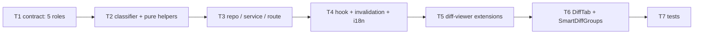
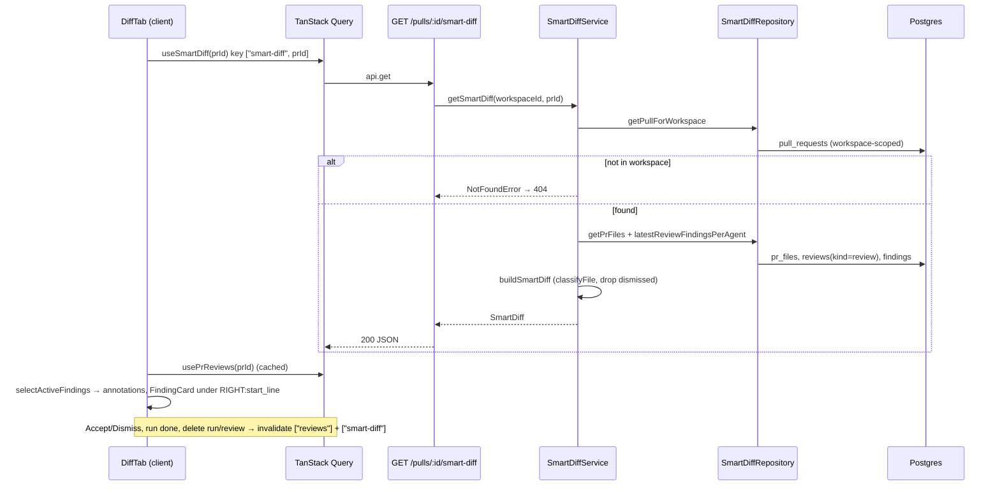

# Development Plan — Smart Diff (role-grouped diff with in-line review findings)
Date: 2026-09-24 · Branch: feat/L03_Subagents · Status: draft

> Source design (approved by the user, not re-litigated here): `~/.claude-private/plans/smartdiff-snug-horizon.md`.
> This plan translates it into tasks and resolves the four open points it delegated to the planner (§0).

## 0. Resolved open points (with evidence)

### 0.1 Where `["reviews", prId]` is refreshed when a review run finishes
- A review run is fire-and-forget: `useRunReview.onSuccess` (`client/src/lib/hooks/reviews.ts:157-159`) invalidates `["reviews", prId]` when the **POST returns**, which is *before* the agents finish. That spot alone does not reflect finished findings.
- The actual "run finished" hook is `FindingsTab`'s `onRunDone` callback, wired in `client/src/app/repos/[repoId]/pulls/[number]/page.tsx:119-123`: it calls `invalidateActiveRuns()`, `invalidateRunHistory()` and `refetchReviews()`.
- `invalidateRunHistory` is defined in `client/src/app/repos/[repoId]/pulls/[number]/hooks/usePrDetailPage.ts:55-60`. It already invalidates `["pr-runs", prId]` and `["pr-intent", prId]`, with a comment explaining that a finished run changes derived PR state.
- **Decision:** add `qc.invalidateQueries({ queryKey: ["smart-diff", prId] })` inside `invalidateRunHistory` (usePrDetailPage.ts:55-60). Also add it next to every other `["reviews", prId]` invalidation in `reviews.ts`: `useDeleteRun` (`:91-94`), `useDeleteReview` (`:110`), `useRunReview` (`:157-159`) and `useFindingAction` (`:182-184`, which the design names). Deleting a run or review changes which review is "latest per agent", so those spots need it too.
- Why invalidation is required: the global `staleTime` is 30 s (`client/src/lib/providers.tsx:28`). Without invalidation, switching to Files changed right after a run would show cached indicators. `invalidateQueries` also marks inactive queries stale, so the Diff tab refetches on its next mount.

### 0.2 Does client `ReviewRecord` expose `agent_id`?
- Yes. `ReviewRecord.agent_id: z.string().nullable()` is at `client/src/vendor/shared/contracts/review-api.ts:26` (the server copy has the same line). The server fills it from `review.agentId` in `reviewToDto` (`server/src/modules/reviews/helpers.ts:63`). `created_at` and `kind` are also on the DTO (`review-api.ts:29,35`).
- **No contract change is needed.** Client-side latest-per-agent selection uses `agent_id`, `kind` and `created_at` directly.
- Edge: `agent_id` can be `null`. The seeded demo review is inserted without `agentId` (`server/src/db/seed.ts:143-155`). See A2 for how it is treated.

### 0.3 Does reviewer-core have its own vendored copy of the shared contracts?
- **No.** `reviewer-core/tsconfig.json:22-23` path-aliases `@devdigest/shared` → `../server/src/vendor/shared`. `reviewer-core/src` has no `vendor/` folder, and nothing in `reviewer-core/src` references `SmartDiff*`.
- There are only **two** copies: `server/src/vendor/shared` (canonical) and `client/src/vendor/shared`. `scripts/check-vendor-shared-sync.sh` diffs exactly those two (`:23-24`).
- reviewer-core still *type-checks* the server copy, so T1's Done-condition includes `cd reviewer-core && npm run typecheck`.

### 0.4 Glob → regex translation (the classifier's full rule table)
Normalization before matching: `p = path.replace(/\\/g, '/').replace(/^(?:\.\/)+/, '')`. Every regex runs against the full normalized path. Two anchoring conventions apply (A3):
- Basename-only globs (no `/`) match the **last segment at any depth**, via `(?:^|\/)` or a `$`-anchored suffix.
- `dir/**` globs match that directory **at any depth**, via `(?:^|\/)dir\/`. This covers `server/dist/…`, `client/src/test/…` and `e2e/…` in this multi-package repo.

Rule order is **boilerplate → tests → wiring → docs**; the first match wins and `core` is the default.

| Role (order) | Spec glob | Regex |
|---|---|---|
| boilerplate | `*.lock` | `/\.lock$/` |
| boilerplate | `pnpm-lock.yaml` | `/(?:^\|\/)pnpm-lock\.yaml$/` |
| boilerplate | `package-lock.json` | `/(?:^\|\/)package-lock\.json$/` |
| boilerplate | `yarn.lock` | `/(?:^\|\/)yarn\.lock$/` (also covered by `*.lock`; kept explicit) |
| boilerplate | `dist/**` | `/(?:^\|\/)dist\//` |
| boilerplate | `build/**` | `/(?:^\|\/)build\//` |
| boilerplate | `**/__snapshots__/**` | `/(?:^\|\/)__snapshots__\//` |
| boilerplate | `*.snap` | `/\.snap$/` |
| boilerplate | `*.generated.*` | `/\.generated\.[^/]+$/` |
| boilerplate | `*.min.js` | `/\.min\.js$/` |
| tests | `*.test.ts(x)` | `/\.test\.tsx?$/` |
| tests | `*.it.test.ts` | `/\.it\.test\.ts$/` (subsumed by the previous rule; kept explicit) |
| tests | `*.spec.ts` | `/\.spec\.ts$/` |
| tests | `**/test/**` | `/(?:^\|\/)test\//` |
| tests | `**/tests/**` | `/(?:^\|\/)tests\//` |
| tests | `**/__tests__/**` | `/(?:^\|\/)__tests__\//` |
| tests | `e2e/**` | `/(?:^\|\/)e2e\//` |
| wiring | `index.ts` / `index.js` | `/(?:^\|\/)index\.[jt]s$/` |
| wiring | `*.config.*` | `/\.config\.[^/]+$/` (requires a literal `.config.` in the basename, so `src/config.ts` stays core) |
| wiring | `tsconfig*.json` | `/(?:^\|\/)tsconfig[^/]*\.json$/` |
| wiring | `.eslintrc*` | `/(?:^\|\/)\.eslintrc[^/]*$/` |
| wiring | `.env*` | `/(?:^\|\/)\.env[^/]*$/` |
| wiring | `docker-compose*.yml` | `/(?:^\|\/)docker-compose[^/]*\.yml$/` |
| wiring | `.github/**` | `/(?:^\|\/)\.github\//` |
| wiring | `.claude/**` | `/(?:^\|\/)\.claude\//` |
| docs | `*.md` | `/\.md$/` |
| docs | `docs/**` | `/(?:^\|\/)docs\//` |
| docs | `README*` | `/(?:^\|\/)README[^/]*$/` |
| docs | `CHANGELOG*` | `/(?:^\|\/)CHANGELOG[^/]*$/` |
| docs | `LICENSE` | `/(?:^\|\/)LICENSE$/` |

(`\|` above is only Markdown table escaping. The source regex uses a plain `|`.)

Matching is case-sensitive, like the spec globs.

Ordering cases, traced:
- `__tests__/__snapshots__/x.snap` → the boilerplate `__snapshots__/` rule matches before `__tests__/` (tests) is checked → **boilerplate**.
- `.claude/skills/security/SKILL.md` → no boilerplate rule and no tests rule matches (no `test/`/`tests/` segment, no `.test.` suffix) → wiring `.claude/` matches before docs `*.md` → **wiring**.
- `e2e/README.md` → tests `e2e/` matches before docs `README*`/`*.md` → **tests** (the user's decision; the table test must record it in a comment).
- Other design table rows: `pnpm-lock.yaml` → boilerplate; `client/src/components/index.ts` → wiring; `server/src/modules/pulls/service.ts` → core; `docs/x.md` → docs; `e2e/playwright.config.ts` → tests (tests precede wiring).
- Consequences worth knowing, all by the same rule order: `.claude/hooks/tests/x.sh` → tests; `e2e/docs/x.md` → tests; `server/test/helpers/pg.ts` → tests; `server/.env.example` → wiring; `server/src/vendor/shared/index.ts` → wiring.
- Seed/e2e check: seeded PR #482 files (`server/src/db/seed.ts:128-131`: `src/middleware/ratelimit.ts`, `src/api/public/webhooks.ts`, `src/config.ts`, `src/api/users.ts`) all classify as **core**. Core is expanded by default, so e2e flow `e2e/specs/05-pr-diff.flow.json:8` (`wait --text src/config.ts`) keeps passing.

## 1. Goal & scope
Turn **Files changed** into a reviewer-ordered Smart Diff:
- PR files are grouped by role (core → tests → wiring → docs → boilerplate) by a deterministic, dependency-free regex classifier on the server (`GET /pulls/:id/smart-diff`).
- Review findings show up directly in the diff:
  - a `● N` counter (files with findings) on each group header;
  - a dot on each file card that has findings;
  - a colored bar, a severity label pill and the reused `FindingCard` under the cited line.
- A Smart/Original toggle switches back to GitHub order, with the same dots and annotations.

**Out of scope:**
- LLM `pseudocode_summary`: stays absent (`nullish`).
- `split_suggestion` logic: always `too_big:false`, `proposed_splits:[]`.
- Persisting roles.
- Calling GitHub from the route.
- LEFT-side (deleted-line) finding anchors.
- New e2e flows.
- Non-`en` locales (only `messages/en` exists).
- The CI runner.
- Adding npm dependencies (e.g. `minimatch`, `@testing-library/user-event`), because lockfiles are off-limits.

## 2. Requirements
- R1 — `SmartDiffRole` is `z.enum(['core','tests','wiring','docs','boilerplate'])` in **both** `server/src/vendor/shared/contracts/brief.ts` and `client/src/vendor/shared/contracts/brief.ts`. `./scripts/check-vendor-shared-sync.sh` exits 0. `SmartDiff.parse` accepts groups with roles `tests` and `docs`.
- R2 — `classifyFile(path)` is pure. It returns the role of the first matching rule in the order boilerplate → tests → wiring → docs, and `core` otherwise, using exactly the regexes in §0.4 after normalizing `\`→`/` and stripping leading `./`. The 8 design table cases produce the listed roles.
- R3 — `GET /pulls/:id/smart-diff` returns a valid `SmartDiffResponse`:
  - groups follow the order core, tests, wiring, docs, boilerplate; empty groups are omitted;
  - each file carries `path`, `additions` and `deletions` from `pr_files`, and files keep the order in which the repository returns them;
  - `finding_lines` holds the sorted, unique `start_line` values of findings with `file === path` from the **latest `kind='review'` review per agent**, excluding dismissed findings;
  - `split_suggestion = { too_big:false, total_lines: Σ(additions+deletions), proposed_splits:[] }`.
  - A PR outside the caller's workspace (or unknown) returns 404. A non-uuid `:id` returns 422. No GitHub/LLM call is made.
- R4 — The client fetches the smart diff with `useSmartDiff(prId)` (key `["smart-diff", prId]`). The cache is invalidated when a finding is accepted or dismissed, when a review run finishes (`invalidateRunHistory`), when a review is triggered, and when a run or review is deleted.
- R5 — `@/components/diff-viewer` gains generic, domain-free extension points: `LineAnnotation`, `partitionAnnotations`, and `FileCard` props `defaultOpen`/`marked`/`annotations`. `CodeLine` gets an `annotations` prop and `DiffViewer` gets `fileProps` and `key={f.path}`. New public exports: `FileCard`, `FileCardProps`, `Line`, `keysForLine`, `LineAnnotation`. Nothing under `src/components/diff-viewer/` imports from `src/app/**` or references findings/severity.
- R6 — The Files changed tab:
  - shows a "Reviewer-ordered diff" header, "N files · +A −D", a Smart/Original toggle (default **Smart**) and the existing Show comments button;
  - in Smart mode, renders `SmartDiffGroups`: each group header has a chevron, a role-colored square, the role label, the role hint, and on the right `● N` (only when N>0, in `SEV.CRITICAL.c`) and "N files";
  - `docs` and `boilerplate` groups start collapsed, the others expanded;
  - while smart-diff is loading, errored, or doesn't cover exactly `pr.files`, it renders the original order.
- R7 — Findings from the latest `kind='review'` review per agent (the same rule as R3, applied client-side to `usePrReviews` data) render under line `RIGHT:start_line` of their file in both modes:
  - a left color bar (`SEV[severity].c`; muted for dismissed findings);
  - a right label pill (blocker/warning/suggestion);
  - `FindingCard` (`defaultExpanded`) with working Accept/Dismiss.
  - Dismissed findings still render their (dimmed) card but don't count toward `● N` or the file dot.
  - Findings whose line isn't in the patch are listed at the end of the file card.
  - A file card shows a dot iff it has ≥1 non-dismissed active finding.
- R8 — `client/messages/en/prReview.json` → `smartDiff` gains `testsLabel`, `docsLabel`, `coreHint`, `testsHint`, `wiringHint`, `docsHint`, `boilerplateHint`, `reviewerOrdered`, `smartOrder`, `originalOrder`, `filesWithFindings`, `lineBlocker`, `lineWarning`, `lineSuggestion` and `summary`. `client/messages/en/shell.json` → `diffViewer` gains `unanchoredTitle`. No UI string added by this feature is hard-coded.
- R9 — Automated tests cover R2, R3, R5, R6 and R7 (T7), and the contract sample covers R1 (T1).

## 3. Assumptions & open questions
- A1 — "Original PR order" inside a group means the order of `pr.files` on the client (the order `DiffViewer` already shows). `pr_files` has no ordering column (`server/src/db/schema/pulls.ts:45-60`: random uuid PK) and `PullsRepository.getPrFiles` has no `ORDER BY` (`server/src/modules/pulls/repository.ts:121-123`), so server order is only insertion/heap order. The server keeps its input order (tested on the pure helper). The client **re-sorts each group's files by their index in `pr.files`** (T6 `resolveSmartGroups`), which makes the display order deterministic regardless of DB scan order.
- A2 — "Latest per agent" groups by `agent_id`, and all `agent_id === null` reviews form **one** bucket keyed `null`. This keeps the seeded agent-less review (`seed.ts:143-155`) visible in the demo. The same rule is implemented on the server (`selectLatestReviewPerAgent`) and the client (`selectActiveFindings`). Newest means max `created_at`; neither implementation relies on input order.
- A3 — Glob anchoring follows §0.4: basename globs match at any depth, and `dir/**` globs match the directory at any depth. The spec's `**/…` patterns are already any-depth. Root-anchoring `dist/**`/`e2e/**` would misclassify `server/dist/…` in this multi-package repo.
- A4 — `LineAnnotation` additionally carries `id: string`, which is used as the React `key` (react-best-practices: no index keys in lists that can change). The shape is `{ id; color; label; content }`. This is a detail of the approved `{color,label,content}` contract, not a change to it.
- A5 — Only `RIGHT:${start_line}` anchors are produced (findings cite new-file lines). A finding whose `start_line` isn't a rendered RIGHT line (deleted-only hunk, missing patch, as in the seeded files which have no `patch`) goes to the unanchored list.
- A6 — The file dot (`marked`) comes from the smart-diff response (`finding_lines.length > 0`) when available, and otherwise from client active non-dismissed findings. By A2, both use the same rule.
- A7 — Accepted (not dismissed) findings count toward indicators. Only `dismissed_at != null` is excluded, per the design.
- Q — none blocking.

## 4. Affected modules
| Package | Layer / area | Files (existing or new) |
|---|---|---|
| server | Domain contract | `src/vendor/shared/contracts/brief.ts` (edit) |
| server | New module `smart-diff` (pure core) | `src/modules/smart-diff/constants.ts`, `classify.ts`, `helpers.ts` (new) |
| server | New module `smart-diff` (data / app / delivery) | `src/modules/smart-diff/repository.ts`, `service.ts`, `routes.ts` (new) |
| server | Composition root | `src/modules/index.ts` (edit) |
| server | Tests | `test/contracts.test.ts` (edit), `test/smart-diff-classify.test.ts`, `test/smart-diff-build.test.ts`, `test/smart-diff.it.test.ts` (new) |
| client | Vendored contract | `src/vendor/shared/contracts/brief.ts` (edit) |
| client | Data hooks | `src/lib/hooks/reviews.ts` (edit), `src/app/repos/[repoId]/pulls/[number]/hooks/usePrDetailPage.ts` (edit) |
| client | i18n | `messages/en/prReview.json`, `messages/en/shell.json` (edit) |
| client | Cross-cutting diff-viewer | `src/components/diff-viewer/{index.ts, annotations.ts (new), FileCard/FileCard.tsx, CodeLine/CodeLine.tsx, DiffViewer/DiffViewer.tsx, styles.ts}` |
| client | PR route UI | `…/[number]/page.tsx`, `…/_components/DiffTab/{DiffTab.tsx, helpers.ts (new), constants.ts (new), styles.ts (new)}`, `…/_components/SmartDiffGroups/{index.ts, SmartDiffGroups.tsx, styles.ts, constants.ts}` (new) |
| client | Tests | `…/SmartDiffGroups/SmartDiffGroups.test.tsx`, `…/DiffTab/helpers.test.ts`, `…/DiffTab/DiffTab.test.tsx`, `src/components/diff-viewer/FileCard/FileCard.test.tsx` (new) |
| reviewer-core | — | none (type-checks the server contract via alias only) |
| e2e | — | none (flow 05 still valid, §0.4) |

(`…` = `client/src/app/repos/[repoId]/pulls/[number]`)

## 5. Constraints
- Contract changes go into both vendored copies identically. Verify with `./scripts/check-vendor-shared-sync.sh`. Sources: `server/AGENTS.md` "Do not touch" (`src/vendor/shared`), `client/AGENTS.md` "Do not touch", `server/Insights.md` 2026-09-18 "vendor/shared hand-mirrored".
- Zod enums are `z.enum([...])` with a same-named `type X = z.infer<typeof X>`, never a TS `enum`. Source: `server/AGENTS.md` "Naming conventions".
- Routes declare Zod `params` (`IdParams`), and invalid input 422s before the handler. Source: `server/AGENTS.md` "Conventions".
- New module = one import plus one entry in `src/modules/index.ts`. Source: `server/AGENTS.md` "Conventions", `server/src/modules/index.ts:14-26` (which names "intent/smart-diff" as a lesson module).
- Only `repository.ts` imports `drizzle-orm`/`db/schema`. `service.ts` imports no Fastify/Drizzle, and `routes.ts` imports no DB. Source: `backend-onion-architecture` skill, layer map.
- No new dependency; the classifier is regex-only. Source: `server/AGENTS.md`/`client/AGENTS.md` "Do not touch" `pnpm-lock.yaml`, and the design.
- Any `*.it.test.ts` `buildApp` helper must set `secrets: new MockSecretsProvider({})`. Source: `server/Insights.md` 2026-09-24 "reviews.it.test.ts is not hermetic…".
- Tests that import `test/helpers/pg.ts` must be named `*.it.test.ts`. Source: `server/AGENTS.md` "Gotchas".
- Never `fetch` in components; hooks live in `src/lib/hooks/*` and call `src/lib/api.ts`. Source: `client/AGENTS.md` "Conventions".
- Route-local components live in `_components/<PascalName>/` with `index.ts`, `styles.ts` (`const s`), `constants.ts` and `helpers.ts`. Cross-cutting components live under kebab-case `src/components/<folder>/`. Source: `client/AGENTS.md` "Naming conventions", `frontend-ui-architecture` skill.
- `src/components/diff-viewer` stays domain-free and never imports `src/app/**`. Source: the design (C3) and `frontend-ui-architecture` (shared layer must not import feature code).
- `@devdigest/ui` never imports `@devdigest/shared`. Nothing in this plan edits `src/vendor/ui`, and feature code casts `f.severity as Severity` at the boundary. Source: `client/Insights.md` 2026-09-18 "`@devdigest/ui` never imports `@devdigest/shared`".
- Client tests use `fireEvent` and `vi.mock` of `lib/hooks/*` (the existing pattern: `FindingsPanel.test.tsx:7`, `RunReviewDropdown.test.tsx:9-12`). `@testing-library/user-event` is **not** a client dependency (`client/package.json`) and must not be added.
- Past migrations are immutable. This plan has **no** schema change or migration. Source: `server/AGENTS.md` "Do not touch".

## 6. Tasks

### T1 — Contract: five SmartDiff roles (both copies)
- Requirements: R1
- Scope: Backend (the shared contract is also mirrored into client)
- Depends on: —
- Owned paths: `server/src/vendor/shared/contracts/brief.ts`, `client/src/vendor/shared/contracts/brief.ts`, `server/test/contracts.test.ts`
- Mandatory skills: `backend-onion-architecture`, `fastify-best-practices`, `typescript-expert`, `zod`, `engineering-insights`
- Change:
  - In both `brief.ts` files, line 124: `export const SmartDiffRole = z.enum(['core', 'tests', 'wiring', 'docs', 'boilerplate']);`. Keep the `type SmartDiffRole` line. No other field changes: `SmartDiffFile`, `SmartDiffGroup` and `SmartDiff` stay as-is at `:127-156`.
  - Make the two files byte-identical.
  - In `server/test/contracts.test.ts`'s `it('SmartDiff …')` (`:129-140`), add groups with `role: 'tests'` and `role: 'docs'`, and assert both parse. Also add a `SmartDiffRole.safeParse('vendor').success === false` assertion.
- Why: every later task types against these five roles. Without them the classifier can't return `tests`/`docs`, and the UI can't map labels.
- Risk: Low. A copy drift between server and client wouldn't be caught by TypeScript. · Mitigation: the Done-condition runs the sync script.
- Acceptance: the contracts test passes with `tests`/`docs` samples (R1). The sync script prints `OK`.
- Done-condition: `cd server && pnpm typecheck && pnpm test -- contracts && pnpm lint` · `cd client && pnpm typecheck` · `cd reviewer-core && npm run typecheck` · `./scripts/check-vendor-shared-sync.sh`

### T2 — Classifier and pure Smart Diff helpers (server)
- Requirements: R2, R3
- Scope: Backend
- Depends on: T1
- Owned paths: `server/src/modules/smart-diff/constants.ts`, `server/src/modules/smart-diff/classify.ts`, `server/src/modules/smart-diff/helpers.ts`
- Mandatory skills: `backend-onion-architecture`, `fastify-best-practices`, `typescript-expert`, `zod`, `engineering-insights`
- Change:
  - `constants.ts`:
    - `export const SMART_DIFF_ROLE_ORDER = ['core','tests','wiring','docs','boilerplate'] as const satisfies readonly SmartDiffRole[];`
    - `export const CLASSIFY_RULES: readonly { role: Exclude<SmartDiffRole,'core'>; patterns: readonly RegExp[] }[]` has exactly four entries in the order boilerplate, tests, wiring, docs, with the regexes from §0.4 verbatim.
    - Add a header comment recording the anchoring convention (A3) and the `e2e/README.md → tests` decision.
  - `classify.ts`: `export function classifyFile(path: string): SmartDiffRole`.
    - Normalize: `path.replace(/\\/g,'/').replace(/^(?:\.\/)+/,'')`.
    - Iterate `CLASSIFY_RULES` and return the first `role` whose `patterns.some(re => re.test(p))`; otherwise return `'core'`.
    - No global (`g`) flags on the regexes, because `lastIndex` state would make `test()` non-deterministic.
  - `helpers.ts` (pure, no Drizzle/Fastify imports; declare structural input types locally):
    - `export interface SmartDiffInputFile { path: string; additions: number; deletions: number }`.
    - `export interface SmartDiffInputFinding { file: string; startLine: number; dismissedAt: Date | null }`.
    - `export function selectLatestReviewPerAgent<T extends { agentId: string | null; createdAt: Date }>(reviews: readonly T[]): T[]` returns, for each distinct `agentId` (with `null` as its own bucket, A2), the element with the greatest `createdAt`. It must not rely on input order.
    - `export function buildSmartDiff(files: readonly SmartDiffInputFile[], findings: readonly SmartDiffInputFinding[]): SmartDiff`:
      - build `Map<path, Set<number>>` from findings where `dismissedAt == null`;
      - bucket files by `classifyFile(f.path)`, preserving input order;
      - emit groups in `SMART_DIFF_ROLE_ORDER`, skipping empty ones;
      - each file is `{ path, additions, deletions, finding_lines: [...set].sort((a,b)=>a-b) }` (no `pseudocode_summary` key);
      - `split_suggestion: { too_big: false, total_lines: Σ(additions+deletions) over all files, proposed_splits: [] }`.
- Why: this is the pure core, kept free of HTTP and DB so a later lesson (L08) can reuse the classifier without a request, and so the rules can be table-tested.
- Risk: Medium.
  - Glob-to-regex drift, e.g. `*.config.*` catching `src/config.ts`, or `index.ts` matching `reindex.ts`.
  - Rule-order mistakes (the three ordering cases).
  - Using a `g` flag.
  - · Mitigation: the regexes are fixed in §0.4 with `(?:^|\/)` boundaries; the ordering cases are traced in §0.4; T7's table test pins all of them.
- Acceptance: for the paths in §0.4, `classifyFile` returns the listed role (R2). `buildSmartDiff` omits empty groups, orders groups by `SMART_DIFF_ROLE_ORDER`, dedupes and sorts `finding_lines`, excludes dismissed findings, and sums `total_lines` (R3). The output passes `SmartDiff.parse`.
- Done-condition: `cd server && pnpm typecheck && pnpm lint && pnpm test -- --exclude '**/*.it.test.ts'`

### T3 — Repository, service, route and registration (server)
- Requirements: R3
- Scope: Backend
- Depends on: T2
- Owned paths: `server/src/modules/smart-diff/repository.ts`, `server/src/modules/smart-diff/service.ts`, `server/src/modules/smart-diff/routes.ts`, `server/src/modules/index.ts`
- Mandatory skills: `backend-onion-architecture`, `fastify-best-practices`, `typescript-expert`, `drizzle-orm-patterns`, `postgresql-table-design`, `zod`, `engineering-insights`
- Change:
  - `repository.ts`: `export class SmartDiffRepository { constructor(private db: Db) {} }`. It is the only file in the module importing `drizzle-orm` and `../../db/schema.js`. Precedents: `pulls/repository.ts:84-90,121-123,164-178` and `reviews/repository/review.repo.ts:58-74`.
    - `getPullForWorkspace(workspaceId, prId): Promise<PullRow | undefined>`: `select().from(t.pullRequests).where(and(eq(workspaceId), eq(id)))`.
    - `getPrFiles(prId): Promise<{ path; additions; deletions }[]>`: select only those three columns from `t.prFiles` where `prId`. No `patch` is needed. No `ORDER BY` (A1).
    - `latestReviewFindingsPerAgent(prId): Promise<FindingRow[]>`:
      - select `{ id, agentId, createdAt }` from `t.reviews` where `prId = ? AND kind = 'review'`, `orderBy(desc(t.reviews.createdAt))`;
      - `selectLatestReviewPerAgent(rows)` (imported from `./helpers.js`);
      - if empty, return `[]`;
      - else `select().from(t.findings).where(inArray(t.findings.reviewId, ids))`.
    - No new indexes: `pr_files_pr_id_idx` exists (`schema/pulls.ts:58`), and the reviews/findings access paths are the same ones `reviews/repository/review.repo.ts:58-74` already uses.
  - `service.ts`: `export class SmartDiffService`. Its constructor takes `container: Container` and builds `new SmartDiffRepository(container.db)`, following `pulls/service.ts:24-29`.
    - `async getSmartDiff(workspaceId: string, prId: string): Promise<SmartDiff>`:
      - `if (!pull) throw new NotFoundError('Pull request not found')` (`platform/errors.ts:19`);
      - load files and findings (`Promise.all` is fine after the workspace check);
      - map findings to `{ file, startLine, dismissedAt }`;
      - return `buildSmartDiff(files, mapped)`.
    - No Fastify or Drizzle imports.
  - `routes.ts`: `export default async function smartDiffRoutes(appBase: FastifyInstance)`, mirroring `pulls/routes.ts:22-35`: `withTypeProvider<ZodTypeProvider>()`, `const service = new SmartDiffService(container)`, and `app.get('/pulls/:id/smart-diff', { schema: { params: IdParams } }, async (req): Promise<SmartDiffResponse> => { const { workspaceId } = await getContext(container, req); return service.getSmartDiff(workspaceId, req.params.id); })`. Imports: `IdParams` from `../_shared/schemas.js`, `getContext` from `../_shared/context.js`, and `type SmartDiffResponse` from `@devdigest/shared`. Include a header comment saying the route reads `pr_files` (refreshed by `GET /pulls/:id`) and never calls GitHub.
  - `modules/index.ts`: `import smartDiff from './smart-diff/routes.js';` and add a `smartDiff,` entry to `modules`.
- Why: this exposes the Smart Diff over HTTP with workspace scoping, reusing the one "latest per agent" rule from T2.
- Risk: Medium.
  - Cross-workspace data leak if the file/review queries run before the workspace check.
  - Route path collision with `pulls` (none exists today; `pulls/routes.ts` defines `/pulls/:id` and `/pulls/:id/comments` only).
  - `null` agentId handling.
  - · Mitigation: the service checks the workspace first (404) before any unscoped `prId` query, the same convention as `pulls/repository.ts:13-20`; A2 is covered by the helper; T7's IT test covers 404, 422 and the older-review exclusion.
- Acceptance (R3):
  - `GET /pulls/<seeded uuid>/smart-diff` → 200 and a body passing `SmartDiffResponse.parse`;
  - an unknown or foreign uuid → 404;
  - `/pulls/not-a-uuid/smart-diff` → 422;
  - no GitHub adapter is invoked.
- Done-condition: `cd server && pnpm typecheck && pnpm lint && pnpm test`

### T4 — Client hook, cache invalidation and i18n
- Requirements: R4, R8
- Scope: Frontend
- Depends on: T3
- Owned paths: `client/src/lib/hooks/reviews.ts`, `client/src/app/repos/[repoId]/pulls/[number]/hooks/usePrDetailPage.ts`, `client/messages/en/prReview.json`
- Mandatory skills: `frontend-ui-architecture`, `next-best-practices`, `react-best-practices`, `typescript-expert`, `engineering-insights`
- Change:
  - `reviews.ts`:
    - Add `SmartDiffResponse` to the `@devdigest/shared` type import.
    - Add `export function useSmartDiff(prId: string | null | undefined)` next to `usePrIntent` (`:63-69`): `useQuery({ queryKey: ["smart-diff", prId], queryFn: () => api.get<SmartDiffResponse>(\`/pulls/${prId}/smart-diff\`), enabled: !!prId })`.
    - Add `qc.invalidateQueries({ queryKey: ["smart-diff", prId] })` next to each `["reviews", prId]` invalidation: `useDeleteRun` (`:91-94`), `useDeleteReview` (turn `:110` into a block body that invalidates both keys), `useRunReview` (`:157-159`) and `useFindingAction` (`:182-184`, inside the existing `if (prId)`).
  - `usePrDetailPage.ts`: inside `invalidateRunHistory` (`:55-60`), add `qc.invalidateQueries({ queryKey: ["smart-diff", prId] })`, and extend the comment ("a finished run changes the latest-per-agent findings behind the Smart Diff indicators").
  - `prReview.json` → `smartDiff` (keep the existing keys at `:53-62`). Add:
    - `"testsLabel": "Tests"`, `"docsLabel": "Docs"`;
    - `"coreHint": "The substance of the change — review closely"`;
    - `"testsHint": "Tests that exercise the change"`;
    - `"wiringHint": "Hooks the core into the app"`;
    - `"docsHint": "Docs and notes"`;
    - `"boilerplateHint": "Generated / mechanical — skim"`;
    - `"reviewerOrdered": "Reviewer-ordered diff"`;
    - `"smartOrder": "Smart order"`, `"originalOrder": "Original order"`;
    - `"filesWithFindings": "{count} files with findings"`;
    - `"lineBlocker": "blocker"`, `"lineWarning": "warning"`, `"lineSuggestion": "suggestion"`;
    - `"summary": "{files} files · +{additions} −{deletions}"`.
- Why: the UI needs a cached data source, and the indicators must refresh after Run review / Accept / Dismiss / delete (§0.1), because the global `staleTime` is 30 s.
- Risk: Low. A missed invalidation spot would leave stale dots. · Mitigation: every `["reviews", prId]` invalidation in `reviews.ts` plus `invalidateRunHistory` is enumerated above by line.
- Acceptance: `useSmartDiff` requests `/pulls/:id/smart-diff` only when `prId` is set (R4). `grep -n '"smart-diff"' client/src/lib/hooks/reviews.ts` shows the query key plus 4 invalidations, and `usePrDetailPage.ts` shows 1. The JSON is valid and contains all 15 new keys (R8).
- Done-condition: `cd client && pnpm typecheck && pnpm test && pnpm lint`

### T5 — Diff-viewer generic extensions (annotations, marked, defaultOpen, fileProps)
- Requirements: R5, R7, R8
- Scope: Frontend
- Depends on: T4
- Owned paths: `client/src/components/diff-viewer/index.ts`, `client/src/components/diff-viewer/annotations.ts` (new), `client/src/components/diff-viewer/FileCard/FileCard.tsx`, `client/src/components/diff-viewer/FileCard/index.ts`, `client/src/components/diff-viewer/CodeLine/CodeLine.tsx`, `client/src/components/diff-viewer/DiffViewer/DiffViewer.tsx`, `client/src/components/diff-viewer/styles.ts`, `client/messages/en/shell.json`
- Mandatory skills: `frontend-ui-architecture`, `next-best-practices`, `react-best-practices`, `typescript-expert`, `engineering-insights`
- Change:
  - `annotations.ts` (new, pure; imports `ReactNode` type only):
    - `export interface LineAnnotation { id: string; color: string; label: string; content: ReactNode }` (A4).
    - `export type LineAnnotationMap = Map<string, LineAnnotation[]>` (keys are `lineKey` format `"RIGHT:n"`/`"LEFT:n"`, `comments.ts:34`).
    - `export function partitionAnnotations(map: LineAnnotationMap | undefined, renderedKeys: Set<string>): { matched: LineAnnotationMap; unanchored: LineAnnotation[] }`, modeled on `partitionThreads` (`comments.ts:89-106`). It must not mutate its input.
    - Nothing in this file mentions findings or severity.
  - `FileCard.tsx`:
    - Export `export interface FileCardProps { file: PrFile; commenting?: DiffCommentApi; defaultOpen?: boolean; marked?: boolean; annotations?: LineAnnotationMap }`.
    - `useState(defaultOpen ?? (additions+deletions <= AUTO_EXPAND_MAX_LINES))`.
    - Compute `renderedKeys` once (hoist the existing `keysForLine` loop at `:46-47`) and use it for both `partitionThreads` and `partitionAnnotations`.
    - When `marked`, render a small dot (`s.markDot`, `aria-label` via `t("diffViewer…")`; no number) right after the path and separate from the comment counter.
    - Pass `annotations={annotationsForLine(ln, matchedAnnotations)}` to each `CodeLine`, using a helper that mirrors `threadsForLine` (`:23-31`).
    - After the lines (and independent of `showComments`), render unanchored annotations in a footer styled like `OutdatedComments` (`cs.outdatedWrap`/`cs.outdatedTitle`) with the title `t("diffViewer.unanchoredTitle", { count })`, followed by each `content` (key = `id`). Render it even when `lines.length === 0`.
  - `CodeLine.tsx`: new optional prop `annotations?: LineAnnotation[]`. When non-empty:
    - the row gets an inset left bar in `annotations[0].color` (e.g. `boxShadow: inset 3px 0 0 <color>`, so the layout doesn't shift);
    - a right-aligned pill per distinct label (`s.annotationPill(color)`) appears inside the row;
    - each `content` renders under the row inside a `div` with `cs.thread`, **before** comment threads (key = `id`).
    - Hunk rows ignore annotations.
  - `DiffViewer.tsx`: `key={f.path}` instead of the index. Add a new optional prop `fileProps?: (f: PrFile) => Omit<Partial<FileCardProps>, "file" | "commenting">`, spread onto each `FileCard`.
  - `styles.ts`: add `markDot`, `annotationPill(color)` and `annotatedRow(color)`, using only CSS vars and the passed color.
  - `index.ts`: add exports `FileCard`, `type FileCardProps` (from `./FileCard`; add the type re-export to `FileCard/index.ts`), `type Line` (`./helpers`), `keysForLine` (`./comments`), `type LineAnnotation`, `type LineAnnotationMap` and `partitionAnnotations` (`./annotations`).
  - `shell.json` → `diffViewer`: add `"unanchoredTitle": "{count} note(s) not on a line shown in this diff"` and `"hasFindings": "Has review findings"` (the dot's aria-label).
- Why: Smart Diff needs to inject content under lines, mark files and control expansion, while the shared diff viewer stays reusable and domain-free (design C3).
- Risk: Medium.
  - Regressing inline GitHub comments (thread anchoring, the "+" composer, `showComments` gating).
  - Switching the key to `f.path` could collide if a PR lists the same path twice (GitHub doesn't).
  - `defaultOpen` is only an initial value, so toggling modes remounts cards; that's acceptable because the key is stable per path.
  - · Mitigation: comment paths are untouched except for the shared `renderedKeys` hoist; the existing `client/src/test/smoke.test.tsx` diff-viewer render must stay green; T7 adds `FileCard.test.tsx`.
- Acceptance (R5/R7/R8):
  - `grep -rn "src/app\|Finding\|severity" client/src/components/diff-viewer` finds nothing.
  - Rendering `FileCard` with `annotations: new Map([["RIGHT:2", [...]]])` renders `content` directly after line 2's row.
  - An annotation keyed to a missing line appears under the `unanchoredTitle` footer.
  - `marked` renders the dot.
  - Omitting all new props renders exactly as before.
- Done-condition: `cd client && pnpm typecheck && pnpm test && pnpm lint`

### T6 — DiffTab Smart/Original modes and SmartDiffGroups UI
- Requirements: R6, R7
- Scope: Frontend
- Depends on: T5
- Owned paths: `client/src/app/repos/[repoId]/pulls/[number]/page.tsx`, `client/src/app/repos/[repoId]/pulls/[number]/_components/DiffTab/DiffTab.tsx`, `…/_components/DiffTab/helpers.ts` (new), `…/_components/DiffTab/constants.ts` (new), `…/_components/DiffTab/styles.ts` (new), `…/_components/SmartDiffGroups/index.ts`, `…/_components/SmartDiffGroups/SmartDiffGroups.tsx`, `…/_components/SmartDiffGroups/styles.ts`, `…/_components/SmartDiffGroups/constants.ts` (all new)
- Mandatory skills: `frontend-ui-architecture`, `next-best-practices`, `react-best-practices`, `typescript-expert`, `engineering-insights`
- Change:
  - `page.tsx` (`:127-134`): pass `repoFullName={repoFullName}` and `headSha={pr.head_sha}` to `DiffTab`. No other change.
  - `DiffTab/constants.ts`:
    - `export const SEVERITY_LINE_LABEL = { CRITICAL: "lineBlocker", WARNING: "lineWarning", SUGGESTION: "lineSuggestion" } as const satisfies Record<Severity, string>` (the `Severity` type from `@devdigest/shared`);
    - `export const DIFF_ORDER = ["smart", "original"] as const; export type DiffOrder = (typeof DIFF_ORDER)[number];`.
  - `DiffTab/helpers.ts` (pure; no React components, no hooks):
    - `selectActiveFindings(reviews: ReviewRecord[]): FindingRecord[]`: keep `kind === "review"`, keep the max-`created_at` review per `agent_id` (`null` is one bucket, A2), and flatten its `findings`.
    - `findingsByFile(findings): Map<string, FindingRecord[]>`.
    - `findingAnnotations(findings: FindingRecord[], renderCard: (f: FindingRecord) => ReactNode, labelFor: (f: FindingRecord) => string): LineAnnotationMap`:
      - key `` `RIGHT:${f.start_line}` ``;
      - `id: f.id`;
      - `color: f.dismissed_at ? "var(--text-muted)" : SEV[f.severity as Severity].c` (`SEV` from `@devdigest/ui`, `vendor/ui/primitives/tokens.ts:6-14`);
      - `label: labelFor(f)`;
      - `content: renderCard(f)`.
    - `filesWithFindings(group: SmartDiffGroup): number` = the count of files with `finding_lines.length > 0`.
    - `resolveSmartGroups(smart: SmartDiff | undefined, files: PrFile[]): { role: SmartDiffRole; files: PrFile[]; withFindings: number; markedPaths: Set<string> }[] | null`:
      - returns `null` when `smart` is undefined or when the set of smart-diff paths ≠ the set of `files` paths (the fallback, R6);
      - otherwise maps each group's paths to `PrFile` objects, sorted by their index in `files` (A1).
    - `markedPathsFrom(smart, activeFindings): Set<string>`: from `finding_lines` when `smart` is present, else from non-dismissed active findings (A6).
    - `diffTotals(files): { additions; deletions }`.
  - `DiffTab/styles.ts`: `const s` with the header row and the segmented toggle.
  - `DiffTab.tsx` (props add `repoFullName?: string | null; headSha?: string | null`):
    - hooks: `usePrComments`/`useCreatePrComment` (existing), `usePrReviews(prId)` (cached, same key as the page), `useFindingAction()`, `useSmartDiff(prId)`, `useTranslations("prReview")`;
    - state: `order: DiffOrder` (default `"smart"`), plus the existing `showComments`.
    - Derived values, computed in render (no effects): `active = selectActiveFindings(reviews ?? [])`, `byFile = findingsByFile(active)`, `groups = resolveSmartGroups(smart.data, files)`, `marked = markedPathsFrom(smart.data, active)`.
    - `renderCard = (f) => <FindingCard f={f} defaultExpanded onAction={(a, r) => action.mutate({ findingId: f.id, action: a, reply: r, prId: prId ?? undefined })} pending={action.isPending && action.variables?.findingId === f.id} repoFullName={repoFullName} headSha={headSha} />`, importing `FindingCard` from `../FindingCard`.
    - `fileProps = (f: PrFile) => ({ marked: marked.has(f.path), annotations: findingAnnotations(byFile.get(f.path) ?? [], renderCard, (x) => t(\`smartDiff.${SEVERITY_LINE_LABEL[x.severity as Severity]}\`)) })`.
    - Header: `SectionLabel` shows `t("smartDiff.reviewerOrdered")`. The `right` slot holds `t("smartDiff.summary", {...})`, a two-button toggle (`Chip`s from `@devdigest/ui`, `vendor/ui/primitives/Chip.tsx:4`, or buttons with `aria-pressed`, labeled `smartOrder`/`originalOrder`), and the existing Show comments button unchanged.
    - Body: `order === "smart" && groups` → `<SmartDiffGroups groups={groups} commenting={commenting} fileProps={fileProps} />`; otherwise `<DiffViewer files={files} commenting={commenting} fileProps={fileProps} />`.
  - `SmartDiffGroups/constants.ts`:
    - `ROLE_COLOR: Record<SmartDiffRole, string>`, using existing CSS vars (e.g. core `var(--accent)`, tests `var(--sugg)`, wiring `var(--info)`, docs `var(--text-muted)`, boilerplate `var(--border)`);
    - `ROLE_LABEL_KEY` / `ROLE_HINT_KEY` maps to the `smartDiff.*Label` / `*Hint` keys;
    - `DEFAULT_COLLAPSED: ReadonlySet<SmartDiffRole> = new Set(["docs","boilerplate"])`.
  - `SmartDiffGroups.tsx` (`"use client"`), props `{ groups: ResolvedGroup[]; commenting?: DiffCommentApi; fileProps: (f: PrFile) => Omit<Partial<FileCardProps>,"file"|"commenting"> }`:
    - state: `collapsed: Set<SmartDiffRole>`, initialized from `DEFAULT_COLLAPSED`.
    - Per group, the header is a `<button type="button" aria-expanded={!collapsed}>` with a chevron, a colored square, the label, and the hint (muted). On the right:
      - `{g.withFindings > 0 && ● {n}}`;
      - `t("smartDiff.filesCount", { count: g.files.length })`.
    - When expanded, the files render as `<FileCard key={f.path} file={f} commenting={commenting} {...fileProps(f)} />`, imported from `@/components/diff-viewer`.
    - Extract the group header into a small internal component in the same file (react-best-practices: no `renderX()` factories).
  - `SmartDiffGroups/index.ts`: `export { SmartDiffGroups } from "./SmartDiffGroups";`. `ResolvedGroup` (the element type returned by `resolveSmartGroups`) is exported from `DiffTab/helpers.ts`, and `SmartDiffGroups.tsx` imports it type-only from `../DiffTab/helpers`. That is a one-way import; DiffTab/helpers never imports SmartDiffGroups.
- Why: this is the user-visible feature (grouping plus in-line findings) with a safe fallback, reusing the existing FindingCard/actions so Accept/Dismiss behave exactly as on the Findings tab.
- Risk: High (largest UI surface).
  - Mismatch between smart-diff paths and `pr.files` after a PR refresh. · Mitigation: `resolveSmartGroups` → `null` → original order.
  - `● N` accidentally counting findings instead of files. · Mitigation: `filesWithFindings` is file-based and unit-tested in T7.
  - Dismissed findings counted. · Mitigation: the server excludes them and the client `marked` fallback filters `dismissed_at`.
  - `{count && …}` rendering a literal `0`. · Mitigation: use `> 0`.
  - `FindingCard` expanded state persisting across a mode switch: acceptable, since keys are stable (`f.path`, `f.id`).
  - Performance of rebuilding annotation maps each render: small (O(findings)). No `useMemo` unless measured (react-best-practices).
- Acceptance (R6/R7):
  - Default render shows groups in role order with labels, hints and "N files"; docs/boilerplate are collapsed and the others expanded.
  - `● N` equals the number of files with non-dismissed findings, and is hidden at 0.
  - Clicking "Original order" renders `DiffViewer` in `pr.files` order with the same dots and annotations.
  - While `useSmartDiff` is loading or errored, the original order renders.
  - A finding at `start_line` 2 of an expanded file renders a bar, a pill ("blocker" for CRITICAL) and a FindingCard under line 2; clicking Reject calls `useFindingAction().mutate` with `{ findingId, action: "dismiss", prId }`.
  - Seeded PR #482: all 4 files are in "Core" and expanded, so e2e flow 05 still finds `src/config.ts`.
- Done-condition: `cd client && pnpm typecheck && pnpm test && pnpm lint`

### T7 — Tests (for test-writer)
- Requirements: R1–R3, R5–R7, R9
- Scope: Backend + Frontend
- Depends on: T6
- Owned paths: `server/test/smart-diff-classify.test.ts`, `server/test/smart-diff-build.test.ts`, `server/test/smart-diff.it.test.ts`, `client/src/app/repos/[repoId]/pulls/[number]/_components/SmartDiffGroups/SmartDiffGroups.test.tsx`, `…/_components/DiffTab/helpers.test.ts`, `…/_components/DiffTab/DiffTab.test.tsx`, `client/src/components/diff-viewer/FileCard/FileCard.test.tsx`
- Mandatory skills: Backend: `backend-onion-architecture`, `fastify-best-practices`, `typescript-expert`, `drizzle-orm-patterns`, `postgresql-table-design` (the IT test inserts rows directly), `zod`. Frontend: `frontend-ui-architecture`, `next-best-practices`, `react-best-practices`, `typescript-expert`, `react-testing-library`. Any: `engineering-insights`.
- Change / Acceptance:
  - `smart-diff-classify.test.ts`: an `it.each` table covering every row of the §0.4 "Ordering cases" list (all 8 design cases plus `.claude/hooks/tests/x.sh`→tests, `src/config.ts`→core, `server/dist/app.js`→boilerplate, `client\\src\\x.test.tsx` with backslashes→tests, `./README.md`→docs). Add a comment above `e2e/README.md` recording the user's decision (tests before docs). R2.
  - `smart-diff-build.test.ts` (pure):
    - groups are ordered by `SMART_DIFF_ROLE_ORDER` regardless of input order;
    - empty groups are omitted;
    - in-group input order is preserved;
    - `finding_lines` are deduped and sorted (`[52,28,28]`→`[28,52]`);
    - dismissed findings are excluded;
    - findings for other paths are ignored;
    - `total_lines` = Σ;
    - `SmartDiff.parse(result)` succeeds;
    - `selectLatestReviewPerAgent` keeps the newest per agent from shuffled input and treats `null` as one bucket.
    - R3.
  - `smart-diff.it.test.ts` (Testcontainers via `test/helpers/pg.ts`, `dockerAvailable` skip guard like `intent.it.test.ts`; `buildApp` with `secrets: new MockSecretsProvider({})`, per the server Insights 2026-09-24):
    - insert `prFiles` (one core, one test, one lock file);
    - insert `reviews`: agent A older with findings on line 5, agent A newer with findings on lines 7 and 3 (one dismissed on line 9), and agent B with a finding on the core file;
    - insert `findings` directly;
    - assert 200 plus `SmartDiffResponse.parse`, that only the newer agent-A lines and the agent-B lines appear, and that dismissed line 9 is absent;
    - assert 404 for a random uuid and 422 for `not-a-uuid`.
    - R3.
  - `DiffTab/helpers.test.ts`:
    - `findingAnnotations` keys by `RIGHT:start_line`, maps colors from `SEV`, gives dismissed findings a muted color, and labels via `labelFor`;
    - `selectActiveFindings` does latest-per-agent (including the `null` bucket and `kind:"summary"` excluded);
    - `resolveSmartGroups` returns `null` on path-set mismatch and sorts by `pr.files` index;
    - `filesWithFindings` counts files, not findings.
    - R7.
  - `FileCard.test.tsx` (`NextIntlClientProvider` with the `shell` messages, like `src/test/smoke.test.tsx:37`):
    - with a patch and `annotations` on `RIGHT:2`, the annotation content appears after line 2's text (`getByText` plus `compareDocumentPosition`);
    - `marked` renders the dot (`getByLabelText`);
    - an annotation on a non-rendered line appears under the unanchored title.
    - R5.
  - `SmartDiffGroups.test.tsx` (`NextIntlClientProvider` with `prReview`, like `RunReviewDropdown.test.tsx:22`):
    - headers appear in role order with labels;
    - "N files" is shown;
    - `● N` counts files (2 files with 3 findings total → `● 2`) and is hidden at 0;
    - docs/boilerplate file paths are not visible until their header button is clicked (`fireEvent.click`), and the header has `aria-expanded`.
    - R6.
  - `DiffTab.test.tsx`: `vi.mock` the `@/lib/hooks/reviews` hooks (the pattern in `FindingsPanel.test.tsx:7`), returning smart-diff data and one review. Assert:
    - the Smart view shows group headers;
    - clicking "Original order" shows files in `pr.files` order without group headers;
    - with `useSmartDiff` returning `{ isError: true }`, the original order renders.
    - R6.
  - Use `fireEvent`, not `userEvent` (not installed; §5).
- Why: these tests pin the classifier table, the latest-per-agent/dismissed rules, workspace scoping, and the UI toggles/collapse/counters, which are the design's acceptance points.
- Risk: Medium.
  - The IT test becomes non-hermetic if `secrets` isn't mocked. · Mitigation: stated explicitly above.
  - DiffTab tests coupled to hook internals. · Mitigation: mock only at the `lib/hooks/reviews` boundary.
- Done-condition: `cd server && pnpm typecheck && pnpm test && pnpm lint` · `cd client && pnpm typecheck && pnpm test && pnpm lint`

## 7. Testing strategy
- Existing suites covering the change:
  - server: `test/contracts.test.ts` (contract); `test/routes-smoke.test.ts` (app boots with the new module registered); `test/reviews.it.test.ts` / `test/pulls-comments.it.test.ts` (unaffected paths, must stay green).
  - client: `src/test/smoke.test.tsx` (diff-viewer render path); `FindingCard.test.tsx` (the reused card); `RunReviewDropdown.test.tsx`/`FindingsPanel.test.tsx` (they mock `lib/hooks/reviews`; adding `useSmartDiff` doesn't break their partial mocks because they don't render DiffTab).
  - reviewer-core: `npm run typecheck` only (it type-checks the server contract).
  - e2e: flow `05-pr-diff.flow.json` (hermetic runner) still asserts `src/config.ts` on the Diff tab (core, expanded).
- New or changed tests: T1 → `server/test/contracts.test.ts`. T7 → the seven files listed in T7.
- Gaps (flag for reviewers):
  - No automated check that the `● N`/dots refresh after a real run finishes (invalidation wiring). Covered only by grep in T4's Acceptance and manual verification step 2.
  - Visual placement of the bar/pill isn't asserted (jsdom has no layout).
  - No e2e flow asserts grouping or annotations; adding one is out of scope.

## 8. Diagrams

### Task graph

### Cross-package flow

(No `erDiagram`: there is no schema change.)

## 9. Traceability
| Requirement | Tasks |
|---|---|
| R1 | T1, T7 |
| R2 | T2, T7 |
| R3 | T2, T3, T7 |
| R4 | T4 |
| R5 | T5, T7 |
| R6 | T6, T7 |
| R7 | T5, T6, T7 |
| R8 | T4, T5 |
| R9 | T1, T7 |

## 10. Red-flags check
- [x] Every requirement maps to ≥1 task; every task maps to ≥1 requirement
- [x] Depends-on forms a DAG (a linear chain T1→T7); the order is executable top-to-bottom
- [x] Owned paths of different tasks don't overlap (`reviews.ts`/`usePrDetailPage.ts`/`prReview.json` → T4 only; `shell.json` and `diff-viewer/**` → T5 only; `page.tsx` and route `_components` → T6 only; test files → T1 (`contracts.test.ts`) / T7 only)
- [x] No owned path hits a "Do not touch" file (lockfiles, `skills-lock.json`, `CLAUDE.md` symlinks, `docker-compose.yml`, `.env*`). `vendor/shared` is edited in both copies together, as the rule requires
- [x] Schema and API-contract decisions are settled in the plan (enum values, response shape unchanged, route path, 404/422, latest-per-agent, null bucket)
- [x] Migrations: none needed (no schema change)
- [x] Every task has a Why and a Risk; Medium/High risks name concrete edge cases and a mitigation
- [x] Testing strategy names the existing suites per changed package and the coverage gaps
- [x] Every Done-condition is an existing command (`server/package.json` / `client/package.json` scripts `typecheck`/`test`/`lint`; `reviewer-core` `npm run typecheck` per `reviewer-core/AGENTS.md`; `scripts/check-vendor-shared-sync.sh`)
- [x] No task contradicts a mandatory skill or an Insights.md entry (MockSecretsProvider in IT tests; vendor mirror; `@devdigest/ui` stays free of `@devdigest/shared`; no index keys; no render factories)
- [x] No blocking open question remains

## 11. Handoff to reviewers
- **Architecture:**
  - `smart-diff/service.ts` must not import `drizzle-orm`/schema, and `routes.ts` must not import the DB.
  - `helpers.ts` is pure and is imported by `repository.ts` (same module, pure → allowed).
  - `src/components/diff-viewer/**` has no imports from `src/app/**` and no finding/severity vocabulary.
  - `SmartDiffGroups` ↔ `DiffTab/helpers.ts` type import direction has no cycle.
- **Security:** workspace scoping happens in `SmartDiffService.getSmartDiff` before any `prId`-only query. `IdParams` uuid validation is in place. Finding rationale is rendered through the existing `FindingCard`'s `Markdown` (unchanged).
- **Correctness hot spots:**
  - regex boundaries in `CLASSIFY_RULES` (no `g` flag);
  - latest-per-agent parity between server `selectLatestReviewPerAgent` and client `selectActiveFindings`;
  - `● N` counts files;
  - the `resolveSmartGroups` fallback;
  - the FileCard `renderedKeys` hoist not changing comment anchoring.
- **pr-self-review:** the vendor-shared sync script; no lockfile changes.
- **Suggested Insights entries (for the implementer to add at the end, not written by the planner):**
  - server: "`pr_files` has no ordering column and `getPrFiles` has no ORDER BY — any 'PR order' guarantee must come from the client's `pr.files` (GitHub order) or a new column".
  - client: "finished review runs surface via `FindingsTab.onRunDone` → `usePrDetailPage.invalidateRunHistory`, not `useRunReview.onSuccess` (the POST returns before agents finish) — derived per-PR caches must be invalidated there".

## 12. Risks & rollback
- Cross-task risks:
  - Contract drift between the two `brief.ts` copies. · The sync script is in T1's Done-condition.
  - Stale indicators if an invalidation site is missed. · Enumerated in T4.
  - The classifier's any-depth anchoring (A3) could put a legitimately-named source dir `build/`/`dist/`/`test/` in the wrong group. This is cosmetic (grouping only); nothing is hidden, since collapsed groups still list their count and expand on click.
- Rollback:
  - Revert the feature commits.
  - Partial rollback: remove the `smartDiff` entry from `server/src/modules/index.ts` and set DiffTab's default `order` to `"original"`. Adding enum values is backward-compatible for readers.
  - No data or migration to undo.
