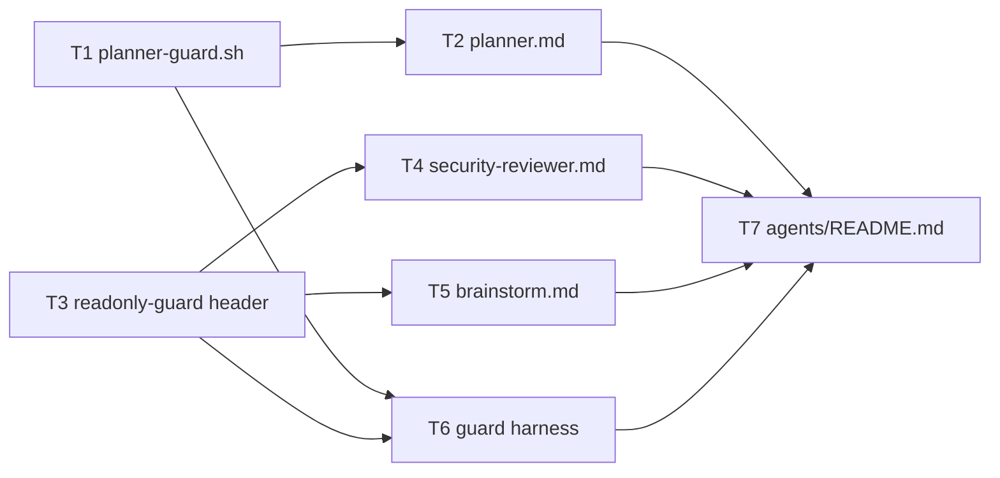
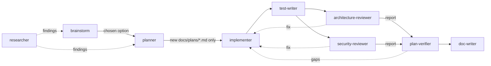

# Development Plan — Add security-reviewer + brainstorm agents; planner becomes create-only
Date: 2026-09-25 · Branch: feat/L03_Subagents · Status: draft (describes changes already present, uncommitted, in the working tree — written for `plan-verifier`)

## 1. Goal & scope

This plan responds to two points of mentor feedback on the L03 subagents work.

1. **Two roles are missing.** The pipeline has seven agents instead of nine. `mechanical-checker` doesn't count toward the nine because it does a different job: mechanical pass/fail checks, not architecture review or comparing approaches. The missing roles are:
   - `security-reviewer`, a read-only, evidence-first security review of a diff;
   - `brainstorm`, a read-only comparison of design options that runs before the planner.
2. **The planner can edit existing files.** `planner.md` lists both `Write` and `Edit`. By design the planner must not be able to change existing code or files. It may only **create** its plan file.

Gaps in the earlier plan that this plan closes (`docs/plans/2026-09-23-subagents-test-arch-verify-doc.md`):
- Its R9 (line 50) covers only "all seven agents" in `.claude/agents/README.md`.
- Its §1 "Out of scope" (line 20) excludes any change to `planner.md` and `planner-guard.sh`. This plan brings both into scope.
- Its architecture-reviewer "Out of scope" section (line 373) hands security to "the security review", but no agent performed that review. `pr-self-review` was the only security pass. `security-reviewer` now fills that slot.

**In scope** (these 7 paths are already changed in the working tree):
- new `.claude/agents/security-reviewer.md`, new `.claude/agents/brainstorm.md`;
- `.claude/agents/planner.md`, `.claude/hooks/planner-guard.sh`, `.claude/hooks/readonly-guard.sh` (header comment only), `.claude/hooks/tests/run-guard-tests.sh`, `.claude/agents/README.md`.

**Out of scope**
- Any product code, tests, package `AGENTS.md`/`Insights.md`, skills, `skills-lock.json`, or other agent files: `implementer.md`, `architecture-reviewer.md`, `plan-verifier.md`, `mechanical-checker.md`, `doc-writer.md`, `researcher.md`, `test-writer.md`.
- Behaviour changes to `readonly-guard.sh`. The new agents reuse its base mode unchanged.
- Changing the planner↔implementer Skill-sets contract or the plan template (only the planner's write permission changes).
- Wiring `security-reviewer` into `pr-self-review`. They stay separate and share the severity scale.
- Adding `security-reviewer`/`brainstorm` names to planner template §11 "Handoff to reviewers" (still generic wording; see §11).

## 2. Requirements

- **R1 — `security-reviewer` agent exists and is read-only.** `.claude/agents/security-reviewer.md` has this frontmatter:
  - `name: security-reviewer`, `model: opus`;
  - `tools: Read, Grep, Glob, Bash`;
  - `disallowedTools: Write, Edit, NotebookEdit, Agent, Skill, WebFetch, WebSearch`;
  - `skills: [security]`;
  - a `PreToolUse` hook, matcher `"Bash|Write|Edit"`, running `readonly-guard.sh security-reviewer`.

  The body contains:
  - a check catalog with IDs **SA1–SA11**, each mapped to an OWASP Top 10:2025 category from the `security` skill (A01, A03, A04, A05, A06, A09, A10);
  - a Method that requires **source → sink** evidence (no attacker-controlled source means no finding);
  - an evidence discipline section (`file:line` + snippet for both source and sink; the skill's confidence table);
  - a fixed **Security Review Report** template with 7 sections: Scope, Verdict, Findings, Checks run clean, Mitigations observed, Out of scope, Handoff summary.
- **R2 — `brainstorm` agent exists and is read-only apart from web research.** `.claude/agents/brainstorm.md` has this frontmatter:
  - `name: brainstorm`, `model: opus`;
  - `tools: Read, Grep, Glob, Bash, WebFetch, WebSearch`;
  - `disallowedTools: Write, Edit, NotebookEdit, Agent, Skill`;
  - preloaded `backend-onion-architecture` and `frontend-ui-architecture`;
  - a `PreToolUse` hook, matcher `"Bash|Write|Edit"`, running `readonly-guard.sh brainstorm`.

  Its `description` says to use it "before the planner". The body has:
  - a 6-step Workflow that produces 2–4 non-cosmetic options;
  - a fixed **Options Report** with 7 sections: Problem, What exists, Options, Comparison, Recommendation, Questions for the user, Handoff to planner;
  - Hard rules forbidding plans, code, tests and docs.
- **R3 — The planner has no Edit tool, and its prompt says it may only create a file.** In `.claude/agents/planner.md`:
  - `tools` is `Read, Grep, Glob, Bash, Write, Agent, Skill` (no `Edit`);
  - `disallowedTools` includes `Edit` and `NotebookEdit`;
  - the hook matcher is `"Write|Edit|NotebookEdit|Bash|Agent"`.

  The prompt states three things: the planner only **creates** the plan file, it gets **one `Write`**, and it picks a **new slug (e.g. `-v2`) if the path exists**. The Hard rules forbid overwriting or editing any existing file, including an earlier plan.
- **R4 — `planner-guard.sh` enforces create-only.**
  - `Edit` and `NotebookEdit` are always blocked (exit 2).
  - `Write` is allowed only when both of these hold:
    - the path is `docs/plans/*.md` with no `..`;
    - the target does **not** already exist.

  Overwriting any existing file is blocked (exit 2), and the message suggests a new slug. The existing `Agent` and `Bash` branches are unchanged.
- **R5 — The `readonly-guard.sh` header documents the new users.** The usage comment lists `security-reviewer → base mode` and `brainstorm → base mode`. The script's logic is unchanged: the diff on this file adds exactly 2 comment lines.
- **R6 — The guard harness covers the new rules and passes.** `.claude/hooks/tests/run-guard-tests.sh` defines `PL`, `SR` and `BS` guard arrays. It adds a `## planner-guard` section with 9 cases and a `## security-reviewer / brainstorm` section with 7 cases (§6 T6 lists each case). `bash .claude/hooks/tests/run-guard-tests.sh` exits 0 and prints `… passed, 0 failed`.
- **R7 — `.claude/agents/README.md` describes nine pipeline agents, plus `mechanical-checker` as a side role.**
  - **Pipeline:** `brainstorm → planner` (optional). `security-reviewer` runs in parallel with `architecture-reviewer`, and both feed `plan-verifier`. `security-reviewer` findings go back to `implementer`.
  - **Catalog, Permissions and Artifacts** each have a `brainstorm` and a `security-reviewer` row.
  - The planner's Permissions row shows `Edit` under Denied, and the create-only rule.
  - The prose covers four points:
    - `brainstorm` is optional;
    - the two reviewers may run in parallel;
    - there are four evaluators;
    - `readonly-guard.sh` is shared by six agents.
  - The `pr-self-review` section mentions `security-reviewer`.
- **R8 — No other files change.** `git status --porcelain` lists only the 7 in-scope paths plus this plan file.

## 3. Assumptions & open questions

- A1 — **Who executes this plan:** the main session or the user, not `implementer`, because `implementer-guard.sh` blocks every write under `.claude/`. The work is already done. This plan exists so that `plan-verifier` can check it.
- A2 — **`plan-verifier` can't run the harness itself.** Its `readonly-guard.sh --verify` mode doesn't allow the `bash` command. This planning session saw the same block from `planner-guard.sh` ("command not in planner read-only allowlist: bash"). So the Done-conditions `bash .claude/hooks/tests/run-guard-tests.sh` and `bash -n …` are run by the main session or the user and handed to the verifier as evidence. Without that output, the verifier marks those rows Unverifiable. Every requirement also has a grep/read-level Acceptance the verifier *can* check.
- A3 — The nine agents are: researcher, brainstorm, planner, implementer, test-writer, architecture-reviewer, security-reviewer, plan-verifier, doc-writer. `mechanical-checker` is the tenth file, with a separate utility role (per the mentor note).
- A4 — Both new agents reuse `readonly-guard.sh` base mode with no code change. Its base-mode allowlist has no `curl`, which is the right behaviour for `security-reviewer` ("never send requests").
- A5 — The OWASP 2025 category names in SA1–SA11 follow `.claude/skills/security/SKILL.md:32-41`. SSRF comes under A01 in the 2025 list.
- A6 — The planner-guard existence check uses `[[ -e "$root/$rel" ]]`, so it blocks overwriting any existing file under `docs/plans/`. It isn't an atomic create: a race between two planner sessions is theoretically possible and accepted, because execution is sequential.
- Q1 — Should `brainstorm` keep `WebFetch`/`WebSearch`? **Proposed: yes.** It uses them only for prior art and library capabilities, and must cite the URL (`brainstorm.md` step 4). · Blocking: no
- Q2 — Should `security-reviewer` be allowed to load more skills on demand? **Proposed: no.** `Skill` is disallowed, the same as `architecture-reviewer`, and `security` is preloaded. · Blocking: no

## 4. Affected modules

| Package | Layer / area | Files (existing or new) |
|---|---|---|
| repo tooling | Claude Code agents | new `.claude/agents/security-reviewer.md`, new `.claude/agents/brainstorm.md`, existing `.claude/agents/planner.md`, existing `.claude/agents/README.md` |
| repo tooling | Claude Code hooks | existing `.claude/hooks/planner-guard.sh`, existing `.claude/hooks/readonly-guard.sh` (comment only), existing `.claude/hooks/tests/run-guard-tests.sh` |
| client / server / reviewer-core / e2e | — | **no changes** |

## 5. Constraints

- C1 — Agent file shape:
  - frontmatter with `name`, `model`, `description`, `tools`, `disallowedTools`, optional `skills`, `hooks.PreToolUse[matcher → command "\"$CLAUDE_PROJECT_DIR\"/.claude/hooks/<x>.sh …"]`, `color`;
  - no `permissionMode` on read-only agents;
  - a body with a step-by-step section, a fixed report template and Hard rules.

  Source: earlier plan §5, first bullet (`docs/plans/2026-09-23-subagents-test-arch-verify-doc.md:85-86`) and `.claude/agents/architecture-reviewer.md`.
- C2 — Enforcement lives in hooks and tool lists, not `permissionMode`. `skills:` doesn't restrict the `Skill` tool, so read-only agents deny `Skill`. Source: `.claude/agents/README.md` Permissions prose ("Hooks, not `permissionMode`, carry enforcement…").
- C3 — Guards follow the existing pattern (`set -euo pipefail`, `jq` stdin, `block()` → stderr + exit 2). Source: `.claude/hooks/planner-guard.sh:9-15`.
- C4 — After any guard edit, run `bash .claude/hooks/tests/run-guard-tests.sh`. Source: `.claude/agents/README.md` ("After any guard edit, run …").
- C5 — Read-only guard quirks (no `$(…)`, use `grep -e a -e b`, no redirection) must be stated in the prompt of every agent that uses `readonly-guard.sh`. Source: `.claude/agents/README.md` Permissions prose; `readonly-guard.sh` header.
- C6 — Keep the severity scale `critical|major|minor|nit` shared with `pr-self-review` and `architecture-reviewer`. Source: `.claude/agents/README.md` "Relationship to `pr-self-review`".
- C7 — Don't assign `security` or `pr-self-review` as an implementation-task skill; security review runs separately after implementation. Source: `.claude/agents/planner.md` "Skill sets" note. (`security-reviewer` *preloads* `security` as its review rubric, which is a different use.)
- C8 — Never touch `skills-lock.json`, `CLAUDE.md` symlinks, lockfiles, `docker-compose.yml` or `.env*`. Source: root `CLAUDE.md` "Do not touch".
- C9 — `main` is the course starter state, and lesson work stays on the branch/fork. Source: root `CLAUDE.md` "Conventions".

## 6. Tasks

All tasks use Scope: tooling (Any) → Mandatory skills: `engineering-insights` (per the planner Skill-sets "Any" row; no Backend/Frontend code is touched).

### T1 — `planner-guard.sh`: create-only Write, block Edit/NotebookEdit
- Requirements: R4
- Scope: tooling (Any)
- Depends on: —
- Owned paths: `.claude/hooks/planner-guard.sh`
- Mandatory skills: `engineering-insights`
- Change:
  - Header comment: replace `Write/Edit only to docs/plans/*.md` with `Write only to create a NEW docs/plans/*.md (no overwrite); Edit/NotebookEdit always blocked`.
  - Replace the `Write|Edit)` case with two cases:
    - `Edit|NotebookEdit)` → `block "planner cannot edit existing files — it only creates a new docs/plans/*.md with Write"`.
    - `Write)` → keep the existing path check (`rel == docs/plans/*.md && rel != *..*`), then add `[[ -e "$root/$rel" ]] && block "planner may only create a new plan file, not overwrite $rel — use a new slug (e.g. -v2)"`.
  - Leave the `Agent` and `Bash` branches byte-identical.
- Why: `disallowedTools: Edit` alone only removes the tool, and the planner could still overwrite a file with `Write`. The hook is the only layer that can tell "create" from "overwrite" (C2).
- Risk: Medium.
  - (a) `set -e` with `[[ -e … ]] && block` returns non-zero when the file does not exist. That is safe only because the `&&` list is not the last command of the case branch and `set -e` ignores failures on the left of `&&`. The harness case "pl allow create new plan" proves the allow path exits 0.
  - (b) The block could break the planner's normal flow when a same-day slug collides. Mitigation: the message names the fix (`-v2`), and `planner.md` step 6 tells the planner to pick a new slug.
  - (c) Path traversal. Mitigation: the `..` check stays in place, and the harness case "pl block .. traversal" covers it.
- Acceptance (R4):
  - `grep -n -e "Edit|NotebookEdit)" -e "not overwrite" .claude/hooks/planner-guard.sh` returns both lines.
  - The harness planner-guard cases in T6 pass: allow new plan; block overwrite; block Edit plan; block Edit product code; block Write product code; block non-md; block `..`; allow `git log`; block `rm`.
  - `git diff .claude/hooks/planner-guard.sh` shows no changes to the `Agent)`/`Bash)` branches.
- Done-condition: `bash -n .claude/hooks/planner-guard.sh && test -x .claude/hooks/planner-guard.sh && bash .claude/hooks/tests/run-guard-tests.sh` (0 failed).

### T2 — `planner.md`: remove Edit, create-only prompt
- Requirements: R3
- Scope: tooling (Any)
- Depends on: T1
- Owned paths: `.claude/agents/planner.md`
- Mandatory skills: `engineering-insights`
- Change:
  - Frontmatter:
    - `tools: Read, Grep, Glob, Bash, Write, Agent, Skill`;
    - `disallowedTools: Edit, NotebookEdit, WebFetch, WebSearch`;
    - hook matcher `"Write|Edit|NotebookEdit|Bash|Agent"` (defense-in-depth: the guard still sees an Edit if a runtime ever surfaced one).
  - Intro paragraph: "Your only write is **creating** the plan file in `docs/plans/`: you have `Write` but not `Edit`, and a hook … blocks overwriting any existing file (including an earlier plan) …".
  - Workflow step 6: "Write the plan to a new file … You get one `Write`: compose the whole plan and run the red-flags check *before* writing. If the path already exists, pick a new slug (e.g. `-v2`) — never overwrite."
  - Hard rules first bullet: "Only create new `docs/plans/*.md` files. Never overwrite or edit an existing file — not even an earlier plan; changes to an approved plan go back to the user as a new plan version. …"
  - The Skill-sets table, plan template and Return format stay unchanged.
- Why: this is the mentor's point 2. The planner is a read-only design phase, and an agent that can edit could "fix" code or rewrite an approved plan without anyone noticing. Because the planner gets one Write, the red-flags check has to run before the Write, since the planner can't patch the plan afterwards.
- Risk: Low. The planner loses the ability to fix a typo in its own plan. · Mitigation: the prompt already requires composing the plan fully before the single Write. Corrections go out as a new versioned plan.
- Acceptance (R3):
  - `grep -n -e "^tools:" -e "^disallowedTools:" -e "matcher:" .claude/agents/planner.md` shows the three lines above exactly.
  - `tools:` contains no `Edit`.
  - `grep -n -e "creating" -e "one \`Write\`" -e "new slug" -e "Only create new" .claude/agents/planner.md` returns hits in the intro, step 6 and Hard rules.
  - `git diff .claude/agents/planner.md` touches only those 4 regions (frontmatter, intro, step 6, Hard rules first bullet).
- Done-condition: the greps in Acceptance; `bash .claude/hooks/tests/run-guard-tests.sh` (0 failed). Live evidence: this plan file was itself created through the new guard. A second `Write` to the same path would be blocked.

### T3 — `readonly-guard.sh`: header lists the new agents
- Requirements: R5
- Scope: tooling (Any)
- Depends on: —
- Owned paths: `.claude/hooks/readonly-guard.sh`
- Mandatory skills: `engineering-insights`
- Change: in the `Usage:` comment block, add `#   security-reviewer      → base mode` and `#   brainstorm             → base mode` after the `architecture-reviewer` line. Don't change any code.
- Why: the script is shared, and its header is the only index of which agent uses it in which mode. Without it, a future edit could tighten base mode for one agent and silently break the others.
- Risk: Low. An accidental logic change. · Mitigation: Acceptance requires a comment-only diff.
- Acceptance (R5): `git diff --stat .claude/hooks/readonly-guard.sh` reports `2 +` and no `-` lines. `grep -n -e "security-reviewer      → base mode" -e "brainstorm             → base mode" .claude/hooks/readonly-guard.sh` returns 2 lines.
- Done-condition: `bash -n .claude/hooks/readonly-guard.sh && bash .claude/hooks/tests/run-guard-tests.sh` (0 failed).

### T4 — New `security-reviewer` agent
- Requirements: R1
- Scope: tooling (Any). The prompt content covers backend and frontend security.
- Depends on: T3
- Owned paths: `.claude/agents/security-reviewer.md`
- Mandatory skills: `engineering-insights`. The agent itself preloads `security`. I loaded `security` for this plan only to check the OWASP mapping, not as an implementation skill (C7).
- Change: create the file with:
  - **Frontmatter:**
    - `name: security-reviewer`, `model: opus`;
    - a description with proactive triggers: after implementer/test-writer, "in parallel with architecture-reviewer", before `pr-self-review`/PR, and whenever a change touches a route, auth/workspace scoping, input parsing, SQL, secrets, outbound fetches, LLM prompts or rendered HTML;
    - `tools: Read, Grep, Glob, Bash`;
    - `disallowedTools: Write, Edit, NotebookEdit, Agent, Skill, WebFetch, WebSearch`;
    - `skills: [security]`;
    - hook matcher `"Bash|Write|Edit"` → `"\"$CLAUDE_PROJECT_DIR\"/.claude/hooks/readonly-guard.sh security-reviewer"`;
    - `color: red`.
  - **Body sections:**
    1. Role. It never modifies files, and the implementer applies the fixes.
    2. Guard quirks (C5).
    3. **Review set.** Default: `git status --porcelain` → `git merge-base HEAD main` → `git diff <sha>` (+`--stat`), then the callers and callees of each changed route, service and hook.
    4. **Rule sources:**
       - the `security` skill (+ `checklists.md`, `examples.md`);
       - root `CLAUDE.md` and package `AGENTS.md`/`Insights.md`;
       - `server/src/modules/_shared/context.ts` (`getContext` → `workspaceId`);
       - `server/src/platform/errors.ts`, `redact.ts`, `container.ts`;
       - `reviewer-core/src/prompt.ts` and `server/src/platform/prompt.ts` (`wrapUntrusted`, `INJECTION_GUARD`).
    5. **Method:** source → sink. No confirmed attacker-controlled source means no finding.
    6. **Check catalog:**

       | ID | Check | OWASP 2025 | Default |
       |---|---|---|---|
       | SA1 | IDOR / missing `workspaceId` scoping | A01 | critical |
       | SA2 | Route input not Zod-validated | A05 | major |
       | SA3 | SQL built from input (`sql.raw`, concatenation, dynamic identifiers) | A05 | critical |
       | SA4 | Secrets hard-coded / logged / returned / read outside config / `.env*` committed | A04 / A09 | critical |
       | SA5 | SSRF: outbound fetch to an input-derived URL | A01 | major |
       | SA6 | Prompt injection: untrusted PR text without `wrapUntrusted` + `INJECTION_GUARD`, or unvalidated/trusted LLM output | A05 | major |
       | SA7 | XSS: `dangerouslySetInnerHTML`, raw-HTML markdown, unchecked `href`/`src` schemes | A05 | major |
       | SA8 | Error leaks | A10 | minor |
       | SA9 | GitHub side effect without explicit user action / own credentials | A01 | major |
       | SA10 | New dependency (supply chain) | A03 | minor |
       | SA11 | Unbounded work from input | A06 | minor |

       Plus the rationale sentence for SA1–SA4 defaults (multi-workspace tenancy).
    7. **Evidence discipline:**
       - re-Read before reporting;
       - `file:line` + snippet for both source and sink;
       - the skill's confidence table (HIGH → Findings, MEDIUM → Needs manual verification, LOW → drop);
       - don't flag tests, dead code, server-controlled values or framework-mitigated patterns;
       - the existing `layout.tsx` theme `<script dangerouslySetInnerHTML>` is a constant and not a finding.
    8. **Security Review Report** (exactly 7 sections): Scope · Verdict (`pass | pass-with-findings | blocking`) · Findings (`ID · Severity · Check · OWASP · Source → Sink · Exploit scenario · Suggested fix · Confidence`, plus a Needs-manual-verification list) · Checks run clean · Mitigations observed · Out of scope · Handoff summary.
    9. **Hard rules:** read-only; never run the app, send requests or try exploits; never echo a secret's value.
- Why: this is the mentor's point 1. `pr-self-review` runs `security` as one rubric among many. A dedicated fresh-context reviewer with a fixed, stack-grounded catalog and mandatory source → sink evidence stops generic OWASP advice. Tying the catalog to this repo's real defences (`getContext`, `wrapUntrusted`) keeps false positives down.
- Risk: Medium.
  - (a) Paths cited in the prompt may drift from the code. Mitigation: all six files exist today (checked during planning: `ls` on each path; `grep` finds `wrapUntrusted`/`INJECTION_GUARD` in `server/src/platform/prompt.ts` and `reviewer-core/src/prompt.ts`), and Acceptance re-checks them.
  - (b) A wrong OWASP mapping. Mitigation: every category ID in the table matches `.claude/skills/security/SKILL.md:32-41`.
  - (c) Overlap with `architecture-reviewer` (e.g. Zod validation is also AB8). Mitigation: the Out-of-scope section redirects layering findings, and SA2 is judged only as an injection risk.
- Acceptance (R1):
  - The frontmatter lines match the Change list (`grep -n -e "^name:" -e "^model:" -e "^tools:" -e "^disallowedTools:" -e "security$" -e "readonly-guard.sh security-reviewer" .claude/agents/security-reviewer.md`).
  - `grep -c "^| SA[0-9]" .claude/agents/security-reviewer.md` = 11, and each row names an `A0x`/`A10` category.
  - The report has 7 numbered sections under `## Security Review Report`.
  - The six rule-source paths exist (`ls`).
  - The harness `sr` cases in T6 pass.
- Done-condition: the greps/`ls` in Acceptance; `bash .claude/hooks/tests/run-guard-tests.sh` (0 failed). Optional manual smoke: delegate `security-reviewer` on the current diff. It should return all 7 sections, and `git status --porcelain` should be unchanged afterwards.

### T5 — New `brainstorm` agent
- Requirements: R2
- Scope: tooling (Any)
- Depends on: T3
- Owned paths: `.claude/agents/brainstorm.md`
- Mandatory skills: `engineering-insights`. The agent preloads `backend-onion-architecture` and `frontend-ui-architecture`, and both are preloaded in this planning session too.
- Change: create the file with:
  - **Frontmatter:**
    - `name: brainstorm`, `model: opus`;
    - a description: "Use proactively before the planner when a feature, fix or refactor has more than one reasonable approach …". It lists the trigger phrases and the Options Report contents, and ends with "Does not write plans, code or docs.";
    - `tools: Read, Grep, Glob, Bash, WebFetch, WebSearch`;
    - `disallowedTools: Write, Edit, NotebookEdit, Agent, Skill`;
    - `skills: [backend-onion-architecture, frontend-ui-architecture]`;
    - hook matcher `"Bash|Write|Edit"` → `readonly-guard.sh brainstorm`;
    - `color: yellow`.
  - **Body sections:**
    1. Role: widen the solution space; the planner turns the chosen option into a plan.
    2. Guard quirks (C5).
    3. **Workflow:** 1 Frame the problem (return numbered questions if it's ambiguous) · 2 Load repo rules · 3 Look at what exists (`file:line`) · 4 Generate 2–4 options that differ in a real design dimension, including the simplest one; web only for prior art, and cite the URL · 5 Evaluate on fixed criteria (correctness/UX, repo-rule fit, change surface, testability, performance/cost incl. LLM tokens, risk/reversibility, effort S/M/L) · 6 Recommend, with "choose X instead if …".
    4. **Options Report** (exactly 7 sections): Problem · What exists · Options (`Name · Sketch · Files · Pros · Cons · Risks · Effort · Repo-rule fit`) · Comparison · Recommendation · Questions for the user · Handoff to planner.
    5. **Hard rules:** read-only; grounded in files read; no strawmen; no task lists; confidentiality.
- Why: this is the mentor's point 1. Without it the planner commits to the first plausible design. Comparing options in its own context, before planning, keeps the planner's context and its one Write focused on a design that has already been chosen.
- Risk: Low–Medium.
  - (a) Scope creep into planning. Mitigation: the "no implementation task lists" hard rule, and a Handoff section limited to 3–6 bullets.
  - (b) Web research leaking repo details into search queries. Mitigation: the confidentiality hard rule, and web use limited to prior art and library capabilities.
- Acceptance (R2):
  - The frontmatter matches the Change list (`grep -n -e "^tools:" -e "^disallowedTools:" -e "readonly-guard.sh brainstorm" -e "before the planner" .claude/agents/brainstorm.md`).
  - `## Workflow` has 6 numbered steps.
  - `## Options Report` has 7 numbered sections.
  - The harness `bs` cases in T6 pass.
- Done-condition: the greps in Acceptance; `bash .claude/hooks/tests/run-guard-tests.sh` (0 failed).

### T6 — Guard harness: planner-guard + new read-only agents
- Requirements: R6 (verifies R1, R2, R4)
- Scope: tooling (Any)
- Depends on: T1, T3
- Owned paths: `.claude/hooks/tests/run-guard-tests.sh`
- Mandatory skills: `engineering-insights`
- Change:
  - After `DW=(…)`, add:
    - `PL=("$H/planner-guard.sh")`
    - `SR=("$H/readonly-guard.sh" security-reviewer)`
    - `BS=("$H/readonly-guard.sh" brainstorm)`
  - Before the summary, add `## planner-guard`. It sets `existing_plan="$(ls "$R"/docs/plans/*.md | head -1)"`, then runs:
    - `0` "pl allow create new plan": Write `$R/docs/plans/2099-01-01-guard-test-new.md`
    - `2` "pl block overwrite plan": Write `$existing_plan`
    - `2` "pl block Edit plan": Edit `$existing_plan`
    - `2` "pl block Edit product code": Edit `$R/server/src/app.ts`
    - `2` "pl block Write product code": Write `$R/server/src/new.ts`
    - `2` "pl block Write non-md plan": Write `$R/docs/plans/x.txt`
    - `2` "pl block .. traversal": Write `$R/docs/plans/../../server/src/app.ts`
    - `0` "pl allow read-only git": Bash `git log --oneline -5`
    - `2` "pl block rm": Bash `rm docs/plans/x.md`
  - Then add `## security-reviewer / brainstorm (readonly-guard base)`:
    - `0` "sr allow grep -e": `grep -rn -e sql.raw -e dangerouslySetInnerHTML server/src client/src`
    - `2` "sr block Write" · `2` "sr block Edit": `$R/server/src/app.ts`
    - `2` "sr block curl": `curl http://localhost:3001/pulls`
    - `0` "bs allow git log": `git log --oneline -5`
    - `2` "bs block Write plan": Write `$R/docs/plans/2099-01-01-x.md`
    - `2` "bs block Edit": Edit `$R/client/src/app/layout.tsx`
  - Reuse the existing helpers `bash_json`, `write_json`, `edit_json`, `expect`. No new helpers.
- Why: hooks are the only enforcement layer (C2), and C4 requires the harness after every guard edit. The overwrite case uses a plan that really exists, so it exercises the new `-e` check against the real repo, not a mock.
- Risk: Medium.
  - (a) "pl block overwrite plan" depends on at least one file existing in `docs/plans/`. If the folder were empty, `ls` would fail and the case would test an empty path. Mitigation: four plans exist today, and this plan adds a fifth.
  - (b) "pl allow create new plan" would flip to a block if someone ever created `docs/plans/2099-01-01-guard-test-new.md`. Mitigation: the far-future date makes a collision practically impossible. The harness never writes files (guards only read JSON).
  - (c) The "bs block Write plan" case and the planner "allow" case use different 2099 filenames, so they're independent.
- Acceptance (R6):
  - `grep -c '"pl ' .claude/hooks/tests/run-guard-tests.sh` = 9.
  - `grep -c -e '"sr ' -e '"bs ' .claude/hooks/tests/run-guard-tests.sh` = 7.
  - Running the harness prints no `FAIL` line, and its last line is `<N> passed, 0 failed` with exit 0.
- Done-condition: `bash -n .claude/hooks/tests/run-guard-tests.sh && bash .claude/hooks/tests/run-guard-tests.sh` → `… passed, 0 failed`, exit 0.

### T7 — `.claude/agents/README.md`: nine-agent pipeline
- Requirements: R7
- Scope: tooling (Any)
- Depends on: T2, T4, T5, T6
- Owned paths: `.claude/agents/README.md`
- Mandatory skills: `engineering-insights`, `mermaid-diagram`
- Change:
  - **Pipeline `flowchart LR`:**
    - `R -.->|findings| B[brainstorm]`
    - `B -->|Options Report + recommendation| P`
    - `R -.->|findings| P` (researcher can still feed the planner directly)
    - `TW --> SR[security-reviewer]`
    - `SR -->|Security Review Report| PV`
    - `SR -.->|findings to fix| I`
  - **Prose under the diagram:**
    - `architecture-reviewer` and `security-reviewer` are both read-only and may run in parallel;
    - `brainstorm` is optional;
    - there are "four evaluators (test-writer, architecture-reviewer, security-reviewer, plan-verifier)".
  - **Catalog:** add a `brainstorm` row (opus) after researcher, and a `security-reviewer` row (opus; SA1–SA11, source → sink) after architecture-reviewer.
  - **Permissions:**
    - add a `brainstorm` row (`readonly-guard.sh brainstorm`, base mode);
    - add a `security-reviewer` row (`readonly-guard.sh security-reviewer`, base mode, "no `curl`, so no live probing");
    - change the planner row's Tools to drop `Edit` and add `Edit` to Denied;
    - the planner row's hook column describes `Write` only to create a new `docs/plans/*.md`, with `Edit`/`NotebookEdit` blocked.
  - **Permissions prose:**
    - "the reviewers and `brainstorm` deny `Skill` outright";
    - "`readonly-guard.sh` is shared by six agents".
  - **Artifacts:**
    - add a `brainstorm` row (Options Report in chat) and a `security-reviewer` row (Security Review Report);
    - the planner Input mentions "optionally the chosen option from `brainstorm`".
  - **Relationship to `pr-self-review`:** name `security-reviewer` as the deeper source → sink check. "All three" share the severity scale.
- Why: the README is the single map of the pipeline. The earlier plan's R9 fixed it at seven agents, and this task brings it to nine plus `mechanical-checker`.
- Risk: Low.
  - (a) Stale wording elsewhere in the README. Known leftover: the Sources table row "`disallowedTools: Skill` on both reviewers" wasn't updated (see §11).
  - (b) A Mermaid syntax error. Mitigation: only `flowchart LR` edges in the existing style, and every node ID used is defined.
- Acceptance (R7):
  - `grep -c -e "brainstorm" -e "security-reviewer" .claude/agents/README.md` ≥ 10.
  - The Catalog table has 10 agent rows (9 pipeline + `mechanical-checker`): `grep -c "^| \[" .claude/agents/README.md` counts the linked Catalog rows.
  - The planner Permissions row has `Edit` in the Denied column, not in Tools.
  - `grep -n "shared by six agents"` returns 1 hit, and so does `grep -n "four evaluators"`.
  - The Mermaid block contains the edges `B -->|Options Report + recommendation| P[planner]`, `TW -->|tests + Test Report| SR[security-reviewer]`, `SR -->|Security Review Report| PV` and `SR -.->|findings to fix| I`.
- Done-condition: the greps in Acceptance; `bash .claude/hooks/tests/run-guard-tests.sh` (0 failed, unchanged by this doc edit).

## 7. Testing strategy

- **Existing suites that cover the change:** `.claude/hooks/tests/run-guard-tests.sh` is the only suite for agent/hook tooling. Its existing sections (readonly-guard base and `--verify`, test-writer-guard, doc-writer-guard) must stay green. That proves the `readonly-guard.sh` comment-only edit and the new agents' reuse of base mode didn't regress anything. Package suites (`server`, `client`, `reviewer-core`, `e2e`) aren't affected because no package file changes. Per `TESTING.md`, their path-filtered workflows don't fire.
- **New or changed tests:** T6 owns the 16 new cases in `.claude/hooks/tests/run-guard-tests.sh` (9 planner-guard, 4 security-reviewer, 3 brainstorm).
- **Gaps (for reviewers):**
  - **G1:** the harness tests the guard scripts, not the runtime's enforcement of `tools`/`disallowedTools`. Nothing automated proves that `planner` has no `Edit` tool at runtime. Evidence is the frontmatter (T2 Acceptance), plus the `/agents` listing, which shows `planner … (Tools: Read, Grep, Glob, Bash, Write, Agent, Skill)`.
  - **G2:** the prompt quality of `security-reviewer` and `brainstorm` (report completeness, the evidence discipline) is only verifiable by a manual smoke delegation. Mark it Unverifiable unless a smoke run is provided.
  - **G3:** `plan-verifier` can't run `bash` (A2). The harness output must be supplied by the main session or the user.

## 8. Diagrams

Task graph:

Resulting agent pipeline (mirrors T7):

## 9. Traceability

| Requirement | Tasks |
|---|---|
| R1 security-reviewer agent | T4 (verified by T6) |
| R2 brainstorm agent | T5 (verified by T6) |
| R3 planner has no Edit, create-only prompt | T2 |
| R4 planner-guard create-only | T1 (verified by T6) |
| R5 readonly-guard header | T3 |
| R6 harness green | T6 |
| R7 README nine agents | T7 |
| R8 no other files changed | T1–T7 (Owned paths), checked by `git status --porcelain` |

R8 Acceptance: `git status --porcelain` lists exactly these paths:
- ` M .claude/agents/README.md`
- ` M .claude/agents/planner.md`
- ` M .claude/hooks/planner-guard.sh`
- ` M .claude/hooks/readonly-guard.sh`
- ` M .claude/hooks/tests/run-guard-tests.sh`
- `?? .claude/agents/brainstorm.md`
- `?? .claude/agents/security-reviewer.md`
- `?? docs/plans/2026-09-25-security-reviewer-brainstorm-planner-write-only.md`

## 10. Red-flags check

- [x] Every requirement maps to ≥1 task; every task maps to ≥1 requirement
- [x] Depends-on forms a DAG (T1→T2, T1/T3→T6, T3→T4/T5, T2/T4/T5/T6→T7); order is executable top-to-bottom
- [x] Owned paths of different tasks don't overlap (one file per task)
- [x] No owned path hits a "Do not touch" file
- [x] Schema and API-contract decisions — n/a (no schema/API change)
- [x] Migrations — none
- [x] Every task has a Why and a Risk; Medium risks (T1, T4, T6) name concrete edge cases and mitigations
- [x] Testing strategy names the covering suite (guard harness) and the gaps G1–G3
- [x] Every Done-condition is an existing command. `bash .claude/hooks/tests/run-guard-tests.sh` comes from `.claude/agents/README.md` and the earlier plan's T4; the rest are `bash -n`/`test -x`/`grep`/`git` read-only checks.
- [x] No task contradicts a mandatory skill or Insights.md entry. `security` is preloaded as a reviewer rubric, not assigned to an implementation task (C7).
- [x] No blocking open question remains

## 11. Handoff to reviewers

- **`plan-verifier`:**
  - It needs the harness output from the main session (A2).
  - It should verify R8 against `git status --porcelain`.
  - It should confirm that the `readonly-guard.sh` diff is comment-only (R5).
- **Known leftovers, outside the Acceptance above** (flag them, but don't count them as Missing unless the user extends scope):
  - The `.claude/agents/README.md` Sources table still says "`disallowedTools: Skill` on both reviewers". It should now read "on the reviewers and `brainstorm`".
  - The `readonly-guard.sh` header doesn't list `mechanical-checker → --verify`, even though README says six agents share it. This omission predates this plan.
  - Planner template §11 doesn't yet name `security-reviewer` as a reviewer.
- **Architecture/security review:**
  - Check the `[[ -e … ]] && block` line under `set -euo pipefail` in `planner-guard.sh`, and confirm the allow path exits 0 (the harness case covers it).
  - Check that `security-reviewer`'s base-mode Bash allowlist really excludes network tools (`curl`, `wget`, `nc`).
- **Candidate Insights entry** (not written by the planner; no package `Insights.md` owns `.claude/` tooling, so record it where the user prefers): "[Decision] Planner is create-only: `disallowedTools: Edit` + `planner-guard.sh` `[[ -e ]]` check. A plan is revised by writing `-v2`, never by editing, so the approved plan the implementer runs against can't change under it."

## 12. Risks & rollback

- **Cross-task risk:** the planner can no longer revise a plan in place. Any workflow that relied on the planner editing its own plan (e.g. applying plan-verifier "unmeasurable criteria" feedback) now produces a new versioned plan file. That is intentional, but it increases the number of files in `docs/plans/`.
- **Rollback:** everything is uncommitted tooling config, and no package or DB state is involved. To revert:
  - `git restore .claude/agents/README.md .claude/agents/planner.md .claude/hooks/planner-guard.sh .claude/hooks/readonly-guard.sh .claude/hooks/tests/run-guard-tests.sh`;
  - delete `.claude/agents/brainstorm.md` and `.claude/agents/security-reviewer.md`;
  - reload `/agents`.

  The user runs this; no agent does.
