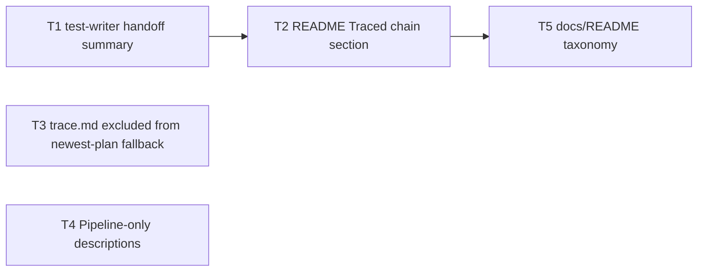
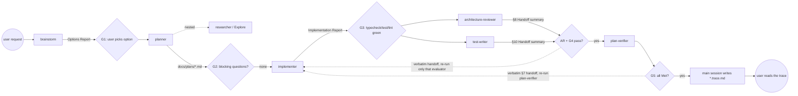

# Development Plan — Traced chain (second agent chain with a per-run cost/context trace)
Date: 2026-09-27 · Branch: feat/L04_mcp-server (see A1) · Status: draft

## 1. Goal & scope

Add a second, named agent chain — **Traced chain** — to `.claude/agents/README.md`, next to the existing Pipeline (which stays byte-identical):

`brainstorm → planner → implementer → (architecture-reviewer ∥ test-writer) → plan-verifier → user reads the trace`

The main session orchestrates it with plain `Agent` calls (sequential, except the parallel pair sent as two `Agent` calls in one message). After the run, the main session writes a **run trace** `docs/plans/<YYYY-MM-DD>-<slug>.trace.md` next to the feature's plan. The trace records every Agent call (including nested ones) with model, context id, input/output artifacts, tokens, duration and cost computed from the subagent JSONL transcripts.

Also in scope: the smallest set of agent-file and `docs/README.md` edits needed so the new chain doesn't collide with existing behavior (§6 T1, T3–T5).

Out of scope:
- Any product code (`server/`, `client/`, `reviewer-core/`, `e2e/`, `mcp-server/`).
- Any hook/guard change (`.claude/hooks/*`). No guard gets loosened.
- Changing the existing Pipeline section, the Workflow tool, `security-reviewer` / `doc-writer` behavior beyond one description sentence each.
- A cost-computation script checked into the repo. The recipe lives in the README as a `jq` command (A5).

**Executor for every task: the MAIN SESSION, not `implementer`.** `implementer-guard.sh` blocks every edit under `.claude/` and `docs/plans/` (`.claude/hooks/implementer-guard.sh:31`), and T5's `docs/README.md` edit is kept with the rest for one reviewable change.

## 2. Requirements

- R1 — `.claude/agents/README.md` has a new `## Traced chain` section placed directly after the Pipeline section's closing paragraph and before `## Catalog`. `git diff` of the README shows zero removed or changed lines inside the Pipeline section (lines 5–29 today).
- R2 — The section contains a Mermaid `flowchart` of the chain in which `architecture-reviewer` and `test-writer` are drawn as a parallel pair, and text stating: (a) the main session calls each agent via the `Agent` tool; (b) the pair is two `Agent` calls in one message; (c) no Workflow tool / dynamic workflow; (d) `security-reviewer` and `doc-writer` are not part of this chain; (e) nobody commits during the run — the user commits.
- R3 — The section lists five gates with their pass evidence: (G1) after brainstorm — the user picks the option; (G2) after planner — blocking open questions go to the user, the run pauses; (G3) after implementer — typecheck/test/lint green with command + output tail in the Implementation Report; (G4) test-writer — status `done` with both runs green; (G5) plan-verifier — every matrix row Met (Unverifiable rows are listed to the user, not looped on). It also states the fix loop: relay the producing evaluator's Handoff summary **verbatim** to a new implementer call, then re-run **only** that evaluator; at most 2 fix iterations per evaluator before escalating to the user.
- R4 — The section states the pre-run rule (working tree clean — `git status --porcelain` empty — the user commits unrelated work themselves) and the diff-range rule (main session records `git rev-parse HEAD` as the base sha before brainstorm; every reviewer/verifier prompt includes the base sha and the explicit file list from the Implementation Report §2 Tasks table).
- R5 — The section specifies the trace file: path `docs/plans/<YYYY-MM-DD>-<slug>.trace.md` (same date+slug as the plan), writer (main session, after the last gate), per-call fields (order, parent, agent, model from frontmatter + transcript, agent id, input artifacts, output artifacts, gate result, tokens split into input / output / cache read / cache write 5m / cache write 1h, duration, cost), the cost method (JSONL usage × prices fetched from official Anthropic pricing docs at run time, never from memory; cross-check with `/cost`), and a trace template (the one in §6 T2).
- R6 — Every evaluator in the chain ends its report with a Handoff summary the main session can quote verbatim: `architecture-reviewer` §8 and `plan-verifier` §7 already do; `test-writer` gets a new §10.
- R7 — The "newest plan" fallbacks in `implementer.md` and `plan-verifier.md` exclude `*.trace.md`, so a trace written after a run can never be picked up as "the newest plan".
- R8 — The two agents whose `description` proactively triggers at a point inside the Traced chain (`doc-writer`: "after plan-verifier reports a plan as verified"; `security-reviewer`: "in parallel with architecture-reviewer") each state in one added sentence that they belong to the Pipeline and are not part of the Traced chain. No other agent description changes.
- R9 — `docs/README.md` taxonomy row "Plans and specs in flight" and the `plans/` index bullet mention `*.trace.md` run traces and their owner (main session).

## 3. Assumptions & open questions

- A1 — The current working tree on `feat/L04_mcp-server` holds unrelated, uncommitted blast-radius work. This plan's Owned paths don't overlap it, but the user should commit or stash that work (or branch) before executing, so the docs change lands as its own commit. The R4 "clean tree" rule applies to future Traced-chain runs, not to executing this docs plan.
- A2 — Chain name: **Traced chain**. The README anchor is `#traced-chain`.
- A3 — Fix-loop implementer calls are **new** `Agent` calls (fresh context, own agent id, own trace row), not `SendMessage` continuations — each call is then one trace row with its own transcript file. The prompt carries: plan path, base sha, and the verbatim Handoff summary lines.
- A4 — Fix-loop cap: 2 iterations per evaluator, then the main session stops and asks the user. After any implementer fix, the implementer's own Done-condition re-runs the whole package suite, which includes the test-writer's new tests; that is why re-running only the producing evaluator is safe.
- A5 — Cost is computed with a `jq` one-liner the main session runs by hand (documented in the README). No script file is added (this is a docs/process change).
- A6 — Transcript location, verified on this machine: `<config dir>/projects/<cwd with / → ->/<main session id>/subagents/agent-<agentId>.jsonl` plus `agent-<agentId>.meta.json` (`agentType`, `toolUseId`, `spawnDepth`). The config dir here is `~/.claude-private` (a `CLAUDE_CONFIG_DIR`-style override), not `~/.claude`. The README must say "the Claude Code config dir (`~/.claude` by default)", not hard-code either path.
- A7 — In the JSONL, one assistant message spans several lines with the same `message.id` and repeated `usage`. Summing must de-duplicate by `message.id` (take the last line per id). Seen on a real transcript: 6 lines share one id with identical usage. `usage.cache_creation` splits writes into `ephemeral_5m_input_tokens` / `ephemeral_1h_input_tokens`, which are priced differently.
- A8 — The model cross-check has two transcript sources: `message.model` in the subagent JSONL (e.g. `claude-opus-5-5`) and `toolUseResult.resolvedModel` of the `Agent` call in the main-session JSONL (e.g. `claude-opus-5-5[1m]`). Built-in agents (`Explore`) have no project frontmatter → record "built-in".
- A9 — Duration: taken from the task-completion notification if it reports one. Otherwise last − first `timestamp` in the subagent JSONL (label it as such).
- Q1 — Should `test-writer` get a new Handoff summary section (T1), or should the fix loop relay its existing §7 "Suspected product bugs" verbatim instead? The plan picks T1, because the user's gate says "relay the evaluators' Handoff summary sections verbatim" and test-writer is the only chain evaluator without one. · Blocking: no (to skip T1, drop it and change T2's fix-loop line to "test-writer §7 Suspected product bugs").
- Q2 — Should the Traced-chain trace (tokens, costs, agent ids) be committed with the feature, or stay local? The plan assumes committed (it lives in `docs/plans/`, next to the plan). · Blocking: no.

## 4. Affected modules

| Package | Layer / area | Files (existing or new) |
|---|---|---|
| repo root (agent config) | Subagent docs | `.claude/agents/README.md` (existing) |
| repo root (agent config) | Agent prompts | `.claude/agents/test-writer.md`, `.claude/agents/implementer.md`, `.claude/agents/plan-verifier.md`, `.claude/agents/doc-writer.md`, `.claude/agents/security-reviewer.md` (existing) |
| repo root (docs) | Docs taxonomy | `docs/README.md` (existing) |

No `server/`, `client/`, `reviewer-core/`, `e2e/` or `mcp-server/` file changes, so no package `AGENTS.md`/`Insights.md` rules apply beyond root `CLAUDE.md`.

## 5. Constraints

- The existing Pipeline section stays as is — source: user request.
- Don't loosen any guard; `.claude/` edits are made by the main session because `implementer-guard.sh` blocks `.claude/*` and `docs/plans/*` — source: `.claude/hooks/implementer-guard.sh:31`, `.claude/agents/README.md` Permissions table.
- `.claude/agents/README.md` is "a map — the agent files are the source of truth for behavior". The Traced chain is orchestrated by the main session, which has no agent file, so the README section *is* its source of truth; keep it tight and link to agent files for report formats — source: `.claude/agents/README.md:3`.
- Don't add new `*.md` files under `.claude/agents/`: every `*.md` there is treated as an agent definition — source: `.claude/agents/README.md:3` ("Each `*.md` here is one agent").
- Changing the plan template or skill sets → edit `planner.md` and `implementer.md` together. This plan does **not** touch either shared contract; T3's edit to `implementer.md` is limited to the plan-loading fallback sentence — source: `.claude/agents/README.md:137`.
- After any guard edit, run the guard tests. No guard is edited here; the run in §7 is a regression smoke only — source: `.claude/agents/README.md:136`.
- Mermaid: plain `flowchart`, no C4 extension — source: `docs/README.md` "Diagrams".
- `docs/README.md` rule: link instead of duplicating; relative links — source: `docs/README.md` "Rules".
- Do not touch: `skills-lock.json`, `CLAUDE.md` symlinks, `docker-compose.yml`, `.env*` — source: root `CLAUDE.md` "Do not touch".
- Never quote prices from memory; fetch the official pricing page at run time — source: user request.
- Confidentiality: the trace records artifact references and relayed Handoff lines, never secrets, `.env` values or full prompts containing client data — source: planner/agents hard rules, `docs/README.md` Rules.

## 6. Tasks

### T1 — Add a Handoff summary to test-writer's Test Report
- Requirements: R6
- Scope: Docs/process (agent prompt) · **Executor: main session**
- Depends on: —
- Owned paths: `.claude/agents/test-writer.md`
- Mandatory skills: `engineering-insights` (Any)
- Change: in `## Test Report`, after item 9 **Insights**, append item
  `10. **Handoff summary** — only when Status is red-product-bug or partial: one line per failing test caused by product code: `<test file>:<line> · <test name> · <expected vs actual, ≤15 words>`. Empty otherwise. This section exists so a caller relaying bugs to the implementer can quote it verbatim instead of re-narrating §2/§7 — keep it terse, no prose, no output tails.`
  Wording mirrors `architecture-reviewer.md:114` and `plan-verifier.md:69`. Don't change items 1–9, the frontmatter, or the description.
- Why: the Traced chain's fix loop relays each evaluator's Handoff summary verbatim; test-writer is the only evaluator in the chain without one.
- Risk: Low — the report is "End with exactly", so a new item changes every future Test Report. · Mitigation: purely additive last item, empty when there's nothing to relay.
- Acceptance: R6 — `grep -n 'Handoff summary' .claude/agents/test-writer.md` returns exactly one line inside `## Test Report`; `git diff .claude/agents/test-writer.md` shows only added lines.
- Done-condition: `grep -n -e '10. \*\*Handoff summary' .claude/agents/test-writer.md` · `git diff --stat -- .claude/agents/test-writer.md`

### T2 — Add the "Traced chain" section to the agents README
- Requirements: R1, R2, R3, R4, R5, R6
- Scope: Docs/process · **Executor: main session**
- Depends on: T1 (the section and the Artifacts row reference test-writer's new §10)
- Owned paths: `.claude/agents/README.md`
- Mandatory skills: `engineering-insights` (Any), `mermaid-diagram` (diagram in the section)
- Change:
  1. Insert `## Traced chain` between the Pipeline paragraph (ends "…The user commits — no agent does.") and `## Catalog`. Don't modify any existing line of the Pipeline section.
  2. Section content, in this order:
     - One-sentence purpose: a fixed, narrower chain for features whose design is being chosen via brainstorm, which produces a per-call cost/context trace. Differences from the Pipeline in one line: no `security-reviewer`, no `doc-writer`, test-writer runs **in parallel** with architecture-reviewer (not before it), and a trace file is written.
     - The Mermaid flowchart from §8 "Traced chain (README content)".
     - **Orchestration** (bullets): the main session calls every agent with the `Agent` tool; no Workflow tool, no dynamic workflow; sequential except step 4, where `architecture-reviewer` and `test-writer` are two `Agent` calls in one message; nested calls (planner → `researcher`/`Explore`) happen inside the planner and are traced too; fix-loop calls are new `Agent` calls (A3); nobody commits during the run.
     - **Before the run**: `git status --porcelain` must be empty (the user commits unrelated work first); record `git rev-parse HEAD` as the base sha; record the main session id (the JSONL name under the config dir, see Trace).
     - **Diff range**: every `architecture-reviewer`, `test-writer` and `plan-verifier` prompt gets the plan path, the base sha, and the file list from the Implementation Report §2 Tasks table. Reviewers diff `git diff <base-sha> -- <files>` + `git status --porcelain` for untracked files. Don't rely on the merge-base-with-`main` default.
     - **Gates** table: `Gate · After · Pass evidence · On fail`, rows G1–G5 exactly as R3. The On-fail column: G1/G2 → ask the user, pause; G3 → re-call implementer with the failing command tail; G4 `red-product-bug` → relay test-writer §10 Handoff summary verbatim to implementer, then re-run test-writer only; architecture-reviewer verdict `blocking` or any critical/major finding → relay its §8 Handoff summary verbatim, re-run architecture-reviewer only; G5 → relay plan-verifier §7 Handoff summary verbatim, re-run plan-verifier only; Unverifiable rows → listed to the user, not looped. Cap: 2 fix iterations per evaluator, then the user decides (A4).
     - **Trace** subsection: path `docs/plans/<YYYY-MM-DD>-<slug>.trace.md` (same date+slug as the plan; if it exists, suffix `-run2`, never overwrite); written by the main session after the last gate; required fields = R5; the template below (verbatim, as a fenced `markdown` block); the cost recipe below; the rule "prices come from the official Anthropic pricing page fetched during the run — record URL and retrieval time; never from memory"; the `/cost` cross-check rule (sum of subagent costs ≤ `/cost` session total; the difference is the main session's own orchestration; if `/cost` shows no dollar figure, e.g. under a subscription, record that and compare tokens instead).
     - **Read the trace**: the last step is the user's — the section ends with 3 questions the user answers from the trace: which call cost most and why, how many fix iterations each evaluator caused, whether any model in the transcript differs from frontmatter.
  3. **Artifacts** table, `test-writer` row only: append `, handoff summary` to the Output list (after "insights"). No other line outside the new section changes.
  4. Trace template to embed (also the template this plan specifies):

     ````markdown
     # Run trace — <feature title>
     Date: YYYY-MM-DD · Branch: <branch> · Base sha: <sha> · Plan: `docs/plans/<date>-<slug>.md`
     Main session: <session id> · Transcripts: `<config dir>/projects/<cwd-slug>/<session id>/subagents/`
     Prices: <official pricing URL> · retrieved YYYY-MM-DD HH:MM

     | Model | Input $/MTok | Output $/MTok | Cache read $/MTok | Cache write 5m $/MTok | Cache write 1h $/MTok |
     |---|---|---|---|---|---|

     ## 1. Pre-run
     - `git status --porcelain`: <empty>
     - Base sha: <sha>

     ## 2. Calls
     | # | Parent | Agent | Model: frontmatter → transcript | Agent id | Input artifacts | Output artifacts | Gate | In | Out | Cache read | Cache write 5m / 1h | Duration | Cost $ |
     |---|---|---|---|---|---|---|---|---|---|---|---|---|---|
     | 1 | main | brainstorm | opus → <message.model> | <id> | user request | Options Report | G1: user chose <option> | | | | | | |
     | 2 | main | planner | opus → … | <id> | chosen option (Options Report §5, verbatim) | `docs/plans/<…>.md` | G2: <none / questions> | | | | | | |
     | 2.1 | #2 | Explore | built-in → … | <id> | <question> | findings | — | | | | | | |
     | 3 | main | implementer | sonnet → … | <id> | plan path, base sha | diff (files), Implementation Report | G3: <commands green> | | | | | | |
     | 4a | main | architecture-reviewer | opus → … | <id> | plan path, base sha, file list | Architecture Review Report (§8) | <verdict> | | | | | | |
     | 4b | main | test-writer | sonnet → … | <id> | plan path, base sha, task IDs | test files, Test Report (§10) | G4: <status> | | | | | | |
     | 5 | main | plan-verifier | opus → … | <id> | plan path, base sha, file list | Verification Report (§7) | G5: <counts> | | | | | | |
     | … | | | | | | | | | | | | | |

     Parent: `main` or the parent row # (nested calls have `spawnDepth: 2` in their `.meta.json`; the parent is the transcript containing that `toolUseId`). Parallel calls share a number with a/b. Fix-loop calls get their own rows.

     ## 3. Gates & fix loops
     | Gate | Call # | Evidence (command / report section) | Outcome | Iteration |
     |---|---|---|---|---|

     ## 4. Totals & cross-check
     - Per model: tokens and cost
     - Sum of subagent costs: $<x> · `/cost` session total: $<y> · difference (main session + rounding): $<y−x>
     - Model mismatches (frontmatter vs transcript vs `resolvedModel`): <none / list>

     ## 5. Method
     - Recipe run (verbatim command), de-dup rule, duration source (notification or JSONL timestamps)
     - Known uncertainty: <e.g. per-message output_tokens in JSONL vs `/cost`>

     ## 6. Relayed handoffs (verbatim)
     - Call #<n> → implementer call #<m>: <quoted Handoff summary lines>

     ## 7. Reading the trace (user)
     - Most expensive call and why:
     - Fix iterations per evaluator:
     - Model surprises:
     ````
  5. Cost recipe to embed (per subagent transcript; run once per `agent-<id>.jsonl`):

     ```bash
     jq -s 'map(select(.type=="assistant" and .message.usage)) | group_by(.message.id) | map(last) | {models: (map(.message.model)|unique), in: (map(.message.usage.input_tokens)|add), out: (map(.message.usage.output_tokens)|add), cache_read: (map(.message.usage.cache_read_input_tokens // 0)|add), write_5m: (map(.message.usage.cache_creation.ephemeral_5m_input_tokens // 0)|add), write_1h: (map(.message.usage.cache_creation.ephemeral_1h_input_tokens // 0)|add), start: (map(.timestamp)|min), end: (map(.timestamp)|max)}' agent-<id>.jsonl
     ```

     Cost = in × input price + out × output price + cache_read × cache-read price + write_5m × 5-minute cache-write price + write_1h × 1-hour cache-write price (all per MTok, from the fetched pricing page; apply any long-context rate the page lists if `resolvedModel` carries a `[1m]` suffix and the call's prompts exceeded that threshold).
     Agent id → file: the Agent tool result's `agentId`; `agent-<id>.meta.json` gives `agentType` and `spawnDepth`.
- Why: the main session has no agent file; this section is the only place its orchestration rules, gates and trace format can live, and it must be reusable on every run.
- Risk: Medium —
  (a) the `jq` recipe is **untested** by the planner (the planner's Bash guard blocks pipes inside `jq` filters); a wrong filter silently produces wrong costs; · Mitigation: before saving the README, the main session runs the recipe against one existing `subagents/agent-*.jsonl` and checks `in+out+cache_read+write_*` is non-zero and `models` is non-empty.
  (b) JSONL `output_tokens` per message may be a streaming snapshot and undercount (seen: a 6-line message with `output_tokens: 21`); · Mitigation: the `/cost` cross-check and the template's "Known uncertainty" line; the README states transcript cost is an estimate reconciled against `/cost`.
  (c) test-writer writes files while architecture-reviewer reads the tree in parallel, so the reviewer's view is racy; · Mitigation: the reviewer gets the explicit implementer file list (R4), which excludes test files.
  (d) accidental edits inside the Pipeline section; · Mitigation: Acceptance checks the diff has no `-` lines except the one Artifacts row.
- Acceptance:
  - R1 — `grep -n -e '^## Traced chain' -e '^## Pipeline' -e '^## Catalog' .claude/agents/README.md` shows Pipeline < Traced chain < Catalog; `git diff .claude/agents/README.md` has exactly one removed line (the test-writer Artifacts row) and it is replaced by the same row + `handoff summary`.
  - R2 — the section has one ```` ```mermaid ```` block containing both `architecture-reviewer` and `test-writer`, and text mentioning "two `Agent` calls in one message", "Workflow", `security-reviewer`, `doc-writer`.
  - R3 — gates G1–G5 present; "verbatim" and "only" (re-run only the producing evaluator) and the 2-iteration cap present.
  - R4 — "git status --porcelain", "rev-parse HEAD" and "base sha" present.
  - R5 — `.trace.md`, the template, the `jq` recipe, "never from memory" and `/cost` present; the recipe was run once on a real transcript (main session notes the output in its handoff message).
  - R6 — the fix-loop text names architecture-reviewer §8, test-writer §10, plan-verifier §7.
- Done-condition: `grep -n -e '^## Traced chain' -e '^## Pipeline' -e '^## Catalog' .claude/agents/README.md` · `git diff --stat -- .claude/agents/README.md` · `grep -c -e '.trace.md' .claude/agents/README.md`

### T3 — Exclude `*.trace.md` from the "newest plan" fallbacks
- Requirements: R7
- Scope: Docs/process (agent prompts) · **Executor: main session**
- Depends on: —
- Owned paths: `.claude/agents/implementer.md`, `.claude/agents/plan-verifier.md`
- Mandatory skills: `engineering-insights` (Any)
- Change:
  - `implementer.md:25` — change "or the newest one in `docs/plans/`" to "or the newest plan in `docs/plans/` (ignore `*.trace.md` run traces)". Nothing else in the file.
  - `plan-verifier.md:25` — change "use the newest `docs/plans/*.md`" to "use the newest `docs/plans/*.md` that isn't a `*.trace.md` run trace". Nothing else in the file.
  - Don't touch the Skill sets table or anything in the planner↔implementer shared contract.
- Why: after a Traced-chain run, the newest file in `docs/plans/` is the trace; without this, a later "verify/implement the latest plan" call would load the trace as a plan.
- Risk: Low — wording-only edit to one sentence each. · Mitigation: Acceptance checks the diff is exactly one changed line per file.
- Acceptance: R7 — `git diff --numstat -- .claude/agents/implementer.md .claude/agents/plan-verifier.md` shows `1 1` for each file; `grep -n 'trace.md'` hits line 25 in both.
- Done-condition: `git diff --numstat -- .claude/agents/implementer.md .claude/agents/plan-verifier.md` · `grep -n -e 'trace.md' .claude/agents/implementer.md .claude/agents/plan-verifier.md`

### T4 — Mark doc-writer and security-reviewer as Pipeline-only in their descriptions
- Requirements: R8
- Scope: Docs/process (agent prompts) · **Executor: main session**
- Depends on: —
- Owned paths: `.claude/agents/doc-writer.md`, `.claude/agents/security-reviewer.md` (frontmatter `description` line only)
- Mandatory skills: `engineering-insights` (Any)
- Change: append one sentence to the end of each `description:` value:
  - doc-writer: ` Part of the Pipeline, not the Traced chain (see .claude/agents/README.md).`
  - security-reviewer: ` Part of the Pipeline, not the Traced chain — run it separately after a Traced-chain run if the change needs it (see .claude/agents/README.md).`
  Keep YAML valid: the description is an unquoted scalar; the added text contains no `: ` sequence and no leading special character. Change no other line.
  No edit to `architecture-reviewer.md` ("after implementer (and test-writer) finish" — the parenthetical already allows running alongside test-writer), `plan-verifier.md` description ("before doc-writer or opening a PR" — "or" keeps it valid when there's no doc-writer), `test-writer.md` description, `brainstorm.md`, `planner.md`.
- Why: descriptions drive proactive delegation; these two fire at points inside the Traced chain (after plan-verifier verified; in parallel with architecture-reviewer), which would add untraced-by-design calls and break the "only these agents" contract.
- Risk: Low — a YAML break would hide the agent. · Mitigation: Acceptance parses the frontmatter; a fresh session's init event confirms both still list (the `/agents` wizard has been removed).
- Acceptance: R8 — `grep -c 'not the Traced chain'` = 1 in each file; `git diff --numstat` shows `1 1` for each; both agents still appear in a fresh session's init `agents` list: `claude -p "ok" --model haiku --max-turns 1 --output-format stream-json --verbose | jq -c 'select(.type=="system" and .subtype=="init") | .agents'`.
- Done-condition: `grep -n -e 'not the Traced chain' .claude/agents/doc-writer.md .claude/agents/security-reviewer.md` · `git diff --numstat -- .claude/agents/doc-writer.md .claude/agents/security-reviewer.md`

### T5 — Register `*.trace.md` in the docs taxonomy
- Requirements: R9
- Scope: Docs · **Executor: main session**
- Depends on: T2 (link target `#traced-chain` must exist)
- Owned paths: `docs/README.md`
- Mandatory skills: `engineering-insights` (Any)
- Change:
  - Taxonomy row "Plans and specs in flight (not docs)": Location becomes `docs/plans/` (planner output) + `docs/plans/*.trace.md` (run traces of the [Traced chain](../.claude/agents/README.md#traced-chain), next to their plan); Owner becomes `planner, main session (traces), humans`.
  - Index bullet `plans/` becomes: "Development Plans written by the `planner` agent, plus `*.trace.md` run traces written by the main session after a Traced-chain run."
  - No new page, no other line.
- Why: a trace in `docs/plans/` is in-flight process material, which fits the existing row; the index rule requires every page type to be discoverable, and doc-writer's guard already excludes `docs/plans/`, so ownership must be explicit.
- Risk: Low. · Mitigation: diff limited to two lines.
- Acceptance: R9 — `git diff --numstat -- docs/README.md` shows `2 2`; `grep -n 'trace.md' docs/README.md` hits the taxonomy row and the index bullet.
- Done-condition: `git diff --numstat -- docs/README.md` · `grep -n -e 'trace.md' docs/README.md`

## 7. Testing strategy

- Existing suites: no package suite covers `.claude/agents/*.md` or `docs/README.md` (per `TESTING.md`, suites are per package). The guard suite `bash .claude/hooks/tests/run-guard-tests.sh` (`.claude/agents/README.md:136`) is unaffected because no guard changes; the main session runs it once at the end as a regression smoke.
- New or changed tests: none.
- Gaps (flag for reviewers):
  - Mermaid rendering of the new flowchart — verify in GitHub preview or Mermaid Live (manual).
  - After T4, confirm both agents still load via a fresh session's init event: `claude -p "ok" --model haiku --max-turns 1 --output-format stream-json --verbose | jq -c 'select(.type=="system" and .subtype=="init") | .agents'` (the `/agents` wizard has been removed).
  - The `jq` cost recipe is only validated by the one manual run in T2's Mitigation; there's no automated check.
  - The whole chain is only truly validated by the first real Traced-chain run; the user should read its trace critically (R5, §12).

## 8. Diagrams

Task graph:



Execution order (single main session, top-to-bottom): T1 → T2 → T3 → T4 → T5.

Traced chain (README content for T2):



## 9. Traceability

| Requirement | Tasks |
|---|---|
| R1 | T2 |
| R2 | T2 |
| R3 | T2 |
| R4 | T2 |
| R5 | T2 |
| R6 | T1, T2 |
| R7 | T3 |
| R8 | T4 |
| R9 | T5 |

## 10. Red-flags check

- [x] Every requirement maps to ≥1 task; every task maps to ≥1 requirement
- [x] Depends-on forms a DAG (T1 → T2 → T5; T3, T4 independent); order is executable top-to-bottom
- [x] Owned paths of different tasks don't overlap (README only in T2; each agent file in exactly one task)
- [x] No owned path hits a "Do not touch" file
- [x] Schema and API-contract decisions — N/A (no schema/contract); trace format and gate semantics are settled in T2
- [x] Migrations — none
- [x] Every task has a Why and a Risk; the Medium risk (T2) names concrete edge cases and mitigations
- [x] Testing strategy names the existing suite (guard tests) and the coverage gaps
- [ ] Every Done-condition is an existing command from the package's AGENTS.md / package.json — **N/A by design**: no package is touched; Done-conditions are read-only `git`/`grep` commands that plan-verifier's read-only guard allows.
- [x] No task contradicts a mandatory skill or an Insights.md entry (`mermaid-diagram`: plain flowchart, labeled edges, < 20 nodes)
- [x] No blocking open question remains (Q1, Q2 are non-blocking with defaults)

## 11. Handoff to reviewers

- `plan-verifier` can verify this plan: every Done-condition is a read-only `git diff`/`grep`. Mark manual items (Mermaid render, the fresh-session agent-list check, the recipe's trial run) as Unverifiable.
- `architecture-reviewer` / `security-reviewer`: no product code — low value; skip unless the user wants a process review.
- Human review focus: T2's gate/fix-loop wording (especially "re-run only the producing evaluator" + the 2-iteration cap), and whether the Pipeline section diff is truly empty. For T4, check that the YAML frontmatter still parses.
- Suggested Insights entry (not written by the planner; the main session may add it to a relevant Insights file if the user wants): "Subagent transcripts: `<config dir>/projects/<cwd-slug>/<session>/subagents/agent-<id>.jsonl` + `.meta.json` (`agentType`, `toolUseId`, `spawnDepth`); one message spans several lines sharing `message.id` — de-dup before summing usage."

## 12. Risks & rollback

- Cross-task risk: the Traced chain's cost numbers are estimates (JSONL snapshot usage, prices fetched by hand). The trace must say so; `/cost` is the reconciliation point.
- Cross-task risk: changing "End with exactly" report templates (T1) affects every future test-writer run, not only Traced-chain runs; it's additive and empty by default.
- Cross-task risk: the parallel pair means architecture-reviewer never sees test-writer's tests; that's accepted by the user's design, and the file list in R4 makes it explicit.
- Rollback: all changes are docs in six files. `git checkout -- .claude/agents/README.md .claude/agents/test-writer.md .claude/agents/implementer.md .claude/agents/plan-verifier.md .claude/agents/doc-writer.md .claude/agents/security-reviewer.md docs/README.md` before commit, or `git revert <commit>` after. Then start a new session so the agent files are re-read.
