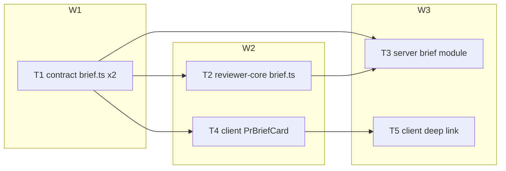
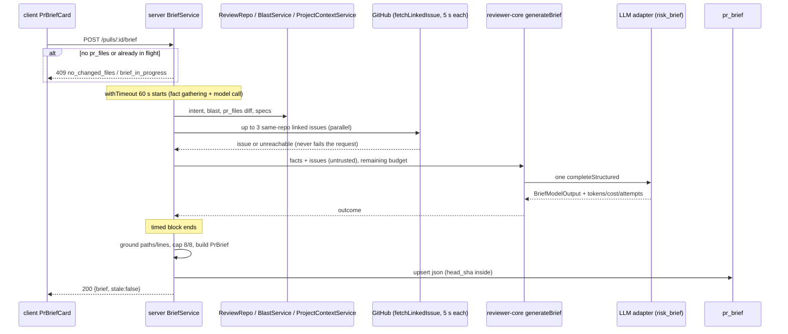

# Implementation Plan — Risk Brief ("PR Brief" block on the PR Overview tab) · v2
Date: 2026-09-30 · Branch: feat/L05_Spec_Driven_Development · Status: draft · Execution mode: multi-agent
Supersedes plan: `docs/plans/2026-09-30-pr-risk-brief.md` (v1, left unchanged) — v2 adds the spec amendment A8 (linked issues as a model input)
Sources: `specs/SPEC-2026-09-30-pr-risk-brief.md` (approved; amended and re-approved 2026-09-30: US-12, AC-52…AC-55, changed AC-7/AC-48/NFR-1, EC-24…EC-29, A8; OQ-1…OQ-9 at their defaults) · user technical pointers · user answers to the Requirements Review (Q-1 service-level timeout, Q-2 RTL + integration, Q-3 include P3, Q-mode multi-agent; all ⚠ defaults and REC-1…REC-11 accepted) — read-only; this plan does not change them

## 0. Changes vs v1
- R4 now includes linked issues; new R17 (linked-issue fetching, AC-52…AC-55); R3 timeout budget measured from the start of the generation request (NFR-1 amended).
- T1: `BriefMissingInputName` + `issue`; `BriefMissingReason` + `none_linked | unreachable | unsupported`; new `BriefIssueInput`; `PrBrief.inputs.issues`.
- T2: `BriefGeneratorInput.issues`, a `linked-issue:#N` untrusted prompt section (body ≤ 4000 chars), `inputs.issues` provenance; tests for AC-7/AC-48 extended.
- T3: issue fetching reuses `parseContextLinks` and an issue-fetch function extracted from `IntentClassifier.gatherContext` (owned path `server/src/modules/reviews/intent-classifier.ts` added); the 60 s `withTimeout` now wraps all fact gathering (incl. issue fetches) + the model call, with persistence outside it; new integration cases AC-52…AC-55; `test/intent.it.test.ts` + `test/intent-links.test.ts` join the Done-condition.
- T4: `brief.json` labels for the `issue` reasons; RTL case for an `issue` entry in the "Generated without" note.
- T5, waves, gates, execution mode: unchanged.

## 1. Goal & scope
Add a generated, persisted, grounded **PR Brief** to the Overview tab: one logical structured model call over already-computed facts (PR title/description, up to 3 same-repo linked issues fetched at generation time, stored intent, blast map, `pr_files` diff stats + Smart Diff roles + new-side hunk ranges, Project Context docs) → summary, file-linked Risk areas, ordered Review focus; every path/line grounded against the PR's changed files and blast callers; cached in the existing `pr_brief` table with the head SHA inside the JSON; Review focus items deep-link into Files changed (`?tab=diff&file=<path>`), expanding the Smart Diff group and the file card. P3 items (verdict banner, risk explanation expand) are included.

Out of scope: PR history generation (`history` stays empty), findings as model input, diff code in the prompt, classifying intent during brief generation, issue comments / issues beyond the first 3 / cross-repo issues / external trackers (flagged, not fetched), automatic regeneration, an MCP tool, SSE/background jobs, confirmation modal, LLM adapter changes (Q-1), e2e flows (Q-2), any DB schema change / migration, any `specs/**` or `<package>/specs/**` edit.

## 2. Requirements
- R1 — `GET /pulls/:id/brief` returns 200 `{ brief: PrBrief | null, stale: boolean }` from `pr_brief` without calling the LLM or GitHub; `stale = brief.head_sha !== pull.headSha`; a stored JSON that fails `PrBrief.safeParse` is returned as `brief: null`; PR outside the caller's workspace → 404 · Source: SPEC AC-35, AC-41, AC-47, NFR-3, A8, EC-23
- R2 — `POST /pulls/:id/brief` (no body, rate limit 10/min) makes exactly one `completeStructured` call with the `risk_brief` feature model from `resolveFeatureModel` and returns 200 `{ brief, stale: false }`; the returned brief's `model`/`provider` equal the resolved choice; issue fetches are GitHub calls, not model calls · Source: SPEC AC-2, NFR-2, NFR-6, A1, A8, OQ-3
- R3 — POST errors: 404 not in workspace; 409 `brief_in_progress` while a generation for the same PR runs in this process; 409 `no_changed_files` when the PR has 0 `pr_files` rows; missing provider key → existing `ConfigError` (500, `config_error`); model throw, schema failure after adapter re-asks, or the generation not finished within 60 s from the start of the generation work (fact gathering incl. issue fetches + model call; service-level `withTimeout(…, 60_000)`) → 502 `external_service_error` with a redacted message; a linked-issue fetch failure never fails the request; the stored brief is unchanged on any error · Source: SPEC AC-17, AC-38, AC-39, AC-40, AC-47, AC-54, NFR-1 (amended), OQ-8; Q-1 answer (REC-11)
- R4 — Model input is built only from: PR title + description (≤ 8000 chars), fetched linked issues (title + body ≤ 4000 chars each), stored intent (summary, in/out-of-scope, risk_areas), blast summary + callers `file:line` + endpoints + crons, per-file `path, +a/-d, role, new-side hunk ranges` (≤ 200 files, ≤ 20 hunks/file), Project Context docs (≤ 6000 chars each); no diff code line, no finding; every text input (incl. issue titles and bodies) wrapped by `wrapUntrusted`, `INJECTION_GUARD` in the system prompt · Source: SPEC AC-7 (amended), AC-48 (amended), NFR-5, OQ-7
- R5 — Diff stats, hunk ranges and the changed-file allow-list come only from `pr_files` (patch parsed via `diffFromPrFiles`), never `git.diff`; a file without a patch is in the allow-list with zero hunks · Source: REC-2 (user confirmed R15, issue 9)
- R6 — `missing_inputs[]` entries `{input, status, reason, ref}`: intent absent → `{intent, missing, not_classified, null}`; blast degraded `flag_off|index_failed|repo_too_large|no_data` → `{blast, missing, <reason>, null}` and `brief.blast = null`; `index_partial` → `{blast, partial, index_partial, null}` with partial facts used; no attached docs → `{specs, missing, none_attached, null}`; repo not cloned but docs attached → `{specs, missing, not_cloned, null}`; an attached doc missing or unreadable → `{specs, missing, doc_missing, <path>}`; issue entries per R17; a stale intent is used without any marker · Source: SPEC AC-10–AC-14, AC-53–AC-55; REC-3 (user confirmed R14, issue 8)
- R7 — Specs input = union of paths attached for the PR's repo to any workspace agent directly or via a bound, enabled skill (`usedByForRepo`), deduplicated by path; `brief.inputs.specs` lists each `{path, truncated}`, `truncated = text.length > 6000` · Source: SPEC AC-15, OQ-5; REC-1
- R8 — Grounding: risk refs whose path is neither a changed file nor a blast caller file are removed; a risk left without refs is dropped; a ref's line/range not inside a new-side hunk range of that file and not on a blast caller line of that file loses its line part; focus items whose file is not allowed, or whose line is not in a hunk range / caller line of that file, are dropped; `dropped: {risks, focus}`; after grounding keep the first 8 risks and first 8 focus items in model order; every stored risk has a non-empty title, valid severity, ≥ 1 ref · Source: SPEC AC-18, AC-22–AC-28
- R9 — `PrBrief` contract (both vendored copies byte-identical): adds `summary`, `review_focus`, `missing_inputs` (input ∈ `intent|blast|specs|issue`), `inputs.specs`, `inputs.issues`, `dropped`, `head_sha`, `generated_at`, `model`, `provider`, `tokens_in`, `tokens_out`, `cost_usd`; `intent`/`blast` nullable; `history` kept (empty); `missing_inputs.reason` is a `z.enum` · Source: SPEC Contracts (amended), NFR-9, OQ-2; user pointer; REC-3
- R10 — Generation replaces the stored brief (upsert on `pr_id`), no schema change; the brief's cost is not written to any review-run total · Source: SPEC AC-36, NFR-10, NFR-11, A7
- R11 — One log line per generation (success or failure): prId, provider, model, attempts, tokens in/out, cost, duration_ms, missing-input count, dropped counts, issues fetched count; never prompt/doc/description/issue text · Source: SPEC NFR-4; Q-1 answer ("log attempts")
- R12 — PR Brief block states: empty (heading "PR Brief" + enabled "Generate brief"); loading (indicator, button disabled); success (summary, "Risk areas", "Review focus — read these first (N)"); "Generated without: …" note in plain words for every missing input incl. `issue` reasons; "No notable risks flagged." for zero risks; "Outdated" badge when stale; "Generated <relative> · <model>"; cost `$0.014` + tokens `8.2K→1.3K` when `cost_usd != null`; refresh tooltip containing "new paid model call" on hover/focus; regeneration error keeps the old brief and shows the error + "Retry"; "Brief ready"/error announced via a polite live region; reload shows the stored brief with no POST · Source: SPEC AC-1, AC-3–AC-6, AC-16, AC-20, AC-33, AC-34, AC-37, AC-42, AC-45, AC-46, NFR-7, EC-24
- R13 — Risks: title + first file ref + severity icon with accessible name "High severity" / "Medium severity" / "Low severity"; ordered high → medium → low, model order within one severity; model text rendered as plain text; with a stored brief the Intent card hides its `risk_areas` chips · Source: SPEC AC-19, AC-21, AC-43, AC-49, NFR-8, OQ-9
- R14 — Review focus: items in stored order as `<file>:<line> — <reason>`; a changed-file item is a keyboard-activatable button opening `?tab=diff&file=<path>`; a blast-only item is plain text labelled "not in this PR's diff"; the Files changed tab expands the Smart Diff group containing the file and the file card (even > 200 changed lines) and scrolls it into view; an unknown `file` value is ignored · Source: SPEC AC-29–AC-32, AC-44, OQ-4; REC-4
- R15 — Intent and Blast radius cards stay live on the Overview tab alongside the brief · Source: SPEC AC-8, AC-9, OQ-1
- R16 — [Could] With a stored brief and ≥ 1 review record with a non-null verdict, the latest one renders in `VerdictBanner` above the summary; each risk has an expand control (`aria-expanded`) revealing its explanation · Source: SPEC AC-50, AC-51, OQ-6; Q-3 answer
- R17 — Linked issues during POST: links parsed with `parseContextLinks(pull.body, repo, pull.number)` (≤ 3 same-repo issues, dedup, PR's own number skipped); each issue fetched via `container.github().getIssue` bounded at 5 s; fetched issues go to the model as `{ref: "#N", title, body}` and to `brief.inputs.issues` as `{ref, truncated: body.length > 4000}`; failed/timed-out fetch → skipped + `{issue, missing, unreachable, "#N"}`; cross-repo issue / external-tracker links (unsupported links classified as issue-like) → not fetched + `{issue, missing, unsupported, <link>}`; no issue link at all (no same-repo issue and no issue-like unsupported link) → `{issue, missing, none_linked, null}`; linked docs parsed from the description are ignored by the brief (docs come from Project Context) · Source: SPEC AC-52, AC-53, AC-54, AC-55, EC-24–EC-28, A8; A7 (this plan)

## 3. Requirements review, assumptions & open questions
- REC-1 — Specs union via `ProjectContextRepository.usedByForRepo` + new `ProjectContextService.resolveForRepo` · Accepted
- REC-2 — Facts only from `pr_files` via `diffFromPrFiles`; roles via `classifyFile` · Accepted (R5)
- REC-3 — Reason `z.enum` incl. `not_cloned`; `unreadable` → `doc_missing` · Accepted (R6, R9); extended in v2 with the spec's `none_linked | unreachable | unsupported`
- REC-4 — Deep link expands Smart Diff group + FileCard, scroll via a FileCard prop, atomic URL update, `file` cleared on leaving the diff tab · Accepted (R14)
- REC-5 — New `server/src/modules/brief/` module; prompt + model call in `reviewer-core/src/brief.ts`; grounding as pure server helpers · Accepted
- REC-6 — In-process `Set<prId>` lock in `BriefService`, released in `finally` · Accepted
- REC-7 — `IntentCard` `hideRiskAreas` prop · Accepted
- REC-8 — Colocated formatters in `PrBriefCard/helpers.ts` · Accepted
- REC-9 — `brief.it.test.ts` always overrides `secrets` with `MockSecretsProvider({})` · Accepted
- REC-10 — `BriefModelOutput` strict schema reusing `Risk`; `file_refs` parsed server-side · Accepted
- REC-11 — Service-level `withTimeout(…, 60_000)`; adapter transport retries are part of the one logical call · Accepted (Q-1); in v2 the timeout wraps fact gathering + model call (NFR-1 amended)
- REC-12 (v2) — Reuse, don't duplicate, the intent layer's issue path: extract the `linked_issue` branch of `IntentClassifier.gatherContext` (`intent-classifier.ts:96-120`) into an exported `fetchLinkedIssue(container, repoRef, link)` (same 5 s `withTimeout`, same `redactDetail`), export `MAX_ISSUE_BODY_CHARS` and `unsupportedLinkKind`; `gatherContext` calls the extracted function, so intent behaviour is unchanged · Applied as default (follows the coordinator's "reuse existing helpers" instruction; guarded by `intent.it.test.ts`, `intent-links.test.ts`)
- A1 — The API runs as one process; the lock is not shared across processes.
- A2 — After a 502 timeout the in-flight provider request (and any in-flight issue fetch) may still finish; the adapters' `withTimeout` does not cancel (`server/src/platform/resilience.ts`); nothing is persisted from it because persistence sits outside the timed block; the lock is released at 502. Accepted limitation (Q-1).
- A3 — The blast prompt section is capped at 12000 chars (mirrors `MAX_FILE_LIST_CHARS`, `reviewer-core/src/intent.ts`).
- A4 — "Latest completed review" (AC-50) = first `ReviewRecord` with `verdict !== null` from `usePrReviews` (newest-first); blockers = `CRITICAL` findings.
- A5 — Refresh tooltip is a local element (`role="tooltip"`, `aria-describedby`); `@devdigest/ui` has no Tooltip primitive.
- A6 — Refs are `path`, `path:N` or `path:A-B`; anything else after the last `:` is part of the path.
- A7 (v2) — "Issue-like" unsupported link = `unsupportedLinkKind(ref) === 'linked_issue'` (cross-repo `/issues/` URLs, Jira/Linear hosts; `intent-classifier.ts` `unsupportedLinkKind`); Notion / Google Docs links are not issue entries. If only unsupported issue-like links exist, no `none_linked` entry is added. Issue fetches for ≤ 3 issues run in parallel (`Promise.all`) to save budget.
- Q — none open.

## 4. Affected modules
| Package | Layer / area | Files (existing or new) |
|---|---|---|
| server (shared contracts) | domain contracts | `server/src/vendor/shared/contracts/brief.ts`, `server/test/contracts.test.ts` |
| client (vendored contracts) | domain contracts mirror | `client/src/vendor/shared/contracts/brief.ts` |
| reviewer-core | pure core | new `reviewer-core/src/brief.ts`, `reviewer-core/src/index.ts`, new `reviewer-core/test/brief.test.ts` |
| server | new module + reused intent helpers | new `server/src/modules/brief/{routes,service,repository,helpers,constants}.ts`, `server/src/modules/index.ts`, `server/src/modules/project-context/service.ts`, `server/src/modules/reviews/intent-classifier.ts`, new `server/test/brief-helpers.test.ts`, new `server/test/brief.it.test.ts` |
| client | data hooks | new `client/src/lib/hooks/brief.ts` |
| client | PR detail route UI | new `_components/PrBriefCard/**`, `_components/OverviewTab/*`, `_components/IntentCard/IntentCard.tsx`, `client/messages/en/brief.json` |
| client | deep link | `hooks/usePrDetailPage.ts` (+ new test), `page.tsx`, `_components/DiffTab/DiffTab.tsx` (+ test), `_components/SmartDiffGroups/SmartDiffGroups.tsx` (+ test), `client/src/components/diff-viewer/FileCard/FileCard.tsx` (+ test) |

(`_components/…` and `hooks/…` are relative to `client/src/app/repos/[repoId]/pulls/[number]/`.)

## 5. Constraints
- Server and client `contracts/brief.ts` must stay byte-identical — source: `server/Insights.md` 2026-09-18 "vendor/shared hand-mirrored"; `server/AGENTS.md` "Do not touch"; SPEC NFR-9
- Zod contract naming `export const X = …; export type X = z.infer<typeof X>`, enums via `z.enum` — source: `server/AGENTS.md` "Naming conventions"
- Strict structured-output schemas: all fields required, no `.optional()` — source: `contracts/brief.ts:38-42`
- Routes declare Zod `params`; business logic in `service.ts`; only `repository.ts` imports Drizzle/`db/schema`; all external calls (GitHub, LLM) through `container` — source: `server/AGENTS.md` "Conventions"; `backend-onion-architecture` skill
- New module = import + entry in `src/modules/index.ts` — source: `server/AGENTS.md`
- reviewer-core: no side effects beyond the injected `LLMProvider` (it never fetches issues; the server passes resolved issue text in, like `LinkedContext` for intent); public API only via `index.ts`; don't rename/remove existing exports — source: `reviewer-core/AGENTS.md`
- Prompt-injection defense = shared `INJECTION_GUARD` + `wrapUntrusted`, no denylist filtering — source: `server/AGENTS.md` / `reviewer-core/AGENTS.md` "Gotchas"
- A per-call GitHub bound must be applied at the call site (`withTimeout`, 5 s), not by changing the shared port/adapter — source: `intent-classifier.ts:21-30` comment
- `*.it.test.ts` for pg-backed tests; `it` helpers must override `secrets` (and `github`, now that POST calls it) — source: `server/AGENTS.md` "Gotchas"; `server/Insights.md` 2026-09-24
- `pr_files` has no ordering column; `pr_files` exist only after the PR page was opened once — source: `server/Insights.md` 2026-09-24, 2026-09-27
- `withTimeout` is a non-cancelling `Promise.race` — source: `reviewer-core/Insights.md` 2026-09-24 (drives A2 and "persist outside the timed block")
- Client: hooks in `src/lib/hooks/*` via `src/lib/api.ts`; feature UI in `_components/<Name>/` + barrel; `styles.ts` `const s`; colocated `*.test.tsx` — source: `client/AGENTS.md`
- Formatters colocated per feature — source: `client/Insights.md` 2026-09-18
- `useState` lazy initializers must not capture async query data — source: `client/Insights.md` 2026-09-27
- Derived per-PR caches refresh in `invalidateRunHistory`, not mutation `onSuccess` — source: `client/Insights.md` 2026-09-24 (brief refreshes only on explicit regenerate)
- Keep `@devdigest/shared` specifiers as-is (`.js`→`.ts` extensionAlias) — source: `client/Insights.md` 2026-09-30
- Do not touch lockfiles, `skills-lock.json`, `CLAUDE.md` symlinks, `docker-compose.yml`, `.env*`, `src/db/migrations/` — source: `CLAUDE.md`, package `AGENTS.md`

## 6. Tasks

### T1 — Brief contract (shared, both vendored copies)
- Requirements: R9 (and shapes used by R1–R8, R12–R17)
- Scope: Backend
- Depends on: —
- Wave: W1
- Owned paths: `server/src/vendor/shared/contracts/brief.ts`, `client/src/vendor/shared/contracts/brief.ts`, `server/test/contracts.test.ts`
- Mandatory skills: backend-onion-architecture, fastify-best-practices, typescript-expert, zod, engineering-insights
- Change: In `contracts/brief.ts` (server copy), after `// ---- Smart Diff ----`, replacing the `// ---- Composed PR Brief ----` block:
  - `BriefFocusItem = z.object({ file: z.string(), line: z.number().int(), reason: z.string() })`
  - `BriefModelOutput = z.object({ summary: z.string(), risks: z.array(Risk), review_focus: z.array(BriefFocusItem) })` — structured-output schema, all fields required (JSDoc like `IntentClassification`).
  - `BriefMissingInputName = z.enum(['intent', 'blast', 'specs', 'issue'])`; `BriefMissingInputStatus = z.enum(['missing', 'partial'])`; `BriefMissingReason = z.enum(['not_classified', 'flag_off', 'index_failed', 'index_partial', 'repo_too_large', 'no_data', 'none_attached', 'not_cloned', 'doc_missing', 'none_linked', 'unreachable', 'unsupported'])` (literals; do NOT import from `review-api.ts`, which imports `brief.ts`).
  - `BriefMissingInput = z.object({ input: BriefMissingInputName, status: BriefMissingInputStatus, reason: BriefMissingReason, ref: z.string().nullable() })`
  - `BriefSpecInput = z.object({ path: z.string(), truncated: z.boolean() })`; `BriefIssueInput = z.object({ ref: z.string(), truncated: z.boolean() })`
  - `PrBrief = z.object({ summary: z.string(), intent: Intent.nullable(), blast: BlastRadius.nullable(), risks: Risks, review_focus: z.array(BriefFocusItem), history: PrHistory, missing_inputs: z.array(BriefMissingInput), inputs: z.object({ specs: z.array(BriefSpecInput), issues: z.array(BriefIssueInput) }), dropped: z.object({ risks: z.number().int().nonnegative(), focus: z.number().int().nonnegative() }), head_sha: z.string(), generated_at: z.string(), model: z.string(), provider: z.string(), tokens_in: z.number().int().nonnegative(), tokens_out: z.number().int().nonnegative(), cost_usd: z.number().nullable() })`
  - `PrBriefResponse = z.object({ brief: PrBrief.nullable(), stale: z.boolean() })`
  - Each with its inferred type. `Risk`, `Risks`, `PrHistory`, `Intent`, `BlastRadius` unchanged; caps not encoded in the schema.
  - Copy byte-for-byte to `client/src/vendor/shared/contracts/brief.ts`.
  - `server/test/contracts.test.ts`: parse a full `PrBrief` (`intent: null`, `blast: null`, `inputs.issues: [{ref: '#12', truncated: false}]`, a `{input: 'issue', status: 'missing', reason: 'none_linked', ref: null}` entry) and `PrBriefResponse {brief: null, stale: false}`; reject an unknown `reason` and an unknown `input`.
- Why: every other task codes against these shapes (contracts first); `PrBrief` has no consumer except a type re-export (`client/src/lib/types.ts:35`).
- Risk: Medium — byte mismatch between copies; a strict-json_schema-unsupported feature in `BriefModelOutput` · Mitigation: no `.min/.max/.optional` in `BriefModelOutput`/`BriefFocusItem`; Done-condition diffs the files.
- Acceptance: R9 — files identical; contracts test passes; reviewer-core, client, mcp-server typecheck.
- Done-condition: `diff server/src/vendor/shared/contracts/brief.ts client/src/vendor/shared/contracts/brief.ts && cd server && pnpm typecheck && pnpm lint && pnpm exec vitest run test/contracts.test.ts && cd ../client && pnpm typecheck && cd ../reviewer-core && npm run typecheck && cd ../mcp-server && npm run typecheck`

### T2 — reviewer-core brief prompt + single structured call
- Requirements: R2 (one call), R4, R7 (truncation), R17 (prompt side, `inputs.issues`)
- Scope: Backend
- Depends on: T1
- Wave: W2
- Owned paths: `reviewer-core/src/brief.ts` (new), `reviewer-core/src/index.ts`, `reviewer-core/test/brief.test.ts` (new)
- Mandatory skills: backend-onion-architecture, fastify-best-practices, typescript-expert, zod, engineering-insights
- Change: New `brief.ts`, modelled on `intent.ts` (pure, `LLMProvider` injected):
  - Types: `BriefFileFact { path; additions; deletions; role: SmartDiffRole; hunks: { newStart: number; newLines: number }[] }`; `BriefBlastFacts { summary; callers: { symbol; name; file; line }[]; endpoints: string[]; crons: string[]; partial: boolean }`; `BriefSpecDoc { path; text }`; `BriefIssue { ref: string; title: string; body: string }` (already fetched by the caller); `BriefGeneratorInput { model; llm: LLMProvider; title: string; description?: string | null; issues: BriefIssue[]; intent: Intent | null; blast: BriefBlastFacts | null; files: BriefFileFact[]; specs: BriefSpecDoc[]; missing: BriefMissingInput[]; timeoutMs?: number; sessionId?: string }`; `BriefPromptResult { messages; approxTokens; specs: BriefSpecInput[]; issues: BriefIssueInput[] }`; `BriefGeneratorOutcome { output: BriefModelOutput; specs: BriefSpecInput[]; issues: BriefIssueInput[]; model; tokensIn; tokensOut; costUsd: number | null; attempts: number; approxTokens: number }`.
  - Constants: `MAX_DESCRIPTION_CHARS = 8000`, `MAX_ISSUES = 3` (defensive slice), `MAX_ISSUE_BODY_CHARS = 4000`, `MAX_FILES = 200`, `MAX_HUNKS_PER_FILE = 20`, `MAX_SPEC_DOC_CHARS = 6000`, `MAX_BLAST_CHARS = 12000` (A3), `BRIEF_MAX_OUTPUT_TOKENS` (≈ 3000).
  - `assembleBriefPrompt(input)`: system text (summary ≤ 4 sentences; ≤ 8 risks with `file_refs` as `path`, `path:N`, `path:A-B`; ≤ 8 review_focus items in reading order; cite only listed files/lines; lines must fall in listed new-side hunk ranges or caller lines; inputs listed as missing in "Input status" must not be invented; linked issues describe the problem the PR should solve) + `INJECTION_GUARD`. Sections, each via `wrapUntrusted(<label>, …)`: `pr-title`, `pr-description` (≤ 8000; "(empty)" when blank), one `linked-issue:<ref>` block per issue with `title\n\nbody` (body sliced to 4000) — mirrors `intent.ts` linked-issue rendering, `intent` or a trusted "not classified" line, `blast` (≤ 12000) or a status line, `file-list` (`path (+a/-d) [role]` + `  +newStart,newLines` per hunk; ≤ 200 files, ≤ 20 hunks, `…N more files`), one `spec:<path>` block per doc (≤ 6000). A trusted "Input status" section lists `missing` entries (enum values + refs). Specs deduped by path, issues deduped by ref (first wins). Returns `specs: [{path, truncated: text.length > 6000}]` and `issues: [{ref, truncated: body.length > 4000}]`. No patch lines exist in the input types by construction.
  - `generateBrief(input)`: `assembleBriefPrompt`, then exactly one `input.llm.completeStructured<BriefModelOutput>({ model, schema: BriefModelOutput, schemaName: 'BriefModelOutput', messages, temperature: 0, maxTokens: BRIEF_MAX_OUTPUT_TOKENS, timeoutMs: input.timeoutMs ?? 60000, maxRetries: 2, sessionId? })`; returns the outcome with `attempts: res.attempts`; throws on LLM failure.
  - `index.ts`: additive export block for `generateBrief`, `assembleBriefPrompt` and the types above.
  - `test/brief.test.ts` (`describe('SPEC-2026-09-30-pr-risk-brief', …)`): `AC-7:` fixture with hunks + roles + one issue → prompt contains `+40,13`, `[core]` and the issue title, no `+`/`-` code line from a fixture patch string, no finding title; `AC-48:` title, description, issue title and body, intent, blast summary, file paths and doc text each appear inside `<untrusted source="…">` (issue under `linked-issue:#12`), system message contains `INJECTION_GUARD`; `AC-52` (core side): 5000-char issue body → only 4000 chars rendered and `issues: [{ref: '#12', truncated: true}]`; `AC-15:` duplicate spec path → one entry; 9000-char doc → `truncated: true`, 6000 chars rendered; `AC-2:` stub `LLMProvider` records exactly one `completeStructured` with `schemaName: 'BriefModelOutput'`; caps: 250 files → 200 rendered + "…50 more files".
- Why: keeps prompt assembly and the model call in the pure core, like `classifyIntent`; issue fetching stays in the server (I/O).
- Risk: Medium — code or raw issue text leaking outside an untrusted block; oversize prompts; export breakage · Mitigation: input types carry no patch; every untrusted source rendered only through `wrapUntrusted` (AC-48 test enumerates them); caps; additive exports; W2 gate typechecks `server`.
- Acceptance: R4, R7, R17 (prompt side), R2 — `reviewer-core/test/brief.test.ts` cases `AC-7`, `AC-48`, `AC-52`, `AC-15`, `AC-2`.
- Done-condition: `cd reviewer-core && npm run typecheck && npm run lint && npm test`

### T3 — Server `brief` module (facts, linked issues, grounding, persistence, routes)
- Requirements: R1, R2, R3, R5, R6, R7, R8, R10, R11, R17
- Scope: Backend
- Depends on: T1, T2
- Wave: W3
- Owned paths: `server/src/modules/brief/` (new: `routes.ts`, `service.ts`, `repository.ts`, `helpers.ts`, `constants.ts`), `server/src/modules/index.ts`, `server/src/modules/project-context/service.ts`, `server/src/modules/reviews/intent-classifier.ts`, `server/test/brief-helpers.test.ts` (new), `server/test/brief.it.test.ts` (new)
- Mandatory skills: backend-onion-architecture, fastify-best-practices, typescript-expert, zod, drizzle-orm-patterns, postgresql-table-design, engineering-insights
- Change:
  - `reviews/intent-classifier.ts` (refactor, REC-12, no behaviour change): export `MAX_ISSUE_BODY_CHARS`, `GITHUB_ISSUE_FETCH_TIMEOUT_MS`, `unsupportedLinkKind`; extract the `linked_issue` branch of `gatherContext` (`:96-120`) into `export async function fetchLinkedIssue(container: Container, ref: RepoRef, link: ParsedLinkedIssue): Promise<LinkedContext>` (same `container.github()`, `withTimeout(github.getIssue(ref, link.number), GITHUB_ISSUE_FETCH_TIMEOUT_MS)`, `used`/`truncated` status by `MAX_ISSUE_BODY_CHARS`, `unreachable` + `redactDetail` on any error; never throws); `gatherContext` calls it. Existing intent tests must stay green unchanged.
  - `constants.ts`: `BRIEF_TIMEOUT_MS = 60_000`, `BRIEF_MAX_RISKS = 8`, `BRIEF_MAX_FOCUS = 8`, `BRIEF_RATE_LIMIT = { max: 10, timeWindow: '1 minute' }`.
  - `repository.ts` — `BriefRepository(db)`, the only module file importing `drizzle-orm`/`db/schema`: `getBriefJson(prId): Promise<unknown | undefined>`; `upsertBrief(prId, json: PrBrief): Promise<void>` (`insert(prBrief).values({prId, json}).onConflictDoUpdate({ target: prBrief.prId, set: { json } })`). Existing table `pr_brief(pr_id uuid PK FK→pull_requests ON DELETE CASCADE, json jsonb NOT NULL)` (`server/src/db/schema/reviews.ts:101-106`) — no schema change, no migration.
  - `project-context/service.ts` — add `resolveForRepo(workspaceId, repo: { id; owner; name; clonePath: string | null }): Promise<{ status: 'none' } | { status: 'not_cloned' } | { status: 'resolved'; docs: { path; text }[]; skipped: { path; reason: 'missing' | 'unreadable' }[] }>`: paths = sorted keys of `this.repo.usedByForRepo(workspaceId, repo.id)`; empty → `none`; no clone → `not_cloned`; else read like `resolveForRun`. Existing methods untouched.
  - `helpers.ts` (pure): `parseFileRef`; `buildAllowList(files, callers)` (ranges `[newStart, newStart + newLines - 1]`); `lineAllowed` / `rangeAllowed`; `groundBriefOutput(output, allow)` → `{ risks, review_focus, dropped }` implementing R8 (filter refs → strip disallowed line parts → drop ref-less or empty-title risks → drop invalid focus items → count → slice 8/8); `blastToFacts(resp)` → `{ facts, snapshot, missing }`; `specsToMissing(result)`; `toFileFacts(diff)` with `classifyFile`; `issueLinksToPlan(links: ParsedLink[])` → `{ toFetch: ParsedLinkedIssue[]; unsupported: BriefMissingInput[] }` (unsupported links with `unsupportedLinkKind(ref) === 'linked_issue'` → `{issue, missing, unsupported, ref}`, A7; linked docs ignored); `issuesToMissing(toFetch, fetched: LinkedContext[], unsupported)` → `unreachable` entries with `ref: '#N'` for `status === 'unreachable'`, plus `{issue, missing, none_linked, null}` when `toFetch` and `unsupported` are both empty.
  - `service.ts` — `BriefService(container)` (no Fastify/Drizzle imports) with `private inFlight = new Set<string>()`, `ReviewRepository`, `BriefRepository`, `BlastService`, `ProjectContextService`:
    - `getBrief(workspaceId, prId)` — unchanged from v1: getPull (404); `PrBrief.safeParse(getBriefJson)`; `{brief|null, stale}`. No GitHub, no LLM (issues are never fetched on GET).
    - `generateBrief(workspaceId, prId, log)` — getPull (404), getRepo (404), `reviewRepo.getPrFiles` (0 rows → `ConflictError('no_changed_files')`), in-flight check (`ConflictError('brief_in_progress')`), `inFlight.add` + `try/finally delete`. `choice = resolveFeatureModel(…, 'risk_brief')`; `llm = await container.llm(choice.provider)` before the timed block (a `ConfigError` propagates as 500). Then `const started = Date.now(); const result = await withTimeout(this.gatherAndGenerate(...), BRIEF_TIMEOUT_MS)` where private `gatherAndGenerate` (no writes) does: intent via `reviewRepo.getIntent`; blast via `blastService.getBlast` → `blastToFacts`; specs via `resolveForRepo`; file facts via `diffFromPrFiles` + patchless rows; issues: `parseContextLinks(pull.body, {owner, name}, pull.number)` → `issueLinksToPlan` → `Promise.all(toFetch.map(l => fetchLinkedIssue(container, ref, l)))` → fetched `used|truncated` contexts become `BriefIssue {ref, title, body}`, the rest become `unreachable` entries; then `generateBrief({..., issues, timeoutMs: Math.max(1, BRIEF_TIMEOUT_MS - (Date.now() - started))})` and returns outcome + gathered facts. Any non-`AppError` failure (incl. `TimeoutError`) → `ExternalServiceError('Brief generation failed: ' + redactDetail(err))` (502). Outside the timed block: ground, assemble `PrBrief` (`inputs: { specs: outcome.specs, issues: outcome.issues }`, `history: {history: []}`, `head_sha`, `generated_at`, model/provider/tokens/cost), `upsertBrief` (only on success), return `{brief, stale: false}`. One log line in both paths (R11: + `issuesFetched`, `issuesMissing`), never text content.
  - `routes.ts` — `GET /pulls/:id/brief` `{ schema: { params: IdParams, response: { 200: PrBriefResponse } } }`; `POST /pulls/:id/brief` same schema + `config: { rateLimit: BRIEF_RATE_LIMIT }`; both `getContext(container, req)` first; one `BriefService` per plugin registration.
  - `modules/index.ts`: `import brief from './brief/routes.js'` + `brief` entry.
  - `test/brief-helpers.test.ts` (`describe('SPEC-2026-09-30-pr-risk-brief', …)`): `AC-18`, `AC-22`, `AC-23`, `AC-24`, `AC-25`, `AC-26` (hunk `+40,13`: line 52 kept, 53 dropped unless a caller line), `AC-28`; `parseFileRef`; `blastToFacts` reason mapping; `specsToMissing` (`not_cloned`, `unreadable`→`doc_missing`); `issueLinksToPlan` / `issuesToMissing` (`none_linked` only when nothing linked; Jira URL → `unsupported`; Notion URL → no entry; `unreachable` with `#12`).
  - `test/brief.it.test.ts` (Testcontainers; `appWith()` always sets `secrets: new MockSecretsProvider({})`, `github: new MockGitHubClient({ issues: {...} })`, `git: new MockGitClient(...)`, `llm.openai` = `MockLLMProvider` with `structuredBySchema.BriefModelOutput`; seeds repo + PR + `pr_files` with patches): `AC-2`, `AC-10`, `AC-11`, `AC-12`, `AC-13`, `AC-14`, `AC-15`, `AC-17`, `AC-27`, `AC-35` (GET: zero LLM calls and zero `getIssue` calls via `vi.spyOn(github, 'getIssue')`), `AC-36`, `AC-38` (test-local throwing `LLMProvider` → 502; previous brief kept), `AC-39`, `AC-40`, `AC-41`, `AC-47`, and new: `AC-52` (body links `#12`, mock issue 12 → the `completeStructured` request's user message contains issue 12's title inside `<untrusted source="linked-issue:#12">`; `inputs.issues` = `[{ref:'#12', truncated:false}]`), `AC-53` (body without links → `{issue, missing, none_linked, null}`, 200), `AC-54` (`issues: {12: 'error'}` → 200 and `{issue, missing, unreachable, '#12'}`), `AC-55` (body linking `https://acme.atlassian.net/browse/X-1` → `getIssue` spy never called, `{issue, missing, unsupported, 'https://acme.atlassian.net/browse/X-1'}`). Test-local stubs live in the test file; `src/adapters/mocks.ts` unchanged.
- Why: implements every API-side AC in a new onion-layered module, reusing intent's link parsing and issue fetch instead of duplicating them (REC-12); measuring the 60 s from the start of the generation work satisfies amended NFR-1 without letting a timed-out run persist.
- Risk: High — (a) grounding off-by-one; (b) lock leak; (c) `ConfigError` masked as 502; (d) a brief persisted after timeout; (e) `it` test hits real GitHub/LLM; (f) the `gatherContext` refactor changes intent behaviour; (g) a slow/failing issue fetch fails the request · Mitigation: (a) `AC-26` boundary test; (b) `finally`, `AC-40`/`AC-38`; (c) `container.llm` resolved before the timed block, `AppError` rethrown, `AC-39`; (d) `gatherAndGenerate` never writes, upsert after `withTimeout` resolves; (e) REC-9 + mocked `github`; (f) pure extraction, `intent.it.test.ts` + `intent-links.test.ts` in the Done-condition; (g) `fetchLinkedIssue` never throws and is bounded at 5 s, `AC-54`.
- Acceptance: R1–R3, R5–R8, R10, R11, R17 — the named cases pass; `grep -n "drizzle-orm" server/src/modules/brief/*.ts` matches only `repository.ts`; `grep -n "getIssue" server/src/modules/brief/*.ts` finds nothing (issue fetching goes through `fetchLinkedIssue`).
- Done-condition: `cd server && pnpm typecheck && pnpm lint && pnpm exec vitest run --exclude '**/*.it.test.ts' && pnpm exec vitest run test/brief.it.test.ts test/project-context.it.test.ts test/intent.it.test.ts`

### T4 — Client PR Brief block (hooks, card, Overview wiring, labels, P3)
- Requirements: R12, R13, R14 (rendering + activation callback), R15, R16, R17 (rendering of `issue` entries)
- Scope: Frontend
- Depends on: T1
- Wave: W2
- Owned paths: `client/src/lib/hooks/brief.ts` (new); `client/src/app/repos/[repoId]/pulls/[number]/_components/PrBriefCard/**` (new); `…/_components/OverviewTab/OverviewTab.tsx`, `…/OverviewTab/styles.ts`, `…/OverviewTab/OverviewTab.test.tsx` (new); `…/_components/IntentCard/IntentCard.tsx`; `client/messages/en/brief.json`
- Mandatory skills: frontend-ui-architecture, next-best-practices, react-best-practices, typescript-expert, react-testing-library, zod, engineering-insights
- Change: as in v1, plus the issue labels:
  - `lib/hooks/brief.ts`: `usePrBrief(prId)` (`["pr-brief", prId]`, GET); `useGenerateBrief(prId)` (POST, `onSuccess` → `setQueryData`; no toast; not invalidated on run finish).
  - `PrBriefCard/` (`"use client"` leaf): `PrBriefCard.tsx` (container: `usePrBrief`, `useGenerateBrief`, `usePullDetail(prId)` for the changed-path set, `usePrReviews(prId)` for the P3 banner; props `{ prId: string; onOpenFile?: (path: string) => void }`); sub-components `_components/RiskAreas`, `_components/ReviewFocus`, `_components/BriefMeta` (folder + same-named file + `index.ts`); `helpers.ts` (`sortRisks`, `formatTokens` → `8.2K`, `formatCost` → `$0.014`, `relativeTime`, `missingInputKey(entry)` → `missing.<input>.<reason>`); `constants.ts`; `styles.ts`; `index.ts`. States and behaviour exactly as v1: Skeleton while GET loads; empty state + "Generate brief"; pending → loading + disabled; brief → `VerdictBanner` (A4) above a plain-text summary, `RiskAreas` (accessible severity names, expand with `aria-expanded`), `ReviewFocus` (buttons for changed files → `onOpenFile(file)`; blast-only plain text + "not in this PR's diff"), `BriefMeta` (generated time + model, cost/tokens, "Outdated", "Generated without: …" joining one label per `missing_inputs` entry, issue refs shown as `(#12)` / the link text as plain text); refresh control with local tooltip "Regenerating makes a new paid model call."; inline error + "Retry" keeping the old brief; `aria-live="polite"` region ("Brief ready" / error).
  - `OverviewTab.tsx`: optional `onOpenFile`; renders `PrBriefCard` first, then the live Intent/Blast row, then Description; `hideRiskAreas={!!data?.brief}` on `IntentCard` via `usePrBrief`.
  - `IntentCard.tsx`: optional `hideRiskAreas` skipping the `risk_areas` chip row (`IntentCard.tsx:124-131`).
  - `messages/en/brief.json`: keep existing keys; add `title`, `generate`, `generating`, `refresh`, `refreshHint`, `riskAreas`, `reviewFocus` ("Review focus — read these first ({count})"), `notInDiff`, `generatedMeta`, `generatedWithout` ("Generated without: {items}"), `missing.intent.not_classified` ("Intent (not classified yet)"), `missing.blast.{flag_off,index_failed,index_partial,repo_too_large,no_data}`, `missing.specs.{none_attached,not_cloned,doc_missing}` (doc_missing with `{ref}`), `missing.issue.none_linked` ("Linked issue (none linked)"), `missing.issue.unreachable` ("Linked issue {ref} (couldn't be fetched)"), `missing.issue.unsupported` ("Linked issue {ref} (unsupported tracker)"), `outdated`, `severity.high|medium|low`, `expand`, `collapse`, `ready`, `failed`, `retry`.
  - Tests (`describe('SPEC-2026-09-30-pr-risk-brief', …)`, fetch mocked): `PrBriefCard.test.tsx` — AC-1, AC-3, AC-4, AC-5, AC-6, AC-16 (intent `not_classified` → "Generated without: Intent (not classified yet)"; plus an `issue`/`unreachable`/`#12` entry → text contains "Linked issue #12"), AC-19, AC-20, AC-29, AC-32, AC-33, AC-34, AC-37, AC-42, AC-44, AC-45, AC-46, AC-49, AC-50, AC-51, NFR-7; `helpers.test.ts` — AC-21, formatters, `missingInputKey` for every `BriefMissingReason`; `OverviewTab.test.tsx` — AC-8, AC-9, AC-43.
- Why: the user-visible surface of the brief; issue reasons must read in plain words (AC-16, EC-24).
- Risk: Medium — (a) XSS via model text or issue refs; (b) losing the old brief on failed refresh; (c) literal `0` rendering; (d) component > 200 lines; (e) a reason without a label renders a raw key · Mitigation: (a) plain text only, AC-49; (b) `onError` doesn't touch the cache, AC-37; (c) `length > 0`; (d) three sub-components; (e) `helpers.test.ts` covers every enum value.
- Acceptance: R12, R13, R15, R16, R17 (rendering), activation part of R14 — tests above pass; `grep -rn "dangerouslySetInnerHTML\|Markdown" …/PrBriefCard` finds nothing.
- Done-condition: `cd client && pnpm typecheck && pnpm lint && pnpm test`

### T5 — Client deep link into Files changed (`?tab=diff&file=`)
Unchanged from v1.
- Requirements: R14 (navigation, expand, scroll)
- Scope: Frontend
- Depends on: T4
- Wave: W3
- Owned paths: `client/src/app/repos/[repoId]/pulls/[number]/hooks/usePrDetailPage.ts`, `…/hooks/usePrDetailPage.test.tsx` (new), `…/page.tsx`, `…/_components/DiffTab/DiffTab.tsx`, `…/_components/DiffTab/DiffTab.test.tsx`, `…/_components/SmartDiffGroups/SmartDiffGroups.tsx`, `…/_components/SmartDiffGroups/SmartDiffGroups.test.tsx`, `client/src/components/diff-viewer/FileCard/FileCard.tsx`, `client/src/components/diff-viewer/FileCard/FileCard.test.tsx`
- Mandatory skills: frontend-ui-architecture, next-best-practices, react-best-practices, typescript-expert, react-testing-library, engineering-insights
- Change: `usePrDetailPage.ts` — `setParams(updates)` (one `router.replace`), `setParam` delegates, `setTab(t)` drops `file` when `t !== "diff"`, `openFileInDiff(path)` = `setParams({ tab: "diff", file: path })`, returns `focusFile` + `openFileInDiff`; `page.tsx` — `onOpenFile={openFileInDiff}` to `OverviewTab`, `focusFile` to `DiffTab`; `DiffTab.tsx` — `focusFile` prop, `target` only if in `files`, `fileProps` adds `focused`, `expandRole` from `groups` passed to `SmartDiffGroups`; `SmartDiffGroups.tsx` — `expandRole` removed from `DEFAULT_COLLAPSED` in the lazy initializer (groups resolved before mount); `FileCard.tsx` — `focused` opens regardless of `AUTO_EXPAND_MAX_LINES` and scrolls via ref + `useEffect(scrollIntoView({ block: "start" }))`. Tests (stub `Element.prototype.scrollIntoView`): `usePrDetailPage.test.tsx` AC-30 URL part; `DiffTab.test.tsx` AC-30, AC-31, unknown `focusFile` ignored; `FileCard.test.tsx` `focused` opens a > 200-line file; `SmartDiffGroups.test.tsx` `expandRole`.
- Why: otherwise a focus click lands on fully collapsed Smart Diff groups (`SmartDiffGroups/constants.ts` `DEFAULT_COLLAPSED`) and a collapsed large card (`FileCard.tsx:56-57`).
- Risk: Medium — lost URL key on two sequential updates; stale `file` re-scroll; regressions; unchecked URL path · Mitigation: single `setParams`; `setTab` clears `file`; optional props with unchanged defaults, existing tests kept green; path matched against `pr.files`.
- Acceptance: R14 — tests above pass; existing tests still pass.
- Done-condition: `cd client && pnpm typecheck && pnpm lint && pnpm test`

## 6a. Execution (multi-agent)
| Wave | Tasks (parallel) | Packages | Wave gate (Package gates from §6b, run after all tasks finish) |
|---|---|---|---|
| W1 | T1 | server (`vendor/shared`), client (vendored mirror) — alias-linked to reviewer-core, mcp-server | G.server · G.client · G.reviewer-core · G.mcp-server |
| W2 | T2, T4 | reviewer-core, client (not alias-linked to each other) | G.reviewer-core · G.client · G.server-typecheck |
| W3 | T3, T5 | server, client | G.server · G.client |

Wave rules hold as in v1: T1 alone in W1 (contracts first); T2 (reviewer-core exports) in W2 before the only server task T3 (W3); one task per package per wave; disjoint owned paths (T3's new `reviews/intent-classifier.ts` path is server-only and in no other task); no lockfile, migration or vendored-shared change outside W1.

## 6b. Package gates
| Gate | Package | Commands (full existing suite) | Run by |
|---|---|---|---|
| G.server | server | `cd server && pnpm typecheck && pnpm lint && pnpm test` | wave gate (main session or `mechanical-checker`) · plan-verifier |
| G.server-typecheck | server | `cd server && pnpm typecheck` | W2 wave gate |
| G.client | client | `cd client && pnpm typecheck && pnpm lint && pnpm test` | wave gate · plan-verifier |
| G.reviewer-core | reviewer-core | `cd reviewer-core && npm run typecheck && npm run lint && npm test` | wave gate · plan-verifier |
| G.mcp-server | mcp-server | `cd mcp-server && npm run typecheck && npm run lint && npm test` | W1 wave gate · plan-verifier |

## 7. Testing strategy
- Existing suites covering the change: server unit (`contracts.test.ts`, `intent-links.test.ts`, `smart-diff-classify.test.ts`, `project-context-helpers.test.ts`, `routes-smoke.test.ts`) and integration (`intent.it.test.ts` — guards the `gatherContext` refactor, `project-context.it.test.ts`, `project-context-run.it.test.ts`, `blast.it.test.ts`); reviewer-core (`intent.test.ts`, `prompt.test.ts`, `structured.test.ts`); client (`DiffTab.test.tsx`, `SmartDiffGroups.test.tsx`, `FileCard.test.tsx`, `VerdictBanner.test.tsx`, `BlastRadiusCard.test.tsx`); mcp-server full suite. e2e untouched (Q-2).
- New or changed tests (owned by the named task): T1 `server/test/contracts.test.ts`; T2 `reviewer-core/test/brief.test.ts`; T3 `server/test/brief-helpers.test.ts`, `server/test/brief.it.test.ts`; T4 `PrBriefCard/PrBriefCard.test.tsx`, `PrBriefCard/helpers.test.ts`, `OverviewTab/OverviewTab.test.tsx`; T5 `hooks/usePrDetailPage.test.tsx`, `DiffTab.test.tsx`, `SmartDiffGroups.test.tsx`, `FileCard.test.tsx`. Spec-traced cases sit in `describe('SPEC-2026-09-30-pr-risk-brief', …)` named `AC-N: …`.
- Spec ACs → carrier (spec `e2e` ACs verified by RTL per Q-2):
  - unit, reviewer-core `test/brief.test.ts`: AC-7, AC-48, AC-15 (truncation), AC-52 (truncation/provenance, core side), AC-2 (core side)
  - unit, server `test/brief-helpers.test.ts`: AC-18, AC-22, AC-23, AC-24, AC-25, AC-26, AC-28 (+ issue-planning helpers for AC-53/54/55)
  - integration, server `test/brief.it.test.ts`: AC-2, AC-10, AC-11, AC-12, AC-13, AC-14, AC-15 (dedup), AC-17, AC-27, AC-35, AC-36, AC-38 (throw path), AC-39, AC-40, AC-41, AC-47, AC-52, AC-53, AC-54, AC-55
  - client RTL: `PrBriefCard.test.tsx` AC-1, AC-3–AC-6, AC-16, AC-19, AC-20, AC-29, AC-32, AC-33, AC-34, AC-37, AC-42, AC-44, AC-45, AC-46, AC-49, AC-50, AC-51; `helpers.test.ts` AC-21; `OverviewTab.test.tsx` AC-8, AC-9, AC-43; T5 tests AC-30, AC-31
- Gaps (manual / flagged): real-browser viewport for AC-30, real reload for AC-34, real hover positioning for AC-33, real Tab order for AC-44; NFR-1 60 s budget and the 5 s per-issue bound (AC-54 "takes longer than 5 s") are not exercised by wall-clock tests — covered by construction (`withTimeout`) and by the throwing-issue case; NFR-8 contrast manual; NFR-4 log content by review.

## 8. Diagrams

Task graph (waves):

Cross-package flow (generate):

## 9. Traceability
| Requirement | Source | Tasks |
|---|---|---|
| R1 | AC-35, AC-41, AC-47, NFR-3, A8, EC-23 | T1, T3 |
| R2 | AC-2, NFR-2, NFR-6, A1, A8, OQ-3 | T2, T3 |
| R3 | AC-17, AC-38–40, AC-47, AC-54, NFR-1 (amended), OQ-8, Q-1/REC-11 | T3 |
| R4 | AC-7, AC-48 (amended), NFR-5, OQ-7 | T2, T3 |
| R5 | REC-2 (confirmed) | T3 |
| R6 | AC-10–14, AC-53–55, REC-3 (confirmed) | T1, T3 |
| R7 | AC-15, OQ-5, REC-1 | T2, T3 |
| R8 | AC-18, AC-22–28 | T3 |
| R9 | Contracts (amended), NFR-9, OQ-2, REC-3 | T1 |
| R10 | AC-36, NFR-10, NFR-11, A7 (spec) | T3 |
| R11 | NFR-4, Q-1 | T3 |
| R12 | AC-1, 3–6, 16, 20, 33, 34, 37, 42, 45, 46, NFR-7, EC-24 | T4 |
| R13 | AC-19, 21, 43, 49, NFR-8, OQ-9 | T4 |
| R14 | AC-29–32, AC-44, OQ-4, REC-4 | T4, T5 |
| R15 | AC-8, AC-9, OQ-1 | T4 |
| R16 | AC-50, AC-51, OQ-6, Q-3 | T4 |
| R17 | AC-52–55, EC-24–28, A8 (spec), REC-12, A7 (plan) | T1, T2, T3, T4 |

## 10. Red-flags check
- [x] Every requirement maps to ≥1 task and cites a source; every task maps to ≥1 requirement
- [x] Nothing in the plan authors or changes a spec; no owned path under `specs/` or `<package>/specs/`
- [x] Execution mode is the user's choice (multi-agent); waves obey the rules; each wave has a gate
- [x] Depends-on is a DAG; order executable top-to-bottom
- [x] Owned paths don't overlap across tasks (T4 `OverviewTab` / T5 `page.tsx`, sequenced by Depends-on)
- [x] Exported type/signature changes own their consumers: `PrBrief` (type re-export in `client/src/lib/types.ts:35`, no change needed; `contracts.test.ts` in T1); `intent-classifier.ts` gains exports and keeps `IntentClassifier`'s public API (consumers `reviews/service.ts`, `reviews/run-executor.ts` unaffected); reviewer-core exports additive; new UI props optional
- [x] No owned path hits a "Do not touch" file
- [x] Schema and API-contract decisions settled in the plan
- [x] No migration
- [x] Every task has a Why and a Risk with concrete edge cases and mitigations
- [x] Testing strategy names existing suites per package and the gaps
- [x] Every Done-condition and Package gate is an existing command
- [x] No Done-condition runs the full `server/` suite; integration tests named by path and related to the task
- [x] No task contradicts a mandatory skill or an Insights.md entry
- [x] No blocking open question; former ⚠ defaults confirmed; REC-12 and plan A7 are implementation choices inside the spec's wording

## 11. Handoff to reviewers
- `security-reviewer`: untrusted wrapping of every input incl. issue titles/bodies (`linked-issue:#N`); only same-repo issues fetched (`parseContextLinks` allow-list), others flagged; fetch errors redacted (`redactDetail`) and never shown raw; plain-text rendering (AC-49) incl. issue refs in the "Generated without" note; `file` URL param matched against `pr.files`; 502 redaction; no text content in the log; rate limit; workspace scoping; GET makes no GitHub call.
- `architecture-reviewer`: `brief/service.ts` has no Fastify/Drizzle imports; only `brief/repository.ts` touches `pr_brief`; GitHub access only through `container.github()` inside the reused `fetchLinkedIssue`; the `gatherContext` extraction preserves intent behaviour; reviewer-core stays pure (issues passed in resolved); byte-identical vendored `brief.ts`; client data access via `src/lib/hooks/brief.ts`.
- `pr-self-review`: lock semantics (A1), non-cancelling timeouts (A2), cost not in review-run totals (NFR-11).

## 12. Risks & rollback
- Cross-task: T3/T4 depend on T1's exact enums (`issue` + three reasons) — any later contract tweak re-gates server/client/reviewer-core/mcp-server. The deep link works only once W3 lands.
- Operational: timed-out generations may still be billed and may leave an issue fetch running (A2); single-process lock (A1); linked issues can change between generations, so two briefs for the same head SHA may differ (spec provenance table: non-deterministic input).
- Suggested Insights entry after implementation (not written here): `server/Insights.md` — "OpenAI/Anthropic adapters apply `timeoutMs` per attempt and wrap each attempt in `withRetry`; a caller needing a total deadline wraps its own work in `withTimeout` and keeps persistence outside the timed block (brief module precedent)".
- Rollback: no migration, no change to existing table shapes — revert the commits; `pr_brief` rows are harmless (nothing else reads them) and cascade with their PR. The `intent-classifier.ts` extraction reverts with the same commit.
