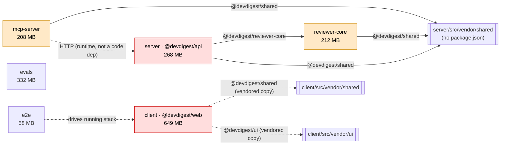
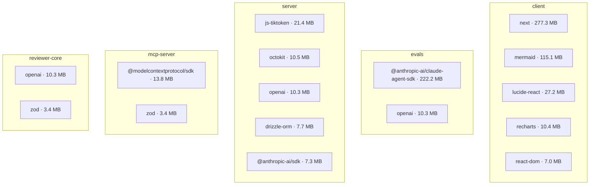

# Dependencies report

> Generated 2026-10-08 on branch `feat/L06_Evals_Plan_Verifier_Export_to_CI` @ `b50ab5b` by the `dependency-checker` skill.
> Mode: online (`outdated` + `audit` per package). Incomplete: none.

## 1. Summary

Advisory counts are unique advisories per package (C/H/M/L). "In prod" means the vulnerable package is reachable from a `dependencies` entry of a deployed package. Everything in `e2e` and `evals` is tooling and counts as dev-only.

| Package | Manager (lock / installed) | Prod | Dev | node_modules | Vulns in prod (C/H/M/L) | Vulns dev-only (C/H/M/L) | Outdated (major) |
|---|---|---|---|---|---|---|---|
| `server` | pnpm / pnpm | 23 | 11 | 268.1 MB | 2/16/4/0 | 4/16/18/5 | 27 (18) |
| `client` | pnpm / pnpm | 12 | 17 | 648.7 MB | 2/11/17/5 | 3/5/5/0 | 25 (14) |
| `reviewer-core` | **npm / pnpm** ⚠ | 2 | 7 | 211.9 MB | 0/1/0/0 | 2/4/3/0 | 7 (5) |
| `mcp-server` | **npm / pnpm** ⚠ | 2 | 7 | 208.0 MB | 0/1/0/0 | 2/2/3/0 | 7 (4) |
| `evals` | pnpm / pnpm | 2 | 5 | 332.2 MB | — (tooling) | 4/16/23/1 | 6 (4) |
| `e2e` | npm / npm | 0 | 6 | 57.8 MB | — (tooling) | 0/0/0/1 | 5 (2) |

**Totals:** 6 packages · 94 direct deps · 1.69 GB on disk · P0 4 · P1 8 · P2 7 · P3 5

The urgent risk is in the two deployed apps. `client` runs `next` 15.5.19, which has two critical unauthenticated-RCE advisories that a patch release inside 15.5 fixes. `server` runs `fastify`, `simple-git` and `drizzle-orm` versions with high or critical advisories. One of them matters especially: `simple-git` handles repositories cloned from GitHub, so their content is attacker-controlled. Below that, the repo's general state is fine but stale. Every package is on `vitest` 2, `zod` 3 and `openai` 4. Two packages have a lockfile that doesn't match how they were installed. There is no version drift between packages, and almost nothing is unused.

## 2. Map

Packages and how they link. Solid arrows are tsconfig `paths` aliases (label: alias), dashed arrows are vendored copies. Red means the package has a P0 finding, amber means P1.

The two dotted runtime edges (`mcp-server → server` over HTTP, `e2e → client`) aren't dependencies. They're drawn so it's clear that `evals` and `e2e` have no code coupling to anything.

Weight: the top 5 prod dependencies per package by on-disk size including transitive deps. `e2e` has no prod deps.

## 3. Inventory by package

All prod dependencies are listed. For dev dependencies, the top 10 by size are shown. "Latest" is `current` when `outdated` reported nothing newer.

> Transitive sizes overlap between dependencies that share sub-dependencies, so they don't add up to the node_modules total.

### `server` — @devdigest/api

Fastify API, deployed. pnpm lockfile and install match. It imports `reviewer-core` and `vendor/shared` as source through aliases.

| Dependency | Kind | Role | Installed | Latest | Own size | With transitive (pkgs) | Notes |
|---|---|---|---|---|---|---|---|
| `js-tiktoken` | prod | ai/llm | 1.0.21 | current | 21.3 MB | 21.4 MB (2) | tokenizer, used in `adapters/tokenizer` |
| `octokit` | prod | util | 4.1.4 | 5.0.5 | 0 MB | 10.5 MB (33) | 1 major behind |
| `openai` | prod | ai/llm | 4.104.0 | 7.30.0 | 4 MB | 10.3 MB (39) | 3 majors behind; pulls vulnerable `form-data` |
| `drizzle-orm` | prod | data | 0.38.4 | 0.45.3 | 7.7 MB | 7.7 MB (1) | **high: SQL injection via identifiers** |
| `@anthropic-ai/sdk` | prod | ai/llm | 0.33.1 | 0.132.0 | 1 MB | 7.3 MB (39) | ~100 0.x releases behind |
| `@ast-grep/napi` | prod | util | 0.43.0 | 0.45.3 | 0.3 MB | 7 MB (2) | pinned exact |
| `fastify` | prod | framework | 5.8.5 | 5.12.5 | 2.6 MB | 6.9 MB (48) | **high ×5 (auth/validation bypass)**, plus `fast-uri` ×9 and `find-my-way` |
| `@vscode/ripgrep` | prod | util | 1.18.0 | current | 0 MB | 4.3 MB (2) | runtime (`adapters/codeindex/ripgrep.ts`) |
| `dependency-cruiser` | prod | util | 17.4.3 | 18.5.0 | 0.9 MB | 4.2 MB (43) | runtime (`adapters/depgraph`), correctly in prod |
| `zod` | prod | validation | 3.25.76 | 4.6.5 | 3.4 MB | 3.4 MB (1) | same version in all packages |
| `graphology` | prod | util | 0.26.0 | current | 2.6 MB | 2.6 MB (2) | |
| `simple-git` | prod | util | 3.36.0 | 4.0.2 | 0.9 MB | 1 MB (7) | **critical ×2, high ×2 (command execution)** |
| `fflate` | prod | util | 0.8.3 | current | 0.7 MB | 0.7 MB (1) | |
| `graphology-metrics` | prod | util | 2.4.0 | 2.4.2 | 0.1 MB | 0.7 MB (8) | |
| `@fastify/cors` | prod | framework | 10.1.0 | 11.3.0 | 0.1 MB | 0.5 MB (4) | 1 major behind |
| `fastify-sse-v2` | prod | framework | 4.2.2 | current | 0 MB | 0.3 MB (16) | |
| `@fastify/rate-limit` | prod | framework | 11.0.0 | 11.2.0 | 0.1 MB | 0.2 MB (4) | |
| `postgres` | prod | data | 3.4.9 | current | 0.2 MB | 0.2 MB (1) | |
| `fastify-type-provider-zod` | prod | framework | 4.0.2 | 7.0.0 | 0 MB | 0.2 MB (3) | 3 majors behind, tied to zod 4 |
| `@fastify/helmet` | prod | framework | 13.0.2 | 13.1.1 | 0 MB | 0.2 MB (3) | |
| `@fastify/autoload` | prod | framework | 6.3.1 | 6.5.0 | 0.1 MB | 0.1 MB (1) | **unused** (see 4.4) |
| `p-queue` | prod | util | 8.1.1 | 9.3.3 | 0 MB | 0.1 MB (3) | 1 major behind |
| `dotenv` | prod | util | 16.6.1 | 18.0.6 | 0 MB | 0 MB (1) | 2 majors behind |
| `drizzle-kit` | dev | build/tooling | 0.30.6 | 0.31.11 | 7.3 MB | 28.7 MB (23) | dev critical via esbuild |
| `@testcontainers/postgresql` | dev | test | 10.28.0 | 12.2.0 | 0 MB | 27.6 MB (158) | dev high ×10 |
| `testcontainers` | dev | test | 10.28.0 | 12.2.0 | 0.3 MB | 27.6 MB (157) | **redundant** (see 4.4) |
| `typescript` | dev | build/tooling | 5.9.3 | 7.0.2 | 22.5 MB | 22.5 MB (1) | |
| `vitest` | dev | test | 2.1.9 | 5.0.3 | 1.5 MB | 21.6 MB (44) | dev critical ×3 |
| `eslint` | dev | lint/format | 10.11.0 | 10.12.0 | 2.8 MB | 10.9 MB (77) | dev high ×5 (shared with typescript-eslint) |
| `tsx` | dev | build/tooling | 4.22.4 | 4.23.15 | 0.4 MB | 10.8 MB (4) | |
| `typescript-eslint` | dev | lint/format | 8.70.0 | 8.71.1 | 0 MB | 5.6 MB (27) | |
| `@types/node` | dev | types | 22.19.19 | 26.6.4 | 2.3 MB | 2.3 MB (2) | |
| `pino-pretty` | dev | util | 13.1.3 | 13.2.0 | 0.2 MB | 0.7 MB (19) | |

+1 small dev dep not shown (`@eslint/js`).

### `client` — @devdigest/web

Next.js app, deployed. pnpm lockfile and install match. `shared` and `ui` are vendored copies, not deps.

| Dependency | Kind | Role | Installed | Latest | Own size | With transitive (pkgs) | Notes |
|---|---|---|---|---|---|---|---|
| `next` | prod | framework | 15.5.19 | 16.4.0 | 133 MB | 277.3 MB (18) | **critical ×2 (RCE), high ×6**; size is mostly native SWC binaries |
| `mermaid` | prod | ui | 11.15.0 | 12.1.0 | 72.8 MB | 115.1 MB (111) | moderate ×4, plus `dompurify`/`katex` via it; already lazy-loaded |
| `lucide-react` | prod | ui | 0.469.0 | 1.52.0 | 27.2 MB | 27.2 MB (1) | 0.x → 1.x |
| `recharts` | prod | ui | 2.15.4 | 3.10.1 | 4.4 MB | 10.4 MB (41) | 1 major behind |
| `react-dom` | prod | framework | 19.2.7 | 19.3.0 | 6.9 MB | 7 MB (2) | |
| `zod` | prod | validation | 3.25.76 | 4.6.5 | 3.4 MB | 3.4 MB (1) | |
| `@tanstack/react-query` | prod | util | 5.101.0 | 5.104.1 | 0.8 MB | 3 MB (2) | |
| `react-markdown` | prod | ui | 9.1.0 | 10.1.0 | 0 MB | 2.6 MB (82) | 1 major behind |
| `next-intl` | prod | framework | 3.26.5 | 4.14.9 | 0.3 MB | 2.3 MB (12) | moderate ×2 (open redirect, prototype pollution) |
| `remark-gfm` | prod | ui | 4.0.1 | current | 0 MB | 2.2 MB (68) | |
| `diff` | prod | util | 9.0.0 | current | 0.5 MB | 0.5 MB (1) | |
| `react` | prod | framework | 19.2.7 | 19.3.0 | 0.1 MB | 0.1 MB (1) | |
| `typescript` | dev | build/tooling | 5.9.3 | 7.0.2 | 22.5 MB | 22.5 MB (1) | |
| `vitest` | dev | test | 2.1.9 | 5.0.3 | 1.5 MB | 21.6 MB (44) | dev critical ×3 |
| `eslint-plugin-react-hooks` | dev | lint/format | 7.1.1 | current | 3.9 MB | 20.4 MB (44) | dev high ×2 (browserslist) |
| `@tailwindcss/postcss` | dev | ui | 4.3.0 | 4.3.3 | 0 MB | 15.7 MB (23) | |
| `jsdom` | dev | test | 25.0.1 | 30.1.2 | 2.9 MB | 13.2 MB (60) | dev high ×1 |
| `@vitejs/plugin-react` | dev | build/tooling | 4.7.0 | 6.1.2 | 0 MB | 11.9 MB (49) | dev high ×2 |
| `eslint` | dev | lint/format | 10.11.0 | 10.12.0 | 2.8 MB | 10.9 MB (77) | |
| `typescript-eslint` | dev | lint/format | 8.70.0 | 8.71.1 | 0 MB | 5.6 MB (27) | |
| `@types/node` | dev | types | 22.19.19 | 26.6.4 | 2.3 MB | 2.3 MB (2) | |
| `@types/react` | dev | types | 19.2.16 | 19.3.0 | 0.3 MB | 1.5 MB (2) | |

+7 smaller dev deps not shown (`@next/eslint-plugin-next` 15.1.3 pinned and out of step with `next` 15.5, `@testing-library/*`, `tailwindcss`, `postcss`, `@types/react-dom`, `@eslint/js`).

### `reviewer-core` — @devdigest/reviewer-core

Pure library, shipped inside `server` through the alias. ⚠ It has `package-lock.json` (npm) but `node_modules` was installed with pnpm.

| Dependency | Kind | Role | Installed | Latest | Own size | With transitive (pkgs) | Notes |
|---|---|---|---|---|---|---|---|
| `openai` | prod | ai/llm | 4.104.0 | 7.30.1 | 4 MB | 10.3 MB (39) | 3 majors behind; pulls `form-data` (high) |
| `zod` | prod | validation | 3.25.76 | 4.6.5 | 3.4 MB | 3.4 MB (1) | |
| `typescript` | dev | build/tooling | 5.9.3 | 7.0.2 | 22.5 MB | 22.5 MB (1) | |
| `vitest` | dev | test | 2.1.9 | 5.0.3 | 1.5 MB | 21.8 MB (44) | dev critical ×2 |
| `eslint` | dev | lint/format | 10.11.0 | 10.12.0 | 2.8 MB | 10.9 MB (77) | |
| `tsx` | dev | build/tooling | 4.23.15 | current | 0.3 MB | 10.7 MB (4) | **unused** (see 4.4) |
| `typescript-eslint` | dev | lint/format | 8.70.1 | 8.71.1 | 0 MB | 5.6 MB (27) | |
| `@types/node` | dev | types | 22.20.4 | 26.6.4 | 2.3 MB | 2.4 MB (2) | |
| `@eslint/js` | dev | lint/format | 10.0.1 | current | 0 MB | 0 MB (1) | |

### `mcp-server` — @devdigest/mcp-server

stdio MCP server that calls the API over HTTP. ⚠ It has `package-lock.json` (npm) but `node_modules` was installed with pnpm.

| Dependency | Kind | Role | Installed | Latest | Own size | With transitive (pkgs) | Notes |
|---|---|---|---|---|---|---|---|
| `@modelcontextprotocol/sdk` | prod | ai/llm | 1.30.1 | 1.32.1 | 4.1 MB | 13.8 MB (92) | pinned exact; high (OAuth client, see P1-4) |
| `zod` | prod | validation | 3.25.76 | 4.6.5 | 3.4 MB | 3.4 MB (1) | |
| `typescript` | dev | build/tooling | 5.9.3 | 7.0.2 | 22.5 MB | 22.5 MB (1) | |
| `vitest` | dev | test | 2.1.9 | 5.0.3 | 1.5 MB | 21.8 MB (44) | dev critical ×2 |
| `eslint` | dev | lint/format | 10.11.0 | 10.12.0 | 2.8 MB | 10.9 MB (77) | |
| `tsx` | dev | build/tooling | 4.23.15 | current | 0.3 MB | 10.7 MB (4) | |
| `typescript-eslint` | dev | lint/format | 8.70.1 | 8.71.1 | 0 MB | 5.6 MB (27) | |
| `@types/node` | dev | types | 22.20.4 | 26.6.4 | 2.3 MB | 2.4 MB (2) | |
| `@eslint/js` | dev | lint/format | 10.0.1 | current | 0 MB | 0 MB (1) | |

### `evals` — @devdigest/evals

Eval harness, tooling only and never deployed. pnpm lockfile and install match.

| Dependency | Kind | Role | Installed | Latest | Own size | With transitive (pkgs) | Notes |
|---|---|---|---|---|---|---|---|
| `@anthropic-ai/claude-agent-sdk` | prod | ai/llm | 0.3.198 | 0.3.293 | 3.5 MB | 222.2 MB (2) | bundles a native CLI binary; pulls MCP SDK 1.29 → express (critical `proxy-addr`); licence "SEE LICENSE IN README.md" |
| `openai` | prod | ai/llm | 4.104.0 | 7.30.0 | 4 MB | 10.3 MB (39) | |
| `typescript` | dev | build/tooling | 5.9.3 | 7.0.2 | 22.5 MB | 22.5 MB (1) | |
| `vitest` | dev | test | 2.1.9 | 5.0.3 | 1.5 MB | 21.6 MB (44) | critical ×3 |
| `tsx` | dev | build/tooling | 4.22.4 | 4.23.15 | 0.4 MB | 10.8 MB (4) | |
| `@types/node` | dev | types | 22.20.0 | 26.6.4 | 2.3 MB | 2.4 MB (2) | |
| `gray-matter` | dev | util | 4.0.3 | current | 0 MB | 0.7 MB (10) | dev high ×2 |

### `e2e` — @devdigest/e2e

End-to-end suite, tooling only. npm lockfile and install match.

| Dependency | Kind | Role | Installed | Latest | Own size | With transitive (pkgs) | Notes |
|---|---|---|---|---|---|---|---|
| `typescript` | dev | build/tooling | 5.9.3 | 7.0.2 | 22.5 MB | 22.5 MB (1) | |
| `tsx` | dev | build/tooling | 4.22.4 | 4.23.15 | 0.4 MB | 20.8 MB (4) | low (esbuild, Windows-only) |
| `eslint` | dev | lint/format | 10.11.0 | 10.12.0 | 2.8 MB | 10.9 MB (77) | |
| `typescript-eslint` | dev | lint/format | 8.70.0 | 8.71.1 | 0 MB | 5.6 MB (27) | |
| `@types/node` | dev | types | 22.19.21 | 26.6.4 | 2.3 MB | 2.3 MB (2) | |
| `@eslint/js` | dev | lint/format | 10.0.1 | current | 0 MB | 0 MB (1) | |

## 4. Findings

### 4.1 Vulnerabilities

Prod-reachable advisories are listed in full. Dev-only ones are grouped by the direct dependency that pulls them in.

**Prod-reachable**

| Package | Vulnerable dep | Severity | Reaches prod? | Via | Advisory | Fix |
|---|---|---|---|---|---|---|
| `client` | `next` <15.5.24 | critical ×2 | yes | `next` | GHSA-2xp9-vwfh-vxw4 (RCE in Image Optimization API), GHSA-p293-qw3h-jr36 (RCE, Windows hosts) | `next` ≥15.5.27 (also clears the rows below) |
| `client` | `next` <15.5.21 | high ×3, moderate ×7 | yes | `next` | GHSA-89xv-2m56-2m9x, GHSA-p9j2-gv94-2wf4 (SSRF), GHSA-m99w-x7hq-7vfj (DoS), cache poisoning GHSA-4jqv-mc3x-m676 / GHSA-mcj8-r9mp-w47p, … | `next` ≥15.5.27 |
| `client` | `postcss`, `nanoid`, `source-map-js` | high ×4, moderate ×2 | yes | `next` (+ dev via tailwind/vitest) | GHSA-6g55-p6wh-862q, GHSA-r28c-9q8g-f849, GHSA-28wg-ghj8-5hjv, GHSA-68fv-2mgg-jv7q, … | refresh with the `next` upgrade |
| `client` | `sharp` <0.35.5 | high ×3 | yes (optional dep of next) | `next` | GHSA-f88m-g3jw-g9cj, GHSA-rgj7-g3m4-5g8c, GHSA-wq5f-xc86-pv6w (libvips/libheif/librsvg) | `sharp` ≥0.35.5 |
| `client` | `mermaid` <11.16.1, `dompurify` ≤3.4.15, `katex` <0.18.2 | moderate ×6, low ×5 | yes | `mermaid` | GHSA-3rrr-jr9j-h3q3, GHSA-6x64-9x62-f2gx, GHSA-55q2-fjhq-7xh7, … | `mermaid` ≥11.16.1 |
| `client` | `next-intl` ≤4.9.1 | moderate ×2 | yes | `next-intl` | GHSA-8f24-v5vv-gm5j (open redirect), GHSA-4c35-wcg5-mm9h | `next-intl` ≥4.9.2 (major) |
| `server` | `simple-git` ≤3.36.0, `@simple-git/argv-parser` <2.0.1 | critical ×2, high ×2 | yes | `simple-git` | GHSA-x6jw-m9v5-85vh, GHSA-v5rq-49vh-5v5c, GHSA-g4wm-2vf7-vfgr, GHSA-858h-whjf-mvg5 | `simple-git` ≥4.0.1 (major) |
| `server` | `fastify` <5.12.5 | high ×4, moderate ×3 | yes | `fastify` | GHSA-p68q-wchp-6fh7 (auth bypass), GHSA-hwr6-493r-vm6h, GHSA-9q9j-q6p8-xq58, GHSA-667r-xxjv-c9mm, … | `fastify` ≥5.12.5 (in range) |
| `server` | `fast-uri` <3.1.8, `find-my-way` ≤9.6.0 | high ×7, moderate ×1 | yes | `fastify` | GHSA-f65p-4m7j-42xc (SSRF), GHSA-c96f-x56v-gq3h (HTTP/2 DDoS), … | refresh with the `fastify` upgrade |
| `server` | `drizzle-orm` <0.45.2 | high | yes | `drizzle-orm` | GHSA-gpj5-g38j-94v9 (SQL injection via identifiers) | `drizzle-orm` ≥0.45.2 |
| `server`, `reviewer-core` | `form-data` 4.0.0–4.0.5 | high | yes | `openai`, `@anthropic-ai/sdk` | GHSA-hmw2-7cc7-3qxx (CRLF in multipart field names) | `form-data` ≥4.0.6 (in range) |
| `mcp-server` | `@modelcontextprotocol/sdk` 1.12.0–1.30.1 | high | yes | direct | GHSA-6qxp-vccf-f47h (OAuth *client* credential leak) | 1.32.1 (non-major) |

**Dev-only (grouped by root)**

| Root dependency | Packages | Advisories (C/H/M/L) | Notes |
|---|---|---|---|
| `vitest` 2.1.9 | client, server, reviewer-core, mcp-server, evals | 3/5/5/1 max per package | tinypool RCE gadgets (GHSA-85c8-ppgw-ccpr, GHSA-5gmw-xhrv-c9v3), Vitest UI file read/exec (GHSA-5xrq-8626-4rwp); fix needs vitest ≥3.2.6 |
| `testcontainers` / `@testcontainers/postgresql` 10.28 | server | 0/10/12/4 | same subtree, counted once |
| `drizzle-kit` 0.30.6 | server | 1/1/1/1 | esbuild dev-server advisories |
| `eslint` + `typescript-eslint` | server | 0/5/1/0 | shared subtree |
| `@anthropic-ai/claude-agent-sdk` 0.3.198 | evals | 1/9/17/1 | via its MCP SDK 1.29 → express (`proxy-addr` critical, `fast-uri`, `hono`, `qs`, `ip-address`); traced with `pnpm why`, since the collector couldn't attribute these peer-installed paths |
| `@vitejs/plugin-react`, `eslint-plugin-react-hooks`, `jsdom`, `@next/eslint-plugin-next` | client | 0/5/1/0 | browserslist, braces |
| `gray-matter` | evals | 0/2/1/0 | |
| `tsx` | e2e, reviewer-core, mcp-server, server, evals | 0/0/1/1 | esbuild |

### 4.2 Outdated (major behind)

Prod dependencies only. The dev-tooling majors (vitest 5, typescript 7, @types/node 26, jsdom 30, testcontainers 12, @vitejs/plugin-react 6) are covered in P1-6, P2-2 and P3-4.

| Package | Dependency | Kind | Installed | Latest | Majors behind |
|---|---|---|---|---|---|
| `server`, `reviewer-core`, `evals` | `openai` | prod | 4.104.0 | 7.30.x | 3 |
| `server` | `fastify-type-provider-zod` | prod | 4.0.2 | 7.0.0 | 3 |
| `server` | `@anthropic-ai/sdk` | prod | 0.33.1 | 0.132.0 | 0.x, ~99 minor releases |
| `server` | `drizzle-orm` | prod | 0.38.4 | 0.45.3 | 0.x, 7 minor releases |
| `server` | `dotenv` | prod | 16.6.1 | 18.0.6 | 2 |
| `server` | `simple-git`, `octokit`, `p-queue`, `@fastify/cors`, `dependency-cruiser` | prod | 3 / 4 / 8 / 10 / 17 | 4 / 5 / 9 / 11 / 18 | 1 |
| all except e2e/evals | `zod` | prod | 3.25.76 | 4.6.5 | 1 |
| `client` | `next`, `mermaid`, `react-markdown`, `recharts`, `next-intl` | prod | 15 / 11 / 9 / 2 / 3 | 16 / 12 / 10 / 3 / 4 | 1 |
| `client` | `lucide-react` | prod | 0.469.0 | 1.52.0 | 0.x → 1.x |

### 4.3 Drift

- **Lockfile / installer drift:** `reviewer-core` and `mcp-server` have a `package-lock.json`, and CI installs them with `npm ci` (`.github/workflows/reviewer-core.yml:45`, `.github/workflows/mcp-server.yml:47`). Locally, both `node_modules` trees were installed by pnpm, so local runs can use different transitive versions than CI does. For example, `tsx` is 4.23.15 here and 4.22.4 in the npm-installed `e2e`.
- **Version drift across packages:** none. Every library declared in more than one package resolves to the same installed version (`zod` 3.25.76, `typescript` 5.9.3, `vitest` 2.1.9, `openai` 4.104.0, …).

### 4.4 Unused and misplaced

| Package | Dependency | Kind | Why it looks unused / misplaced | Verified how |
|---|---|---|---|---|
| `server` | `@fastify/autoload` | prod | No import anywhere. `server/src/modules/index.ts:22` says modules are registered explicitly "rather than via filesystem autoload" | grep over `server/src`, `server/test`, `.github`, `scripts` |
| `server` | `testcontainers` | dev | Only `@testcontainers/postgresql` is imported (`server/test/helpers/pg.ts:1`), and it already depends on `testcontainers` | grep + `closurePackages` (157 of 158 shared) |
| `reviewer-core` | `tsx` | dev | Not in `scripts`, not in its source. CI's `pnpm exec tsx` runs from `server/` (`.github/workflows/e2e-web.yml:88`) | grep over `reviewer-core`, `.github`, `scripts` |
| `client` | `postcss` | dev | Not imported. `@tailwindcss/postcss` depends on `postcss ^8.5.10` itself, so the direct entry is redundant but harmless | `client/node_modules/@tailwindcss/postcss/package.json` |

Misplaced kinds: none found. Every prod dependency of `server`, `client` and `mcp-server` is imported by runtime code. `dependency-cruiser`, `@vscode/ripgrep` and `js-tiktoken` are runtime adapters, not tooling.

## 5. Priorities and actions

### P0 — now

| ID | Package(s) | Dependency | Finding | Evidence | Next step | Effort |
|---|---|---|---|---|---|---|
| P0-1 | `client` | `next` 15.5.19 | Unauthenticated RCE plus SSRF, DoS and cache poisoning in the deployed web app. The `/_next/image` endpoint is on by default even though `next/image` isn't used | 2 critical (GHSA-2xp9-vwfh-vxw4, GHSA-p293-qw3h-jr36), 6 high, 8 moderate; transitive `postcss`/`nanoid`/`source-map-js`/`sharp` advisories come through `next` | `cd client && pnpm add next@^15.5.27 && pnpm add -D @next/eslint-plugin-next@15.5.27`, then `pnpm audit` and `pnpm why sharp postcss` to confirm the transitive fixes landed | S |
| P0-2 | `server` | `simple-git` 3.36.0 | Command execution via git config includes and unsafe-operation guard bypasses, in the adapter that clones and operates on third-party GitHub repos (`server/src/adapters/git/simple-git.ts`) | 2 critical (GHSA-x6jw-m9v5-85vh, GHSA-v5rq-49vh-5v5c), 2 high (GHSA-g4wm-2vf7-vfgr, GHSA-858h-whjf-mvg5) | `cd server && pnpm add simple-git@^4.0.1`, review the v4 changelog against `adapters/git/simple-git.ts`, then run `pnpm test` plus the `*.it.test.ts` suite | M |
| P0-3 | `server` | `fastify` 5.8.5 (+ `fast-uri`, `find-my-way`) | Auth, header and validation bypass in the HTTP layer; SSRF and host confusion in URI parsing; HTTP/2 DDoS | 4 high + 3 moderate in fastify (GHSA-p68q-wchp-6fh7 auth bypass), 7 high in fast-uri, 1 high in find-my-way. Fix is inside the declared `^5.2.0` range | `cd server && pnpm update fastify fast-uri find-my-way && pnpm test` | S |
| P0-4 | `server` | `drizzle-orm` 0.38.4 (+ `drizzle-kit` 0.30.6) | SQL injection through improperly escaped identifiers. Exploitable only where identifiers come from input, so check for dynamic `sql.identifier`/table names, which could downgrade this to P1 | GHSA-gpj5-g38j-94v9 (high); `drizzle-kit` adds 1 critical + 1 high dev-only | `cd server && pnpm add drizzle-orm@^0.45.2 && pnpm add -D drizzle-kit@^0.31`, then `pnpm db:generate` to diff migrations and run the `*.it.test.ts` suite | M |

### P1 — this sprint

| ID | Package(s) | Dependency | Finding | Evidence | Next step | Effort |
|---|---|---|---|---|---|---|
| P1-1 | `client` | `mermaid` 11.15.0 (+ `dompurify`, `katex`) | Sanitiser bypasses and prototype pollution in the component that renders diagrams from PR/LLM content | 6 moderate + 5 low; fix in minor `mermaid` 11.16.1 | `cd client && pnpm update mermaid dompurify katex` | S |
| P1-2 | `server`, `reviewer-core` | `form-data` (via `openai`, `@anthropic-ai/sdk`) | CRLF injection in multipart field names. Field names are set by SDK code rather than user input, so this is downgraded from P0 | GHSA-hmw2-7cc7-3qxx (high), fix 4.0.6 within range | `cd server && pnpm update form-data`; `cd reviewer-core && npm update form-data` (after P1-5) | S |
| P1-3 | `client` | `next-intl` 3.26.5 | Open redirect and prototype pollution | GHSA-8f24-v5vv-gm5j, GHSA-4c35-wcg5-mm9h (moderate, prod); fix only in 4.x | `cd client && pnpm add next-intl@^4.9.2` and follow the next-intl v4 migration guide | M |
| P1-4 | `mcp-server` | `@modelcontextprotocol/sdk` 1.30.1 (pinned) | Advisory affects the SDK's OAuth *client*. `mcp-server/src` has no OAuth code, so this is downgraded from P0, but the fix is cheap | GHSA-6qxp-vccf-f47h (high); 1.32.1 is non-major | `cd mcp-server && npm install --save-exact @modelcontextprotocol/sdk@1.32.1` | S |
| P1-5 | `reviewer-core`, `mcp-server` | (all) | Lockfile/installer drift: npm lockfile, pnpm-installed `node_modules`, CI uses `npm ci` | `lockManager: npm`, `installedWith: pnpm`; `.github/workflows/reviewer-core.yml:45`, `mcp-server.yml:47` | Either `rm -rf node_modules && npm ci` in both, or migrate both to pnpm deliberately (lockfile + workflow together). There is an untracked `mcp-server/pnpm-lock.yaml` in a local stash, which suggests a half-done migration | S |
| P1-6 | `client`, `server`, `reviewer-core`, `mcp-server`, `evals` | `vitest` 2.1.9 | Critical dev-only advisories: tinypool prototype-pollution RCE gadgets, and Vitest UI server file read/exec | GHSA-85c8-ppgw-ccpr, GHSA-5gmw-xhrv-c9v3, GHSA-5xrq-8626-4rwp; fix needs vitest ≥3.2.6 | One PR that bumps `vitest` (and `@vitejs/plugin-react` in client) to the same major in all five packages, then runs each suite | L |
| P1-7 | `server`, `reviewer-core`, `evals` | `openai` 4.104.0 | 3 majors behind in prod. `reviewer-core`'s OpenAI types flow into `server` through the alias, so both must move together | latest 7.30.x | Plan a lockstep upgrade: read the v5–v7 migration notes, then upgrade `reviewer-core` first, then `server`, then `evals` | L |
| P1-8 | `server` | `@anthropic-ai/sdk` 0.33.1 | ~99 0.x releases behind in prod; every 0.x minor may break | latest 0.132.0 | `cd server && pnpm add @anthropic-ai/sdk@latest`, fix type errors (`pnpm typecheck`), run tests | M |

### P2 — planned

| ID | Package(s) | Dependency | Finding | Evidence | Next step | Effort |
|---|---|---|---|---|---|---|
| P2-1 | `server` | `@fastify/autoload` | Confirmed unused prod dependency | 4.4; `server/src/modules/index.ts:22` | `cd server && pnpm remove @fastify/autoload` | S |
| P2-2 | `server` | `testcontainers`, `@testcontainers/postgresql` 10.28 | Redundant direct `testcontainers`; 10 high dev-only advisories in the subtree | 4.4; latest 12.2.0 | `cd server && pnpm remove testcontainers && pnpm add -D @testcontainers/postgresql@^12`, run `*.it.test.ts` | M |
| P2-3 | `evals` | `@anthropic-ai/claude-agent-sdk` 0.3.198 | Pulls MCP SDK 1.29 → express with a critical `proxy-addr` and 27 more advisories (tooling only) | `pnpm why proxy-addr` in `evals`; 0.3.293 is within `^0.3.198` | `cd evals && pnpm update @anthropic-ai/claude-agent-sdk && pnpm audit` | S |
| P2-4 | `server` | `eslint`, `typescript-eslint` | 5 high + 1 moderate dev-only in their shared subtree | audit grouping in 4.1 | `cd server && pnpm update eslint typescript-eslint @eslint/js && pnpm audit` | S |
| P2-5 | `client` | `@vitejs/plugin-react`, `eslint-plugin-react-hooks`, `jsdom`, `@next/eslint-plugin-next` | 5 high dev-only (browserslist, braces). `@next/eslint-plugin-next` is pinned to 15.1.3 while `next` is 15.5 | 4.1; `client/package.json` | Align `@next/eslint-plugin-next` with `next` (done in P0-1), then `pnpm update browserslist braces` | S |
| P2-6 | `server`, `client`, `reviewer-core`, `mcp-server` (+ vendored `shared`) | `zod` 3.25.76, `fastify-type-provider-zod` 4.0.2 | 1 major behind everywhere. `fastify-type-provider-zod` ≥5 requires zod 4, and the schemas in `vendor/shared` are shared across packages | latest zod 4.6.5, provider 7.0.0 | Plan a single zod-4 migration PR across all four packages and both vendored `shared` copies | L |
| P2-7 | `server`, `client` | prod deps 1–2 majors behind | `dotenv` (2), `octokit`, `p-queue`, `@fastify/cors`, `dependency-cruiser`; `next` 16, `mermaid` 12, `react-markdown` 10, `recharts` 3, `lucide-react` 1.x | 4.2 | One upgrade ticket per package, oldest-first; do it after P0/P1 so security fixes aren't blocked on API migrations | M |

### P3 — note

| ID | Package(s) | Dependency | Finding | Evidence | Next step | Effort |
|---|---|---|---|---|---|---|
| P3-1 | `reviewer-core` | `tsx` | Unused dev dependency | 4.4 | `cd reviewer-core && npm uninstall tsx` | S |
| P3-2 | `client` | `postcss` | Redundant direct dev dependency (comes via `@tailwindcss/postcss`) | 4.4 | Optional: `pnpm remove postcss`; keep it if you want the version pinned explicitly | S |
| P3-3 | `e2e` | `tsx` → `esbuild` | Low, Windows-only dev-server file read | GHSA-g7r4-m6w7-qqqr | `cd e2e && npm update tsx` | S |
| P3-4 | all | `typescript` 7, `@types/node` 26 | Major releases available. `@types/node` should track the Node version you run (22), not latest | `outdated` | Keep `@types/node` on 22.x, and take patch updates with `pnpm update @types/node`. Hold TypeScript 7 until vitest/eslint/next support it | S |
| P3-5 | `evals` | `@anthropic-ai/claude-agent-sdk` | Licence is "SEE LICENSE IN README.md" (proprietary terms), not OSI. Fine for internal tooling, but worth knowing before redistributing | `license` field | none | — |

## 6. Advice

- **Fix the deployed apps first, in two small PRs.** P0-1 is a patch bump inside `next` 15.5, and P0-3 is an in-range `pnpm update`. Together they remove 4 critical and ~25 high advisories with almost no code risk. P0-2 and P0-4 are majors that need tests, so ship them separately. (P0-1, P0-3 vs P0-2, P0-4)
- **Move shared tooling in lockstep, once.** `vitest`, `zod`, `openai`, `typescript` and `@types/node` sit on the same version in every package today. That's good: there's no drift. Keep it that way by upgrading each one in a single cross-package PR rather than package by package. (P1-6, P1-7, P2-6)
- **Settle the package manager for `reviewer-core` and `mcp-server`.** The lockfile, the local install and CI should all agree. Mixed managers across packages are fine; mixed managers within one package make "works on my machine" bugs likely. (P1-5)
- **Disk weight is mostly unavoidable, and already handled where it matters.** `next` (277 MB) is native SWC binaries, `@anthropic-ai/claude-agent-sdk` (222 MB) is a bundled CLI in tooling-only `evals`, and `mermaid` (115 MB) is already lazy-loaded (`client/src/components/mermaid-diagram/MermaidDiagram.tsx:36`). No weight action is worth taking now.
- **Pin less, update more often.** Exact pins (`@modelcontextprotocol/sdk` 1.30.1, `@ast-grep/napi` 0.43.0, `@next/eslint-plugin-next` 15.1.3) are where security fixes stall. Prefer `^` ranges with a committed lockfile, and rerun this report monthly so the P0 list stays short. (P1-4, P2-5)

## 7. Changes since last run

First run.

## Method

Collected with `.claude/skills/dependency-checker/scripts/collect-deps.mjs` (online). Sizes are measured from installed `node_modules`. "Unused" is a grep-based heuristic, verified manually as noted in 4.4. Unattributed `evals` advisories were traced with `pnpm why`. The report excludes `server/clones/**` and build output.
