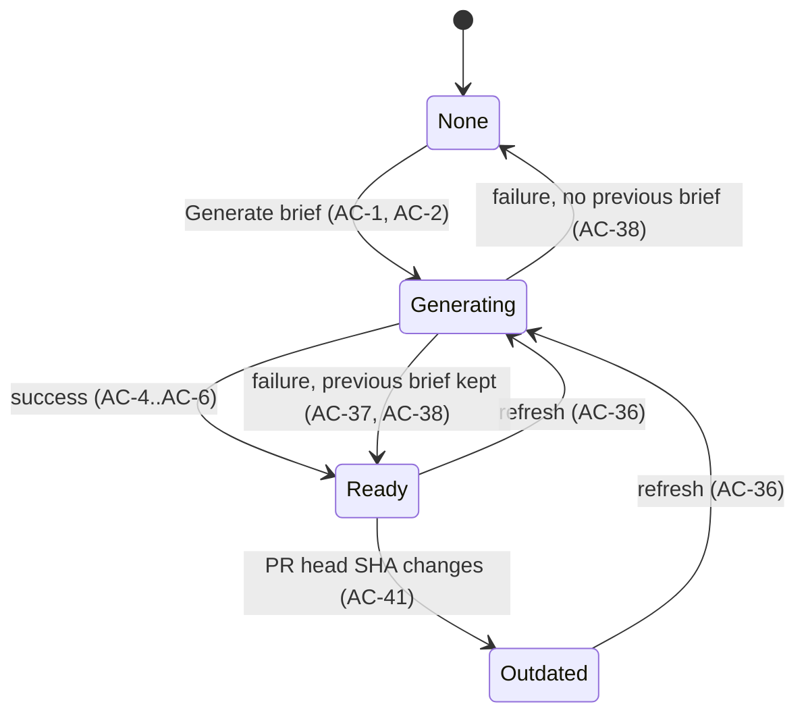
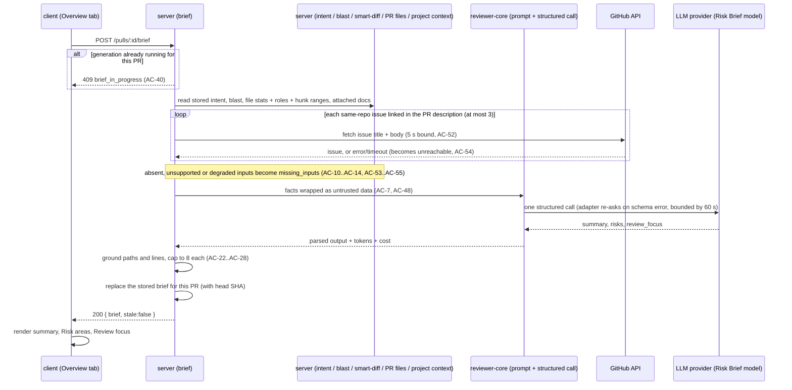

# Spec: Risk Brief — "PR Brief" block on the PR Overview tab
Spec ID: SPEC-2026-09-30-pr-risk-brief
Status: approved
Supersedes: —

## Problem and user

**Who:** a reviewer who opens someone else's pull request in DevDigest "cold".

**Pain:** the reviewer doesn't know why the change exists, what is risky in it, or which file and line to read first. DevDigest already answers parts of this in separate places: the reviewer has to piece them together, and nothing tells them which risks are tied to which file or where to start reading.

**Today in the code (this fork):**
- **Intent (L03) exists.** Each PR has at most one stored intent (summary, in-scope, out-of-scope, unlinked `risk_areas` strings, confidence, sources, head SHA). It is read through `GET /pulls/:id/intent`, which returns `{ intent | null, stale }` (`server/src/modules/reviews/routes.ts:137-140`, `server/src/modules/reviews/service.ts:191-197`, `server/src/modules/reviews/repository.ts:139-140`). It is derived during a review run or by the synchronous manual re-classify `POST /pulls/:id/intent/classify` (`routes.ts:144-152`), so a given PR may have no intent yet. The Intent card then shows a "Classify now" call to action (`client/src/app/repos/[repoId]/pulls/[number]/_components/IntentCard/IntentCard.tsx:49-50`), and it lists the unlinked `risk_areas` strings (`IntentCard.tsx:124-127`).
- **Blast radius (L04) exists.** `GET /pulls/:id/blast` reads the pre-built repo index and never calls the LLM or GitHub (`server/src/modules/blast/routes.ts:8-27`). It returns `summary`, `changed_symbols`, `downstream[{symbol, callers[{name,file,line}], endpoints_affected, crons_affected}]`, `counts`, and `degraded` + `reason` ∈ `flag_off | index_failed | index_partial | repo_too_large | no_data` (`server/src/vendor/shared/contracts/review-api.ts:82-123`, `server/src/modules/blast/service.ts:33-62`).
- **Smart Diff (L03) exists.** `GET /pulls/:id/smart-diff` groups changed files by role `core | tests | wiring | docs | boilerplate` (`server/src/modules/smart-diff/routes.ts:18-25`, `contracts/brief.ts:124`).
- **Diff stats exist.** `GET /pulls/:id` returns `files[{path, additions, deletions, patch}]` (`server/src/vendor/shared/contracts/platform.ts:188-214`). A PR's files are stored only after its detail page has been opened once (`server/Insights.md:50-51`). The intent prompt already sends per-file hunk headers without code (`server/src/modules/reviews/intent-links.ts:208-220`, `reviewer-core/src/intent.ts:229`).
- **Linked-issue fetching exists in the intent layer.** The PR description's links are parsed into same-repo GitHub issues, local docs and unsupported (cross-repo or external tracker) links, capped at 3 issues (`server/src/modules/reviews/intent-links.ts:16`, `:22`, `:106`). Each issue is fetched through the GitHub client with a 5 s bound, and its body counts as truncated above 4000 chars. A failure degrades that one source to `unreachable` (`server/src/modules/reviews/intent-classifier.ts:18`, `:30`, `:96-120`).
- **Project Context (SPEC-2026-09-29-project-context, approved) exists.** Markdown documents from the repository's local clone are attached per repository to agents, directly or through skills (`server/src/vendor/shared/contracts/project-context.ts:55-99`).
- **The Overview tab** shows the Intent card and the Blast radius card side by side, then the PR description (`client/src/app/repos/[repoId]/pulls/[number]/_components/OverviewTab/OverviewTab.tsx:17-38`). Tabs are keyed `overview | findings ("Agent runs") | diff ("Files changed")` in `?tab` (`PrDetailHeader.tsx:116-118`, `hooks/usePrDetailPage.ts:65-73`).
- **Brief scaffolding exists, but nothing uses it:**
  - the shared contract `Risk{kind,title,explanation,severity: high|medium|low,file_refs[]}`, `Risks`, `PrHistory` and the composite `PrBrief{intent, blast, risks, history}`, which is identical in the server and client vendored copies (`server/src/vendor/shared/contracts/brief.ts:89-165`, `client/src/vendor/shared/contracts/brief.ts`);
  - a per-PR cache `pr_brief(pr_id, json)` that nothing writes to (`server/src/db/schema/reviews.ts:101-106`);
  - a selectable system feature model `risk_brief` ("Risk Brief", default `openai` / `gpt-4.1`), resolved through `resolveFeatureModel` (`server/src/vendor/shared/contracts/platform.ts:59-65`, `server/src/modules/settings/feature-models.ts:50-57`);
  - UI labels in `client/messages/en/brief.json` (`block.intent`, `block.blast`, `block.risks`, `noRisks`, `unavailable`, `unavailableHint`).
- **Missing today:** no endpoint generates or returns a brief, no UI shows one, and the Files changed tab cannot be opened at a given file. Large file cards (> 200 changed lines) start collapsed (`client/src/components/diff-viewer/constants.ts:4`, `FileCard/FileCard.tsx:56-57`).

## Goals / Non-goals

### Goals
- G1: One **PR Brief** block on the Overview tab brings together a model-written summary, file-linked **Risk areas** and an ordered **Review focus** list, with the existing Intent and Blast radius cards alongside.
- G2: Generating a brief makes exactly **one logical structured model call** (see Assumptions) over already-computed facts plus the PR's linked issues. The model never receives diff code or review findings.
- G3: Every file in Risk areas and Review focus is a changed file of the PR or a caller file from the PR's blast map. Every Review focus line is a changed (new-side) line of that file or a blast-map caller line in that file. Nothing invented reaches the UI.
- G4: A generated brief persists per PR. Reload shows it without regeneration, and refresh replaces it.
- G5: The brief states explicitly which inputs were missing or partial when it was generated.

### Non-goals
- **"Prior PRs touching these files"** (PR history, P3 from L04). It is not generated in v1 [NEEDS CLARIFICATION: OQ-2].
- **Review findings as model input.** The user chose "facts only" (BQ-3). The design's example reasons ("Stripe key committed") come from findings, but v1 reasons are derived from intent, blast, diff stats, description, linked issues and specs only.
- **Linked-issue comments, issues beyond the first 3 linked, cross-repo issues and external trackers (Jira, Linear, …)** are not fetched. They are flagged instead (AC-55, EC-27).
- **Reading diff code.** The model gets hunk line ranges, not code lines.
- **Classifying intent as part of brief generation.** That would be a second model call. When intent is absent, the brief says so, and the Intent card's existing "Classify now" remains the way to get one.
- **Automatic regeneration** on new commits, on review completion or on page open. v1 only shows an "Outdated" badge.
- **An MCP tool for the brief.**
- **Pixel-perfect design, and the Blast radius Tree/Graph toggle changes.** The existing Blast radius card is reused as is.
- **A confirmation modal before a paid generation.** The user chose a tooltip hint instead (AC-33).
- **Showing intent's unlinked `risk_areas` strings on the Overview tab.** The user chose a single Risk areas block (AC-43). The strings remain a model input.
- **Streaming or background-job generation with SSE.** Generation is one synchronous request bounded by 60 s.
- **Accepted limitations** (see Edge cases):
  - an empty Review focus still shows its header with count 0 (EC-9);
  - failed generations are not retried automatically (EC-12);
  - injected text can bias the wording of the summary, titles and reasons, which only path/line grounding constrains (EC-15);
  - long paths are wrapped, not truncated (EC-19);
  - only the first 3 linked issues are fetched (EC-27).

### Assumptions (defaults applied; the user did not object)
- A1: "The model is called exactly once" means **one logical structured-output call per generation**. The LLM adapter's own schema-validation re-ask loop inside that call is allowed (`server/src/adapters/llm/openai.ts:88-134`, `reviewer-core/src/llm/openrouter.ts:76-131`: up to `maxRetries` extra attempts, default 2, tokens summed). The server makes no other model call, including no intent classification, no second brief call and no application-level retry.
- A2: When the PR head SHA differs from the SHA the brief was generated for, the brief is shown with an "Outdated" badge and is not regenerated automatically.
- A3: A second generation for the same PR while one is in progress is rejected with 409.
- A4: A Review focus item whose file is a blast-map caller file but not a changed file is shown without a link.
- A5: The cost and tokens shown in the block belong to the brief's own generation, not to a review.
- A6: The verdict + score banner and expanding a risk to its explanation are **Could** (P3).
- A7: The brief is persisted in the existing per-PR brief cache. The head SHA it was generated for is stored inside the cached brief, so no storage schema change is needed (user constraint).
- A8 (amendment 2026-09-30, user decision after first approval): the PR's **linked issues** are a model input. `POST /pulls/:id/brief` fetches them with the same link parsing and GitHub issue fetch as the intent layer (≤ 3 issues, 5 s per fetch, body truncated at 4000 chars). This is a GitHub call, not a model call, so the one-model-call rule (A1) is unaffected. Its time counts inside the 60 s generation budget (NFR-1). `GET /pulls/:id/brief` still makes no GitHub or model call (NFR-3).

## User stories

- US-1 [Must]: As a reviewer, I want the Overview tab to show a PR Brief block with a "Generate brief" button while no brief exists, so that I know a brief is available and how to get it.
- US-2 [Must]: As a reviewer, I want to generate a brief and see a short summary (what the PR does and why), Risk areas and Review focus, with the Intent and Blast radius blocks alongside, so that I understand the PR before reading code.
- US-3 [Must]: As a reviewer, I want each risk to show a title, the file it concerns and its severity, so that I know what could go wrong and where.
- US-4 [Must]: As a reviewer, I want Review focus as an ordered list of `file:line — reason` whose items open the Files changed tab at that file, so that I start reading at the right place.
- US-5 [Must]: As a reviewer, I want a reloaded page to show the same brief immediately without regenerating it, so that I don't wait or pay again.
- US-6 [Must]: As a reviewer, I want a refresh button that regenerates the brief, so that I can update it after the PR or its inputs change.
- US-7 [Must]: As a reviewer, I want every file and line in the brief to be real for this PR, so that I can trust the brief and never chase an invented path.
- US-8 [Should]: As a reviewer, I want to see when a brief is outdated relative to the PR's latest commit, so that I know to refresh it.
- US-9 [Should]: As a reviewer, I want to see when the brief was generated, by which model and at what cost, so that I can judge its freshness and spend.
- US-10 [Could]: As a reviewer, I want the latest review's verdict and PR score above the brief summary, so that I see the review outcome and the brief together.
- US-11 [Could]: As a reviewer, I want to expand a risk to read its explanation, so that I understand why it is a risk.
- US-12 [Must]: As a reviewer, I want the brief to take into account the issue(s) the PR links to, so that the summary and risks reflect the problem the PR is meant to solve.

## Acceptance criteria (EARS)

### Empty state and generation (US-1, US-2)

- AC-1 (US-1): WHEN the user opens the Overview tab of a PR that has no stored brief, the UI shall show a "PR Brief" block containing a "Generate brief" button. · Verify: e2e — observable: on a fresh PR the Overview tab shows the "PR Brief" heading and an enabled "Generate brief" button
- AC-2 (US-2): WHEN the user clicks "Generate brief", the API shall make exactly one logical structured model call with the provider and model configured for the "Risk Brief" feature in Settings (default `openai` / `gpt-4.1`). · Verify: integration — observable: with a mock LLM, one generate request produces exactly one structured-call invocation, and the returned brief's `model` equals the configured model
- AC-3 (US-2): WHILE a brief generation for the PR is in progress, the UI shall show a loading state in the PR Brief block with "Generate brief" or refresh disabled. · Verify: e2e — observable: after the click, the block shows a loading indicator and the button has `disabled` until the response arrives
- AC-4 (US-2): WHEN a brief generation succeeds, the UI shall show the brief's summary text in the PR Brief block. · Verify: e2e — observable: the mocked summary text is visible in the block without reload
- AC-5 (US-2): WHEN a brief generation succeeds, the UI shall show a "Risk areas" section listing the brief's risks. · Verify: e2e — observable: the "Risk areas" heading and each mocked risk title are visible
- AC-6 (US-2): WHEN a brief generation succeeds, the UI shall show a "Review focus — read these first (N)" section, where N is the number of focus items. · Verify: e2e — observable: the heading shows the mocked item count and each item is visible
- AC-7 (US-2, US-12): The API shall build the model input only from the PR title and description, the linked issues (AC-52), the stored intent, the blast summary with its caller files and lines and affected endpoints and crons, the diff stats (per changed file: path, additions, deletions, Smart Diff role, new-side hunk line ranges) and the Project Context documents (AC-15). It shall not include any diff code line or review finding. · Verify: unit — observable: for a fixture PR, the assembled prompt contains the fixture's hunk ranges and roles, and contains no `+`/`-` code line from the fixture patch and no finding title
- AC-8 (US-2): WHERE the PR has a stored intent, the UI shall show the Intent block alongside the brief on the Overview tab. · Verify: e2e — observable: the Intent block with the stored intent's summary is visible on the Overview tab next to the PR Brief content
- AC-9 (US-2): The UI shall show the Blast radius block alongside the brief on the Overview tab, including its existing degraded and empty states. · Verify: e2e — observable: the Blast radius block heading is visible on the Overview tab with a generated brief
- AC-10 (US-2): IF the PR has no stored intent when a brief is generated, THEN the API shall generate the brief without intent and list `intent` with reason `not_classified` in the brief's missing inputs, without classifying intent. · Verify: integration — observable: the response's `missing_inputs` contains `{input:"intent", reason:"not_classified"}` and `GET /pulls/:id/intent` still returns `intent: null`
- AC-11 (US-2): IF the PR's blast radius is degraded with reason `flag_off`, `index_failed`, `repo_too_large` or `no_data` when a brief is generated, THEN the API shall generate the brief without blast facts and list `blast` with that reason as `missing`. · Verify: integration — observable: with the repo-intel flag off, `missing_inputs` contains `{input:"blast", status:"missing", reason:"flag_off"}`
- AC-12 (US-2): IF the PR's blast radius is degraded with reason `index_partial`, THEN the API shall use the available blast facts and list `blast` with status `partial` and reason `index_partial`. · Verify: integration — observable: `missing_inputs` contains `{input:"blast", status:"partial", reason:"index_partial"}` and the prompt contains the partial caller list
- AC-13 (US-2): IF no Project Context document is attached for the PR's repository, THEN the API shall list `specs` with reason `none_attached` in the brief's missing inputs. · Verify: integration — observable: `missing_inputs` contains `{input:"specs", reason:"none_attached"}`
- AC-14 (US-2): IF an attached Project Context document cannot be read from the repository's local copy, THEN the API shall skip that document and list `specs` with reason `doc_missing` and the document's path. · Verify: integration — observable: `missing_inputs` contains `{input:"specs", reason:"doc_missing", ref:"docs/gone.md"}`, and the brief is generated
- AC-15 (US-2): The API shall take as the specs input every Project Context document attached for the PR's repository to any agent of the workspace, directly or through a bound, enabled skill [NEEDS CLARIFICATION: OQ-5]. Duplicates are removed by path, and each document is truncated to 6000 characters. · Verify: unit — observable: for two agents sharing `specs/a.md`, the brief's `inputs.specs` lists `specs/a.md` once, and a 9000-char document is marked `truncated: true`
- AC-16 (US-2): WHEN a stored brief has at least one missing-input entry, the UI shall show a "Generated without" note naming each missing or partial input and its reason in plain words. · Verify: e2e — observable: for a brief without intent, the block shows text like "Generated without: Intent (not classified yet)"
- AC-17 (US-1): IF the PR has no changed files known to the server, THEN the API shall reject the generation with 409 and code `no_changed_files`. · Verify: integration — observable: `POST /pulls/:id/brief` for a PR with no stored files returns 409 `{code:"no_changed_files"}`

### Linked issues (US-12)

- AC-52 (US-12): WHEN a brief is generated for a PR whose description links same-repository GitHub issues, the API shall fetch up to 3 of them, using the same link parsing as the intent layer, and include each fetched issue's title and body (truncated at 4000 chars) in the model input. · Verify: integration — observable: with a mock GitHub returning issue #12, the prompt contains the issue's title inside an untrusted block, and the brief's `inputs.issues` lists `#12` with `truncated: false`
- AC-53 (US-12): IF the PR description links no issue, THEN the API shall generate the brief and list `issue` with status `missing` and reason `none_linked` in the brief's missing inputs. · Verify: integration — observable: for a PR body without issue links, `missing_inputs` contains `{input:"issue", status:"missing", reason:"none_linked"}`
- AC-54 (US-12): IF fetching a linked issue fails or takes longer than 5 s, THEN the API shall skip that issue, generate the brief, and list `issue` with reason `unreachable` and the issue reference. · Verify: integration — observable: with a mock GitHub that throws for #12, the response is 200 and `missing_inputs` contains `{input:"issue", reason:"unreachable", ref:"#12"}`
- AC-55 (US-12): IF the PR description links an issue in another repository or an external tracker, THEN the API shall not fetch it, and shall list `issue` with reason `unsupported` and the link as the reference. · Verify: integration — observable: for a body linking `https://acme.atlassian.net/browse/X-1`, the mock GitHub records no call for it, and `missing_inputs` contains `{input:"issue", reason:"unsupported", ref:"https://acme.atlassian.net/browse/X-1"}`

### Risk areas (US-3)

- AC-18 (US-3): The API shall return each risk with a non-empty title, a severity of `high`, `medium` or `low`, and at least one file reference. · Verify: unit — observable: every risk in a validated brief has `title.length > 0`, a valid `severity` and `file_refs.length >= 1`
- AC-19 (US-3): The UI shall show each risk's title, its first file reference and a severity icon whose colour and accessible text name the severity. · Verify: e2e — observable: a `high` risk row shows its title, `src/x.ts:12-18` and an icon with accessible name "High severity"
- AC-20 (US-3): WHEN a stored brief has no risks, the UI shall show "No notable risks flagged." in the Risk areas section. · Verify: e2e — observable: the text is visible for a brief with `risks: []`
- AC-21 (US-3): The UI shall list risks ordered by severity `high` → `medium` → `low`, keeping the model's order within one severity [NEEDS CLARIFICATION: OQ-9]. · Verify: unit — observable: input order low, high, medium renders as high, medium, low
- AC-43 (US-3): WHILE the Overview tab shows a stored brief, the UI shall show risks only in the brief's Risk areas section and shall not show the intent's unlinked risk-area strings. · Verify: e2e — observable: with an intent whose `risk_areas` contains "Legacy text", that text is not visible on the Overview tab, and the brief's risks are visible

### Grounding of paths and lines (US-7)

- AC-22 (US-7): WHEN the model output is received, the API shall remove every risk file reference whose path is neither a changed file of the PR nor a caller file in the PR's blast map. · Verify: unit — observable: a risk ref `src/invented.ts` is absent from the stored brief, and a ref `src/api/users.ts` that is a changed file is kept
- AC-23 (US-7): WHEN a risk has no file reference left after AC-22, the API shall drop that risk. · Verify: unit — observable: a risk whose only ref was invented does not appear in the stored brief
- AC-24 (US-7): IF a kept risk file reference carries a line or line range that falls neither within a new-side hunk range of that file nor on a blast-map caller line in that file, THEN the API shall keep the path and drop the line part. · Verify: unit — observable: ref `src/x.ts:900-905` outside every hunk is stored as `src/x.ts`
- AC-25 (US-7): WHEN the model output is received, the API shall drop every Review focus item whose file is neither a changed file of the PR nor a caller file in the PR's blast map. · Verify: unit — observable: an item for `src/invented.ts:3` is absent from the stored brief
- AC-26 (US-7): WHEN the model output is received, the API shall drop every Review focus item whose line falls neither within a new-side hunk range of its file nor on a blast-map caller line in that file. · Verify: unit — observable: for hunk `+40,13`, an item at line 52 is kept and one at line 53 is dropped, unless 53 is a blast caller line in that file
- AC-27 (US-7): WHEN validation drops at least one risk, file reference or focus item, the API shall record the number of dropped risks and focus items in the brief. · Verify: integration — observable: the response has `dropped: {risks: 1, focus: 2}` for a mocked output with those invalid items
- AC-28 (US-2): The API shall keep at most 8 risks and at most 8 Review focus items after validation, in the model's order. · Verify: unit — observable: a mocked output with 11 valid focus items is stored with the first 8

### Review focus (US-4)

- AC-29 (US-4): The UI shall show Review focus items in the order stored, each as `<file>:<line> — <reason>`. · Verify: e2e — observable: the items render in the mocked order with that text pattern
- AC-30 (US-4): WHEN the user activates a Review focus item whose file is a changed file of the PR, the UI shall switch to the Files changed tab with that file's card scrolled into view. · Verify: e2e — observable: the URL has `tab=diff` plus the file reference [NEEDS CLARIFICATION: OQ-4], and the file card header for that path is within the viewport
- AC-31 (US-4): WHEN the Files changed tab is opened from a Review focus item whose file card is collapsed by default, the UI shall expand that file card. · Verify: e2e — observable: for a fixture file with > 200 changed lines, its diff lines are visible after activation
- AC-32 (US-4): WHERE a Review focus item's file is a blast-map caller file but not a changed file, the UI shall show the item without a link, labelled "not in this PR's diff". · Verify: e2e — observable: such an item is not a link, and the label text is visible next to it
- AC-44 (US-4): The UI shall let the user activate a Review focus item with the keyboard (Tab to focus, Enter to activate). · Verify: e2e — observable: focusing the first item with Tab and pressing Enter opens the Files changed tab at that file

### Persistence, refresh and staleness (US-5, US-6, US-8, US-9)

- AC-33 (US-6): The UI shall show on the refresh button a tooltip stating that regenerating makes a new paid model call. · Verify: e2e — observable: hovering or focusing the refresh button shows text containing "new paid model call"
- AC-34 (US-5): WHEN the user reloads the Overview tab of a PR with a stored brief, the UI shall show the stored brief without starting a generation. · Verify: e2e — observable: after reload the same summary and `generated_at` are shown, and no generate request is sent
- AC-35 (US-5): WHEN a client requests a PR's brief, the API shall return the stored brief, or `brief: null` when none exists, without calling the model. · Verify: integration — observable: `GET /pulls/:id/brief` returns 200 with the stored brief, and the mock LLM records zero calls
- AC-36 (US-6): WHEN the user clicks refresh on a stored brief, the API shall generate a new brief that replaces the stored one. · Verify: integration — observable: a following `GET /pulls/:id/brief` returns a later `generated_at` and the new summary
- AC-37 (US-6): IF a regeneration fails, THEN the UI shall keep showing the previous brief and show an error message with a "Retry" action. · Verify: e2e — observable: with the generate call mocked to 502, the old summary stays visible and "Retry" is shown
- AC-38 (US-2): IF the model call fails, exceeds 60 s, or still returns output that fails schema validation after the adapter's own re-asks, THEN the API shall respond 502 with a redacted message and keep the stored brief unchanged. · Verify: integration — observable: with a mock LLM that throws, `POST` returns 502 and `GET` returns the previous brief
- AC-39 (US-2): IF the "Risk Brief" feature's provider has no API key configured, THEN the API shall reject the generation with the existing configuration error [NEEDS CLARIFICATION: OQ-8]. · Verify: integration — observable: with no provider key, `POST /pulls/:id/brief` returns the configuration-error status and a message naming the missing provider
- AC-40 (US-2): IF a brief generation for the same PR is already in progress, THEN the API shall reject a second generation request with 409 and code `brief_in_progress`. · Verify: integration — observable: two concurrent `POST`s return one 200 and one 409 `{code:"brief_in_progress"}`
- AC-41 (US-8): WHEN the PR's current head SHA differs from the head SHA the stored brief was generated for, the API shall return the brief with `stale: true`. · Verify: integration — observable: after the fixture PR's head SHA changes, `GET /pulls/:id/brief` returns `stale: true`
- AC-42 (US-8): WHILE the displayed brief is stale, the UI shall show an "Outdated" badge in the PR Brief block. · Verify: e2e — observable: the "Outdated" badge text is visible for a stale brief and absent for a fresh one
- AC-45 (US-9): The UI shall show the brief's generation time as relative time together with the model name (e.g. "Generated 3 min ago · gpt-4.1"). · Verify: e2e — observable: the text "Generated" followed by the mocked model name is visible
- AC-46 (US-9): WHERE the provider reported a cost for the brief's generation, the UI shall show that cost and the input → output token counts in the PR Brief block. · Verify: e2e — observable: for `cost_usd: 0.014, tokens_in: 8200, tokens_out: 1300` the block shows "$0.014" and "8.2K→1.3K"
- AC-47 (US-2): IF the requested PR does not exist in the caller's workspace, THEN the API shall respond 404 to both reading and generating its brief. · Verify: integration — observable: `GET` and `POST /pulls/<other-workspace-pr>/brief` return 404

### Untrusted content (US-2, US-7)

- AC-48 (US-2, US-12): The API shall wrap every text input to the model (PR title and description, linked-issue titles and bodies, intent text, blast summary, file paths, Project Context document text) as untrusted data under the existing injection guard. · Verify: unit — observable: each input appears inside an `<untrusted source="…">` block, and the guard text is present in the system prompt
- AC-49 (US-7): The UI shall render the model-written summary, risk titles, explanations and focus reasons as plain text. · Verify: unit — observable: a reason containing `` and `[x](javascript:alert(1))` renders as literal characters with no element or link created

### Could (P3) (US-10, US-11)

- AC-50 (US-10): WHERE the PR has at least one completed review, the UI shall show above the brief summary a banner with the latest review's verdict and PR score [NEEDS CLARIFICATION: OQ-6]. · Verify: e2e — observable: for a PR whose latest review is `request_changes` with score 61, the banner shows "Request changes" and "61"
- AC-51 (US-11): WHEN the user expands a risk, the UI shall show the risk's explanation text below its title. · Verify: e2e — observable: after clicking the risk's expand control, the mocked explanation is visible, and `aria-expanded` is `true`

## Edge cases

| # | Case | Source | Outcome |
|---|---|---|---|
| EC-1 | PR has no intent yet (no review run, never classified) | code: `service.ts:191-197`, `IntentCard.tsx:49-50` | Brief generated without intent, flagged as missing — AC-10, AC-16 |
| EC-2 | Repo-intel flag off, index failed, repo too large, or PR files unknown to the index | contract: `review-api.ts:82` | Brief without blast facts, flagged — AC-11, AC-16 |
| EC-3 | Index is partial | contract: `review-api.ts:82`; `server/Insights.md:47-48` | Partial facts used, flagged as partial — AC-12 |
| EC-4 | No Project Context documents attached for this repo | SPEC-2026-09-29-project-context | Flagged `none_attached` — AC-13 |
| EC-5 | Attached document renamed or deleted in the clone | SPEC-2026-09-29-project-context (missing attachments) | Document skipped, flagged `doc_missing` — AC-14 |
| EC-6 | Same document attached to several agents or skills | design analysis | Deduplicated by path — AC-15 |
| EC-7 | Model cites a path not in the PR and not in the blast map | user P1 AC; review-contract grounding analogy | Reference or item dropped — AC-22, AC-23, AC-25 |
| EC-8 | Model cites a real file with a line outside the changed hunks | BQ-2 answer | Focus item dropped (AC-26); risk keeps its path without the line (AC-24) |
| EC-9 | All model items dropped by validation | design analysis | Empty sections with their empty messages (AC-20) and dropped counts recorded (AC-27). Accepted: an empty Review focus shows the section header with count 0 |
| EC-10 | Model returns more than 8 risks or focus items | BQ-4 answer | Truncated to 8 — AC-28 |
| EC-11 | Invalid JSON or schema mismatch from the model | `openai.ts:88-134` | Adapter re-asks inside the single logical call; still invalid → 502, stored brief kept — AC-38 |
| EC-12 | Model timeout > 60 s or provider outage | BQ-4 answer | 502, stored brief kept, Retry offered — AC-38, AC-37. Accepted limitation: no automatic retry (would break the one-call rule) |
| EC-13 | Double click, or two tabs generating at once | ux-review §4 | Button disabled while pending (AC-3); a concurrent request gets 409 (AC-40) |
| EC-14 | New commits pushed after generation | code: intent `stale` precedent `service.ts:195` | "Outdated" badge — AC-41, AC-42 |
| EC-15 | PR description or documents contain prompt-injection text | `reviewer-core/src/prompt.ts:15-44` | Wrapped as untrusted (AC-48); output grounded (AC-22–AC-26); rendered as text (AC-49). Accepted limitation: injected text can still bias the wording of summary, titles and reasons, which only grounding of paths and lines constrains |
| EC-16 | PR files not yet stored (detail page never opened) | `server/Insights.md:50-51` | Generation rejected with 409 `no_changed_files` — AC-17. Opening the PR page stores them first |
| EC-17 | Focus target file is huge and its card collapsed by default | code: `diff-viewer/constants.ts:4` | Card expanded on navigation — AC-31 |
| EC-18 | Focus item file is a blast caller file, not a changed file | design analysis | Shown without a link, labelled — AC-32 |
| EC-19 | Very long paths or unicode file names | ux-review overflow | Path is plain text (AC-29, AC-49). Accepted: the UI wraps long paths, with no truncation rule in v1 |
| EC-20 | Regeneration fails when a brief already exists | ux-review error state | Previous brief stays, error + Retry — AC-37 |
| EC-21 | PR from another workspace requested | security (access control) | 404 — AC-47 |
| EC-22 | Provider API key missing for the Risk Brief model | code: intent precedent `service.ts:199-205` | Configuration error surfaced — AC-39 |
| EC-24 | PR description links no issue | amendment A8 | Brief generated, flagged `none_linked` — AC-53, AC-16 |
| EC-25 | Linked issue fetch times out, is deleted or private, or the GitHub token is invalid | code: `intent-classifier.ts:30`, `:96-120` | Issue skipped, flagged `unreachable`; brief still generated — AC-54 |
| EC-26 | Linked issue is cross-repo, or on Jira / Linear / another tracker | code: `intent-links.ts:22` | Not fetched, flagged `unsupported` — AC-55 |
| EC-27 | More than 3 issues linked | code: `intent-links.ts:16` | Only the first 3 are fetched (AC-52). Accepted limitation: the rest are ignored, same as the intent layer |
| EC-28 | Linked issue body contains prompt-injection text or is very long | security; `intent-classifier.ts:18` | Wrapped as untrusted (AC-48); body truncated at 4000 chars (AC-52) |
| EC-29 | Slow GitHub eats into the generation budget | amendment A8 | Issue fetches count inside the 60 s budget; each is bounded at 5 s — NFR-1, AC-54 |
| EC-23 | A brief stored before this spec's contract (an old shape) | code: `pr_brief` has no writers today | Not reachable (no writers exist). If an unparsable cached brief is found, the API treats it as `brief: null` — AC-35 |

## Workflows and contracts

### Brief lifecycle (per PR)

### Generation (synchronous request, one logical model call)

### Contracts

| Interface | Request | Response | Errors | ACs |
|---|---|---|---|---|
| `GET /pulls/:id/brief` | path `id` (PR uuid) | 200 `{ brief: PrBrief \| null, stale: boolean }` | 404 PR not in workspace | AC-34, AC-35, AC-41, AC-47 |
| `POST /pulls/:id/brief` (generate / regenerate) | path `id`; no body | 200 `{ brief: PrBrief, stale: false }` | 404 not found · 409 `brief_in_progress` · 409 `no_changed_files` · configuration error for a missing provider key [NEEDS CLARIFICATION: OQ-8] · 502 model failure, timeout or invalid output · 429 when the per-route rate limit is exceeded [NEEDS CLARIFICATION: OQ-3] · a linked-issue fetch failure never fails the request | AC-2, AC-10–AC-17, AC-52–AC-55, AC-22–AC-28, AC-36, AC-38–AC-40, AC-47 |
| Files changed deep link | `?tab=diff` plus a file reference [NEEDS CLARIFICATION: OQ-4] | Files changed tab scrolled to and expanding that file | Unknown path → tab opens at the top | AC-30, AC-31 |

**`PrBrief` shape changes.** Relative to `contracts/brief.ts:159-164`, all changes are additive or nullable and apply identically to the server and client vendored copies:

| Field | Type | Change | ACs |
|---|---|---|---|
| `summary` | string | new, required | AC-4 |
| `review_focus` | list of `{ file: string, line: integer ≥ 1, reason: string }`, ≤ 8, reading order | new, required (may be empty) | AC-6, AC-25, AC-26, AC-28, AC-29 |
| `risks.risks[]` | existing `Risk`; `file_refs` entries are `path`, `path:line` or `path:start-end`; ≥ 1 entry; ≤ 8 risks | existing shape, rules tightened | AC-18, AC-22–AC-24, AC-28 |
| `intent` | existing `Intent`, **nullable** | was required; now null when not classified | AC-10 |
| `blast` | existing `BlastRadius`, **nullable** | was required; now null when blast is missing | AC-11 |
| `history` | existing `PrHistory` | kept; empty in v1 [NEEDS CLARIFICATION: OQ-2] | — |
| `missing_inputs` | list of `{ input: intent \| blast \| specs \| issue, status: missing \| partial, reason: string, ref: string \| null }`. `issue` reasons: `none_linked`, `unreachable`, `unsupported` | new | AC-10–AC-14, AC-16, AC-53–AC-55 |
| `inputs.specs` | list of `{ path, truncated: boolean }` | new, provenance | AC-15 |
| `inputs.issues` | list of `{ ref, truncated: boolean }` (issues actually sent to the model) | new, provenance | AC-52 |
| `dropped` | `{ risks: integer, focus: integer }` | new | AC-27 |
| `head_sha` | string | new: the PR head the brief was generated for | AC-41 |
| `generated_at` | ISO timestamp | new | AC-34, AC-36, AC-45 |
| `model`, `provider` | string | new | AC-2, AC-45 |
| `tokens_in`, `tokens_out` | integer | new (sum over the adapter's attempts) | AC-46 |
| `cost_usd` | number, nullable | new (null when the provider reports none) | AC-46 |

`intent` and `blast` inside a stored brief are the snapshot of inputs used for generation. The Overview tab keeps rendering the live Intent and Blast radius cards [NEEDS CLARIFICATION: OQ-1].

**Model output schema** (structured output, all fields required as strict mode demands, per `contracts/brief.ts:39-42`): `summary`, `risks[{kind, title, explanation, severity, file_refs[]}]`, `review_focus[{file, line, reason}]`. The server fills every other field.

**Invariants kept:**
- The review pipeline (`server/specs/review-flow.md`, `reviewer-core/specs/review-contract.md`) is unchanged. The brief never creates a review run, findings or a score, and never reads or alters grounding of findings.
- Untrusted-content wrapping (`reviewer-core/src/prompt.ts:41-44`) applies to all brief inputs.
- The grounding idea (drop what cites something outside the diff) is extended to brief paths and lines, but it is the brief's own rule, not `groundFindings`.

## Non-functional requirements

- NFR-1: IF a brief generation has not completed within 60 s from the start of the generation request, THEN the API shall abort the call and respond 502 (AC-38). The 60 s includes linked-issue fetches, each bounded at 5 s (AC-54).
- NFR-2: The API shall make at most one logical structured model call per generation request. Only the LLM adapter's own schema re-asks (currently at most 2 extra attempts) may add provider requests (Assumption A1).
- NFR-3: WHEN serving `GET /pulls/:id/brief`, the API shall not call the LLM provider or GitHub.
- NFR-4: WHEN a brief generation finishes (success or failure), the API shall log one line with PR id, provider, model, attempts, tokens in/out, cost, duration, count of missing inputs and dropped counts. It shall never log prompt text, document text or the PR description.
- NFR-5: The API shall bound the model input with the same caps the intent prompt uses today (description ≤ 8000 chars, ≤ 200 files, ≤ 20 hunk ranges per file; `reviewer-core/src/intent.ts:33-37`) [NEEDS CLARIFICATION: OQ-7], and each Project Context document ≤ 6000 chars (BQ-4).
- NFR-6: The API shall apply a per-route rate limit to brief generation equal to the manual intent re-classify route (10 requests per minute; `server/src/modules/reviews/routes.ts:144-146`) [NEEDS CLARIFICATION: OQ-3].
- NFR-7: WHEN a brief generation completes or fails, the UI shall announce "Brief ready" or the error text through a polite live region.
- NFR-8: The UI shall convey risk severity by text or accessible name as well as colour, with contrast ≥ 3:1 for the severity icon against its background.
- NFR-9: The server and client vendored copies of the brief contract shall remain byte-identical after the change.
- NFR-10: The brief shall be persisted in the existing per-PR brief cache, with no storage schema change (Assumption A7).
- NFR-11: The generation cost shall appear only in the brief's own metadata. It shall not be added to the PR's review-run cost totals.

## Inputs and provenance

**Spec sources**
- User text (Ukrainian, translated by the coordinator): context, 6 user stories, P1 acceptance criteria, the must/P3 split.
- Figma exports (PNG): `/Users/iaroslava.nautz/Desktop/Screenshot 2026-09-30 at 15.21.51.png`, `/Users/iaroslava.nautz/Desktop/Screenshot 2026-09-30 at 15.28.38.png`.
- User answers to BQ-1…BQ-4 and to three UX proposals; the user's technical pointers (contract, cache, `completeStructured`, `resolveFeatureModel`, `brief.json`, `VerdictBanner`), each checked against code.
- Code: `server/src/vendor/shared/contracts/brief.ts`, `review-api.ts`, `platform.ts`, `project-context.ts`; `server/src/db/schema/reviews.ts`, `pulls.ts`; `server/src/modules/reviews/{routes,service,repository,intent-classifier,intent-links}.ts`; `server/src/modules/blast/{routes,service}.ts`; `server/src/modules/smart-diff/routes.ts`; `server/src/modules/settings/feature-models.ts`; `server/src/adapters/llm/openai.ts`; `reviewer-core/src/{intent,prompt}.ts`, `reviewer-core/src/llm/openrouter.ts`; `client/src/app/repos/[repoId]/pulls/[number]/{page.tsx,hooks/usePrDetailPage.ts,_components/OverviewTab,_components/IntentCard,_components/PrDetailHeader,_components/VerdictBanner,_components/DiffTab}`; `client/src/components/diff-viewer/{constants.ts,FileCard/FileCard.tsx}`; `client/messages/en/brief.json`.
- Specs and docs: `specs/SPEC-2026-09-29-project-context.md`, `server/specs/review-flow.md`, `reviewer-core/specs/review-contract.md`, `client/specs/pages.md`, `server/Insights.md`, `client/Insights.md`, `reviewer-core/Insights.md`.
- DevDigest MCP: not used (system state was not needed).

| Input | Origin | Deterministic | Produced by → consumed by |
|---|---|---|---|
| PR title, description | GitHub API (stored PR) | yes (as stored) | server PR sync → brief prompt |
| Linked issue title and body (≤ 3, ≤ 4000 chars each) | GitHub API, fetched live during generation | no (the issue can change between generations) | brief generation (intent-layer link parsing + GitHub issue fetch) → brief prompt |
| Stored intent (summary, scope, risk-area strings) | LLM (earlier intent call), DB | no (stored snapshot) | intent layer → brief prompt |
| Blast summary, callers `file:line`, endpoints, crons, degraded reason | repo index (DB) | yes | blast module → brief prompt + path/line validation |
| Changed files, additions, deletions, hunk ranges | GitHub API (stored PR files) | yes | server PR sync → brief prompt + path/line validation |
| Smart Diff role per file | deterministic classifier | yes | smart-diff module → brief prompt |
| Project Context documents | repo local clone + attachment config (DB) | yes (for a given clone state) | project-context module → brief prompt |
| Risk Brief provider/model | workspace Settings / registry default | yes | settings → brief generation |
| Summary, risks, review focus | LLM | no | reviewer-core structured call → server validation → DB → client |
| Tokens, cost | LLM provider usage / price estimate | yes per call | LLM adapter → brief metadata → client |
| PR head SHA | GitHub API (stored PR) | yes | server → staleness check |

## Untrusted inputs

| Input | Controlled by | Treatment | AC |
|---|---|---|---|
| PR title, description | PR author | Wrapped as untrusted under the injection guard; size-capped | AC-48, NFR-5 |
| Linked issue title and body; links in the PR description | issue authors and commenters with edit rights; PR author | Only same-repo issue links are fetched, others are flagged `unsupported`; wrapped as untrusted; body truncated at 4000 chars; fetch errors are redacted and never shown raw | AC-48, AC-52, AC-54, AC-55 |
| Changed file paths, hunk ranges | PR author | Wrapped as untrusted; paths are also the allow-list for output validation | AC-48, AC-22, AC-25 |
| Project Context document text | repository contributors / local edits | Wrapped as untrusted; truncated to 6000 chars per document | AC-48, AC-15 |
| Stored intent text | LLM output earlier derived from PR content | Wrapped as untrusted | AC-48 |
| Blast summary and caller paths | derived from repository code | Wrapped as untrusted; caller files and lines are the allow-list for output validation | AC-48, AC-22, AC-26 |
| Model output (summary, titles, explanations, reasons, paths, lines) | LLM, steerable by all of the above | Schema-validated; paths and lines grounded; lists capped; rendered as plain text | AC-18, AC-22–AC-28, AC-49 |
| Path parameter `:id` | API caller | Validated as a uuid; scoped to the caller's workspace | AC-47 |
| Files changed deep-link file reference (URL) | anyone who shares a link | Matched only against the PR's changed file list; unknown values are ignored | AC-30 |

## Open questions

- OQ-1: Should the Overview show the live Intent and Blast radius cards, or the snapshot stored in the brief? — Default taken: the live cards, because they already exist with their own states and actions ("Classify now", resync). The snapshot is kept for provenance only.
- OQ-2: Should the contract's `history` field be removed, or kept empty? — Default taken: kept and returned empty, because removing it is a breaking contract change for no v1 gain, and "Prior PRs" is a Non-goal.
- OQ-3: What rate limit should brief generation have? — Default taken: 10 requests per minute per route, mirroring the manual intent re-classify route, because it is the closest synchronous paid LLM action in the codebase.
- OQ-4: Which URL parameter carries the file for the Files changed deep link? — Default taken: `?tab=diff&file=<path>`, following the existing URL-state pattern (`?tab`, `?trace`).
- OQ-5: Which agents count for the specs union: all workspace agents, or only enabled ones? — Default taken: every agent of the workspace, direct attachments plus bound, enabled skills, matching the "Used by N agents" rule of SPEC-2026-09-29-project-context (AC-4).
- OQ-6: For the P3 banner, which review is the "latest review" when several agents ran? — Default taken: the most recently completed review run of the PR, rendered with the existing verdict banner.
- OQ-7: Should the prompt caps copy the intent prompt's caps? — Default taken: yes (8000 / 200 / 20), because those caps already bound the same kinds of input in the same codebase.
- OQ-8: With a missing provider key, should the API return the existing configuration error (500 in the intent precedent) or a 4xx? — Default taken: the existing configuration-error path, for consistency with manual intent re-classify.
- OQ-9: Should risks be ordered by severity or by model order? — Default taken: severity high → low, then model order, so the most severe risk is read first.
## Design analysis

| Finding | Bucket | Source | Decision | Reason |
|---|---|---|---|---|
| No "no brief yet" state in the designs | gap | user US-1; ux-review empty state | accepted → AC-1 | Required by P1 |
| No loading state | gap | ux-review loading | accepted → AC-3 | Visible status for a paid action taking seconds |
| No error state (provider, timeout, invalid output) | gap | ux-review error; `openai.ts:88-134` | accepted → AC-37, AC-38 | Recoverable error with Retry |
| Missing provider key | gap | intent precedent `service.ts:199-205` | open → OQ-8 (AC-39) | Status code is a consistency choice |
| Stale brief after new commits | gap | intent `stale` precedent | accepted → AC-41, AC-42 | User did not object |
| Explicit "which data was missing" note | gap | user P1 | accepted → AC-10–AC-16 | Required by P1 |
| Empty lists after validation | gap | ux-review empty results | accepted → AC-20, EC-9 | Distinguish "nothing" from "not loaded" |
| Verdict + score banner | gap | screenshots, user (P3) | accepted → AC-50 [Could] | P3 |
| Risk expand with explanation | gap | screenshots, user (P3) | accepted → AC-51 [Could] | P3 |
| Prior PRs touching these files | gap | screenshots, user (P3 from L04) | rejected → Non-goal | Not needed for the brief |
| Cost/tokens on the banner: whose? | gap | screenshot 1 | accepted → AC-46 (brief's own cost) | User did not object |
| Invented paths | corner case | user P1 | accepted → AC-22, AC-23, AC-25 | Required by P1 |
| Lines the model can't know without code | corner case | BQ-2 | accepted → AC-7, AC-24, AC-26 | Hunk ranges + line check chosen |
| Invalid structured output | corner case | `openai.ts:88-134`; user pointer | accepted → AC-38, Assumption A1 | Adapter re-asks count as one logical call |
| Double submit / two tabs | corner case | ux-review §4 | accepted → AC-3, AC-40 | User did not object |
| No intent for the PR | corner case | `service.ts:191-197` | accepted → AC-10 | One-call rule forbids classifying |
| Blast degraded / partial | corner case | `review-api.ts:82` | accepted → AC-11, AC-12 | Existing degraded reasons |
| Attached doc missing | corner case | SPEC-2026-09-29-project-context | accepted → AC-14 | Visible skip |
| PR files not stored yet | corner case | `server/Insights.md:50-51` | accepted → AC-17 | Deterministic rejection |
| Huge collapsed file card | corner case | `diff-viewer/constants.ts:4` | accepted → AC-31 | Otherwise the click lands on a closed card |
| Too many items | corner case | BQ-4 | accepted → AC-28 | ≤ 8 each |
| Prompt injection via PR or docs | corner case | `prompt.ts:15-44` | accepted → AC-48, AC-49, EC-15 | Existing guard reused |
| Long / unicode paths | corner case | ux-review overflow | accepted → EC-19 (limitation) | Plain text, wrapped |
| New endpoints for read + generate | module communication | code: intent classify precedent | accepted → Contracts, AC-35, AC-36 | Synchronous, like intent classify |
| `PrBrief` lacks summary and focus; intent/blast required | module communication | `contracts/brief.ts:159-164`; user pointer | accepted → Contracts | Additive + nullable, both vendored copies |
| Model from Settings "Risk Brief" | module communication | `feature-models.ts:50-57` | accepted → AC-2 | Existing registry |
| Specs input source | module communication | BQ-1 | accepted → AC-15; open → OQ-5 | Project Context union chosen |
| Findings as input | module communication | BQ-3 | rejected → Non-goal | User chose facts only |
| Linked issue as input (homework requirement found after approval) | module communication | user decision (amendment A8); `intent-classifier.ts`, `intent-links.ts` | accepted → AC-52–AC-55, EC-24–EC-29 | Reuses the intent layer's parsing, caps and 5 s bound; a GitHub call, not a model call |
| Files changed has no file deep link | module communication | `usePrDetailPage.ts:65-73` | accepted → AC-30; open → OQ-4 | Needed for US-4 |
| MCP tool for the brief | module communication | design analysis | rejected → Non-goal | User did not object |
| Live cards vs stored snapshot | module communication | design analysis | open → OQ-1 | Both viable |
| Single Risk areas block | UX | UX proposal (accepted) | accepted → AC-43 | Avoid two risk lists |
| Generation time + model shown | UX | UX proposal (accepted) | accepted → AC-45 | Freshness and provenance |
| Paid-call hint on refresh | UX | UX proposal (accepted) | accepted → AC-33 | Cost awareness without a modal |
| Keyboard access and live announcements | UX | ux-review §6 (WCAG 2.2 AA) | accepted → AC-44, NFR-7, NFR-8 | Accessibility minimum |
| Blast-only focus files | UX | design analysis | accepted → AC-32 | No diff to open |
| Severity ordering of risks | UX | design analysis | open → OQ-9 | Sensible default |
